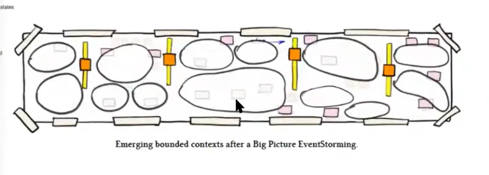

where we're gonna do some techniques for modeling bounded contacts
this meetup what we're going to be doing over the next hour maybe stretching to two hours so it's about strategic design 
very often when we think about architecture and strategic design we think about bounded contexts and we think about boundaries like if
you want to architect a system you have to take a large system and you break it down into subsystems 
some people call them micro services, some people call them bounded contexts, some people say a microservice is a bounded context
i'm sure we have some strong opinions about that i know there's a few blog posts out there
one recently from alberto brandolini touching on that topic

but what people don't talk about as much
is the integration
of those subsystems of your
microservices or bounded contexts
certainly not in the design phase so
people talk about
event-driven event-driven architecture
from a technical perspective but
not so much as a design activity
and if you want to design a loosely
coupled architecture
which we all strive to do it's no
there aren't many things we agree on as
an industry but
building loosely coupled systems is one
of those things that we all strive for
because we know that a loosely coupled
system means that we can make changes
easily to one part
without affecting other parts of the
system that gives teams autonomy
and in order to to design that loose
coupling it's not just about
finding the right boundaries it's about
identifying how those different
subsystems communicate with each other
and and making the specific choices

so we we broadly speaking we have
three kinds of message and i use the
word message generically
not to me the message bus we have
commands we have queries and we have
events
and then for each of those kinds of
messages you have to decide what what's
the payload inside that message
and so there are a lot of choices here
the type of message what's contained in
the message how you name the message how
big is the message
and all of those things can have a big
impact on coupling
for example if you use a command
basically it's one context telling
another context
i want you to do something so the
responsibility of deciding what happens
next
is in the sender but if you use an event
you're saying hey something's happened
and it's up to someone else another
context to listen to that
and decide i'm going to decide what to
do
so broadly speaking that's that's
that's kind of stepping on the
the area of orchestration which is
centralized coordination versus
choreography
and so yeah how you integrate things
has a big impact on coupling
and how do you design the integration
it's not something i see a lot of that
it's like i was saying previously people
talk a lot about boundaries but not so
much about the integration

so there are a bunch of tools out there
but none of them have really become
standard tools i would say there's lots
of discussion
there was lots so there was lots of
discussion on one of the github tickets
so we we have a simple technique called
message flow modeling which you'll see
later
and on on the github
on the github project for that technique
it was a long conversation about how
should you display
commands and events flowing through
different contexts
there were quite a few opinions on there
and actually that's how we came to have
this meet up to review the different
techniques
and to evaluate the trade-offs
and to to maybe start thinking about
giving advice in the future so shaping
best practices
when you're designing a system and
you're in situation x yeah this
technique
Y might be most suitable like event
storming
for your boundaries showing
communication between a boundary context
when would you use that
and when might you not use that

so that's the background to this
one other thing i wanted to mention is
that in the meetup description itself
we talked about vladik kononov one of
his comments which he talks a lot about
which is
global complexity versus
local complexity so if you're not
familiar with these concepts
you probably know what they are but you
might not know how to name them and the
naming
is is really useful it gives you a way
to express these concepts very easily in
conversation
so local complexity is when
something in and of itself is very
simple
so if you have a microservice and it's
100 lines of code
that microservice is very simple because
there's not much code theoretically
you can do a lot of damage in 100 lines
of code but typically speaking if
you've got a microservice 100 lines of
code versus a microservice 10 000 lines
of code
the one with the 100 lines of code is
smaller and is likely to have
much less local complexity
and the problem here is if you have
small micro services you have more micro
services
and so you have more complexity in how
those systems
talk to each other the messages flowing
between them because now you've got
network boundaries
you've got public contracts so if things
live inside the same code base
you can change everything atomically
when you have two separate code bases
which are deployed separately
a change to the interface of one would
break the other one so you start getting
into backwards compatibility
versioning etc
so uh the name here is local versus
global complexity
and with with the message flow modeling
or the bounded context integration we're
looking for the global complexity
what's all the stuff that lives in
between bounded contexts
and the complexity there not necessarily
the infrastructure itself but
the communication patterns

so what we're going to do this evening
is for the first part
is we're going to review some existing
techniques i will reveal
a section on the Miro board very
shortly
and then after that we'll have a bit of
a discussion and then we'll do some
hands-on modeling later in groups
so before i get started i've just spoken
for eight minutes which felt like an
hour
does anyone else want to add any
thoughts on what i talked about
you know maybe maybe you've had this
problem where people have focused on
boundaries and not the integrations and
it's been problematic
or maybe you've worked in a team who are
very focused on
the messaging aspects between bounded
context or microservices
and you've got some advice here about
things that work well or
maybe the concepts of local versus
global complexity
resonate with you or maybe you think
it's it's the model's too simple and
there's more
local local and global aren't sufficient
alone
and uh if you do want to speak up you
can just start speaking well if anyone
clashes we'll manage that as we go along
it's just
it's normal for meetups online don't
worry about that

there is a question in the chat i can
read it out
cool so anthony davis saying i'm not
sure if it's relevant but one technique
i came across recently was event
modeling
is that something you've explored
so we we do have event modeling on
tonight's list of activities
so yes it is relevant it is a good
suggestion
and it is something that's in this space
for sure
what's your favorite technique kenny no
i was just
so so my favorite technique is still
event storming
okay i've tried
the others as well uh
domain storytelling for instance or the
the version you use of
naturally but one thing that kept in
mind when you say the
what you just said about local versus um
right between the microservices
complexity
and um what people sometimes try to do
is mimic communication because it's
communication right and
thinking that you can run 100
microservices while your communication
between the teams
is almost non-existent
yeah be careful with that
fix your communication problems and we
were just
the twittering with root if you if
you're if you're not following root
milan yet
please do she has a lot of great
insights on this
doing so there was actually this paper
where we this
was she recently posted about conway's
law alignment in 1999
about this topic and it's really
interesting that
it it keeps coming back right and and we
we just made a joke russell
root's law is everything you try to
learn or want to learn
she probably has already written about
css and
um what i'm trying to get is she had
this great heuristic that
uh i now call it the 3c heuristic which
means communication communication
communication
so if you cannot do communication right
between teams or between people
please don't go for local
less local complexity but go for for
more of a monolith architecture because
that will probably fit your
company better yeah i actually have a
name for that anti-pattern
i call it organizational dysfunctions
Miroed as architectural complexity
like basically you you've got these
problems in your organization
and rather than fixing how teams
collaborate you try and solve the
problem in code
so one of them one of the examples i
have here
kenny yeah yeah no i was just trying to
pitch in there
where you say i recently uh someone gave
me a metaphor
and it's outside the itt but they were
saying like uh
going towards a micro services pro
microsoft architecture while
jape and dave is constantly talking
about
look for what's wrong now don't think
about something new that's
fun it's like having a relationship and
thinking that marriage
or a child will help your relationship
at the moment
that's the same for thinking yeah
thinking that your organization will do
better
if you just think oh microservices
everyone's doing that and it sounds fun
no fun fun things won't help you there
neither does that holiday it's
sit down talk to each other see what's
going wrong now
and start from there new heuristic
you can only have a microservice if
you've got a child
like no the number of microservices you
can have is the number of children you
have
[Music]
yeah so that i was i was thinking about
that metaphor right so
don't don't don't look at that don't
don't look at
don't look at the feature what you want
and what's
fun same with when your team is
not fun thinking that you go to a fun
day with your group no sit down talk to
each other and
go into the conflict or like uh right
someone is sitting in the fire safas
was sitting in the fire sit in the fire
with your team
and battle the conflict so there's one
more

-------- context mapping
question in the chat uh is asking
whether
context mapping helps with global
complexity and establishing
communication patterns
with bandwidth context
i can answer that one if you like so
my opinion is that context mapping does
help
although i've got some caveats about
context mapping which is
most of us don't know how to do it
properly and
here's an exclusive scoop for you if you
want to learn how to view context
mapping
go to eric evans dvd workshop and he
teaches context mapping
via a play like
you will play a role in some fictitious
company
and you will learn context mapping by
actually doing
amateur drama in his workshop so i've
been told i haven't been to it it's on
my wish i've
i've been there it was great uh three
years ago it
yeah three years ago explored who did it
was nice
i can't remember i was just so much it
was so much fun i i
i still probably have to play lying
around here i need to look it up
but yes going back to context mapping um
there are a number of patterns in there
which do which do
vis which do surface global complexity
one of those
is the conformist pattern
and being aware of where you're using
the conform is can be very useful for a
couple of reasons
so a conformist is i'm going to use the
domain model from another system i
integrate with
because the cost of translating is too
high so
i used to work for a company that built
marketing automation software
and they were using a facebook marketing
api and basically
in our code base we used the facebook
model
exactly in our code and then
facebook started changing their api and
our code
was coupled to their model so our code
basically
had to keep trying to keep up with
facebook's api
but the code was basically a mixture of
facebook api versions one two three plus
some custom bits so with context mapping
you can see what you've got patterns
like the conformist
and you can see where you've got chains
so this can
this context conforms to this one and
then
another context conforms to that one so
if the first one changes like you've got
a whole chain of contexts
which could all potentially be coupled
to each other's contracts and have to
change together
so yeah it's cool it's called the
deadlock conformist pattern
i've seen it a lot of times in big
enterprises like a chain of conformists
yeah so i didn't know the name for it
but uh mikhail plot
he's got some talks on this topic um
and he does name some of the patterns so

---------

just to break up a second
break this conversation i've unlocked
the the main section of the miro board
and we've got a collection of modeling
techniques which you can see
next to each technique you can leave
some feedback so thumbs up you like it
thumbs down you don't like something
about it
so it's not the technique itself it's
something about the technique
so for the first one uml you could say
thumbs up i like the way it works
vertically
okay and if you if you've got comments
or you're not sure the third column is
kind of
there i'm thinking about this i'm not
sure about this
so have a look at all of those
techniques leave as much feedback as you
want to
and we'll have a discussion in about
i'll set a timer for like 20 minutes
but we can also whilst you're doing that
we can still carry on this discussion
here
yeah someone uh
i think uh yeah nick maybe you can lock
the
the frame and the background so that
people don't move it around all right
yeah sorry about that okay i'll lock it
how it is now
i think somebody copied it over
basically instead of
all right let's lock what we've got
there now should be okay
so if anyone uh does this youtube stream
is live right so is anyone watching
uh there i'm monitoring the youtube chat
so if you if you have any comments or
like i said strong opinions for nick
uh let us know in the youtube chat
yeah well uh all right i'm gonna pass it
or say
i'm gonna quickly put this board in
read-only mode just for a minute and
then i'll
uh i'll tidy this
section up i'll lock some stuff
okay
nobody's moving anymore yeah they're all
frozen that
that's uh that's interesting okay
so the board is locked and what i should
have explained is
all you need to use here is the post-its
sticky note button over here select to
post it
and try and keep the same size medium
just like that so i'll unlock it now and
we can try again
does that work yes it does like everyone
moves again
that's nice
so what sorry you're saying something
kenny
no i i don't know i i was saying to
people on youtube if
they want to ask questions let us know
it will be interesting to see if anyone

here
is from the bpmn world has got
experience with the bpmn choreography
and collaboration i'm very open to bpmn
i haven't used it
really and i don't know if it's a good
tool for
collaboration i have my reservations
there
yeah i also have my bias there just
because i saw
enterprises uh go haywire with bp bbns
can
be very well i think but you still need
to have
it mostly think about kaplan
that's what i always think yeah i think
a great great one to speak about is
parent rooker right
yeah we had him at ddd london before
just before lockdown came in actually
so what he was telling us was there were
a few there were a few different flavors
of bpmn
systems like
one of the styles and anyone who knows
bpmn is probably
laughing at me right now thinking this
guy knows nothing but basically
what i heard is there are like two
styles of bpmn there's the one style
which tries to
replace developers and put all of your
code inside the bpmn system
which is the ones i've had bad
experiences with it's like hey
we can replace all the developers with
this bpmn tool
and then i said so how do you test it
and they went oh you can write junit
tests
like right you're going to replace all
your developers and who's going to write
the junit test
so that that was my negative experiences
there
but ben was actually talking about a
different kind of bpmn tool where you
define
you define your workflow in the tool
but you still have your code inside your
separate microservices or whatever
and whenever your microservices complete
some step
they call the bpmn system and so it's
it's kind of um it's kind of visualizing
visualizing the process without
without invading your code base in a way
and i think it's it's becoming
it's becoming the lines between bpmn
and message bus message broker are
starting to blur a bit there
so yeah if anyone doesn't know this
topic please uh feel free to jump in
so if you want to hear a story about
conformance pattern

12 years ago i was working for a company
that
already did some microservices but
80 80 of these services were translators
towards the
self-made enterprise surface bus with a
message broker
of ebm mq wait wait wait can i uh can i
just get some clarification here what do
you mean translators
so um it was an esp pattern with a
canonical data model in the middle so we
were integrating
several systems this was 12 years ago
so right now you will laugh at it but
12 i think it was actually created 15
years ago so it was
ahead of its time back then we had
proper monitoring on it business
monitoring
on events there are proper events on it
the only problem was was the canonical
data model in between
that everyone needed to confirm
towards so what happens when you want to
change the canonical data model you need
all these different stakeholders
like 10 to confirm
to the new canonical data model ah
and the miguel plods got a name for
something like that
he calls it the vetoing consumer where
you've got like
multiple consumers who depend on a
specific
let's say an open host for example
or a partnership maybe it was i don't
know the exact details now
but basically when two of them want
something to be changed
and the third one says no you can't
change it for some reason
like those kind of politics and i would
say absolutely that is
global complexity
so i've sent the mural board now to uh
to the youtube channel because people
have a hard time seeing it just so you
know so
afterwards you need to reset the
password or put it on read more
but now people can join in the fun from
youtube
yeah but that that's that was a hard one
we we tried our we
really decoupled the canonical data
model and went to bounded context
so decoupling it uh locally and that
really worked well
took some time but do i still need to
share my screen is this you recording my
screen or
yeah yeah yeah keep your screen and uh
will be
okay so i'll
have a quick quick look through it seems
event modeling is
proving to be very popular down here
zooming out you can see where
where people tend to gravitate started
with uml
uml event storming and event modeling
seems to be the three topics

bpmn has been uh
let's say ignored for now but you know i
would i would say that's reflective of
the kind of people who come to this
meetup there's not much overlap with
bpmn space
but that doesn't reflect on bpmn itself

so let's have a look at event storming
what do people like about event storming
right level of information it's flexible
and explicit it's easy to read
it's very collaborative yep
it's got a low barrier to entry what's
in a group setting holistic view
what doesn't work about events don't
mean
so it needs a good facilitator
yeah that
yeah sometimes you get a group of people
together you try and do something
collaboratively
and it has the potential to like event
storming's about chaos right
and you have to manage the chaos so
sessions do tend to go a bit off track
sometimes so i think that's a valid
concern

needs to be a story i'd be keen
for whoever wrote that if they want to
speak up about that now or later
because i i like the story format
that was me that was you so what i mean
is it requires a
a user story uh as in a user
journey story uh i remember
three or four years ago uh we modeled
a uh adaptive cruise control
in a session at the ddd netherlands with
alberto there
and we had bruno thomas there we had
marin there
uh we had marco there and uh i think
alexi was there and not sure if you were
there were you there no and paul was
there
and we went into groups and people did
some modeling on that part and alberto
took event storming and he hated me ever
since because
adaptive cruise control is is not a
story in its total
right it's it's um you you react on
certain events
and that's it it's not like this happens
and that's
so it's it's it requires a full
uh user journey to be more viable

okay so something
um so when we move on to the when we
move on to the modeling
later hands-on modeling we could do that
again
the adaptive cruise control with a
different technique if you want to if
you know about that
if you have the instructions that you
could share 

let's go have a look at uml (sequence diagram)
so um yeah i think uml is pretty well
known so i can see why
it's got um a bit more negatives
so firstly as an advantage it's a known
it's a known concept everyone pretty
much knows
your ml sequence diagrams
yeah it does capture the important
information
it it is it is hard to misinterpret i'll
i'll give you that
like this uml diagram i've taken here
it's pretty clear what's going on there
it is hard to misinterpret that i think
if you if you look at event storming for
example
when we have this event here and these
two contexts
is this is this happening in parallel
or does it mean this happens or this
happens
so with the flexibility of event
storming
yeah it it doesn't always have the full
precision

------- Question on green, pink post-it color 

why does it say query on the screen
sticky in the event storming
picture uh basically this context here
is sending a query to this context here
oh but it looks green so it should be a
read model
so yeah that's uh so i
i did this this is how i would do this
but yeah that's the thing with event
storming i guess right nick
what i've said in the past it's the
concept that matters it's not
the name of the sticky it's more like
the
what does it represent and if query
helps
in this case but the problem is we build
habits we we associate things like
oranges and events
green is a read model and so yeah but i
mean the name on
the name you give that concept so
right the event is usually event but in
this case you call
the the the the pink one context
while uh in in other you can call it
external systems in software design
we call it system in process design and
in in your version you call it contact
so you adjust the naming
according to the to what you're doing i
think that's powerful
that's the powerful stuff about event
storming you can
leave outcome you can leave out concepts
or you can rename concepts what works
for you in a specific
workshop yeah and i i would say
event storming is more flexible in that
respect
yeah but it just means you have to
re-learn some
some the notation each time what things
mean which can be confusing
yeah whereas uml the uml sequence
diagrams are very clear
but it's less flexible i would say
because did you make it green because it
has something to do with the read model
or is just a coincidence it's just the
query elements
it happens to be green yeah i use green
for query and other things so and there
aren't that many colors to choose from
in Miro
yeah so the the yeah the read model is
kind of the
source of the query in a respect so
there is
some relationship there ah i also call
it
i also call it information okay
so it's either query read model
information for me it's the same concept
it's
information yeah
but in this in this diagram here where i
put query
is it is context a querying the read
model of the next context
or is the first context on the left
updating its read model
which the second context is querying
it's not clear because there
there isn't a standard notation we've
been taught in school and we've learned
it forever
like we're making stuff up as we go
along a bit here yeah
which is useful and i think this goes
this goes deeper into the concept of shu
hari the the model for learning
like you start as a beginner you kind of
copy what's there
and then you progress into competent
level
and then you become a master and you
stop following the rules and you
you start applying ad hoc
yeah i'm like a master in a situation
and i would say that's
that's what's good about event storming
it is flexible
that you can adapt it to the problem
you're facing
it it just takes a long time to get to
that stage sometimes
and if if you've got people who are in
the shoe level
and they're still trying to work out
what is event storming and what does a
green thing mean
and they see someone else who's a master
of using it for something else
yeah it can be confusing and confusing
so so i think that's so
fair yeah so i think alberto's last
point is to always abide by the color
coding so there would be a blue in
between
officially but i always say the same
that you say nick
if you think it will be too explicit and
it will be common sense then you just
leave concepts out during
one of these storms and that's what you
did here
yeah it's like oh people if i go to
france i have to drive on the other side
of the road
but i'm so used to driving on the left
side of the road
even though i know i'm supposed to drive
on the right-hand side i've been driving
on the left-hand side for almost 20
years
like it's just a habit there so if i've
been doing event storming for a year
and i've been associating green with one
thing and now it means something else
even if you tell me
like my brain is still like trained to
see it as something else
so it's it's hard to break the
association and the habits

yeah go on yuri sorry yeah usually just
having
the same like board with all the legends
for event storming helps
and as you mentioned it is pretty easy
to invent new concepts
there so we we just tend to have
a legend everywhere and every time
and the drill helps yeah
and that's actually a pretty important
heuristic or what you're just saying
describing yuri and that's not only for
event storming but also for
if you're just doing whiteboards
modeling
sessions always create a legend because
uh
yeah it's better for yourself but also
for people that just joining
you can see oh you mean this with that
and this with that
so thanks for sharing that and 

and then
then you get advanced users who do know
this concept
well and they're like i want it to be
clear what's a command and what's an
event i want this to stand out
i can i can do advanced pattern matching
and my brain just knows when i see an
event and it has this relationship to a
context and a command
i know that's an anti-pattern i can just
see that so with this advanced format we
have a separate color
for each type of message and we have a
slightly different notation
so with the command it just lives on the
line
but with an event and this was based on
a discussion
in the on the github repo people said
they wanted to see an event separately
from a command
so with an event let's look at the sales
context here
the sales context pushes out the order
placed
and then it goes to the billing context
like we're emphasizing that the sales
context is pushing it out there
but it's not pushing it to the billing
context it's just pushing it out there
and the billing context is then fetching
it

so so who who sees it different
i would like to know so so this is nick
you're you were looking for
uh other opinions so who who would see
it different
yeah so if you if you're an expert or
your experience building messaging
systems and you know commands queries
and events
[Music]
then you can look at this second diagram
here and you can see a lot of blue
commands
and that's usually a sign that
we normally default towards events so
when you see lots of
commands that's normally a trigger to
look deeper
um let me think of some more examples uh
when you when you see one context and
it's pushing out lots of commands to
other contexts
it might be a sign that's too coupled
it might be a sign that you've got a
process manager
which is fine or it might be a sign that
hey
because this context is sending commands
to lots of other contexts
it's maybe it's got too many
responsibilities in there
whereas if something publishes a lot of
com publishes and not
five events i wouldn't worry so much
about that if i saw more commands that
would indicate more coupling
generally not not as a rule just as a
one of those
pattern matching things you think oh i
need to look deeper there
like seeing that combination of commands
and events
i've not seen that before or i've seen
that pattern before
and it's normally associated with too
much coupling
so this version just conveys more
information

-------------------------------------MARKER

all right so the time is up but you can
you can keep adding feedback if you like
uh i'll set a timer for 10 more minutes
and we can just discuss some of these
some disgusted feedback so if anyone
does want to speak up
feel free to pop a message in chat or
just start speaking
and i will continue here
so message flow modeling can be a hard
start but simply in the end
yep i would say one of one of the
problems going into detail there is
with a message flow modeling diagram
like this
you have to lay things out for yourself
you're positioning the context and the
messages of the arrows
to try and try and make it make the
design clear
whereas with uml sequence diagramm the layout is automatic
you don't have to think about that so
uml is more structured here
this is a bit more freeform compared to
uml
and that can be a bit more complex but
it also gives you more flexibility to
highlight
certain aspects of the coupling

so one thing to comment there because i
i did that
sticky hard stuff but simpler in the end
last time i did it it was
you need to get into the concepts
uh a bit longer than for instance event
storming where you just begin with
events right that's
what i meant but i think what something
i always say
um about the structure versus chaotic
right
yeah in chaos we gain insights
if you structure too soon you will
probably lose valuable insights
so that's a heuristic that i always use
is
we tend to see start seeing patterns if
you leave
gaps open or if you structure it
differently
and just because the uml diagram already
structured
it for you it's harder to see patterns
for me or
odd patterns it's just what you see i
see too many commands
or maybe that's an insight and yeah get
that from
from uml or from the uml model yeah and
and also going back to going back to the
one we just saw
like maybe even more important than
commands is queries
if you see lots of queries that's
like okay this this this architecture
is query based it's all rpc there's no
messages or events here
that's normally the distributed monolith
because you can actually show it oh this
query calls this
service and this service queries this
service you've got like
a long sequence of chains and if one of
those calls fails the whole system fails
like the the runtime coupling

uh what i would also say about this one
is
i agree with your heuristic when you're
trying to structure something
that that challenge you have structuring
things is feedback
but also sometimes sometimes there's
accidental complexity
where structuring adds no value
and there's nothing to be gained it's
just time spent

-------------------------------------MARKER

so there's a question that
let's see
in domain message flow diagram what is
the difference between system and
bounded context
is system something external
yeah so typically a bounded context is
it's something in our architecture it's
a
it's a part of our domain it's an
architectural subsystem
a system is something that's not
typically part of the domain it
might be something we build or it could
be external so in this example i
consider the website
our own company website as a system
i'd probably have a you could have a
separate notation here for application
like mobile app website could be a
separate thing
uh but most most of the time it will be
an external system
in this example there's a mail monkey
email service and a primo payments
payment service

-------------------------------------MARKER

so then i got a question for you there
uh nick yeah we'll go to the next
question
because for me a system and a bounded
context means something else right
they're not
mutually they call it so abundant
context is about a language boundary
and a model and there can be several
bounded contexts in a system
like for instance a website can have
several bounded contacts if you model it
that way
is that something you already think
about here
right do you get where i'm i'm getting
to
yeah it's it's the simplicity versus
precision thing again
basically a system is anything that's
not a bounded context
now inside of websites
typically i wouldn't consider that to be
a bounded context in the ddd sense
but in the general sense it could be
so for me a website is the front-end
html css javascript
that receives commands from the user or
presents information to the user
doesn't contain any business logical
domain rules
it's just a way to expose the domain
cool so maybe maybe that would be best
to call it system / app

yeah something like that so some yeah
it might even i i was thinking about
also making the distinction
between what do you own and what is
really external

yeah and i think that goes back to
the similar principles we spoke about
before we've got we've got a couple of
principles emerging here
one is the more notation you add
the more complex something is because
there's more things
to learn and to understand but the fewer
concepts you had it might look simpler
but then things become more ambiguous
which we have in this case where our
system is quite ambiguous
so it doesn't always mean that fewer is
better it might mean that having more is
simpler
that's also a good heuristic i think
that's
what i always use with event storming
it's emergent
notation right once you need it just use
it
but start simple and expand from there
and then then so i'm seeing three three
degrees of freedom here
one is about the number of things versus
precision
so let's call it simplicity versus
precision
then we've got um the other one we spoke
about
is structure versus flexibility in terms
of notation
and the third one we're coming across is
is it a design tool or a documentation
tool
if it's a design tool then we probably
want more flexibility there
because we might be solving novel
problems and we don't want to be
constrained
but if it's a documentation tool
we might be striving for more
consistency there

-------------------------------------MARKER

next question is that okay
yeah yeah keep the questions coming so
in event storming how would we know
to what level shall we keep on going to
storm out domain events ea when is event
storming session to be concluded
as i can have front to end and end to
front flow still in place with limited
domain events on board
yeah so that's all about

thinking about the scope of your session
what would you like to achieve

### Canvas 

firstly um if it's a big picture
discovery
then the outcome is a bit
um blurry you don't really know where
you'll end up sometimes

however if your goal is to model your
bounded contexts
then
then there are certain um
outcomes you can aim for 

you're the outcome of
your
workshop might be let's try and create a bounded context canvas
a one bounded context
and the goal is let's find all of the
commands queries and events
related to this bound of context that
come in or that go out
that could be the scope of your workshop
or it might be
we've got four bounded contexts let's
try and create a canvas for four of them

and from that perspective
i would design the workshop to
to achieve those things so what would i
what would i need from the workshop to
achieve to achieve
those outcomes what information would i
need beforehand
to achieve those things so
it might be that we've already had an
event storming workshop
we've identified our bounded context
boundaries and that's our starting point
in that case
in that case we can create a notation
for this workshop
so the notation would be we need some
symbol for a bounded context
we need some symbol for a command and
some symbol for
a query like we've got here like we just
need these four bits of notation
and then we think of the use cases so
what does this bounded context have to
do
it might be you know accept payments
reject
payments allow the user to create a new
credit card
and then you just model model those
flows
and you're looking for every command
query or events
that goes in or comes out of the bounded
context and that's the level of detail
you stay at

but sometimes
you might need to go into more detail
like you might decide i'm not sure if
there should be an event or a command
here
we just don't know what we're going to
have to do is
actually start modeling the internals of
the bounded context
like we might have a process manager but
we might think we need a process manager
but before we can design the interface
it might be good to design how it works
inside first

so then then you have to adapt the level
of detail you work at
so it's it's like we were saying earlier
when you first get started you have a
specific notation you follow
and you have little flexibility but then
when you become more advanced with the
tools
you're adapting as you go along like
what level of detail what notation
should we use
and it's less less predictable from that
respect

so feel free to uh ask any more
questions about that i think it's a
great topic
i think it's it's that's what i find
most exciting about this
when you get to the advanced level and
you have to be more creative
and you have to like bend the tools
rather than following the
prescribed recipes

---------------------------------------MARKER

and that's uh don said it last time it
goes back to the shoe hiring
when you're in chaos so you don't know
so when you're in novelty
just follow the process and casper
started that ddd process uh
thing on the ddd crew right and it
reminds me of that that people getting
into the ddd space
just follow that process and because
you're a novel
if you're something novel i i've done
aikido which is
japanese martial art it's the same
it's it's might be boring at start but
just follow the process and
eventually when you get and they have
explicit levels right
like uh at some point you get to a done
level
and then you're the re so up until then
just just
follow the process and at some point you
start feeling oh maybe i need to do
something different here can we are we
still
within the principles yes okay now we do
it
but in novelty and in chaos just follow
that process

---------------------------------------MARKER

yeah so i would say if you're not sure
where to start then the first thing is
clarify your outcome for the workshop
so try and try and have a focus on what
you'd like to achieve
and then whoever's facilitating the
workshop
their responsibilities to keep the group
moving towards that goal
and if if things go off topic you need
to bring things back
on topic sometimes but the problem is
sometimes things go off topic for a
valid reason
and you discover new things and that's
the more advanced level where it's like
okay
let's go off topic for a bit because it
might be productive
so yeah if you're a beginner i would say
have a focus of what you'd like to
achieve
and just stay on topic
and if you if you do go off topic or you
feel like you want to go off topic
just put a note to come back later and
try and get to the outcome first

---------------------------------------MARKER

## BPMN

all right i'm gonna go check in on the
bpm tools
so we did get a bit of feedback
so someone says activity is a good tool
i haven't used activity
um if anyone has used activity i'd like
to hear about it
so maybe some other people here would
too
uh looks formal looks like you need to
create an enterprise architect to create
one
um i think that's a reasonable
observation
it's not about whether something's true
or false it's about how is something
perceived
and i i perceive bpmn tools in a similar
way
and i'm always looking to try and
challenge my opinions
because one of the things i learned from
simon wardly and his wardly mapping
concept is that
every evolution goes through stages
and even if the current version of
evolution
isn't working for you there might be an
evolution of that that comes along and
changes the constraints or
changes the pros and cons of that tool
and the new version um
is useful and is beneficial so i'm
always
i'm always thinking look there are so
many people
who use bpmn there's got to be something
useful there
it can't be a just a complete waste of
time there's got to be something useful
there
there are some smart people working in
that space
and they're not standing still are they
they're constantly innovating so
who knows like one day the bpmn
community
they might invent something better than
event storming
so i'm always open to seeing what could
happen there like always keeping my mind
open

and maybe now that we're all working
remotely maybe some of the bpmn tools
are more suitable

---------------------------------------MARKER

so there's another question from osun
saying is it okay to model every single
scenario that needs to be
implemented in design level event
storming
so i i can take i can take that one if
you
if you want so for software design level
software design level is a 2b right it's
what we want the system to behave
once we created it
so there's this uh in in
alberto's book you'll see that thing and
i think i
also put it on the ddd crew site where
you first
always always first rush well not rush
the happy path so finish your story
nobody likes a unfinished story
that's george that's uh some thing to
george rr martin right
we want that finished story so first do
that
and whenever you feel like you're
jumping in like i'm a developer so we
want to jump into
if then else's right cases we look in
cases
you just hot spot them your hot spot
there's more to discover here
you finish the happy flow part you make
sure that that's night
and neatly abide by the color coding and
then you just
explore the most prioritized
use cases and you go deeper so it will
be top to bottom
thing just hope that that answers a bit
your question
i'm looking now for the
[Music]
let's see if i can quickly pick up that
picture
show it
no i don't think so so
that does that answer your question also
hopefully

---------------------------------------MARKER

so nick how would you remodel
integration between two external systems
a question from uh unseat
i need to zoom in the chat
zoom is like really small i'm not sure
if you have the same problem
so um we can pick up the
continue it are you still there nick
yeah i just wanted to turn my lights on
ah okay
yeah so how would we model integration
between two external systems
integration between two external systems
so if
both systems are external and they're
communicating with each other
um that seems like it's outside of my
responsibility
i'm trying to think about a situation
where i've had that scenario
before i'm trying to work out
yeah so i think i've had this before
where
where you get data from another system
and it's useful to know where they get
the data from there's like a chain
um i would say depends on what we're
trying to
what we're trying to gain from that
if it's from a relationship perspective
in terms of the contracts
then i think context mapping is a good
tool there
if we want to know what the messages and
what are the payloads and the
conversations between those two services
then context mapping is not so good
there context mappings about the
structure
like this thing is connected to this
thing and they have this relationship
the tools we've got here on the miro
board
i'd be probably picking one of these so
so my
my thinking on this topic is
if i want to model a long sequence of
interactions
then i would use event storming or
something with swim lanes like story
storming or
maybe event modelling if i had a very
simple scenario
and i wanted to document it on an a4
piece of paper
i would use the message flow modeling so
when the scope is small
i prefer message flow modeling because i
can just see the relationships easier
when the sequence of interactions is
longer
so i always say when you're doing
message flow modeling
if you've got more than seven messages
on the diagram
that it's you've got too much going on
there make smaller diagrams
if you want something bigger then i
would go with event storming
or event modeling in that case
so yeah it will be one of those tools
basically am i looking at the structural
relationship
and the organizational aspects or am i
looking at the conversations the
messages flowing backwards and forwards
and the payloads that would help me to
choose
which technique there
so i'm going to quickly go over event
modeling now discuss the feedback here
and then then we can take like a
15-minute break and then we can come
back and do some hands-on modeling
so event storming is a nice to read
model

---------------------------------------MARKER

### Event modelling

so if we if we look across here what
stands out to me here
i can see these swim lanes down here i
guess these are my actors or my services
so
yeah that's pretty clear event storming
uses the same
colors for commands queries and events
so as someone who's used that notation
before i can adapt to this easier
because i know it
because standards there
um it it does look a bit complex to me
though i don't understand all of it
at first glance i guess you need to
learn all of these techniques
i think someone said it down here yeah
it looks a bit complex to start
which i think is a fair there's quite a
few different kinds of concepts here
like we talked about before
there's the swim lanes there's the
arrows there's the line here the bits at
the top
it's not a huge amount but when you
first look at this it can be
it can be a bit in your face daunting
until you learn it so i think both of
those comments are fair

i think this one here is good i've never
thought about this
so event storming shows the ui but we
care about ux
so i think i always think it's good to
think about the ui
when you're designing the back end
systems like how will the
how will the boundaries of the
architecture and the communications
affect the ui
but what the point here is well ui is
not ux
are we coupling are we coupling the back
end to the ui
when the ui might change frequently or
or the ux and the back end might be
designed separately
so i think that's that made me think
actually that this one here made me
think a lot
um and so yeah up here includes the ui
which we often do forget
which i like about event modeling
it's detailed enough to drive
development which i think is useful
so going back to the question from
earlier how do you decide what the scope
is
when do you start when do you stop if
your goal is to actually start
developing after after the session
maybe you want something like event
modelling which is much closer to the
implementation

all context in one model
yep i think this is useful when we think
about the messages flowing between
bounded contexts
people often have like commands events
and queries which is important
but they don't show the payload on those
messages
and when you start thinking about the
payload like which information needs to
be on this message
then you realize oh the context sending
this message
doesn't actually have that piece of data
to put on the message
and it forces you to reevaluate the
design whereas event modelling makes you
think about the data that's being
transferred around

someone says here it's a good mixture
which i think is fair
someone here says in combination with
event storming which i think is also
fair
uh someone here says it takes
assumptions to go to cqrs es
i don't have a lot of experience doing
that so if anyone wants to speak up
uh yeah it does uh adam speaks quite
often that uh
everything should be secured as yes and
everything
by nature is uh eventually consistent
and everything's right
that's i mean he speaks a lot about this
so i think it's a fair point i i'm not
the one that i wrote that by the way i'm
just saying that it's
it's a fair point okay so we know it was
you now shall i put your name on this
one
uh i didn't write that my iraqi one
directly in the
on the left of that to be honest but i'm
just saying it's a fair point as i said
adam makes a lot of uh
uh very regularly mentioned yeah
i think there are yeah so the one to the
left here and this one over here
so i've not used event modeling but it
looks to me like
some of the patterns you can do in event
storming around collaboration
don't fit here so with event storming
you can show
parallel processes i don't know how you
would do that
here it looks like you've only got one
one conversation happening here it's one
sequential step of offense

---------------------------------------MARKER 1:05:11

---------------------------------------MARKER https://www.youtube.com/live/oj4zGj6sPDc?si=r-G_Fs3O5jN_m1wv&t=3924
yeah i wrote both of those tickets by
the way so the reason i mentioned that
it's not very collaborative is because
i mean it's what i write below it's it
lacks that brainstorming
ability it's it's too structured to
facilitate
that aspect of putting on ideas and then
deciding to try something different and
then dropping it down
which event storming really really helps
and facilitates
so it's much it's from my experience i
will say it's really good for the
requirement of structure
requirement extraction in a more 
structured way but not really helpful
with brainstorming itself
and the aspect with some workflows don't
feel the available patterns
is that event modeling has
a certain part patterns uh with regards
to how messages flow
happens and there are a couple of cases
where this is not exactly
and this doesn't exactly fit especially
when you have
longer running processes driven by
events without
necessarily having to stick them in
views first anyway just some
cases where it doesn't strictly fit the
available patterns

------------------------------------MARKER

### Event modeling - between uml and event storming 

yeah and something you were saying there
about structure goes back to what we
talked about earlier
where we were comparing the flexibility
of event storming
with the structure of uml and the pros
and cons there
if we look at event modeling it's kind
of in between the two
yeah i have a bit less structure than
uml
but a bit more structure than event
storming

um with uml i feel like
i can see exactly what's happening
between two services
like this goes from here to here it's
very clear
but looking at this one
it's not always clear to me which event
is going where but maybe i need to learn
this more

i mean this is supposed to be as you see
the time flows from left to right as
well so you're supposed
i think you do get that piece of
information you don't get like
lifetime scopes uh in
in event modeling but you do get that
flowing sequence of things quite nicely
in my opinion so that exists and
it does have that similarity i think
from my perspective it
i i do agree perfectly with your or with
your assessment i did see it somewhere
in between
um i tried it a couple of times
maybe someone else i don't know can
voice some opinions

yeah i was just about to ask because
there's a lot of on the upside
and is there anyone
wish to speak out on the upper side i
really like to hear those

--------------------------------MARKER

### Service blueprint

so what keeping it interesting thing
nick
it's what i'm thinking about is about
the flow and everything and don
is now currently writing about surface
blueprint
have you ever heard of that one yeah
there's a Miro template for that too
should i
shall i import one into here now i've
i've put a picture on
on the right side i'll put it on the
bottom side
so it's a reminder to me a bit about
this uh
but this is a lot nicer structure it it
doesn't hold the bounded context in
of course because there's a line of
visibility which reminded me of
a bit of wartly  right the visibility
perhaps but perhaps
here you can also add in a line with the
bounded contexts right
that was just popping in my mind now
looking at that yeah so with the
bounded context it's a bit closer to the
implementation i think the service
blueprints
looking at this for the first time
looks a bit more high level
yeah yeah and i'm just wondering if
anyone ever done that
because that was just an experiment
experimentation i thought of
doing and it looks like this this
this refers to a service as an end to
end service not
not a technical service no let's say a
service for
shopping online this could this looks
like it involves multiple bounded
contexts like maybe each one of these
actions here and i think there it goes
wrong right because
i think these people call uh surface
designers
and it's more of a user service designer
and
a bounded contact is an implementation
detail while
this is more of a reality like the
problem
yes right yeah this is probably
something
more on the enterprise strategic level
product level
portfolio level yeah but you should be
able to drill down i guess
yeah i think it would be great to have a
meet up on this topic looking at this
service blueprint now it might be a way
to connect the two different worlds of
domain driven design
plus service design so if you can see i
think
yeah it's the same i think susan kaiser
did at ddd europe last year with Wardley 
mapping
towards bounded contacts
and surface design that was really that
was really nice talk
yeah her talk was great a lot of
a lot of information packed into that
talk i was looking forward to watching
the talk but i don't think it's been
published yet
like re-watching it basically i've seen
the
slides so it gives me some information

----------------MARKER

let's see if we have more do we want to
take a break nick or
ask a few more uh questions so
let's say i'll set a timer for 15
minutes
and then we'll do the hands-on modeling
after this break
but anyone who doesn't want to take a
break and wants to stay here we can
carry on discussing things
and then we'll split into the breakup
groups in 15 minutes

----------------MARKER

so let's uh see a couple of more
questions right continue to event stormy
questions and your inputs

we have started the workshop recently
decently put up board gives good picture
of business flow but still looks
immature for next level to be able
to define boundary context so know the
point of define a goal of workshop

yeah about that about about the goal is
a template i
i usually use uh and it's something
out of the book of david sibbett visual
meetings i'm not sure if anyone's
familiar with that
but let me put it can you can you post
this template you use onto the Miro
board
yeah i'm i'm trying i was trying to copy
paste it but
oh wow we've got a thunderstorm now did
you want one of those or did you just
want the rain yeah
no thunderstorm is also fine so he uses
this template in his book
and it's called visual meetings like me
can you can you hear that
can you hear it no a bid
well my house just vibra my whole house
just shook from the thunder
ah what's this
so this is from this book so here it
says
and this is what we usually do in
workshops nowadays
we define a rough agenda then we have
some roles right who's the
facilitator we put up some rules we add
the rules with the people right i
usually have
one rule my uh my main rule is always
everyone's right and nobody has to
monopoly to the truth that's my core
rule right that means it's just
perceptions and we're trying to
and the second one following up there is
it's okay to change your mind
based on other people's perception right
and then the outcomes is that's what
triggered me right you want to define
the outcomes what are we doing today
and this helps people
in the chaos of a group structure

----------------------MARKER

so another one was
is david still here yeah so does which
to us appropriately evolve the
relationship with the client progresses
from first discussion of functionality
to illicitly requirements for the first
time to cycle of adding functionality
i do not have a sense of when to use
wardley mapping and when to use event
storming i thinking of
illustrating events then wardley mapping
and then drill down with more events
storming for details on most
immediate work well it's something you
also talked about and
i think uh casper in the dd crew
talked about right want to share
something there nick or casper

firstly i would say there is no
perfect starting point you could start
with either of those tools
and both tools will give you insights
and probably make you more productive
when you use the next one

i think
what would be the heuristics i would use
or what would be the characteristics i'm
looking for about choosing each
technique so
sometimes sometimes it's useful to talk
about
the business strategy first
like what are the goals of the company
where are we looking to go as a company
and investing in an event storming
workshop
getting a bunch of people together
modeling things collaboratively.

that can be a big leap for some
companies it can be a lot of effort i
love buying
taking a lot of time out of people's
calendars
and it might be too big a step sometimes
whereas tools like
wardley mapping or the business model
canvas

you can start mapping out the high level
of their business
just just the main concepts like how do
you make money what are your key
services what services do you depend on.
and you can start having conversations
about what are your properties right now
how is your landscape evolving what's
your focus for the future
and then if those sessions go well
and people feel like you've understood
their company
and you've provided some insight and
value
people might be happy to jump into an
event storming session
and commit more time and effort to
exploring the space and looking for
possibilities

a lot of a lot of companies have heard
of event storming now
they know it's a proven technique and
they're very keen to try it
and the outcome of an event storming
session might be:
"we've got lots of opportunities here
lots of problems
how do we decide which ones to focus on
as a company?"
and uh that can happen in event storming
right you uncover lots of problems
and everyone feels like their problems
are the most important
you've got years of legacy debts,
years of legacy and organizational debts
and there's a lot of problems in the
company like where do we start
and that's where wardley mapping is
useful it's a way to step back and look
at the priorities
where does the company want to go
how does it want to develop its business
capabilities from where it is now
to some future target and
and event storming is very detailed with
lots of information
and you want to condense that into
something shorter where you can focus on
like business level initiatives and
capabilities

so in summary you can do either
technique first it it
depends on a couple of things do you
do you want to get the details first or
do you want to think strategically first

i have a question there if it's
uh now go on i mean the so
i'm first of all i've i've been working
permanent to
all companies like for a long time now
uh but one thing that i've seen
at least in the companies i've worked
with uh
what we did event storming and even
before that is that there is
definitely a lot of disalignment between
the different departments
and each case where we actually try to
do
uh big picture events for me at least i
was
well i mean i personally not very
surprised but the consistent picture is
that always people
left that session with like they were
actually saying that this was really
useful because they finally understand
what everybody else is doing and they
understand the bigger
bigger picture more than just the
mission statement or whatever the ceo
share globally and this is really useful
for everyone i mean
it facilitates discussion more than
anything that i've ever personally at
least seen so
the question is that i mean that's a
comment and then every question
um that i wanted to ask is really
if how does that exactly fit i mean i
i um i can see the benefits with working
up him
but if you don't have that alignment how
does warldley mapping
ahead i mean that i i don't know i'm not
trying to be
uh just i'm honestly trying to
understand

yeah so so i can pitch in there so for
me
my main heuristic is if i can do a big
picture event storming so i mean big
picture
whole domain or depending on how big
your size is i will always go for the
big picture event storming

downside you need a lot of people
having to lock their agenda for eight
hours on the same day

well that there's already one thing if
if an organization cannot do that that's
already a smell
right that's what you just said uh
probably it might be a dysfunctional one

but if i want to pick i will always go
for a big picture event storming to
know what is there now what knowledge is
there and from there
i can start distilling a context map or
a warldely map
or a or a business model canvas
because then i know what's there and
then i can then later on decide
okay and and there's a nice talk uh
about explorer ddd
first year by javier using 
the business model canvas to be filled
in by
the developers and by the cto and then
match them
right look oh we've got there's a
difference here i didn't know we had
that surface
the the cto said oh now now we have a
new service so i always would pick
going big picture event storming with
the people who built stuff
saying that it's a lot of effort and
sometimes managers don't have that time
or c-level people don't have that time
so i'll just start to do a warldley map
with them
and then start to go to other people
same
thing you would do with a context map
start doing that with one
person or two people in a room do that
and then go to other people the the goal
of a worldley map
is the mapping is is the practice of
mapping
it's not the map itself so it's the the
the
conversations you're having so if i
capture a warldley map conversation
with one person i can do it with another
person and capture that as well and gain
new insights and
thus doing it a bit more
asynchronous and at some point you'll
start feeling the pain
that maybe we need we need to sit
together in one room and
figure this stuff out together and then
do it together
so that that's what you said nick it
doesn't matter which approach you take

i know i think i think it can matter but
sometimes it can
but it depends on the context some yeah
it depends on the context and i think
i think there are two things to keep in
mind here like from a general
perspective we always have this choice
of
top-down or bottom-up ways of
approaching a problem and
since we since it's a uh it's a problem
space we don't have the solutions for
with many unknowns we don't know which
approach is best
so we use heuristics to work out which
technique
and then so in any situation
either of those approaches could be a
good best first step
in an ideal world and then there are the
constraints we face
which may make the ideal solution not
possible anyway
like like kenny was talking about and
the second thing is
both of those tools work at different
levels of abstraction
like you can wardley map your entire
company
or one department or
just your it system and not not some of
the other business parts
kind of same with event storming like
even big picture can mean
big big picture or just quite big
picture

-----------MARKER
https://www.youtube.com/live/oj4zGj6sPDc?si=s75v16C8vMnQh3xg&t=4991

so that's always the first question that
people ask here but how big is big who
do we invite
and i said well try to invite as many as
possible but
a good capability model for instance
would already help then we can pick
already a slice out of that system i
think
i think the heuristics for me would be
which of those
techniques is going to deliver something
useful immediately
and gain buy-in to spend more time
discovering so if my feeling is
there are too many dysfunctions here
event storming won't work to start with
and that might lead me towards would be
mapping for example
or it might lead me towards
um a smaller scope of big picture event
storming
and doing multiple of those sessions 

if i look at a company and i think like if i
wardly map it myself and i think hey
there are some obvious things going on
in this company's
domain a wardley map is a very quick way
to make them clear
then i would go wardly mapping first
so yeah each of the tools could be a
good first step

okay thank you very much that was really
useful thanks

----------------MARKER 

### story mapping technique

now another question from renat is did
we consider an
arena still here i hope did we consider
using user story mapping technique
it's not strictly message oriented
though uh
reena there you are maybe you can ask
the question yourself
yeah so i know that um the um
so um yeah the user story mapping um is
it
the technique that is well it's
helps to um to structure the backlog as
well as i think it's kind of close to
you
what you would have in the
ux uh customer journey maps
um the my the pro the one thing that i
had
like one problem that i have is
with using event storming that they tend
to be
um let's say on the back end side
or api side so to speak if you talk go
through technology
if you apply to technology implement it
if you use it as i think for technology
implementations
but once uh you kind of start talking to
the ux guys
it's uh you do not get that much that
many of the communications

so user story mapping allows us kind of
to create the scenarios and look through
them
uh but it lacks the messaging uh aspect
of
all other techniques that we presented
here so
did we consider it uh what kind of
positives negatives we have about
this particular approach

i think this is uh one of kenny's
favorite topics kenny's always talking
about blind spots

blind spots blind spots blind spots

he's talking about rain a lot today but
when he's not talking about rain he's
talking about still
no rain still no rain okay and
uh yeah so for me user story mapping um
and alberto said it as well i i believe
is a pretty interesting technique
especially to go to a
a pretty well defined backlog the only
thing
i dislike is the focus on commands so
tasks instead of events

but it's scoped right it's usually
scoped for a project
so for me i would still prefer to use
event storming also for the user
perspective because you can model that
in i can just
remove for instance events if they would
like to talk more about
commands but i can bring in user uh
the user journey in this journey of
a event storm um
so i would still prefer the flexibility
of event storming and get the whole
picture straight in an event storm from
user journey to and and it might you
might put them
on top of each other right so you put
the top one you do then the
the the user journey and on the bottom
side you do the
business journey sort of say

okay that's how i approach it but a
a i don't think user story mapping would
work
to because it looks more of a problem
space
and not yet in the solution space 

so it
looks of
what's the problem of a user what's the
user story so that's still problem space
and then the way you implement that in a
user story map
then you need something like example
mapping event storming
or uh any other technique you wish to go
towards the solution space or going
inside the solution space

---------------------- MARKER

yeah great i'll answer your question
yeah pretty much good all right sorry
for that um
should we take a quick vote to see who
wants to do hands-on modeling versus
continuing the discussion
i think we've got about 40 minutes left
which is just enough time
but it seems like there's a lot of uh do
we have many questions left still

---------------------- MARKER

yeah there's uh some comments
or this it's a question there's three
questions i see
uh two question the one is about leaving
so
two questions left
so shall we do a vote so is that
sometimes it shows the hands and
sometimes not right oh there's the
reaction
so uh thumbs up for continuing the
conversation then
it's on the bottom you see reactions and
just do a thumbs up
to continuously conversation and a
clap for doing modeling

so i see now
six for modeling and
seven eight i think most people are
into for the modeling nick all right
cool

so let's do that yeah i guess we i guess
we can do both
so i'll create some spaces on the Miro
board
and then if the people who want to do
modeling can put their hands back up
we'll put you into breakout groups
yeah i'm not sure if you can you need to
do it on the right side
right where there's more and then put
your hands up so
let's see one person putting their hands
on for the modeling space
so do it in the chat you can put your
hands up so if you put your hands up
here
i'll throw you in a in a group
to do modeling and then we might stay
here and
continue to or we could we could do some
mob modeling
we could just try doing it as a mob
doing everything by votes
yeah because i still see only one person
put their hands up
on the chat so
all right let's let's do the questions
and then let's do some
mob modeling so i see
three people now with our hands up
mob modelling sounds neat too
i'd be okay with modeling too okay let's
do that then
all right so let's do uh let's do mob
modeling then we'll come back to the
questions
in say half an hour
yeah so kevin will finish we'll finish
around half past

---------------------- MARKER self-driving cars

https://www.youtube.com/live/oj4zGj6sPDc?si=FPoTnabfq7fFLLCe&t=5464
1:31:04

### Modelling workshop - adaptive cruise control for a car

#### description

sounds good so kenny you had a domain
you were talking about before
would you like to be the domain expert
yeah sure
yeah it's one of my favorite things
about a car
all right so i'll be the facilitator or
the driver
for the first five minutes
and then we'll switch so tell me about
this domain what what's this domain
called
so it's uh it's the adaptive cruise
control
for a car adaptive cruise control for a
car okay
yeah so you have self-driving cars from
tesla now of course
but uh before that um my theme
i i've been riding this for three years
a adaptive cruise control car so
what it mostly does is look
there's a few functions so it looks in
front
and just mimics the speed of the person
in front so you put it on like cruise
control saying
okay i want to drive 100 kilometers an
hour and then it just drives and as soon
as there's a
purse a car in front it will
stay on a safe distance and adapt to the
cruising of the person in front that's
the
main that's the main functionality
there's more but that's the main one
what would we like to model here let's
let's
think about the scope are we modeling a
short
simple transaction or would we like to
model
a longer flow what do you think
what's that what's the scope from your
perspective we're modeling the
the whole thing well there are several
actions a user can take
right there's several actions that can
happen and that we need to take in
account for
okay so i don't think it's a fool
i can explain the journey and maybe we
can map that out and then
dissect these specific functions

okay yes let's map the user journey
with just just uh post-its
to start with let's get the user journey
straight
so can you see can you see my screen
okay

what's the first thing what's
this let's firstly what's this scenario
we're
modeling here so the scenario the first
scenarios

is um
setting the cruise control setting the
cruise control perfect i don't like
setting
but but uh yeah
okay we'll put stars around that maybe
we can find them still need to think
about the word setting because i don't
like technical terms in my domain sure
yeah so what stuff what's the first
thing the user does

who is the user
tell me a bit about the user

the user is the driver of a car
anything more specific about this user
that you can tell us is it a driver of
any car
is it a particular demographic or
particular customer segment or
luxury car or no no it's it's
uh so the early ones uh are
so so let's take a cruise control car
because that's the
most fun to watch yeah all right so
let's take a
electric vehicle crew uh electric
vehicle
car driver electric but it doesn't yeah
it doesn't need to be in the higher
segments though
because this dire segment is a tesla
which is a self-driving car so it's it's
a
it's the the mid to low range cars
drivers

is is this a commercial driver or a
business not a commercial driver like
sorry leisure is it like a leisure park

commuting or yeah okay
commuting great so the first thing they
do
is

so the first thing would be to
set the speed of the cruise control
so the speed of the cues control um
how do you how do you say that english
word
cruise control
yes that sounds okay now we can fix it
later

yeah and then
and then depending on on the current
speed of the car
let's go for the happy scenario that
there's no other car around
it will adjust the speed of the car to
the set
speed of the cruise control

so i'm going to put a placeholder here
other cars around
we'll come back to that later and the
happy path is
uh so so in this first one
cruise control speed sets and in this
one
uh this one is the car car speed
uh crash speeds adjusted to cruise
control what are you saying
yeah to cruise control speed

so we've the car itself has adjusted to
the cruise control speed
and what happens next well that that is
that's the happy scenario and eventually
you'll just
uh eventually you'll end up breaking
so you you press the brake or
you uh lose the cruise control set
and then you've ended so either you
brake
and then it uh the cruise control will
get off
or uh you put it off yourself
manually okay so we've got two scenarios
here
which is yeah two things can happen
at this point but maybe uh that's the
end and then we might go into the next
scenario
and that's the third event that can
happen
uh there's actually four things that can
happen now
so the driver can break yeah
you can manually end cruise control so
the user ended the cruise control
user ended cruise control
cool and there was another one you were
saying yeah so this this will just
end the cruise control thing right uh
and there's um there's
well there's an emergency brake function
uh that that will end the right as well
so that's an easy one and there's a
third one
so what i'm gonna do is i'm gonna start
spreading these out what do you think
about this so
emergency brake activated
yeah that will just that will just uh
end
the the that will just end it as well
there's a few scenarios now that will
move into a next
uh next scenario at this point
okay um 

which one of these
is the main flow from here do you feel
like any one of these

is no this will end the flow so there's
the fourth one
is a car is drive a
car detected in front
okay
so these are the four possible things
that can happen here
uh there there are multiple there's
actually another architecture in france
is that this one here are the cards
around or yeah that's that one
so but it's it's mostly in front
okay so someone in youtube
jimmy and youtube says usually verb is
cancel for ending cruise control
manually
user cancels cruise control that's also
a
nice one but maybe ended this but car
detected in front is other cars around
because it's mostly about the one in
front of you
so what might be the word here
cars detected nearby
or slower because it's about a car
that's driving slower right
slower cars detected nearby yeah

okay so this is it these are the four
scenarios here

uh yeah we might yeah
i think so as well for now maybe we'll
figure more out later

all right so there's a lot of complexity
we could jump into here
but for the purpose of this workshop

------------------------------ SOLUTION SPACE

i think we should uh move to the
boundary context
let's let's jump into the solution space
now
and we can come back to the problem
space if needed

so i'm looking at the problem space we
don't have a lot of complexity in the
domain here

um i i'm leaning towards
creating maybe just a
a message flow diagram here like this
because it seems like it should be
simple yeah

yeah either that or the or the uml one

yeah i would go for this one because i
think because yours is based on
a domain storytelling right this flow
yeah based on it yeah exactly based on the
main storytelling
and it reminds me a bit about the uml uh
diagrams but then in a more domainy way
and in a more flexible way right

so i i i enjoyed that one
for these kind of cases
because event storming is really and
that that's that's the case i was making
right
event storming is a flow which you go
through from left to right
and you're already seeing that there's a
lot happening at one point
so then something like this would would
uh
help me more i think

my heuristic here is
there's not much flow here
there's not a long conversation
involving lots of back and forth
communication
it seems like this can summarize
everything
hopefully we'll discover that this
doesn't summarize things
and we'll realize we'll have to jump
back into the problem space

------------------

question:

yeah yeah um so as a beginner i
i'm just um trying to get my bearings
here is what you did in
excuse me when you were exploring the
problem space
um i think you were calling that the
user
journey correct yeah that's it
and is that sort of a
simplistic uh events storm
that you just that you used for that or
is that
unrelated to the windstorming technique
it seems like it
those are event events in the orange
right

yeah very high level events in the
domain
yeah so it's it's that this technique is
a bit similar as you would
probably might also do and use story
mapping for instance right
you start with either commands or events
i like events more
but yeah this is how i usually start
well if you only have one domain expert
this is
that's the heuristic i think christina
made up as well and it's
also from user story mapping right if
you only have one domain expert
don't let the domain expert speak and
you just map out these events what you
hear
and at some point what nick is now doing
oh maybe this
helps more let's do it
does that make sense does that answer
your question
yeah i got you thank you
and that's why i believe if you have
this toolbox right

niket you wanted to say something or not
i'm i'm not hearing you correctly
unfortunately is that only for me
yeah i don't hear sound either no your
sound is
robotically maybe right
in chat if you can so

what i was about to say um
is um i don't believe in in
one one two i believe you should pick
the tool that comes in you just
i like to start with event storming and
as we did now
just with events laying them down and
then when you get the experience you'll
notice
maybe i need example mapping now maybe i
need uh this flow modeling right now
maybe i need
uh big picture event storming or worldly
mapping that there's the whole toolbox
that you can use and
pick one uh start exploring
my advice will also be always start with
always learn event storming because it
has the
best hit ratio but as you can see here
it won't help you at this
certain modeling
and then you just switch to the other
one just try out as many as you can
experiment with them and see what fits
you the most and the best
that's the most interesting part hey

am i am i audible now properly yeah yeah
yeah
so uh one thing i want to know that can
i
uh i mean can i duplicate the events
over here for example
uh when slower car detected nearby
it is also possible that afterwards uh
we need to under the cruise control or
something like that or it will actually
you know i mean increase the complexity
of the system
so yeah so i have a heuristic which is
whenever you see the same event
which can happen in multiple places
always qualify it
so for me uh i would have
here cruise control ended
due to slower cars cruise control ended
due to journey ending and then
we might find a better name for those
like
cruise control ended because we detected
slower cars nearby that might be
cruise control shut off or something
there might be a special name for it
like oh yeah when we end the cruise
control because there's a car nearby
that might be called a a dam a collision
collision prevented or something like
that
okay so yeah i would always duplicate it
and then look to try and qualify it
and then find a better name for each
event
duplicating

-------

i actually had a small question if you
don't mind
so uh we should consider this one
is like a very small but
big picture event storming right
yeah i guess it it really depends on the
scope of the workshop
but looking at these events
i think there's probably a lot of stuff
going on in here that we haven't modeled
so cruise control speed sets
there's there's a bunch of stuff going
on there inside the system to
set the speed like these events here are
mostly just like the user-facing thing
things that the user sees
but when you when you set the cruise
control
that needs to
control some internal electronics are we
modeling that here or is that outside of
the scope
right right here it's probably outside
of scope
probably for this one yeah but
maybe there are other scenarios i mean
all of them
looks like something that the user will
notice
or face like whether the car speed was
adjusted
or the emergence emergency brake was
activated right
yeah and uh what what we're lacking here
is a couple of things
so why is the user setting the speed
control
that could be important that might give
us different insights
and what are they setting the speed to
and what is the current state of the
world so
it might be user is setting cruise
control because they just got on the
motorway
and they're setting it to the maximum
motorway speed limit
ah okay we've got like oh sorry um
the motorway in the uk is like the what
do you call it
like the fastest road you the biggest
roads
where you can drive the fastest with
three lanes let's say
but maybe there's another reason for
setting the speed control
maybe it's on a smaller road for example
and they're setting it to a lower speed
and
maybe maybe it's like
first time user setting speed control
the first time user setting the um
cruise control speed
like all of these different regions for
doing this might yield different
insights
and have different events that come
after it so to me this is like
super high level this is about as high
level as you can get really
there's a lot of stuff going on in here
like what was the user doing before they
did this
so yeah super high level i would say

----------------

so i actually wanted to continue with
asking whether we can just
try to use other event storm types
like the designer event storming or
value an event storm in
to instead of using some other technique
here to model them commands
i don't know aggregates projections etc

yes
okay let's do that let's do the next
five minutes of mobbing we'll try and
use event storming here
it was just a question but okay actually
let's let's do five more minutes on this
technique and finish this one
and then we'll compare by doing five
minutes on the event storming to have
two things to compare
how's that sound yeah sounds great
okay kenny so when when the ev driver or
the commuter i put here when they set
the cruise control
uh what what system do they talk to is
there like a ui in the car like a
cruiser yeah it's it's a physical
it's a physical on your on your steering
wheel
there are some buttons on your steering
wheel okay
um
so steer wheel buttons or something
yeah okay steering wheel button let's go
with that yeah or
uh oh you see it
yeah that's that's fine we switch or
something
sorry maybe a switch or something isn't
it called a switch
like we put out the new ones you just
have buttons where you say
on or off or okay my account
there's some there's some form of uh
just like a
playstation 4 controller or a switch
controller right
something like that a joy joy joy
so does the user specify the speed here
or how is the speed worked out so the
speed
you set based on your current speed
and then you can adjust it okay so
we have the current speed plus
uh an adjustment let's say yeah

--voice control

you might also set it by our voice
oh yeah i never tried that liking
okay
voice control let's put that for now so
okay where's typically
would just um push a button
um but i would say the future you might
just say
um hey car put me to 100 kilometers
or maybe put me to max speed or you
don't know you didn't see it but you cut
it and you just say
um go the fastest as possible 

----------------- IL DEvine le bounded contexte comme ça.. proposition

just throwing ideas here so then uh
this control unit inside the car
this just takes the information from the
user it's just the interface at this
point it doesn't contain any business
rules or logic
then we have some kind of we have some
kind of custom code to process this
request
so this is our first bound of context
what do we call this
uh
bonus contacts would would be uh well
let's just call it
uh the cruise control surface

------------------

cruise control service sounds a bit
generic but let's go
let's go with that we can if this this
technique will show us if it's doing too
many things

yeah i it probably is for now but
yeah okay
so then basically the ui is basically
just forwarding that command right
it's just forwarding what the user's
done to the to the actual business logic
here now i um
yeah eventually it will send probably uh
to to the
uh i think to a system
called the engine i guess right yeah it
needs to control
the engine okay
let's say engine engine management
engine service something generic engine
engine service for now
electrical engine yeah something like
that all right let's okay
so what what's going on in here then
is this another command here
and the other one is set
adjust speed i guess okay so the
the engine service knows nothing about
cruise control right
no no so it just it just wants to
adjust speed adjust speed
and in here we just have the new speed i
guess
uh yeah
speed so now now becomes the interesting
question right so
normally the engine surface will also
react on my
uh on my gas pedal in this case
maybe the the engine service would
accelerate
yeah would it be so i i would guess
because with an electrical
would it accelerate or will you just
uh pre say to the engine surface but now
we're going to get into
god class or not right well you say to
the engine surface
uh go to go to this speed
or would you say okay increase speed and
then when it doesn't have to increase
speed anymore you just say
no not increase speed so feedback loop
kind of thing right i mean
what you're saying is that i mean it
depends on if if the cruise control
service
says uh something um
it might be different um but the
adjustment of speed might be
different let's say quota quote faster
or slower
than if you would um push a pedal with
your feet
right if you want to go really fast up
to a certain speed
and then you would accelerate faster
maybe that's too
deep here but just wanted to mention it
oh that's some interesting
nikket you wanted to say something so
i'm so yeah i mean i'm saying that
uh basically the idea of cruise control
service making sense if
uh if it takes a decision
uh i mean you know what i'm trying to
say if if we are just
sending a command to adjust speed to
particular number
to engine service directly then
potentially
service control and cruise control
service doesn't have the you know
i mean control so what i'm trying to say
engine service should have increase or
decrease kind of
commands i mean handle the command of
increase the speed or decrease the speed
and then it will also
notify the you know current speed to the
cruise control service
and cruise control service should do the
uh speed adjustment i mean by by
adjusting the commands continuously
don't we have a race condition there
like if the control
if the if the cruise control says the
current speed's 50
i want to get to 70 increase it by 20
but in the time frame between the contr
the
cruise control doing that and the
message being received by the engine
service the user puts their foot down
and the user's going to 70 the engine
will now say oh i'm at 70
the cruise control is asking me to go to
90.
yeah my question is that when when uh
person
uh put the pedal at that time uh the
event which was there that you know
means the
the loop will be sorry just a second the
isn't it
it is as good as user ended the cruise
control i mean i'm just asking
so if we put cruise control afterwards
can
user uh put the pedal or if he puts that
uh isn't it the you know means that the
uh it is as good as
uh cruise control is ended asking
kenny i mean uh
yeah so so does putting the foot down
deactivate the cruise control good
question
so so here here we're coming into the
the solution space right
yeah i would say if you put the foot
down on the brake it
yes it cancels cruise control but if you
accelerate
it kind of just overrides i mean that
at least that's what i experienced in in
cars
okay uh until i see me as a user i i
don't care
i just wanted at that cruise speed
and the rest i don't care about right
that that's my
user perception so how it does it i'm i
don't care
now typically but let's imagine you're
at
at 50 you're entering the the motor road
and you said or go to 100 and it does it
like the acceleration let's say in a
relaxed way
in a relaxed fashion but then you
realize oh there's someone
um very fast approaching behind me and i
need to speed up very quickly
then you push your foot on the pedal
just to go faster to the 100 to
to exit this dangerous situation then
you lift it
again and still cruise control is on
should be on because that's what you
used to
from tubing cruise control systems when
the low mid range yeah so you can
you can always go faster i can put my
foot down
and i can go faster than the set cruise
control
like the acceleration that was
anticipated by the
cruise control service yeah yeah so it
will just do a basic acceleration but i
can put my gas on the pedal and i can go
faster
so there's there's this other other
thing
that the ev commuter can do and that's
use the paddle
and also control the engine surface and
yeah that's just
what i wanted to say maybe yeah
maybe the warning adjusts speed maybe
it's not
um as good as um actually cruise control
would really it would say
accelerate in a certain fashion and
um a different system let's say that the
foot pedal would also say
accelerate in a in a specific
way like accelerate faster or
it might be different but the engine
service would just take in okay how
how much how fast should i accelerate or
effectively how much gas do i put in
the cylinders to burn or something
because that results in a certain
acceleration
so the question is isn't it the
acceleration that the engine service
accepts instead of
go to a different speed because how is
the engine service supposed to know
what acceleration to go to that set
speed
so i'm just nick adding the other one
here as well
to make it a bit more clear perhaps
something a little bit more expensive
so you have the speed pedal that also
controls the engine surface right that
should be separate or not
that's what you're saying as well
andreas and you can get
both of you yeah exactly so yeah it's a
good question now
so does the engine service have an open
host service
which is a standard interface
which both of those things use so are
they both calling
let's say
the question is is it is it drive by a
wire so to say
i mean it's not a physical wire anymore
it's it's all just
commands right and like received by
uh engine electronics these days whereas
back then it was
really a physical cable that that you
adjusted
the gas that was put into the motor
so i have one question uh you said that
i mean the cruise
cruise control limit was 100 kilometer
now uh you know means uh driver actually
use the pedal and it goes to 120
via manual uh speed pedal yeah so after
afterwards uh after you know eventually
it will be down to uh
100 because cruise control was 100
or once that limit will be cross
it will be higher only i mean you know
120 only
can i quickly go meta here and just put
on my modeling hat so
what i'm seeing here is that
we we modeled out the problem space and
it looked very simple
we've jumped into the solution space
which forces us to be more precise
thinking about how can we build
something that runs in software
and suddenly we've uncovered lots of
edge cases
so my feeling here is that with we
should be drifting
more back towards the problem space to
cover these different flows
so one scenario is puts on cruise
control
cruise control set but then we have this
other scenario where
can cruise control is activated driver
puts their foot on the pedal
we've got different scenarios here and
that's probably worth modeling these in
the problem space first
and then coming back over to here 

----------

i think we're pretty much out of time now
anyway
we've got like 15 minutes left so
yeah i think we can we can stop the
mobbing um
but they they were good questions and
when we were saying earlier
are these events too high level well
we proved it by jumping to the solution
space that these were
definitely too high level

and and this is uh when you when you uh
this relates to
something i always uh use from eric
evans
it's the modeling whirlpool i'm not sure
if you ever
ever heard of it i'll put it up the
Miro board put it under the
under where we were working

so what we just did just for people who
are
a bit new to to this also always a bit
of my reference as well for
people entering the dvd scene is that
you first what we did was tell a story
try to be concrete and specific walk
through flesh out refocus on hard part
we focus accordingly forget that now
that that's not what we did here
but we told the story we tried to be
concrete and precise
right with the scenarios 

then we went on
proposing a model
and then we gained new insight and what
you're now proposing nick is 
maybe we should go back and tell that
story again and that's the whirlpool
uh coming in here i've i've written
my side of it with event storming
example mapping but there's tons of
information
going into this uh you can do it with
any
modeling or any any visual tool or
non-visual tool but this is what
actually for people who are novel or new
to ddd
it's actually a really nice thing that
we're doing we're just
going through scenarios going back and
forth from problem to solution space
and that's i like about miro by the way
because you just
it's an infinite board you just now you
can just go back
use another scenario underneath and
propose a new model and you just
let it be there and delete it later on
when you don't need it anymore
it's a lot easier in miro than
if you do it physically where people
don't tend to duplicate or
try to uh right it's more sunk cost
fallacy and physical than there is on
the Miro board

---------------------MARKER
https://www.youtube.com/live/oj4zGj6sPDc?si=Vdjvn--qQviNlFTs&t=7740

https://www.youtube.com/live/oj4zGj6sPDc?t=7740s

a thing here for people is
what we started out is also mapping
these tools on a
lean pub mapping the community tools on
the limp up and we
maybe that's interesting for people as
well
to read up on
so it's the visual collaboration book
any more questions i think i see a few
more messages
yeah and it felt a good case for example
yeah i wanted to jump into example
mapping a few times myself
being a fan of that of the tool
yeah i think that's what i was leaning
to here
when i see whose control speed sets
that's a very pretty i'm i'm changing
the value of some data
in whenever i see something like that
i'm always thinking
why are you changing the data and what
value
are you changing it to like
what happens if i set the cruise control
to zero
what happens if i take the cruise
control to like 500
like exploring these different values
will lead to different outcomes
so so actually i've driven a couple of
cars with adaptive cruise control
and i've experimented with it so i
actually tried to
trying to re-engineer the requirements
so actually when
a thing i figured out is when you run up
against a car and you slow down
the minute you put your lights to the
left because
in most of europe we drive on the right
right so
going left if you want to pass someone
then it will increase its speed
automatically
that's actually one thing i figured out
and i didn't know and i can imagine
people that don't know
and are driving behind a person
putting their lights to the left and
suddenly the car increases that's a bit
scary
so these are all the things i tried out
i haven't tried the
emergency brake yet i was too scared

-------------

https://www.youtube.com/live/oj4zGj6sPDc?si=PofW4OGOOOy9K4lX

i have one question nikki decide so when
we
do big picture event strumming so from
that uh if we
want to identify bounded context uh
should we do it by 
grouping of events or things like that
or bounded context should be identified
independently only
i mean so so basically the question is
that is does big picture
even strumming help help me to identify
bounded context and if yes how

yeah so it can help and
the common example you will see
yeah so in theory you can take an event
storm
and you can organize each section
into bounded context like this in theory
you can do this

but a lot of domains i work in
life isn't so simple like you have
things involving
like one bounded context can be
happening in different places on the
event storm

so that's why alberto calls it emergent
right ?
just what you're saying nick?

it's called emerging bounded context so
it's not a bounded context yet it's like
uh there's a possibility here
is that what you're what you mean there
could be could be yeah so 

it's
definitely
it's definitely the possibility but what
i'm saying on this diagram here
some of these bubbles it might be the
same bound of context repeated multiple
times
it might be a bounded context
gets involved here and it gets involved
here as well
later in the process like towards the
start and towards the end

and yeah so for me that would be a smell
usually why is that it's like every
single
life cycle right like a user signs up
user does some stuff
a user might close their account yeah
but
if at the start it might be a smell
because
the pivotal event are mostly system
boundaries already on a higher level
and going in i might say there there
might be a different purpose on the
right side than there is on the left
side

of the floor because it's a different
business phase yeah so

but the thing is business phases and
capabilities
are different things a capability can
support multiple business phases

yeah like a bank account i create a bank
account
i put money in i take money out i put
money i take money out i close my bank
account
like that doesn't all happen in a nice
little bubble in one place
there's other stuff happening between it
like i might create
a mortgage open a bank account put some
money in
start a mortgage close my bank account
do stuff to the mortgage like these
things don't all happen
in clusters

and it can be a smell but it's also
quite common in my experience 
what happens is
there's that there's that paper from i
always get the name of the paper
but it says when people try and take a
process
and they try and break each process into
separate phases
but with coupling common elements that
are used in
multiple phases

i'm just looking for something really
quick for the david parnes
paper yeah so here it it
it depends so this is a nice this is
always an interesting discussion that
always keeps
this is flowing around right so uh about
the thing to remember about a bounded
contacts is that it's an implementation
detail it's in a tactical design pattern
so it's
how we design it right
and a big picture event storming is
about the problem space
so that's why i think alberta calls them
emergent bounded contexts where you say
well here probably i want to start
diving in and
look for possible bounded contexts but
that's why all these tools help what you
just did nick that's how i
where i believe in is you need several
tools to
to especially at the start when your
novel try different things out
eric evans always say a model is not a
model
at least try three three different
models and see how
how it feels how it goes how it uh how
it's working
yeah so if i go back to the bank account
if you were to model that process of
creating an account
putting money in taking money out
putting money in taking money out
you would have a creation account
a depositing account a withdrawal sorry
a
creating an account bounded context
depositing money bounded context
withdrawing money bounded context and a
closing an account bounded context
those are the four phases but each of
those four phases
relies on the same bits of data
yeah the account balance all of those
things depend on that
yeah so here on the maybe bottom right
side
you see the the the the albertos
interpretation of
of bounded contexts and business phases
and
business lines in this block yeah that's
it yeah
yeah exactly so and that represents his
big picture in in a way
yeah yeah so in this one he doesn't have
any context that cross phases
no no
so everything is in within one phase and
it crosses business lines but not phases
yep if you read that partners paper
parnis argues for the opposite
as you do want you should look for
things that cross faces
that happened in several phases he talks

------------

about it as well
great i think uh we're out of time
right yeah time's up now i do need to
leave as well soon so
yeah same here so uh
nick thank you i hope uh i hope people
enjoyed today
um if you want to get more knowledge in
uh we are remodeling the virtual ddd
site
there's a learning subject that we're
that's heavily under construction but
it's already
you can already start using it and we're
trying to
create or curate contact there from
for instance the dvd crew which most of
the resources come to
and just as a learning platform so if
you want to learn more go to the site
and uh thank you all for coming thank
you nick for facilitating today
you have uh i really like your uh way of
uh
Miroing wizardry
and i'm gonna do a rain dance hopefully
it will rain here as well and i hope to
see
everyone next time so thank you very
much