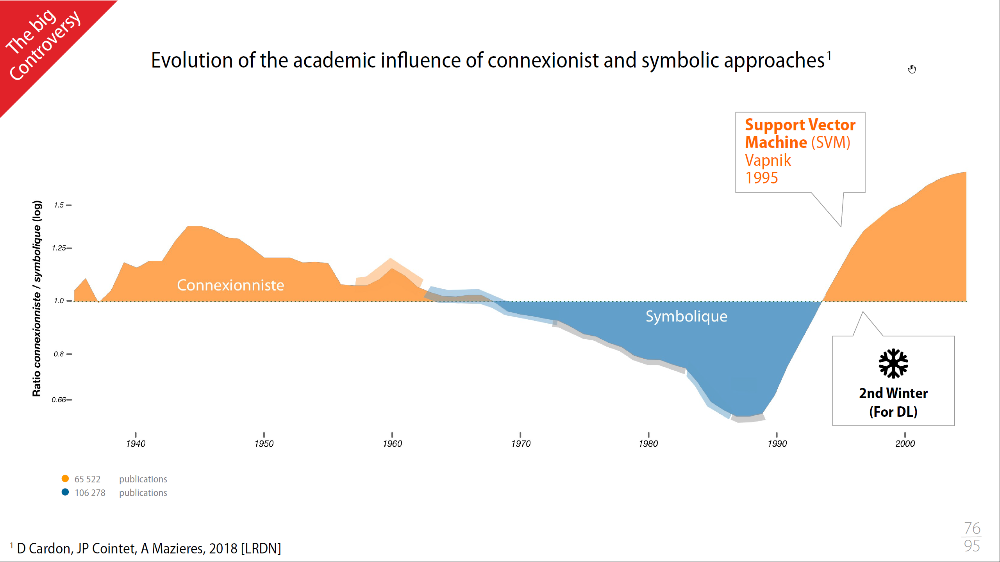

## FIDLE - Formation du CNRS

Suite aux deux spécialisations Coursera : Machine learning et Deep Learning, j'ai visionné les [vidéos](https://www.youtube.com/watch?v=FS33VWweMr4&list=PLlI0-qAzf2Sa6agSVFbrrzyfNkU5--6b_) et lu les [supports](https://cloud.univ-grenoble-alpes.fr/index.php/s/wxCztjYBbQ6zwd6) de la formation [Introduction au Deep Learning](https://gricad-gitlab.univ-grenoble-alpes.fr/talks/fidle/-/wikis/Fidle%20%C3%A0%20distance/Programme#s%C3%A9quence-1-contexte-et-historique-de-la-r%C3%A9gression-lin%C3%A9aire-aux-r%C3%A9seaux-de-neurones) organisée par le CNRS et nommée FIDLE (Formation Introduction au Deep LEarning).

Cette formation, que je ne pas suivie en directe, mais que j'ai pu suivre car entièrement disponible en mode offline, est :
- libre et gratuite, ouverte à toutes et à tous !
- en français
- avec pas mal d'exercices pratiques (tout un environnement avec les travaux pratiques sont disponibles sous docker ou autre)

Je n'expose pas ici une prise de notes complète, à la place :
- je propose des liens vers l'équivalent dans mes prises de note Coursera
- j'ajoute les points supplémentaires, marquants, ou expliqués avec un autre point de vue

### Seq 01 :  Contexte et historique, de la régression linéaire aux réseaux de neurones.

#### Introduction Context, tools and ressources

The Fourth Paradigm: Data-Intensive Scientific Discovery
> 

Après une science basée, sur :
- l'expérimentation
- la théorisation
- l'informatique pour faire avancer la théorie
- on passe sur une science qui avance grâce à l'exploitation de la donnée

Les différents type de Machine Learning

> 

#### From the linear regression to the first neuron

Explication de la notion de
- Linear regression
- Gradient descent
- Logistic regression

Notion expliquée dans la formation [Machine Learning de Coursera](/deeplearning/machine-learning-specialization/c1-supervised-ml/week1).

Une comparaison intéressante pour parler de l'Overfiting (surapprentissage) : plus un étudiant bosse ses exercices, mieux il saura les faire. Mais que ce passe-t-il avec les exercices de l'examen? La solution est donc de ne pas avoir une apprentissage trop poussé sur les exercices d’entraînement et/ou d'augmenter le nombre d’exercices de la phase d’entraînement.

#### Neurones in controversy

##### Connectionnism vs Symbolic

Dualité de la définition de líntelligence :
- Ability to perceive or infer information, and to retain it as knowledge to be applied towards adaptive behaviors within an environment or context ([Wikipedia](https://en.wikipedia.org/wiki/Intellilgence))
- Set of mental functions aimed at conceptual and rational knowledge ([Larousse](https://www.larousse.fr/dictionnaires/francais/intelligence/43555#:~:text=Qualit%C3%A9%20de%20quelqu'un%20qui,Avoir%20l'intelligence%20des%20affaires.))

> 

##### Historic evolution

Ces deux approches ne sont pas incompatibles, et ces deux approches de l'intelligence donnent en informatique de très bons résultats, mais néanmoins voilà il y a quand même une forme de concurrence entre les deux.

Publication de référence : https://www.cairn.info/revue-reseaux-2018-5-page-173.htm?ref=doi

- Dans les années 1940, on a une vision très connectionniste, dans une informatique très éloignée de ce que nous avons aujourd'hui (publication par des physiologistes ou autre, mais pas des informaticiens)
- Premier résultat est le perceptron de Frank Rosenblatt, un modèle simple de neurone artificiel, conçu pour effectuer des tâches de classification binaire.

> 

- Avec un seul neurone pour le Perceptron, on ne sait que traiter des problèmes linéaires, les spécialistes se tournent sur des programmes à base de logique et de règles, avec de bon résultats.
- Mac Carthy invente le terme de "intelligence artificielle" (John McCarthy a joué un rôle crucial dans le développement de l'intelligence artificielle en tant que domaine académique et de recherche, et il a également contribué à la création du langage de programmation Lisp)
- Cette branche symbolique promet beaucoup de chose, mais les promesses ne sont pas tenus, on rentre dans le **premier hiver de líntelligence artificielle** (les deux approches perdent quasi tous leurs financements)

> 

- on continue les progrès tout de même du côté de l'approche symbolique avec les systèmes experts 
- du côté connectionnisme, quelques équipes qui continuent à travailler et deux choses vraiment fondamentales qui qui sont apparues :
    - la rétropagation 
    - les réseaux convolutifs
- côté connectionnisme, on peut désormais s'attaquer à des problèmes non linéaires, et traiter des images, avec des machines capables de calculer

> 

- on arrive a des limites côté des systèmes experts 
- en machine learning, les mathématique progressent et une autre méthode, Support Vector Machine (SVM) viennent concurrencer les réseaux de neurones qui se trouve à nouveau isolé (second hiver pour le DL)
- les chose évolumet pour deux raisons :
    - banalisation de Internet, 
    - augmentation de la puissance de calcul (facteur limitant du DL)
- en 2012, AlexNet a divisé par deux le taux d'erreur au concours annuel ImageNet Large Scale Visual Recognition Challenge (ILSVRC)

> 

#### Data and neurons

Session de live coding :
- Wine quality prediction with a Dense Network (Regression with DNN)
- Recognizing handwritten numbers (Simple classification with DNN)

A noter que le second use case est basé sur le fameux MNIST (Modified National Institute of Standards and Technology) directement intégré dans Keras

### Seq 02 :  Réseaux convolutifs, partie 1

Comparaison intéressante du nombre de neurones selon les espèces
A noter que lorsqu'on parle des réseau actuels, on parle du nombre de paramètres qui est plus le nombre de connexions entre les neurones, et non pas le nombre de neurones. Ainsi un modèle NLP de 150 milliards de paramètres, c'est 1000 fois moins que le nombre de synapses du cerveau humain, et donc le DL aujourd'hui c'est plus la souris ou l'insecte

> 

- Présentation de ce qu'est un [Convolutional Neuron Network (CNN)](/deeplearning/deep-learning-specialization/c4-convolutional-neural-netowrks/week1/)
- Session de live coding :
    - Recognizing handwritten numbers (implemented via DNN on previous sequence, now done with CNN). Le résultat est meilleur en CNN vs DNN (accuracy 98% vs. 95%)
- A propos des GPU :
    - cela aide pour les CNN car le GPU c'est beaucoup de threads, très parallélisable, donc sur un couche du CNN on peut distribuer chaque "kernel" ou filtre
    - Pour Imagenet (1000 classes, 1.000.000 d'images):
        - avant 2017, 14 jours sur un GPU de l'époque
        - aujourd'hui, moins d'une minute sur un supercalculateur, sur un GPU personnel d'aujourd'hui, peut-être 3 ou 4 jours d'apprentissage
- DNN vs. CNN vs. Transformer:
    - CNN est parfait pour image, parole
    - aujourd'hui, les Transformers savent tout faire, mais il leur faut beaucoup de données en input (gros dataset)

### Seq 03 :  Réseaux convolutifs, partie 2

- Cas pratique, dans un vrai cas, dans le vrai monde avec le German Traffic Sign Recognition Benchmark (GTSRB) : 50,000 photos, 40 classes
    - GTSRB1 :Data analysis and creation of a usable dataset
        - on met les 50.000 images dans un seul fichier H5 (éviter les accès fichiers)
        - choisir préparation des données pour avoir un format input homogène (scale des images)
        - préparation des datas (RGB vers noir/blanc, float 32 vs. double 64, on n'a pas besoin de bcp de précision en DL)
    - GTSRB2 :First convolutions and first results
        - accuracy 94%
    - GTSRB3 :Monitoring training, managing checkpoints
        - on travaille sur un sous-system pour aller plus vite
        - on sauvegarde les meilleur modèle en mettant en place des callbacks (`keras.callbacks.ModelCheckPoint`)
        - on utilise `Tensorboard` pour voir les courbes en temps réél (si les performance s'effondre, on peut arrêter)
    - GTSRB4 :Improving the results with data augmentation
        - si on a des erreurs sur le panneau "limite 80", on doit ajouter des panneaux 80km/h... 
        - cela se fait en q qlignes de codes (rotation, etc...) 
    - GTSRB5 :Combine lots of models and lots of datasets
    - GTSRB6 :Run Full convolution notebook as a batch
    - GTSRB7 :Displaying the reports of the different jobs

- The devil is also hiding in the data
> 

### Seq 04 :  Démystifier les outils mathématiques

- Transformation de la représentation des données
    - Définition de la convolution
    - ReLU
    - Max Pooling
- Descente de gradient
    - Diminution du **risque empirique**
- Descente de gradient dans un réseau de neurones
    - Cf. [Gradient Decent](/deeplearning/machine-learning-specialization/c1-supervised-ml/week1/#gradient-descent)
- Descente de gradient stochastique et mini-batchs:
    - impossible de faire un calcul de gradient sur toutes les images, trop dínformations à stocker dans les GPU qui ont peu de mémoire. Cf. [Mini-batch gradient descent](/deeplearning/deep-learning-specialization/c2-improving-deep-neural-networks/week2/#understanding-mini-batch-gradient-descent)

Je trouve à titre personnel que les explications données par Andrew Ng sont plus claires et mieux vulgarisées.

### Seq 05 :  Stratégies d'évaluation des modèles et Données creuses et de type textuelles (Embedding)

#### Stratégies d'évaluation des modèles

- Introduction d'un set de donnée de validation en plus du set de test et de training
    - si on veut améliorer un modèle et qu'on utilise les données de test pour valider le modèle, on introduit un biais
    - on introduit donc un **set de validation** ou **set de dev**.
    - Cf [Train / Dev / Test sets](/deeplearning/deep-learning-specialization/c2-improving-deep-neural-networks/week1/#train--dev--test-sets)
- Finding the right metric (pour évaluer de la pertinance des résultats)
    - quantitatifs vs qualitatifs

> 

> 

#### Données creuses / textuelles (Embedding)

- notion de vecteur creux ou [one-hot encoding](/deeplearning/deep-learning-specialization/c5-recurrent-neural-networks/week1/#notation )
- [Word Embedding](/deeplearning/deep-learning-specialization/c5-recurrent-neural-networks/week2/#using-word-embeddings)
- Live coding
    - Guess whether a film review is positive or not based on the analysis of the text, using One-Hot encoding
    - Guess whether a film review is positive or not based on the analysis of the text, using embedding.

### Seq 06 :  Quand les données sont des séquences, les réseaux récurrents (RNN)

- Neurone récurrent (unit)

> 

> 

- cellule récurrente (plusieurs neurones ou unit)

> 

- LSTM

> 

- Voir les chapitres dans coursera : 
    - [Recurrent Neural Network Model](/deeplearning/deep-learning-specialization/c5-recurrent-neural-networks/week1/#why-sequence-models)
    - [GRU](/deeplearning/deep-learning-specialization/c5-recurrent-neural-networks/week1/#gated-recurrent-unit-gru) 
    - [LSTM](/deeplearning/deep-learning-specialization/c5-recurrent-neural-networks/week1/#long-short-term-memory-lstm)
    - [Different Types of RNNs](/deeplearning/deep-learning-specialization/c5-recurrent-neural-networks/week1/#different-types-of-rnns) (OneToOne, OneToMany,... )

<!-- ### Seq 07 :  Un détour par PyTorch

### Seq 08 :  "Attention Is All You Need", quand les Transformers changent la donne (HB,NC)

### Seq 09 :  Travailler avec des données structurées : Graph Neural Network(GNN)

### Seq 10 : Autoencodeur (AE) : un exemple d'apprentissage "self supervised"

### Seq 11 : Variational Autoencoder (VAE) : apprentissage "self supervised"

### Seq 12 : Revue de projets Fidle Intégrée à la future journée Deep Learning pour la Science

### Seq 13 : Generative Adversarial Networks (GAN)!

### Seq 14 : Diffusion model, text to image (HB,NC,MS)

### Seq 15 -  AI, droit, société et éthique (LR, BC, ...)

### Seq 16 : Apprendre plus vite et moins cher, optimiser l’apprentissage (BC,LH)

### Seq 17 :  Passer à la vitesse supérieure : l’accélération matérielle (BC,LH)

### Seq 18 :  Tactiques et stratégies du Deep Reinforcement Learning

### Seq 19 :  Des neurones pour la physique, les physics-informed neural networks (PINNS)

### Seq 20 :  Journée Deep Learning pour la Science - JDLS2023 -->
