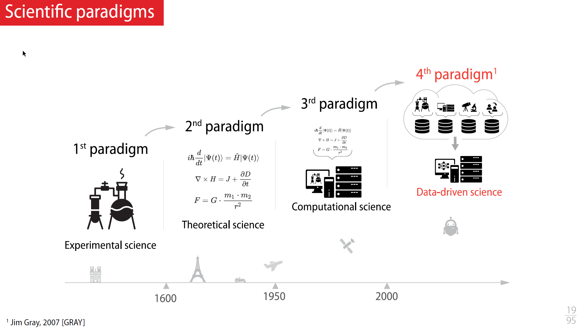
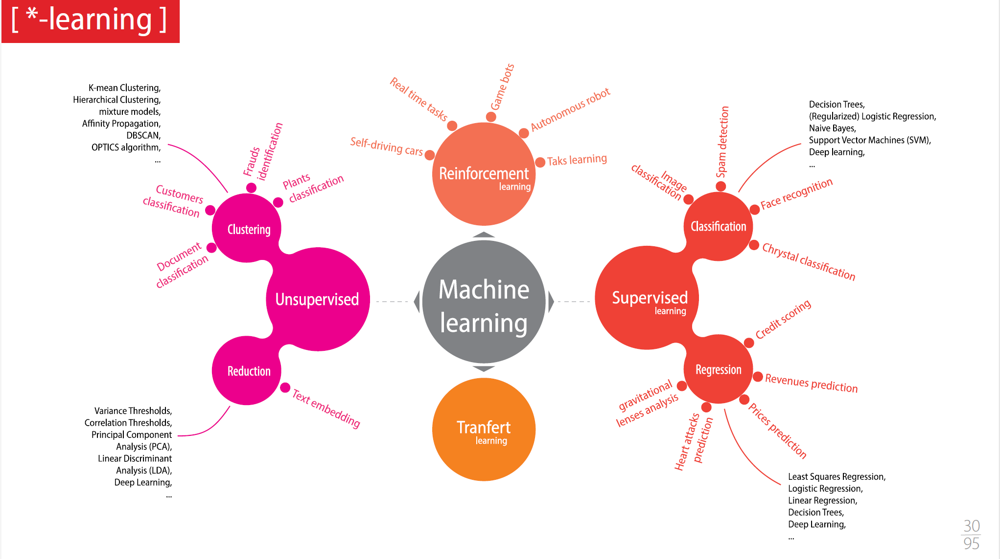
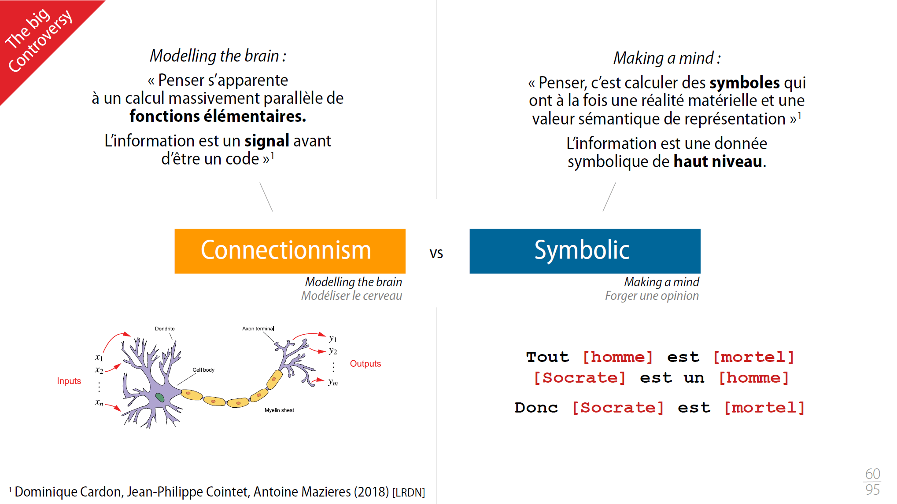
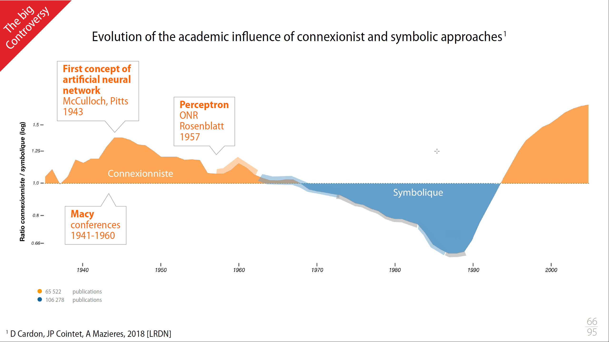
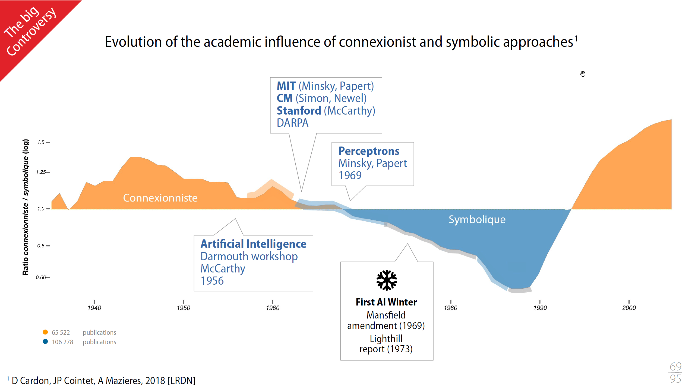
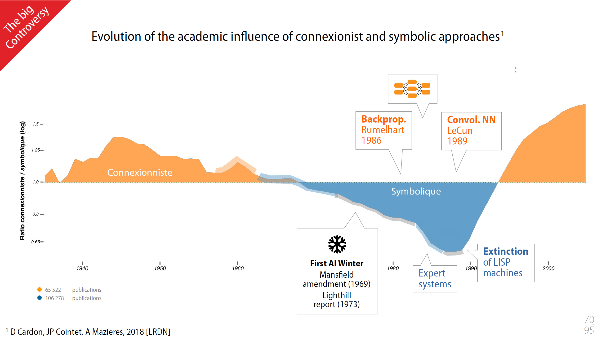
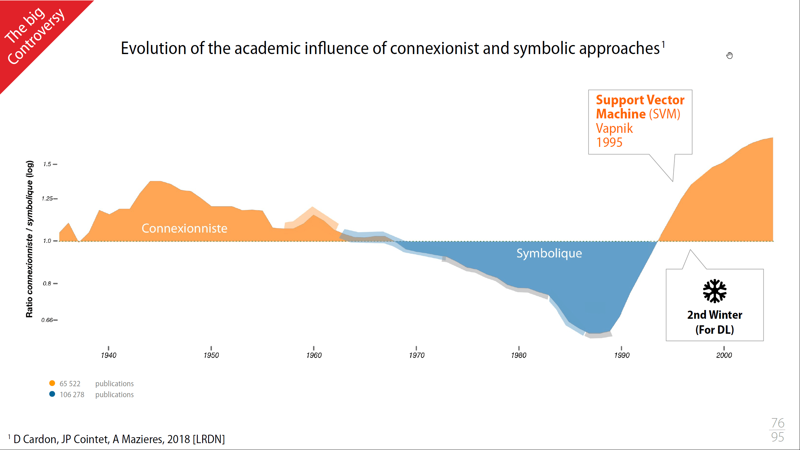

### Seq 01 :  Contexte et historique, de la régression linéaire aux réseaux de neurones.

#### Introduction Context, tools and ressources

The Fourth Paradigm: Data-Intensive Scientific Discovery
> 


Après une science basée, sur :
- l'expérimentation
- la théorisation
- l'informatique pour faire avancer la théorie
- on passe sur une science qui avance grâce à l'exploitation de la donnée

Les différents type de Machine Learning

> 

#### From the linear regression to the first neuron

Explication de la notion de
- Linear regression
- Gradient descent
- Logistic regression

Notion expliquée dans la formation [Machine Learning de Coursera](/deeplearning/machine-learning-specialization/c1-supervised-ml/week1).

Une comparaison intéressante pour parler de l'Overfiting (surapprentissage) : plus un étudiant bosse ses exercices, mieux il saura les faire. Mais que ce passe-t-il avec les exercices de l'examen? La solution est donc de ne pas avoir une apprentissage trop poussé sur les exercices d’entraînement et/ou d'augmenter le nombre d’exercices de la phase d’entraînement.

#### Neurones in controversy

##### Connectionnism vs Symbolic

Dualité de la définition de líntelligence :
- Ability to perceive or infer information, and to retain it as knowledge to be applied towards adaptive behaviors within an environment or context ([Wikipedia](https://en.wikipedia.org/wiki/Intellilgence))
- Set of mental functions aimed at conceptual and rational knowledge ([Larousse](https://www.larousse.fr/dictionnaires/francais/intelligence/43555#:~:text=Qualit%C3%A9%20de%20quelqu'un%20qui,Avoir%20l'intelligence%20des%20affaires.))

> 

##### Historic evolution

Ces deux approches ne sont pas incompatibles, et ces deux approches de l'intelligence donnent en informatique de très bons résultats, mais néanmoins voilà il y a quand même une forme de concurrence entre les deux.

Publication de référence : https://www.cairn.info/revue-reseaux-2018-5-page-173.htm?ref=doi


- Dans les années 1940, on a une vision très connectionniste, dans une informatique très éloignée de ce que nous avons aujourd'hui (publication par des physiologistes ou autre, mais pas des informaticiens)
- Premier résultat est le perceptron de Frank Rosenblatt, un modèle simple de neurone artificiel, conçu pour effectuer des tâches de classification binaire.

> 

- Avec un seul neurone pour le Perceptron, on ne sait que traiter des problèmes linéaires, les spécialistes se tournent sur des programmes à base de logique et de règles, avec de bon résultats.
- Mac Carthy invente le terme de "intelligence artificielle" (John McCarthy a joué un rôle crucial dans le développement de l'intelligence artificielle en tant que domaine académique et de recherche, et il a également contribué à la création du langage de programmation Lisp)
- Cette branche symbolique promet beaucoup de chose, mais les promesses ne sont pas tenus, on rentre dans le **premier hiver de líntelligence artificielle** (les deux approches perdent quasi tous leurs financements)


> 

- on continue les progrès tout de même du côté de l'approche symbolique avec les systèmes experts 
- du côté connectionnisme, quelques équipes qui continuent à travailler et deux choses vraiment fondamentales qui qui sont apparues :
    - la rétropagation 
    - les réseaux convolutifs
- côté connectionnisme, on peut désormais s'attaquer à des problèmes non linéaires, et traiter des images, avec des machines capables de calculer

> 

- on arrive a des limites côté des systèmes experts 
- en machine learning, les mathématique progressent et une autre méthode, Support Vector Machine (SVM) viennent concurrencer les réseaux de neurones qui se trouve à nouveau isolé (second hiver pour le DL)
- les chose évolumet pour deux raisons :
    - banalisation de Internet, 
    - augmentation de la puissance de calcul (facteur limitant du DL)
- en 2012, AlexNet a divisé par deux le taux d'erreur au concours annuel ImageNet Large Scale Visual Recognition Challenge (ILSVRC)

> 


#### Data and neurons

Session de live coding :
- Wine quality prediction with a Dense Network (Regression with DNN)


- Recognizing handwritten numbers (Simple classification with DNN, will we implemented in CNN in [next sequence](../part2/#session-de-live-coding))
```python
hidden1     = 100
hidden2     = 100

model = keras.Sequential([
    keras.layers.Input((28,28)),
    keras.layers.Flatten(),
    keras.layers.Dense( hidden1, activation='relu'),
    keras.layers.Dense( hidden2, activation='relu'),
    keras.layers.Dense( 10,      activation='softmax')
])

model.compile(optimizer='adam',
              loss='sparse_categorical_crossentropy',
              metrics=['accuracy'])
```


A noter que le second use case est basé sur le fameux MNIST (Modified National Institute of Standards and Technology) directement intégré dans Keras

