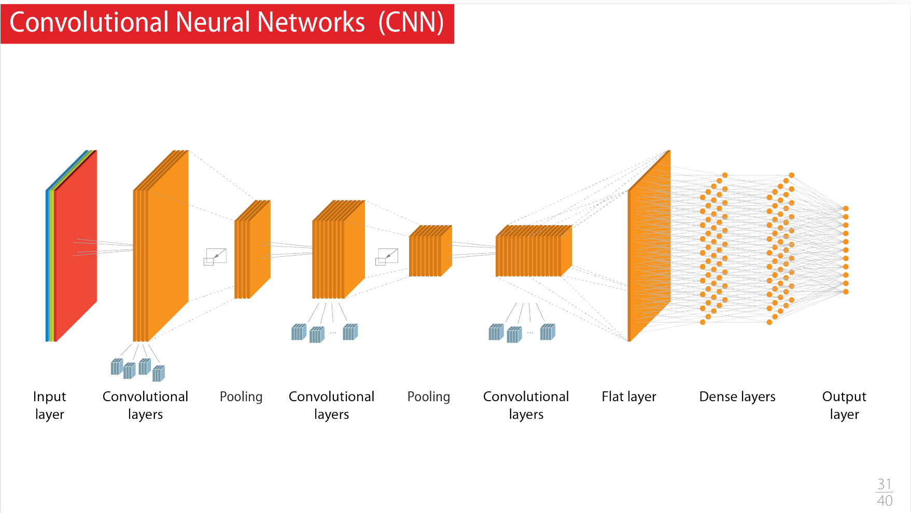

### Seq 02 :  Réseaux convolutifs, partie 1

Comparaison intéressante du nombre de neurones selon les espèces
A noter que lorsqu'on parle des réseau actuels, on parle du nombre de paramètres qui est plus le nombre de connexions entre les neurones, et non pas le nombre de neurones. Ainsi un modèle NLP de 150 milliards de paramètres, c'est 1000 fois moins que le nombre de synapses du cerveau humain, et donc le DL aujourd'hui c'est plus la souris ou l'insecte

> 

- Présentation de ce qu'est un [Convolutional Neuron Network (CNN)](/deeplearning/deep-learning-specialization/c4-convolutional-neural-netowrks/week1/)

> 

> 

> 

> 

> 

- Session de live coding :
    - Recognizing handwritten numbers (implemented via DNN on previous sequence, now done with CNN). Le résultat est meilleur en CNN vs DNN (accuracy 98% vs. 95%)
- A propos des GPU :
    - cela aide pour les CNN car le GPU c'est beaucoup de threads, très parallélisable, donc sur un couche du CNN on peut distribuer chaque "kernel" ou filtre
    - Pour Imagenet (1000 classes, 1.000.000 d'images):
        - avant 2017, 14 jours sur un GPU de l'époque
        - aujourd'hui, moins d'une minute sur un supercalculateur, sur un GPU personnel d'aujourd'hui, peut-être 3 ou 4 jours d'apprentissage
- DNN vs. CNN vs. Transformer:
    - CNN est parfait pour image, parole
    - aujourd'hui, les Transformers savent tout faire, mais il leur faut beaucoup de données en input (gros dataset)

### Seq 03 :  Réseaux convolutifs, partie 2

- Cas pratique, dans un vrai cas, dans le vrai monde avec le German Traffic Sign Recognition Benchmark (GTSRB) : 50,000 photos, 40 classes
    - GTSRB1 :Data analysis and creation of a usable dataset
        - on met les 50.000 images dans un seul fichier H5 (éviter les accès fichiers)
        - choisir préparation des données pour avoir un format input homogène (scale des images)
        - préparation des datas (RGB vers noir/blanc, float 32 vs. double 64, on n'a pas besoin de bcp de précision en DL)
    - GTSRB2 :First convolutions and first results
        - accuracy 94%
    - GTSRB3 :Monitoring training, managing checkpoints
        - on travaille sur un sous-system pour aller plus vite
        - on sauvegarde les meilleur modèle en mettant en place des callbacks (`keras.callbacks.ModelCheckPoint`)
        - on utilise `Tensorboard` pour voir les courbes en temps réél (si les performance s'effondre, on peut arrêter)
    - GTSRB4 :Improving the results with data augmentation
        - si on a des erreurs sur le panneau "limite 80", on doit ajouter des panneaux 80km/h... 
        - cela se fait en q qlignes de codes (rotation, etc...) 
    - GTSRB5 :Combine lots of models and lots of datasets
    - GTSRB6 :Run Full convolution notebook as a batch
    - GTSRB7 :Displaying the reports of the different jobs

- The devil is also hiding in the data
> 

### Seq 04 :  Démystifier les outils mathématiques

- Transformation de la représentation des données
    - Définition de la convolution
    - ReLU
    - Max Pooling
- Descente de gradient
    - Diminution du **risque empirique**
- Descente de gradient dans un réseau de neurones
    - Cf. [Gradient Decent](/deeplearning/machine-learning-specialization/c1-supervised-ml/week1/#gradient-descent)
- Descente de gradient stochastique et mini-batchs:
    - impossible de faire un calcul de gradient sur toutes les images, trop dínformations à stocker dans les GPU qui ont peu de mémoire. Cf. [Mini-batch gradient descent](/deeplearning/deep-learning-specialization/c2-improving-deep-neural-networks/week2/#understanding-mini-batch-gradient-descent)

Je trouve à titre personnel que les explications données par Andrew Ng sont plus claires et mieux vulgarisées.

