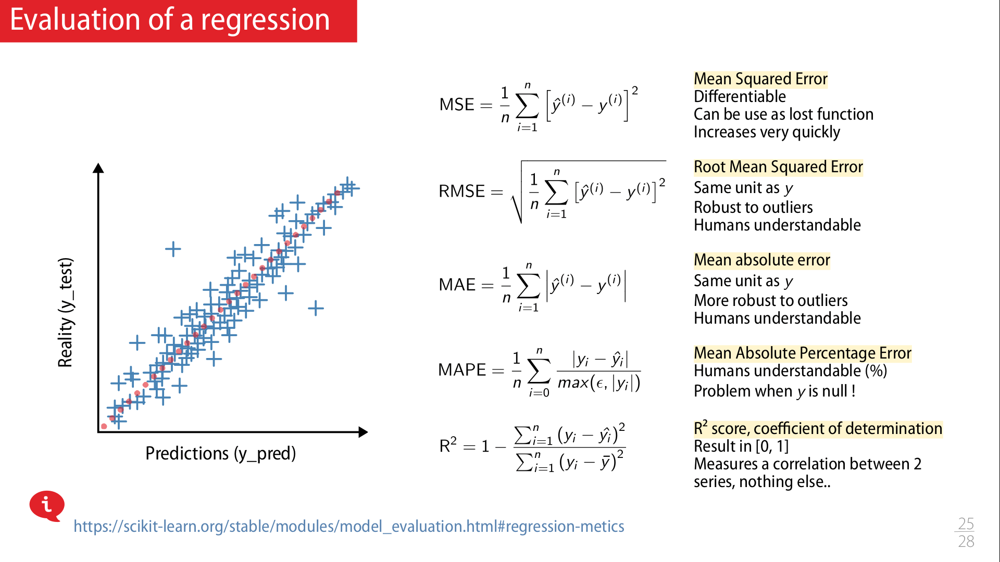
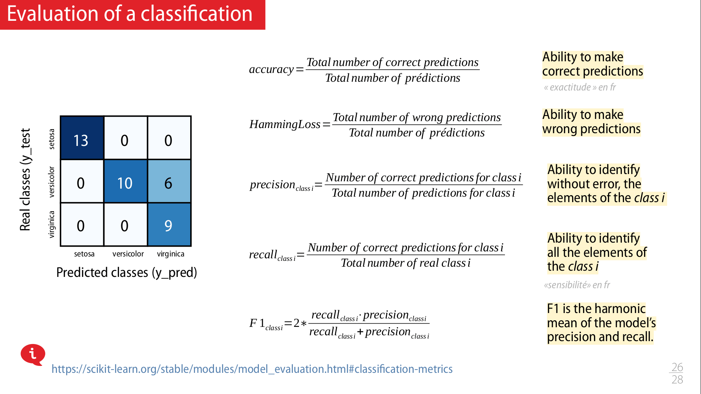
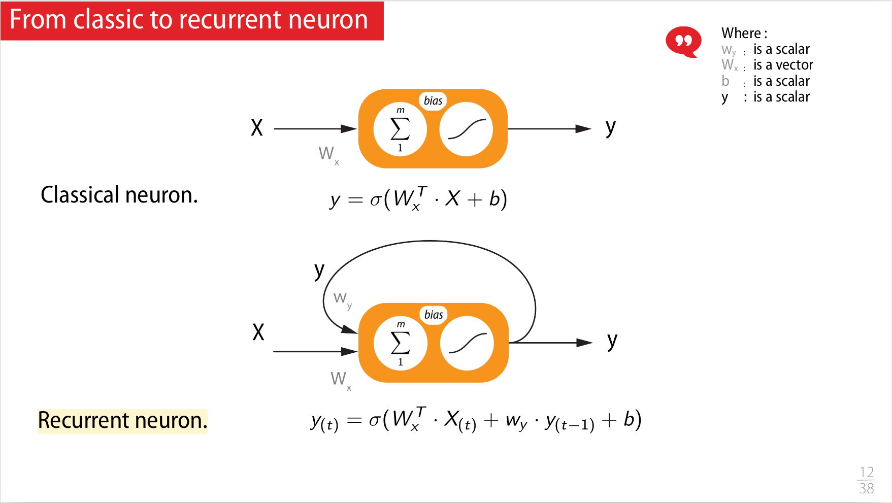
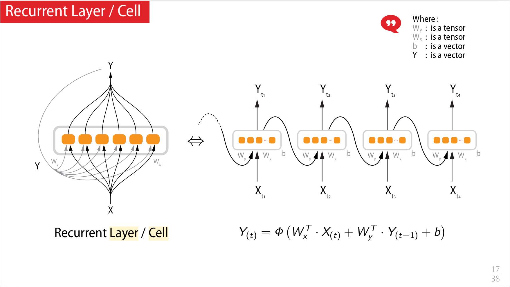
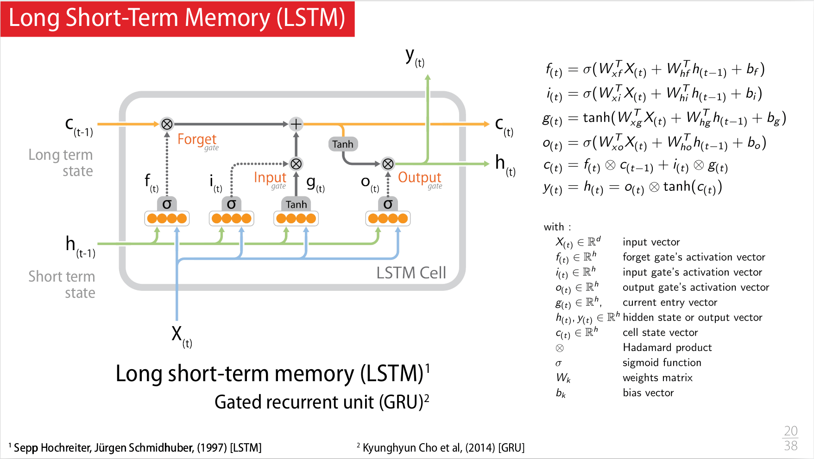

### Seq 05 :  Stratégies d'évaluation des modèles et Données creuses et de type textuelles (Embedding)

#### Stratégies d'évaluation des modèles

- Introduction d'un set de donnée de validation en plus du set de test et de training
    - si on veut améliorer un modèle et qu'on utilise les données de test pour valider le modèle, on introduit un biais
    - on introduit donc un **set de validation** ou **set de dev**.
    - Cf [Train / Dev / Test sets](/deeplearning/deep-learning-specialization/c2-improving-deep-neural-networks/week1/#train--dev--test-sets)
- Finding the right metric (pour évaluer de la pertinance des résultats)
    - quantitatifs vs qualitatifs

> 

> 

#### Données creuses / textuelles (Embedding)

- notion de vecteur creux ou [one-hot encoding](/deeplearning/deep-learning-specialization/c5-recurrent-neural-networks/week1/#notation )
- [Word Embedding](/deeplearning/deep-learning-specialization/c5-recurrent-neural-networks/week2/#using-word-embeddings)
- Live coding
    - Guess whether a film review is positive or not based on the analysis of the text, using One-Hot encoding
    - Guess whether a film review is positive or not based on the analysis of the text, using embedding.

### Seq 06 :  Quand les données sont des séquences, les réseaux récurrents (RNN)

- Neurone récurrent (unit)

> 

> 

- cellule récurrente (plusieurs neurones ou unit)

> 

- LSTM
    - ht (yt dupliqué) appelé hiddent state est la mémoire court terme
    - ct est la mémoire long terme
- GRU version plus récente et simplifié
> 


 
```python
### Serie to vector
inputs= tf.random.normal([32, 20, 8])   # shape (32, 20, 8)    batche de 32 sequences de 20 vecteurs de taille 8 
lstm = tf.keras.layers.LSTM(16)         # 16 units
output = lstm(inputs)                   # shape (32, 16),      batch de 32 Yt de taille 16 (car 16 units) 

### Serie to serie
lstm = tf.keras.layers.LSTM(18, return_sequences=True, return_state=True)
output, memory_state, carry_state = lstm(inputs)    
# output shape   (32, 20, 18)
# Memory state   (32, 18)
# Carry state    (32, 18)
```


- Voir les chapitres dans coursera : 
    - [Recurrent Neural Network Model](/deeplearning/deep-learning-specialization/c5-recurrent-neural-networks/week1/#why-sequence-models)
    - [GRU](/deeplearning/deep-learning-specialization/c5-recurrent-neural-networks/week1/#gated-recurrent-unit-gru) 
    - [LSTM](/deeplearning/deep-learning-specialization/c5-recurrent-neural-networks/week1/#long-short-term-memory-lstm)
    - [Different Types of RNNs](/deeplearning/deep-learning-specialization/c5-recurrent-neural-networks/week1/#different-types-of-rnns) (OneToOne, OneToMany,... )

<!-- ### Seq 07 :  Un détour par PyTorch

### Seq 08 :  "Attention Is All You Need", quand les Transformers changent la donne (HB,NC)

### Seq 09 :  Travailler avec des données structurées : Graph Neural Network(GNN)

### Seq 10 : Autoencodeur (AE) : un exemple d'apprentissage "self supervised"

### Seq 11 : Variational Autoencoder (VAE) : apprentissage "self supervised"

### Seq 12 : Revue de projets Fidle Intégrée à la future journée Deep Learning pour la Science

### Seq 13 : Generative Adversarial Networks (GAN)!

### Seq 14 : Diffusion model, text to image (HB,NC,MS)

### Seq 15 -  AI, droit, société et éthique (LR, BC, ...)

### Seq 16 : Apprendre plus vite et moins cher, optimiser l’apprentissage (BC,LH)

### Seq 17 :  Passer à la vitesse supérieure : l’accélération matérielle (BC,LH)

### Seq 18 :  Tactiques et stratégies du Deep Reinforcement Learning

### Seq 19 :  Des neurones pour la physique, les physics-informed neural networks (PINNS)

### Seq 20 :  Journée Deep Learning pour la Science - JDLS2023 -->
