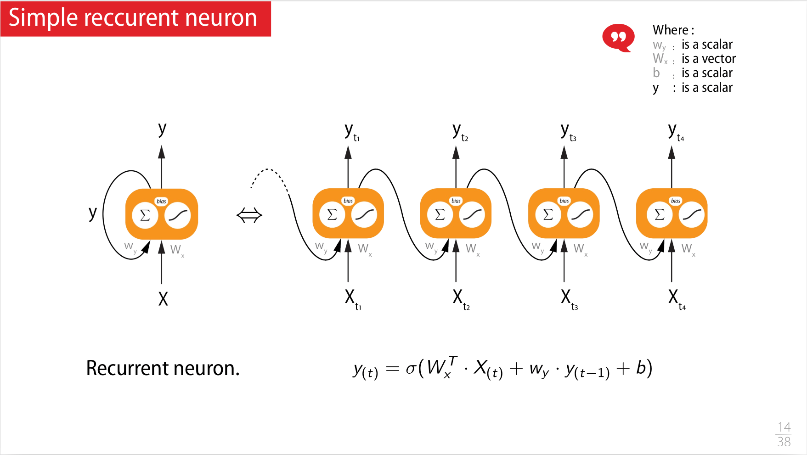

## Seq 05 :  Stratégies d'évaluation des modèles et Données creuses et de type textuelles (Embedding)

https://www.youtube.com/watch?v=_zpguGC19UM&list=PLlI0-qAzf2Sa6agSVFbrrzyfNkU5--6b_&index=6

### Stratégies d'évaluation des modèles

- Introduction d'un set de donnée de validation en plus du set de test et de training
    - si on veut améliorer un modèle et qu'on utilise les données de test pour valider le modèle, on introduit un biais
    - on introduit donc un **set de validation** ou **set de dev**.
    - Cf [Train / Dev / Test sets](/deeplearning/deep-learning-specialization/c2-improving-deep-neural-networks/week1/#train--dev--test-sets)
- Finding the right metric (pour évaluer de la pertinance des résultats)
    - quantitatifs vs qualitatifs

> 

> 

### Données creuses / textuelles (Embedding)

How to feed a neural network with text ?
- « I've never seen a movie like this before. »
- How to build a descriptor for this kind of data (text, DNA, ...)?

#### Solution 1 : one hot vector

> 

> 

#### Solution 2 : Using embedding

> 

##### Contextual embedding - Keras

Pour par exemple avoir une représentation dense spécialisée dans la critique de cinéma, car construit avec un jeu d'entrainement dédié

> 

> 

##### Global embedding

> 

> 

> 

> 


Références dans Coursera :
- notion de vecteur creux ou [one-hot encoding](/deeplearning/deep-learning-specialization/c5-recurrent-neural-networks/week1/#notation )
- [Word Embedding](/deeplearning/deep-learning-specialization/c5-recurrent-neural-networks/week2/#using-word-embeddings)


#### Live coding

Guess whether a film review is positive or not based on the analysis of the text (from IMDB)
- http://ai.stanford.edu/~amaas/data/sentiment/
- Embeded in keras : https://www.tensorflow.org/api_docs/python/tf/keras/datasets

Deux versions:
- Guess whether a film review is positive or not based on the analysis of the text, using One-Hot encoding
- Guess whether a film review is positive or not based on the analysis of the text, using Keras-embedding.


## Seq 06 :  Quand les données sont des séquences, les réseaux récurrents (RNN)

https://www.youtube.com/watch?v=naCCxqMD13o&list=PLlI0-qAzf2Sa6agSVFbrrzyfNkU5--6b_&index=7

- Neurone récurrent (unit)

> 

> 

- cellule récurrente (plusieurs neurones ou unit)

> 

- LSTM
    - ht (yt dupliqué) appelé hiddent state est la mémoire court terme
    - ct est la mémoire long terme
- GRU version plus récente et simplifié
> 


 
```python
# Serie to vector
inputs= tf.random.normal([32, 20, 8])   # shape (32, 20, 8)    batche de 32 sequences de 20 vecteurs de taille 8 
lstm = tf.keras.layers.LSTM(16)         # 16 units
output = lstm(inputs)                   # shape (32, 16),      batch de 32 Yt de taille 16 (car 16 units) 

# Serie to serie
lstm = tf.keras.layers.LSTM(18, return_sequences=True, return_state=True)
output, memory_state, carry_state = lstm(inputs)    
# output shape   (32, 20, 18)
# Memory state   (32, 18)
# Carry state    (32, 18)
```


- Voir les chapitres dans coursera : 
    - [Recurrent Neural Network Model](/deeplearning/deep-learning-specialization/c5-recurrent-neural-networks/week1/#why-sequence-models)
    - [GRU](/deeplearning/deep-learning-specialization/c5-recurrent-neural-networks/week1/#gated-recurrent-unit-gru) 
    - [LSTM](/deeplearning/deep-learning-specialization/c5-recurrent-neural-networks/week1/#long-short-term-memory-lstm)
    - [Different Types of RNNs](/deeplearning/deep-learning-specialization/c5-recurrent-neural-networks/week1/#different-types-of-rnns) (OneToOne, OneToMany,... )


### Session de live coding :

#### Prediction of a 2D ladybug trajectory with a RNN

```python
# Train generator, to genarate sequences fron the global sequence (total of the position)
from tensorflow.keras.preprocessing.sequence import TimeseriesGenerator
train_generator = TimeseriesGenerator(x_train, x_train, length=sequence_len,  batch_size=batch_size)
test_generato
```

```python
# Create the model with sequential
model = keras.models.Sequential()
model.add( keras.layers.InputLayer(input_shape=(sequence_len, features_len)) )
# GRU with 200 units, return_sequences=False we only want the last position (sequence to vector)
model.add( keras.layers.GRU(200, return_sequences=False, activation='relu') )
# GRU output is a vector of 200 positions (because 200 units), we add Dense layer of 2 (x,y)
model.add( keras.layers.Dense(features_len) )

```

```python
batch_size  = 512
epochs      =  16
# We pass the generator to fit method
history = model.fit(  x_train, y_train,
                      batch_size      = batch_size,
                      epochs          = epochs,
                      verbose         = fit_verbosity,
                      validation_data = (x_test, y_test))

```

#### Guess what the weather will be like !

- SYNOP meteorological data, can be found on : https://public.opendatasoft.com  
- panda (qui est l'excel en ligne de commande), permet de faire de l'interpolation pour les données manquantes

> 

