## Seq 08 :  "Attention Is All You Need"

https://www.youtube.com/watch?v=L3DGgzIbKz4&list=PLlI0-qAzf2Sa6agSVFbrrzyfNkU5--6b_&index=9

- [Coursera - Attention Model Intuition ](/deeplearning/deep-learning-specialization/c5-recurrent-neural-networks/week3/#attention-model-intuition)
- [Coursera - Transformer Network](/deeplearning/deep-learning-specialization/c5-recurrent-neural-networks/week4/)

### Quand les Transformers changent la donne (HB,NC)

Les Transformers sont actuellement l'architecture de modèle la plus utilisée dans la recherche. Ils ont été introduits en 2017 avec le célèbre article "Attention is All You Need". Initialement conçus pour la traduction, les Transformers sont maintenant utilisés dans de nombreuses applications de traitement automatique du langage naturel (NLP), de la traduction aux moteurs de recherche, et même dans des modèles comme ChatGPT.

Les Transformers ne sont pas limités au domaine du NLP. Ils ont également révolutionné la vision par ordinateur et l'imagerie médicale. Des domaines scientifiques tels que la prédiction de la structure 3D des protéines avec AlphaFold 2 utilisent également des modèles de Transformers. Ils ont même été employés pour générer de nouvelles molécules.

### Rappel et précision sur l'Embedding

> 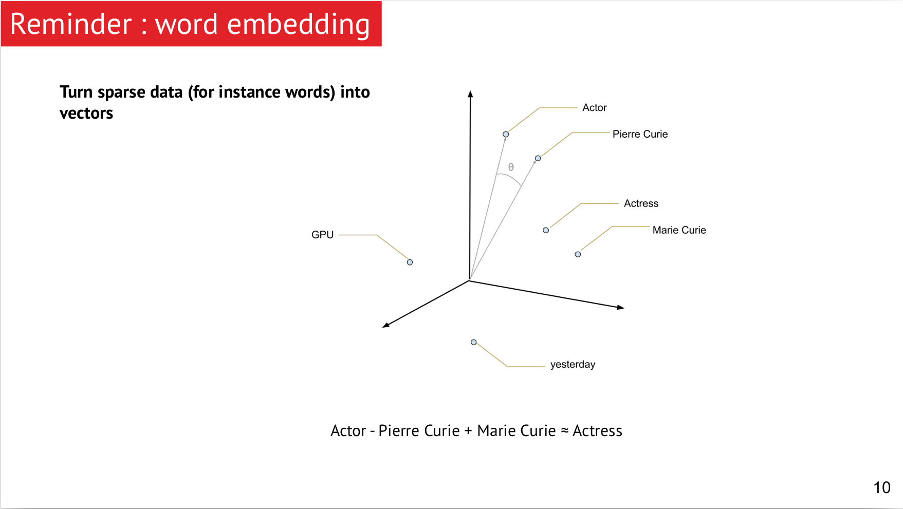

- Contrairement à notre compréhension humaine du langage, où nous associons des mots à des significations spécifiques, les embeddings offrent une représentation plus abstraite dans un espace mathématique.
    - En particulier, on peut calculer la disatnce angulaire entre deux vecteur (similarité cosinus)
- Dans l'analyse du langage, un token est une unité fondamentale utilisée pour traiter et comprendre le texte. Il peut représenter des mots, des parties de mots ou même des concepts plus larges, en fonction du contexte et de la manière dont les modèles de langage sont conçus.

### Positional Encoding

Dans un RNN, la position du mot est clairement identifiée, ce n'est pas le cas dans les Transformer.
Il faut mettre en place un système d'encodage de la position

L'idée est de représenter la position de chaque mot dans la séquence à l'aide d'un vecteur qui est ajouté à son embedding. La manière la plus courante de le faire est de créer un vecteur de position pour chaque mot dans la séquence. Chaque dimension de ce vecteur représente une oscillation sinus ou cosinus à une fréquence spécifique, et la combinaison de ces oscillations forme un modèle unique pour chaque position.

> 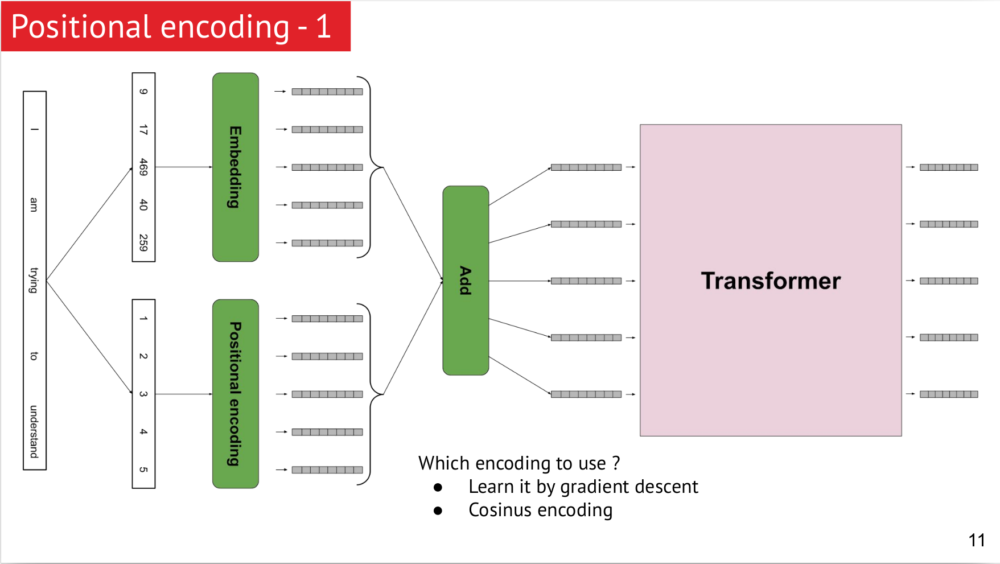

Cf. [Positional Encoding](/deeplearning/deep-learning-specialization/c5-recurrent-neural-networks/week4/#positional-encoding-of-the-input)

### Historique sur le traitement des séquences

- CNN for NLP (mais pas de contexte en dehors du filtre)
- Bidirectional RNNs (Encoder/Decoder), un RNN qui encode la phrase en francais, et un autre RNN qui traduit en anglais 

> 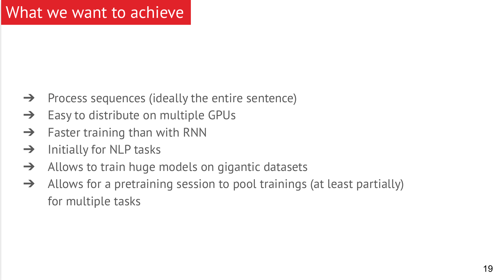

Résultats sur : [GLUE: A Multi-Task Benchmark and Analysis Platform for Natural Language Understanding](https://arxiv.org/abs/1804.07461)

Les modèles de traitement du langage basés sur les Transformers, comme les modèles de modèles pré-entraînés tels que BERT et GPT, ont montré des performances impressionnantes dans des tâches spécifiques, y compris la détermination du sujet dans une phrase donnée ("Le colonel a décoré le soldat car il a été très courageux"). Ils peuvent être meilleurs que les humains

Les défis liés à l'évaluation des performances de ces modèles sont actuellement un domaine actif de recherche et de discussion au sein de la communauté scientifique.

> 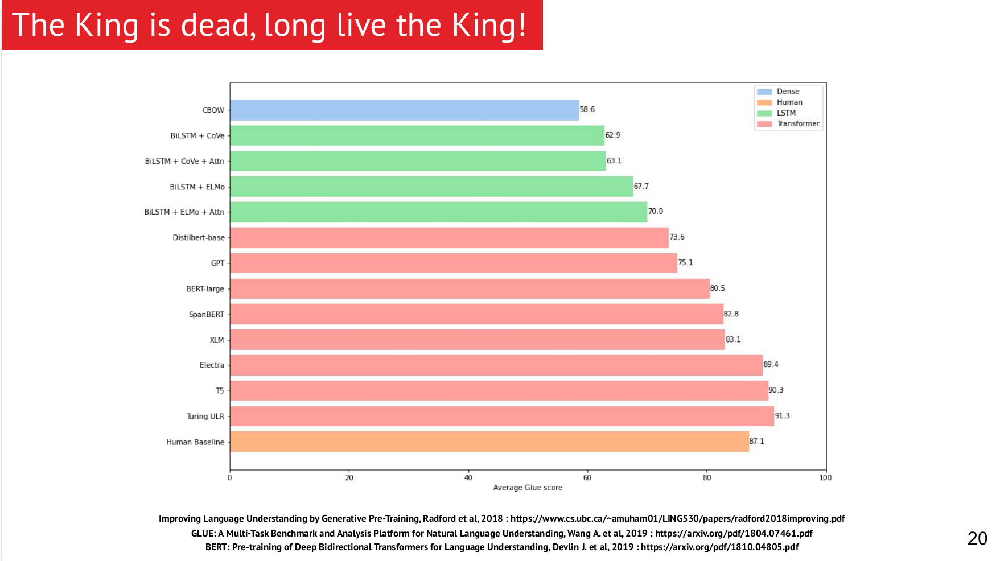

Ces performances sont dûs au mécanisme d'attentions, mais aussi au fait qu'ils peuvent prendre des modèles énormes.

> 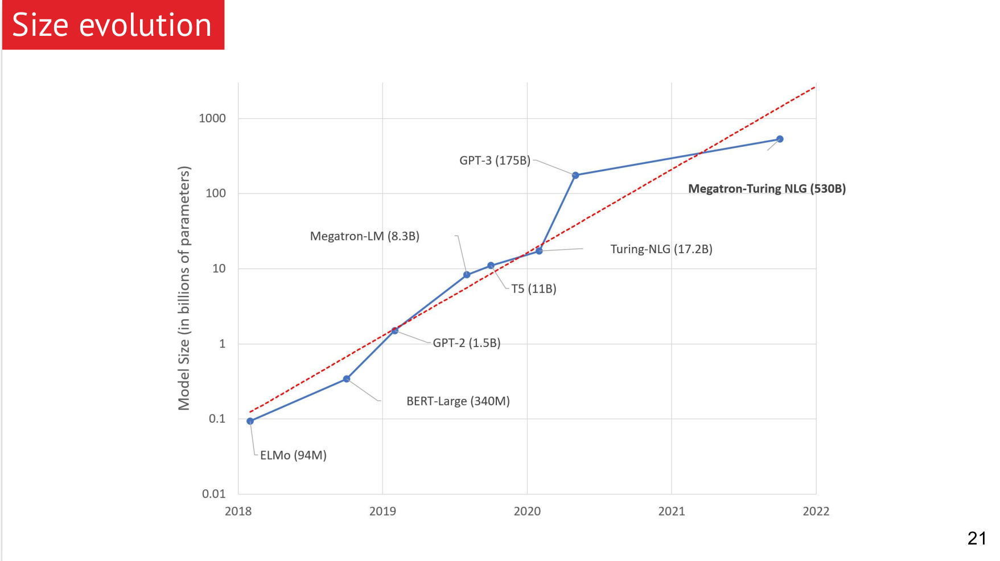

### Architecture du Transformer (type BERT)
(progression pédagogique et non chronologique)

#### Les différents composants - Pre-processing / Transformer / Task Head

On veut un Transformer qui sur base de `"I am trying to understand"` prédise le mot `"Transformer"`:
- Pre-processing
    - dépend énormément de la tâche et des données, ici vu que c'est du texte, word embedding et positional embedding
    - cré un vectuer pour chaque mot, incluant la position
- Transformer
    - sort une séquence généralement de même taille (même nombre de vecteurs, et même taille de vecteur)
    - les informations sont dispatchés dans tous les vecteurs (on n'a plus 1 mot = 1 vecteur)
- Task head
    - sur bases des vecteurs qui contiennent toutes les infos de la séquence, fait levéritable travail de génŕer le mot

> 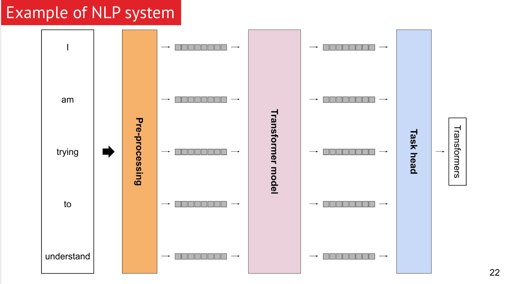

#### Des similarités peuvent être trouver avec les CNNs

> 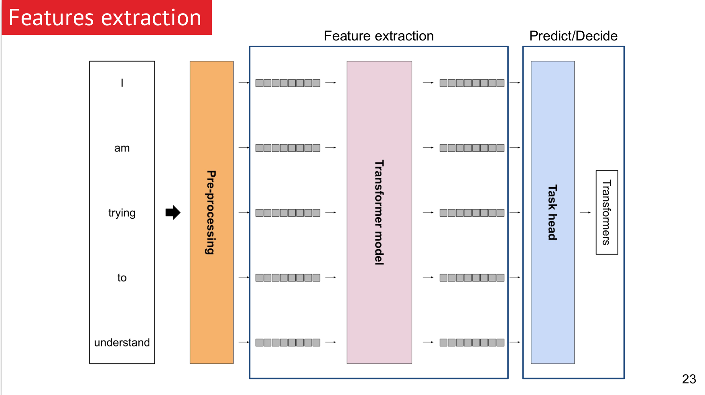

> 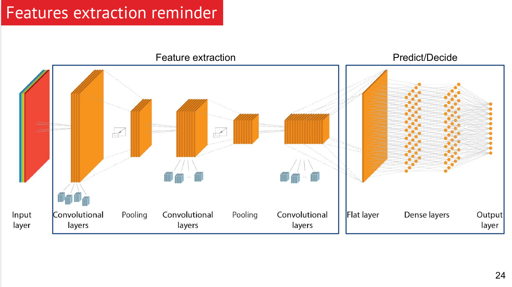

#### Architecture interne du transformer

On va regarder ce qui se passe à l'intérieur du transformer
- À l'entrée, une séquence de vecteurs représentant les mots est utilisée. En sortie, une séquence de vecteurs similaire est produite, avec une taille identique
- A l'intérieur plusieurs couches de trmasformers, qui ont toutes la même architecture (avec des poids différents), études montrent que pas d'amélioration à changer l'architecture et les hyper-paramètres.

> 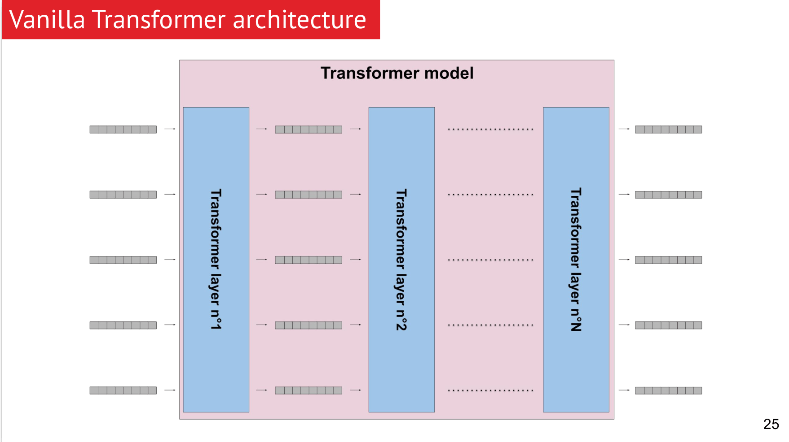

- A l'intérieur d'une de ces couches (schéma simplifié) :
    - le `Multi-Head Attention`, c'est vraiment ce qui caractèrise les Transformers (Attentions is all you need)
    - le `Feed Forward Layer`, petite couche de réseau dense (généralement 2 couches)

> 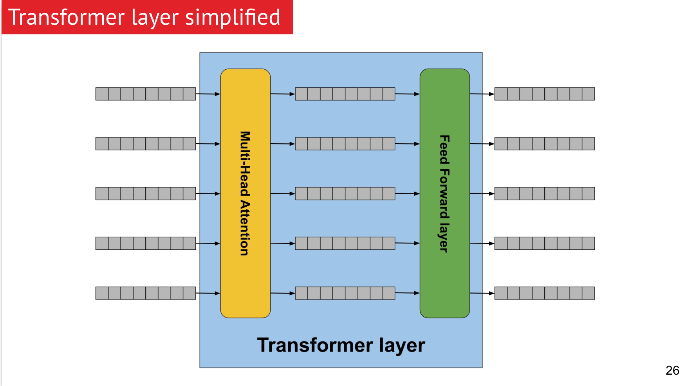

- Détail du `Feed Forward Layer`

> 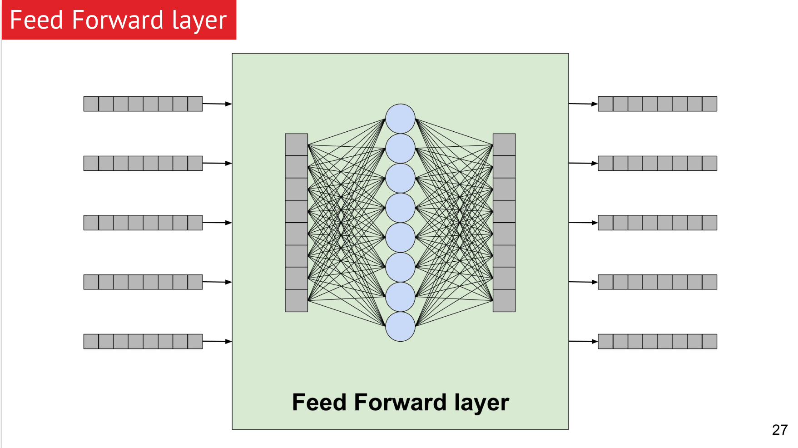

- A l'intérieur d'une de ces couches (schéma plus complet)
    - avec les couche de normalisation (mécanismes qui fait que le réseau en fait se porte mieux)
    - les liens résiduels (comme ResNet) où on additionne les vecteurs d'entrées etde sorties

> 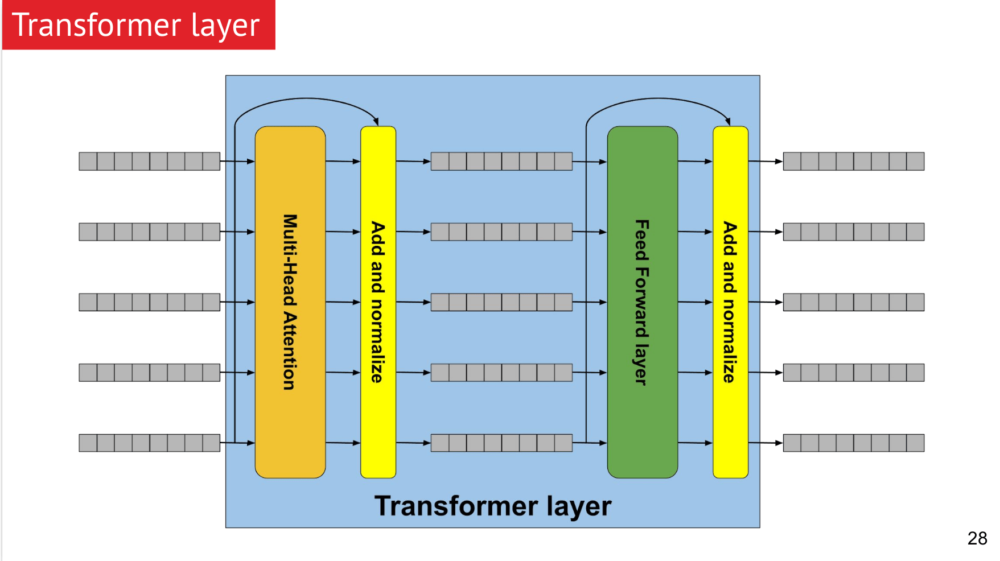

Récapitulatif :

> 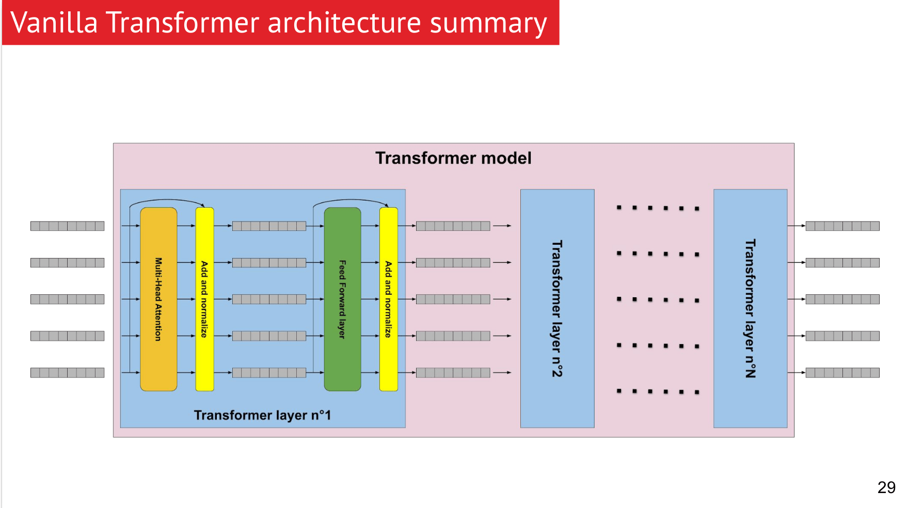

Vous devriez noter que dans l'exemple que je viens de vous montrer, les séquences sont traitées vecteur par vecteur. Cependant, **il n'y a pas de lien établi entre ces vecteurs**. Cela pose un problème, particulièrement lorsque je mentionne un mot spécifique. Imaginons que dans ma séquence, le mot "`avocat`" apparaisse. Pour différencier s'il s'agit du métier d'avocat ou du fruit, le réseau doit établir un lien entre les mots environnants. Par exemple, si je dis "`je mange un avocat`", vous comprendrez probablement que je parle du fruit, pas du métier.

**C'est dans la couche `Multi-Head Attention` que va s'opérer la magie.**

### Algorithme de l'Attention (Self-Attention)

#### Self-Attention : step by step algorithm

- Chaque vecteur passe un par un dans trois réseaux de neurones simples d'une seule couche 
- On obtient 3 nouvelles matrices K, Q et V (Key, Query et Value)
> 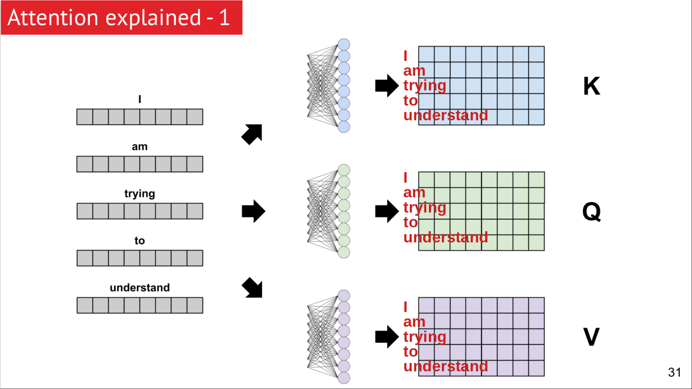

- Dans nos matrices QV, il y a généralement une opération additionnelle. Plus précisément, nous effectuons une division par un coefficient spécifique. Dans certains cas, ce coefficient est en réalité la taille du vecteur d'un des vecteurs de la séquence. Cette méthode est utilisée comme une forme de régularisation (en gros parce que cela fonctionne bien avec cette régularisation, sans plus d'explication)

> 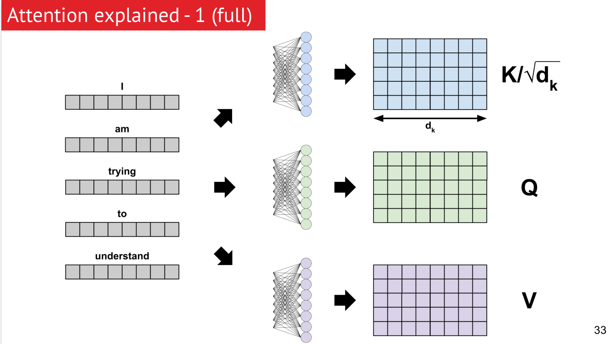

- On multiplie la matrice Q par la transposée de K
- on obtient la **matrice d'attention** 
    - dont chaque élément est le produit scalaire d'un vecteur (mot) par les autres vecteurs
    - C'est un moyen de calculer la [distance angulaire](#rappel-et-précision-sur-lembedding) entre ces deux vecteurs
- on la passe dans un softmax pour avir chaque élément entre 0 et 1 avec une somme par ligne égale à 1 (et donc avoir des probabilités)

> 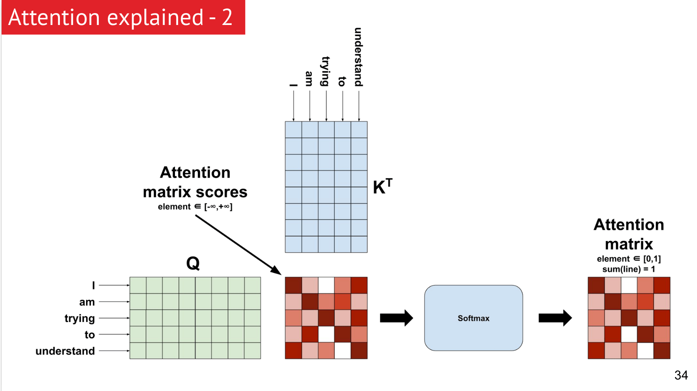

- on mutliplie la **matrice d'attention** par la matrice V

> 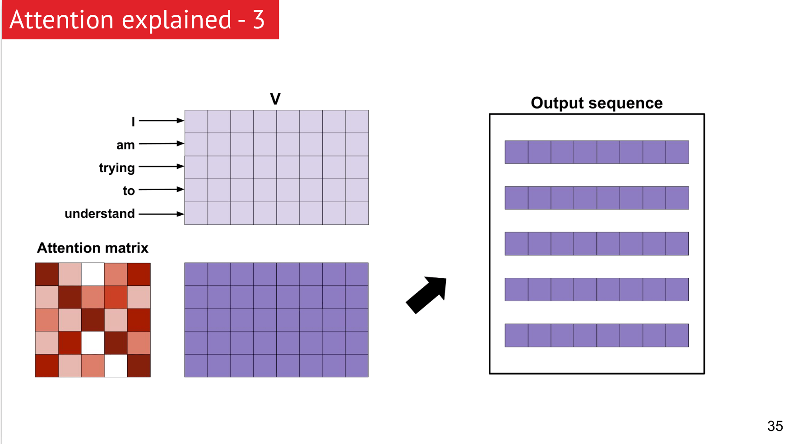

- Chaque ligne de V était un encodage d'un mot
- en multipliant par la matrice d'attention, chaque nouvelle ligne ça va être égale à  une somme pondérée de toute la matrice V

> 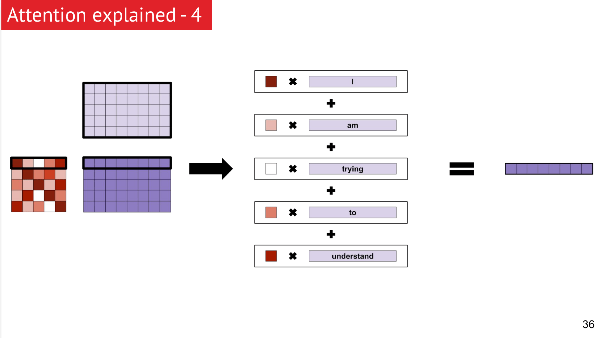

#### Self-Attention Intuition

Essayons d'expliquer brièvement l'intuition derrière ce mécanisme d'attention. Comme vous avez pu le constater, le mécanisme d'attention réalise fondamentalement une somme pondérée par rapport à tous les mots de la séquence. 

Dans la séquence d'entrée, qui comprenait auparavant les informations de `I`, `am`, `trying`... pour chaque vecteur, maintenant nous aurons les informations pour toute la séquence, selon un certain poids pondéré, poids qui ont été appris par le modèle.

> 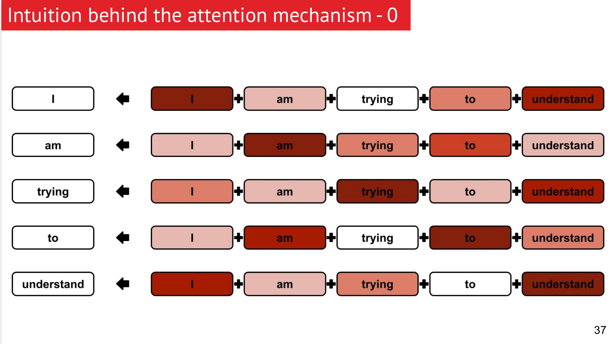

Si on prends 3 mots, éloignés les uns des autres `The`, `big`, `dog`

> 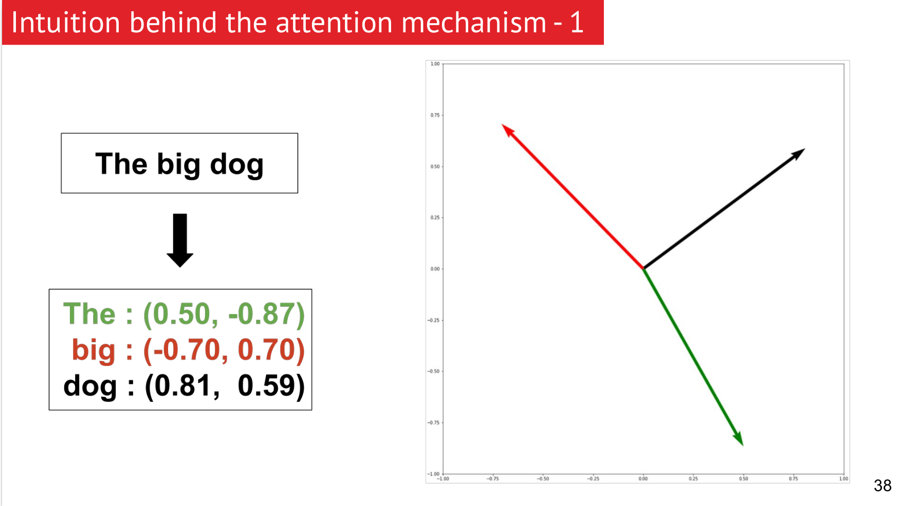

On passe les 3 mots par les 3 systèmes denses pour obtenir K, Q et V

En examinant les espaces K et Q, il est clair qu'un rapprochement entre les termes "big" et "dogs" a été opéré. Cette association a une raison : elle influe sur le calcul ultérieur de la matrice d'attention. Cette matrice utilise la distance angulaire dans son calcul, ce qui signifie que les mots "`big`" et "`dogs`" se trouveront à proximité. 

> 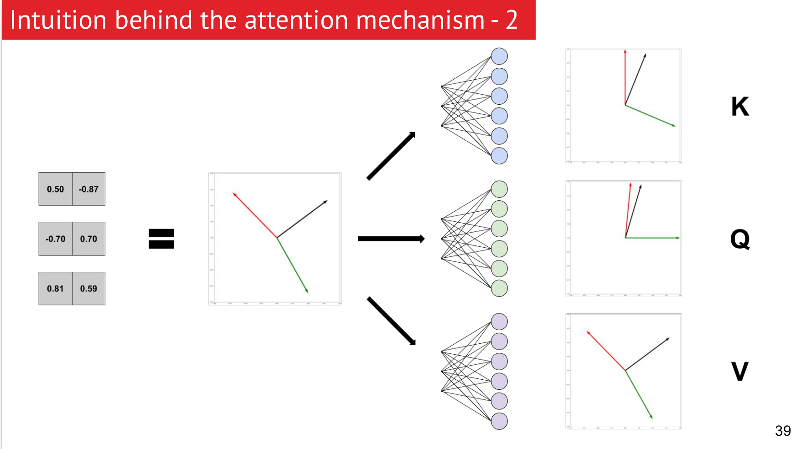

On calcule la matrice d'attention. Ici c'est plus clair qu'il y a un rapprochement entre `big` et  `dog`.

> 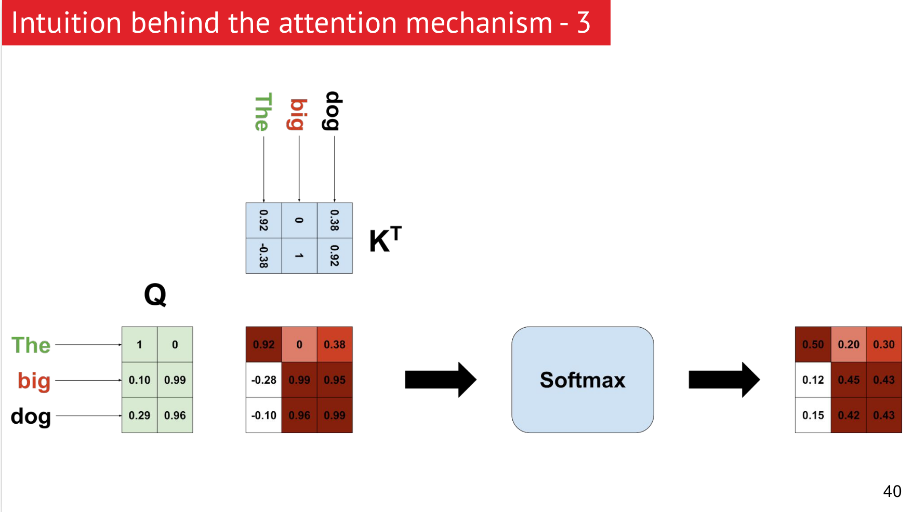

### Multi-Head Attention

- On dćoupe en plusieurs morceaux, cahque morceau est pris en charge par une tête
- le nombre de tête est un hyper-paramètre

> 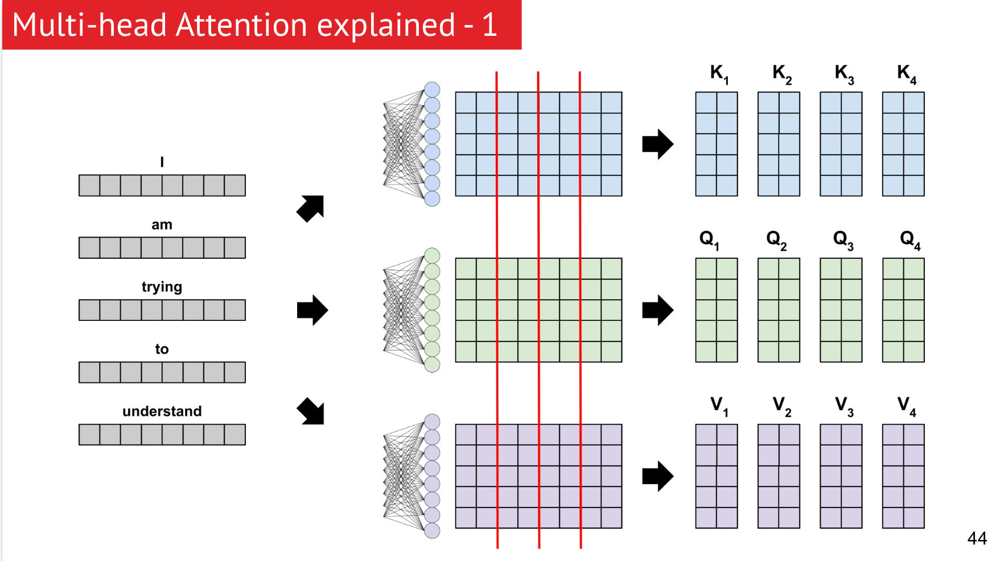

Chaque tête déroule l'algorithme vu précédement

> 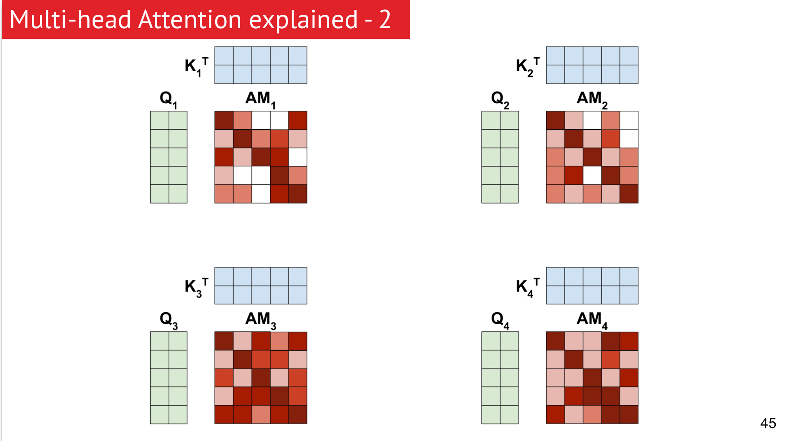

Et on concatène

> 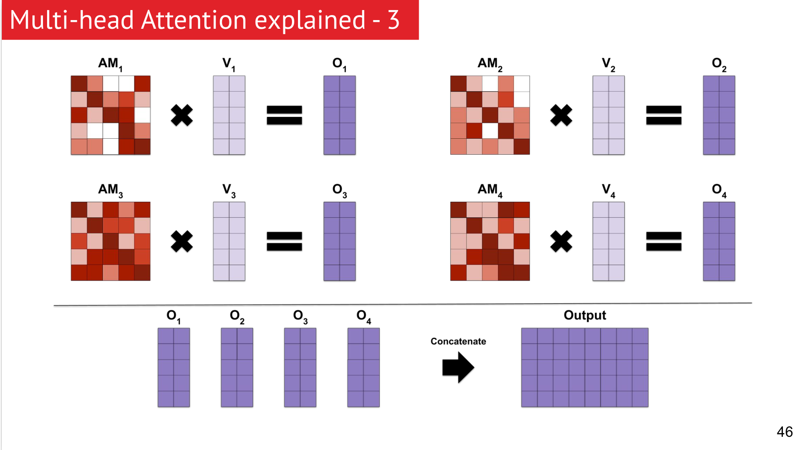

### Les différentes architectures de Transformers

#### Bert (2019)

> 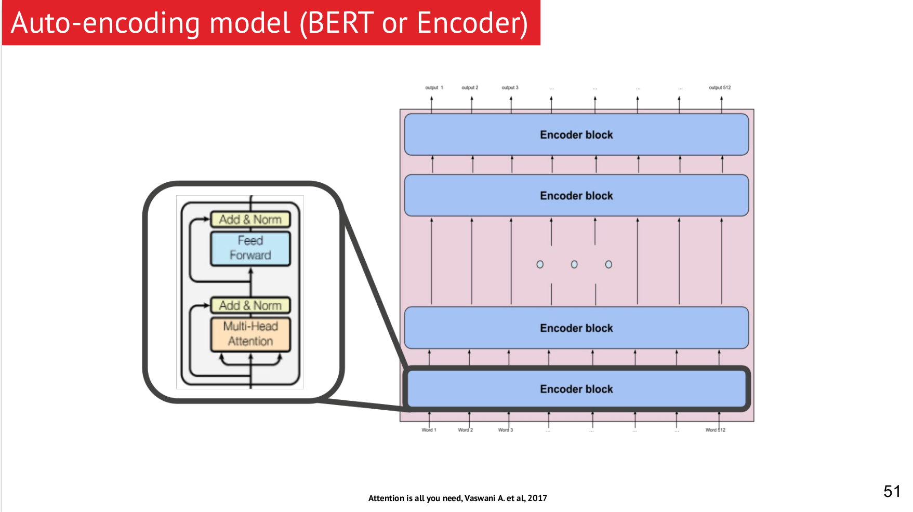

#### GPT (2018)

Ainsi, pour effectuer la transition vers GPT, il est important de noter que la différence entre BERT et GPT réside principalement dans leur mécanisme d'attention. Bien que les bases soient similaires, les divergences sont subtiles mais significatives. Dans BERT, un mécanisme d'attention classique est employé, tandis que GPT utilise un mécanisme d'attention masqué.

L'idée fondamentale derrière BERT, partagée avec les encodeurs et les RNN bidirectionnels, est d'accéder aux mots précédents et suivants pour appréhender pleinement le sens d'un mot donné. En revanche, GPT prend une approche séquentielle, traitant les mots un par un. 

Cette méthode signifie que chaque mot est confronté uniquement aux mots qui le précèdent, ce qui peut engendrer une perte d'information. Toutefois, cette stratégie confère une certaine souplesse, contribuant ainsi à la génération de texte de manière plus fluide :
- GPT excelle particulièrement dans la création textuelle, 
- BERT se positionne davantage du côté de l'analyse et de la classification.

> 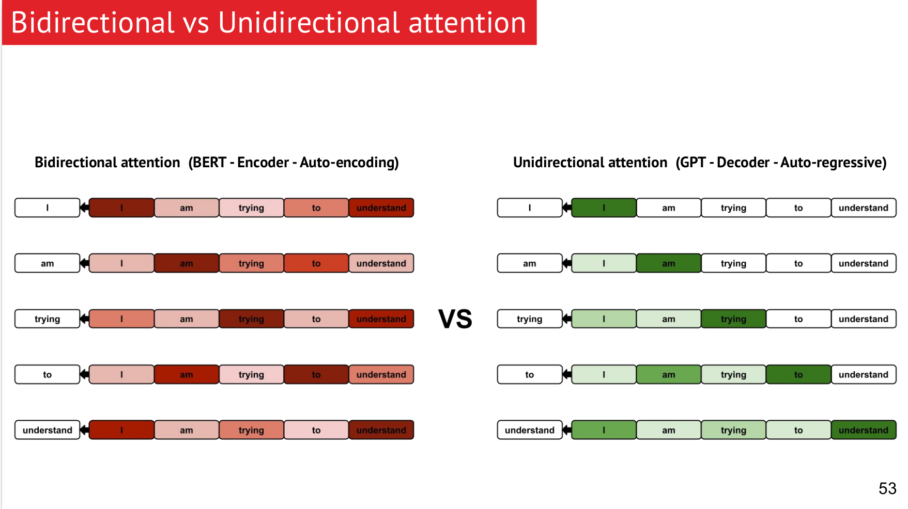

Le mécanisme reste le même mais on masque une partie de la matrice d'attention

> 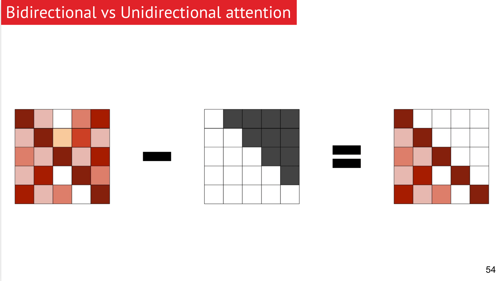

L'architecture est proche de celle de BERT, avec une couche dense en sortie

> 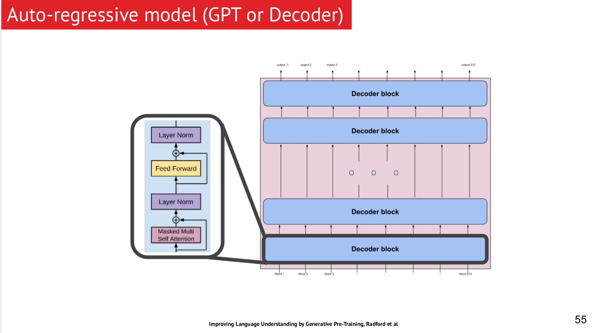

#### Encoder-Decoder model (2017)

Pour clore, nous pouvons évoquer l'approche de l'encodeur-décodeur qui a fait son apparition en 2017 dans l'article "Attention Is All You Need". Les autres modèles ont ensuite été dérivés de cette notion. Plus précisément, GPT est devenu disponible en 2018, suivi de BERT en 2019.

En observant de plus près le schéma de droite, nous pouvons voir que nous avons 
- une pile de décodeurs. Ce processus génère une séquence dans un espace vectoriel abstrait (on parle d'espace latent), similaire à la fonction d'un RNN dans le contexte de la traduction. Par la suite, 
- cette séquence passe à travers un autre transformeur, une pile de décodeurs, pour produire une nouvelle séquence

Cependant, la subtilité réside dans le décodeur de l'encodeur-décodeur. Celui-ci présente une légère différence pour tenir compte du travail accompli par l'encodeur. Afin de saisir cette information, une couche d'**attention croisée** est introduite.

- Dans le mécanisme de **self-attention**, K et Q  avait pour origine la m6em phrase, 
- Afin de confronter ce que l'encoder à trouvé (résultats de l'encodeur) et le début de la phrase qu'a recu le décodeur (début de la séquence traitée par le décodeur), on va utiliser une attention croisée : Q et K ne proviennent plus du même transformeur. 
- Cela dit, l'attention masquée (self-attention) demeure dans le décodeur de l'encodeur-décodeur (qui est suivi de l'intention croisée) 
- En fin de compte, le réseau se poursuit de manière familière avec les couches linéaires, les connexions résiduelles et les normalisations.

> 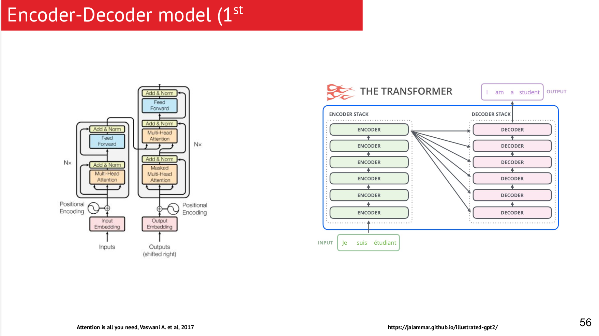

Attention au piège de langage, on a bien un decoder et un encoder

> 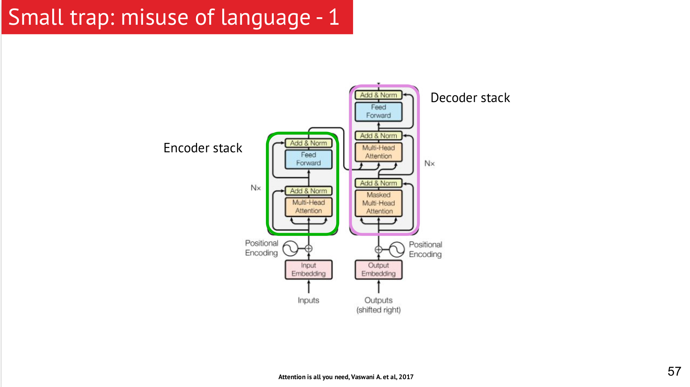

Mais le decoder n'est pas le m6eme que celui de GPT

> 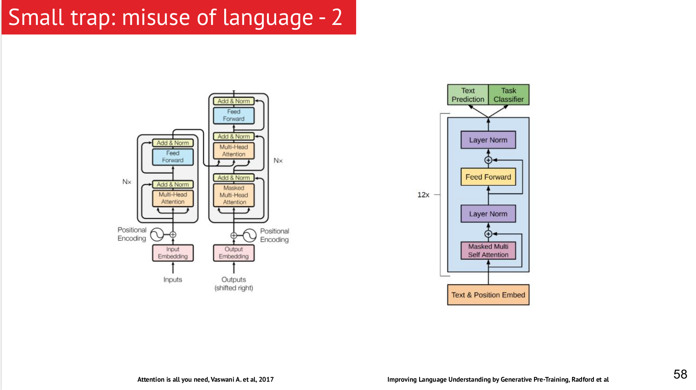

### Le Pré-entraînement

Le NLP offre diverses applications telles que la question-réponse, l'inférence de paraphrases, l'analyse grammaticale, la classification, et plus encore. Bien que ces tâches diffèrent, les modèles sous-jacents restent similaires pour différentes langues. Plutôt que d'effectuer des entraînements distincts pour chaque langue, il est plus efficace d'apprendre une fois pour toutes et d'adapter ensuite. Cela économise du temps, de l'argent et de l'énergie. L'objectif est d'utiliser ces connaissances pour diverses tâches linguistiques et d'optimiser les ressources.

> 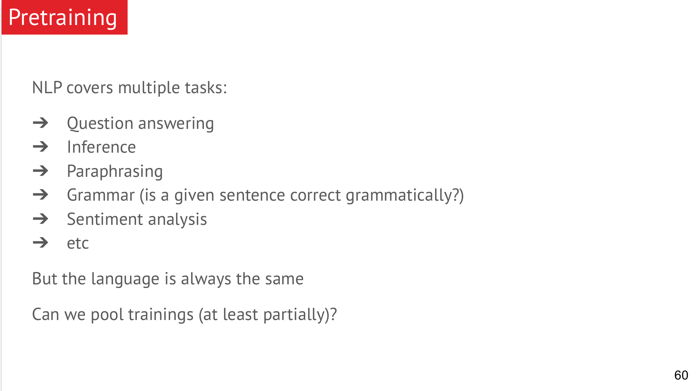

#### Pré-entrainement de GPT

- Le pré-entraînement de GPT implique la prédiction du mot suivant dans une phrase, sans accéder à la séquence entière (puisque masquée). On identifie le mot le plus proche dans le dictionnaire.  

> 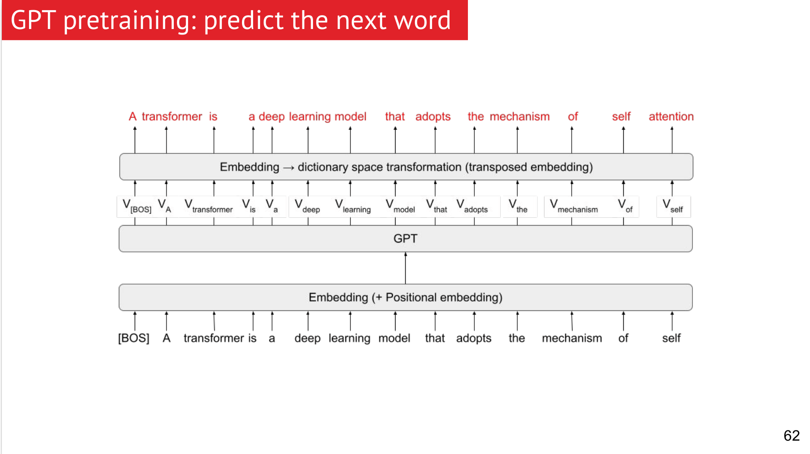

#### Pré-entrainement de BERT

- Pour BERT, la prédiction du mot suivant est trop simple, car la phrase complète est accessible. 
- Avec Bert, on masque aléatoirement certains mots et tentons de les deviner. 
- Les mots masqués sont remplacés par un token spécial appelé `mask`
- Approximativement 15% des mots étaient originellement masqués dans l'article de Berthe, incluant parfois des mots non masqués (80% du temps), d'autres mots aléatoires (10% du temps) ou les mots originaux (10% du temps). Cela empêche le modèle de se focaliser uniquement sur le masque, l'incitant à prédire une variété de mots cachés.

> 

Avec BERT, une deuxième méthode d'entraînement a été introduite, notamment dans l'article original de 2019. Cette approche, appelée "Next Sentence Prediction" (prédiction de la phrase suivante), consiste à prendre deux phrases au hasard. La première a une probabilité de 50% d'être suivie par la deuxième phrase qui lui succède, tandis que dans les autres 50% des cas, la deuxième phrase est choisie de manière indépendante. Les deux phrases sont ensuite introduites dans le modèle Transformer, séparées par un token spécifique, le "token séparateur". Cet objectif complète le premier, où les mots sont masqués, et concerne également les tokens de la deuxième phrase.

> 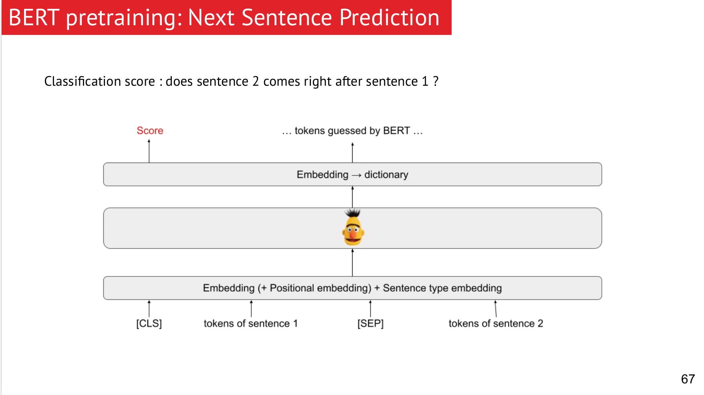

Ce second objectif a été supprimé car il dégradait les performances et ajoutait de la confusion.

> 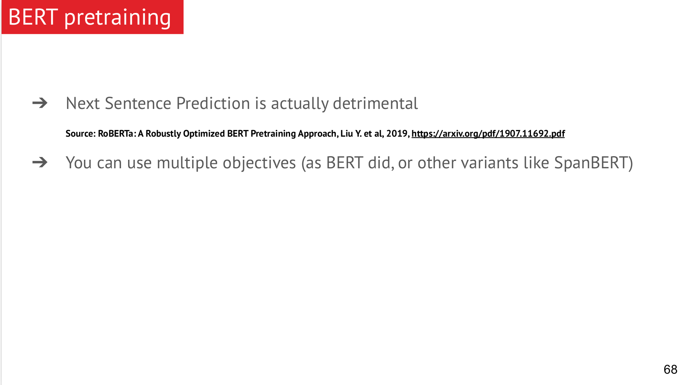

#### Quelques remarques

Il est essentiel de souligner que le pré-entraînement joue un rôle aussi crucial que l'architecture des Transformers. Initialement, les Transformers sont pré-entraînés avec des tâches fondamentales, puis affinés pour des tâches spécifiques. Leur succès résulte de cette combinaison entre l'architecture des Transformers et le processus de pré-entraînement.

Lorsque nous parlons d'apprentissage supervisé, il convient plutôt de se référer à l'apprentissage auto-supervisé. Cette approche intelligente élimine le problème des labels inhérent à l'apprentissage supervisé. Il suffit d'avoir du texte ou d'autres données  (comme par exemple pour la génération de molécules sur base d'un laboratoire qui avait une grosse base de donnée) 

C'est remarquable de constater que cette approche rappelle l'apprentissage chez les humains. Dans le langage, par exemple, nous apprenons en écoutant et en observant notre environnement. Cette méthodologie reflète notre apprentissage fondamental, basé sur l'observation de notre entourage. Finalement, la composante supervisée de notre apprentissage est relativement minimale par rapport à la vaste étendue de l'apprentissage que nous acquérons de notre environnement quotidien.

### Fine-Tuning

- le transformer a été entrainé avec son pre-processing, le changer c'est donc compliqué
- on change principalement la couche de prédiction (head)

> 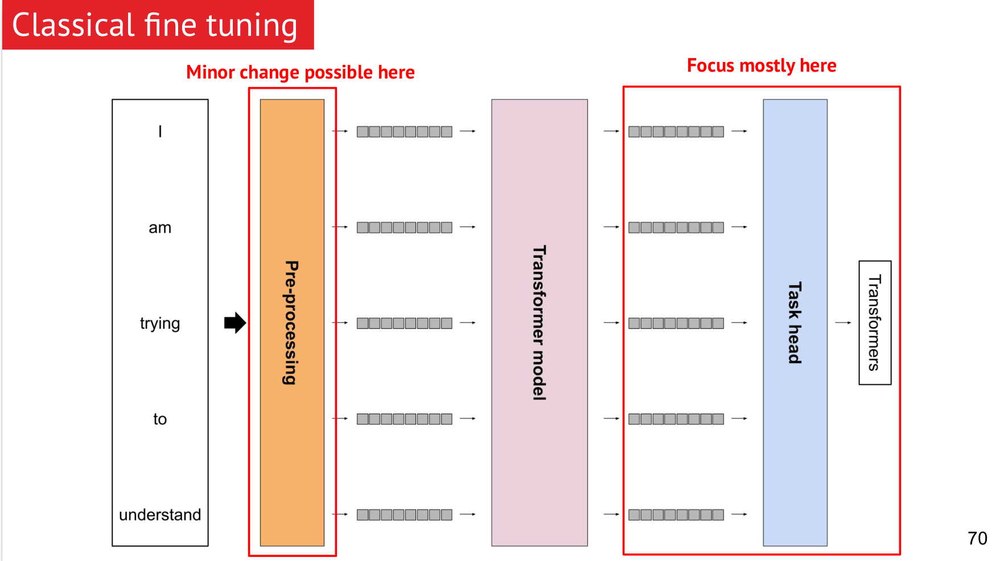

#### Exemple, sur les commentaires d'IMDB. 

Ces commentaires IMDB varient entre positifs, négatifs et neutres: 
- Notre approche consiste à exploiter un modèle pré-entraîné tel que BERT (dont la tâche est juste de retrouver les mots cachés)
- Dans cette démarche, nous prenons le modèle tel qu'il est, en utilisant spécifiquement le premier vecteur de la séquence, qui correspond au vecteur `CLS` (classification token). 
- Ce vecteur est ensuite introduit dans un réseau dense, comportant une ou deux couches, par exemple. Le réseau produit trois scores en sortie, correspondant aux trois classes : positif, négatif et neutre. 
- En fin de compte, ces scores subissent une opération softmax pour obtenir les probabilités respectives associées à chaque classe.

> 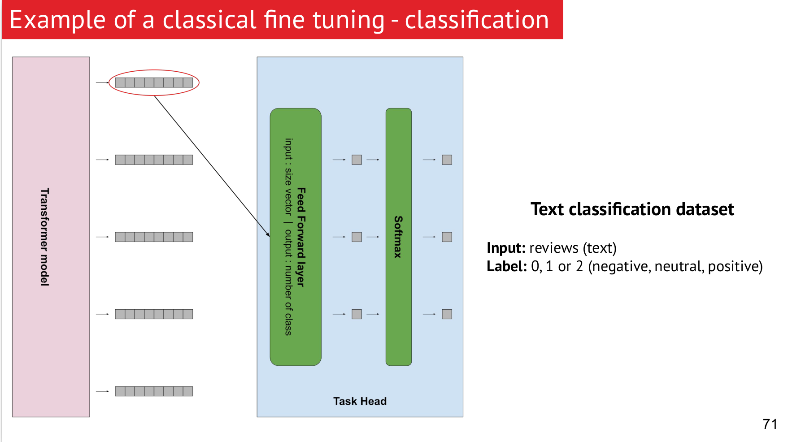

#### Prompting

Valable que pour les très gros modèles, et les modèles génératifs (GPT3, Bloom)

Le "prompting" exploite la capacité de ces modèles génératifs à produire des mots pour accomplir différentes tâches, en plus de la génération de texte. Prenons l'exemple de la classification de commentaires. Imaginons un ensemble de données comprenant des critiques et leurs étiquettes (positif, neutre, négatif). Pour utiliser cette approche, nous pouvons fournir au modèle Transformer une entrée telle que "la critique est" suivie d'un espace, et laisser le modèle générer le mot suivant. Ce mot généré pourrait être "positive", "neutre" ou "négative". Ainsi, le modèle pré-entraîné qui a été conçu pour générer du texte est maintenant exploité pour réaliser une tâche de classification.

> 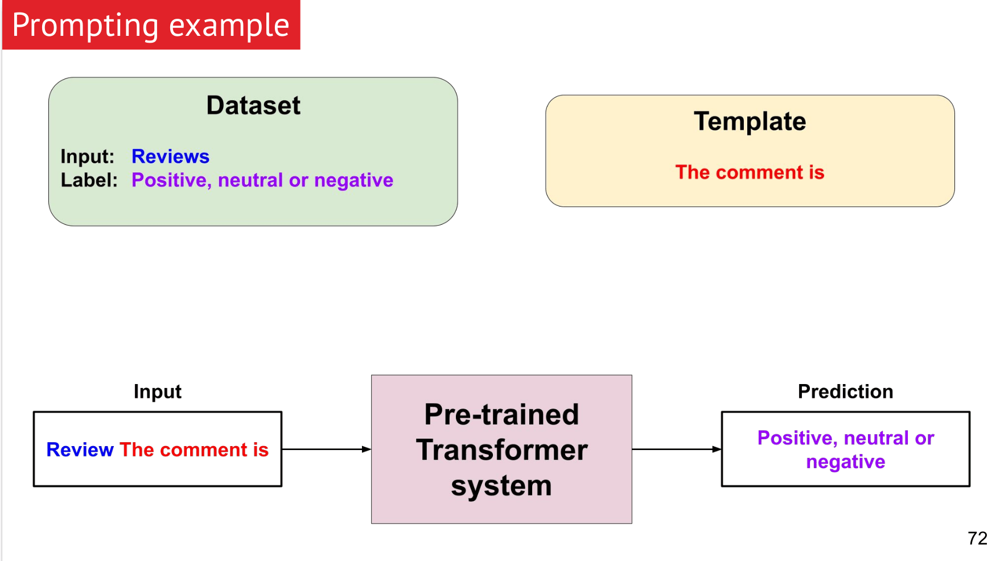

On peut généraliser cela, dès qu'on a en entrée du texte, on y mettant un template pour obtenir des réponses (classification des commentaires IMDB, toxixité de certaines matières...)

On peut aussi obtenir un modèle qui fait des résumés, en lui demandant : "résume ..."

> 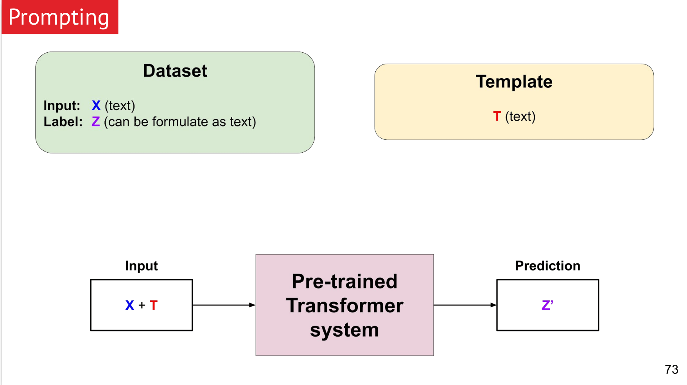

Quelques exemples. Il y a tout une ingénieurie autour du prompting...

> 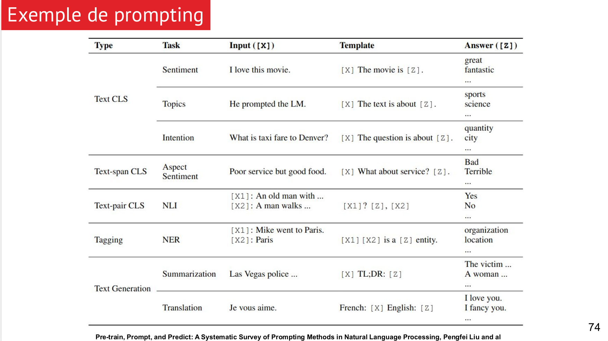

### Vision Transformer

> 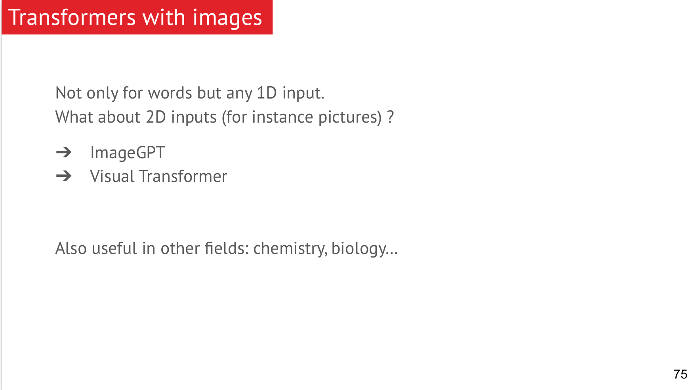

- imageGPT, un simple flatten pour passer de 2d à du 1d
- et cela marche!

> 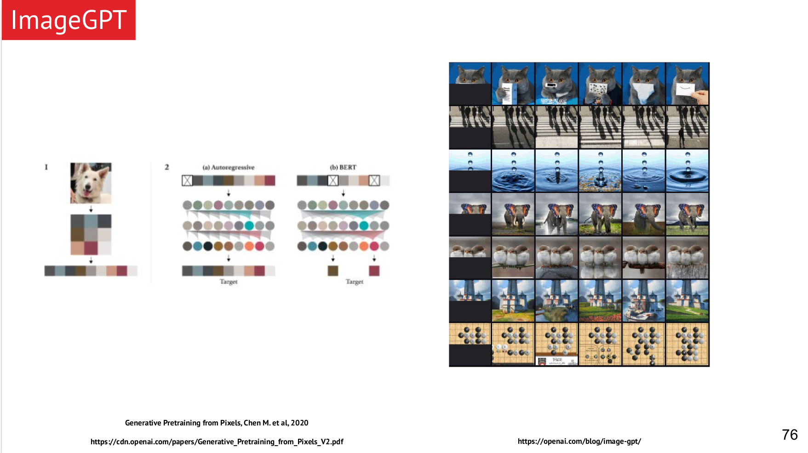

- Visual Transformer, on découpe l'image en "patch" et on fait un prétraitement (sorte d'embedding)
- ce qui est très intéressant c'est qu'on a vraiment une une représentation visuelle de ce que fait l'attention 
- on retrouve vraiment le terme d'attention, le réseau focalise sur une partie de l'image qui lui parait pertinente

> 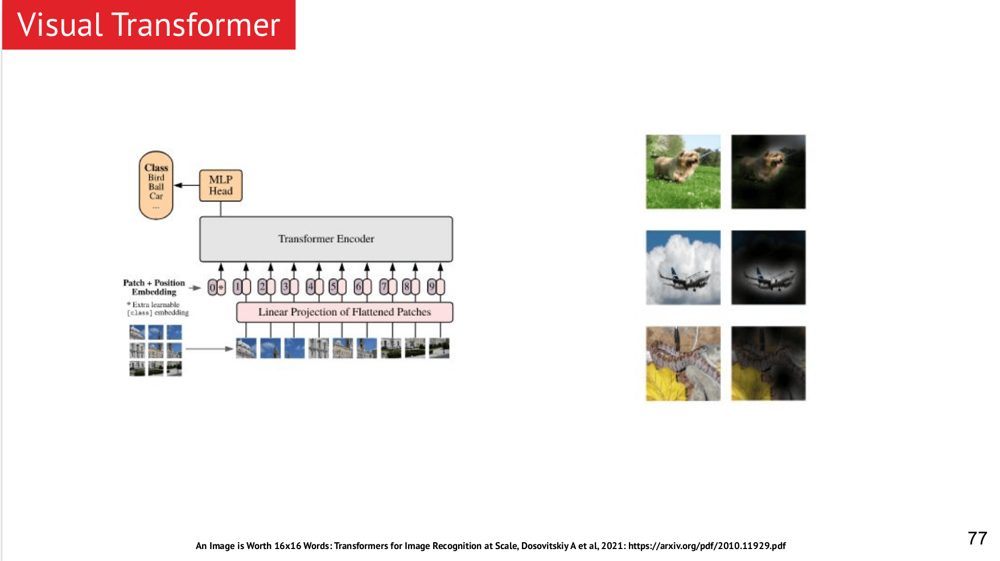

L'attention axiale est une technique qui divise une séquence en rangées et colonnes, puis applique l'attention de manière séparée le long de ces deux axes pour optimiser les calculs d'attention dans les modèles Transformer

> 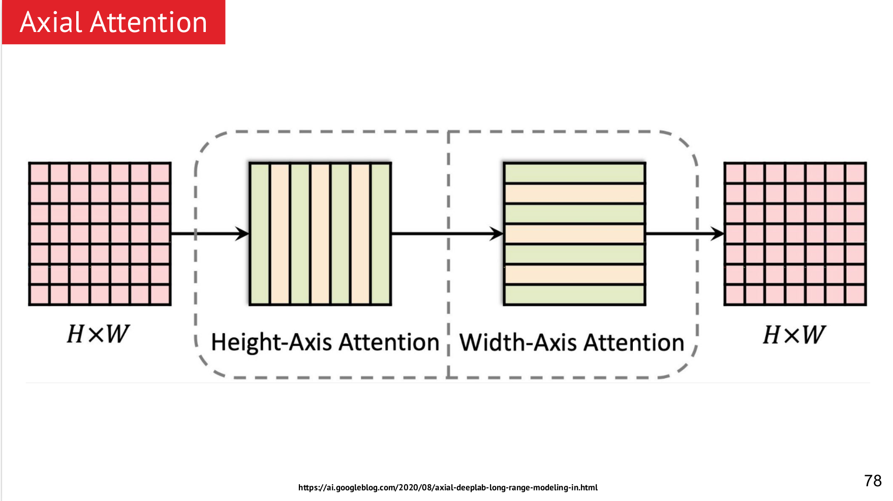

Papers:
- Attention Is All You Need (https://arxiv.org/abs/1706.03762)
- BERT (https://arxiv.org/abs/1810.04805)
- GPT (https://cdn.openai.com/research-covers/language-unsupervised/language_understanding_paper.pdf)
- GPT3 (https://arxiv.org/abs/2005.14165)
- T5 (https://arxiv.org/abs/1910.10683)
- BLOOM (https://arxiv.org/abs/2211.05100)
- Foundation Models (https://arxiv.org/abs/2108.07258)

Book :
- Natural Language Processing With Transformers: Building Language Applications With Hugging Face

### Live coding
- Seulement sur calculateur, ou éventuellement une partei sur PC gaming (et encore...)
- 3 versions, PyTorch, PyTorch lightning, et Tensorflow
- utilisation d'une librairie "transformers" de hugging face, pas seulement un zoo de modèles pré-entrainemés mais aussi une biblio python qui permet de faire facilement des Transformers  
- A partir d'un DistilBERT pré-entrainé

