## Seq 09 :  Travailler avec des données structurées : Graph Neural Network(GNN)

### Introduction au GNN

En machine learning (pour par exemple les CNN), un process très classique 
1. on a des représentations qui sont complexes, larges, riches et bruité avec énormément d'informations
2. on densifie cette information (embedding - ou plongement en français - 
3. à partir de cette information extrêmement dense on va essayer reconstituer l'information de départ pour essayer d'en retrouver des choses essentielles  

Pour les graphes, c'est la même chose et finalement ce qui est particulier c'est 
- comment représenter de línformation complexe sous forme de grapge
- la phase d'embedding 

Une fois cet embedding fait, les méthodes sont classiques (CNN, Tranformer, Encoder, ...)

### Introduction à la théorie des graphe

#### Vocabulary and concepts

- Graphs are everywhere: social networks, molecules, direction recommendation, knowledge graphs
- Vocabulary :
    - Node or Vortex
    - Edge
    - Edge orientation : undirected and directed graphs
    - Edge weights (ex : time to travel in direction recommendations)
    - Paths
- Graphs can store information (features) on nodes, edges and globally
- Node proximity
- Node centrality : Measure how many paths goes through the node

#### Graph representation

- Matrice  adjacentes vs liste : matrice creuse avec pas mal de 0, problématique quand bcp de noeud 
- La matrice est unique si on définit comment ordonner les nœuds 

> 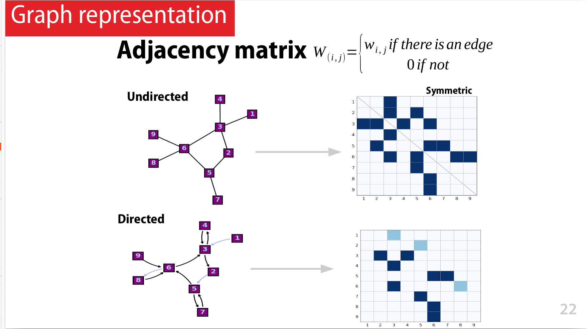

> 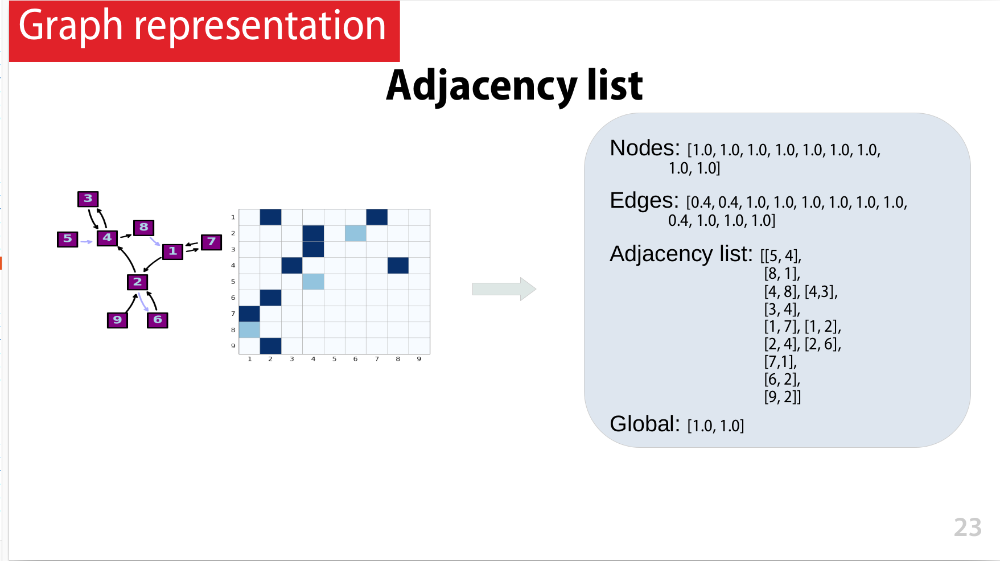

#### Useful Matrices

|Name|Notation|Description|
|-|-|-|
|Adjacency|W|Weight of edges|
|Degree|D|Diagonal matrix with number of edges for each node|
|Laplacian|L|D - W|
|Node Features|X|Information stored|

### Graph embedding

- `Word Embedding` se traduite en francais par `plongement lexical`

Deux catégories de tâches :
- la classification (de molécule par exemple), pourprédire des labels (ŷ)
- recontruire la matrice d'adjacence et donc le graphe (ŵ)

Ce schéma est génériques, tous n'est pas forcément utiliser selon les uses case

> 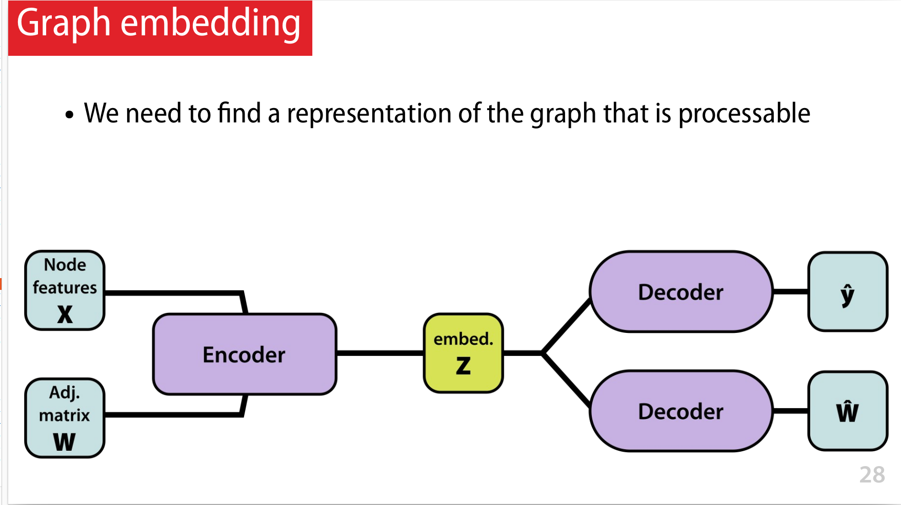

- Un espace latent est un espace vectoriel continue qui va permettre de représenter de façon condensée les informations stockées sur les nœuds les arrêtes et les graphes 
- La dimension (qui est un hyper paramètre), doit être 
    - suffisament grand pour permettre l'apprentissage
    - pas trop grand pour éviter le sur-apprentissage
- Dans l'exemple de droite
    - les noeuds en bleu ont 3 voisins, et vert ils ont en 4 
    - l'idée est de d'avoir, dans l'esapce latent, les noeud similaires proches et éloignés sinon

> 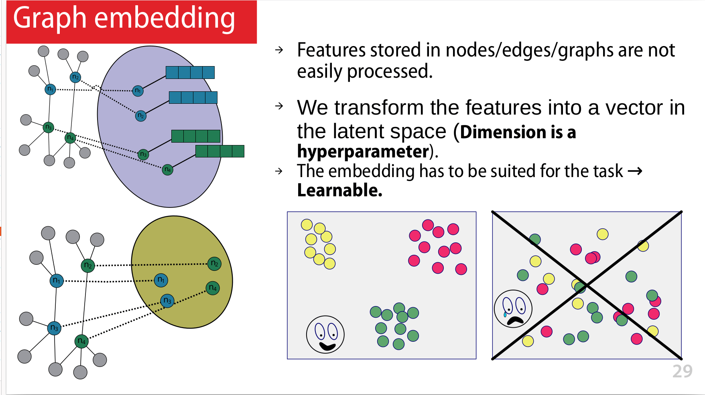

### Transductive and inductive learning

#### Inductive learning

- Inductive learning, classiquement rencontré, permet de généraliser, avec des structures de graphes pas encore rencontrés
- Inductive learning, also known as discovery learning, is a process where the learner discovers rules by observing example 
- Vocabulaire : Dans le domaine de l'intelligence artificielle, la phase d'inférence représente l'exécution d'un modèle une fois qu'il a déjà été entraîné. 

> 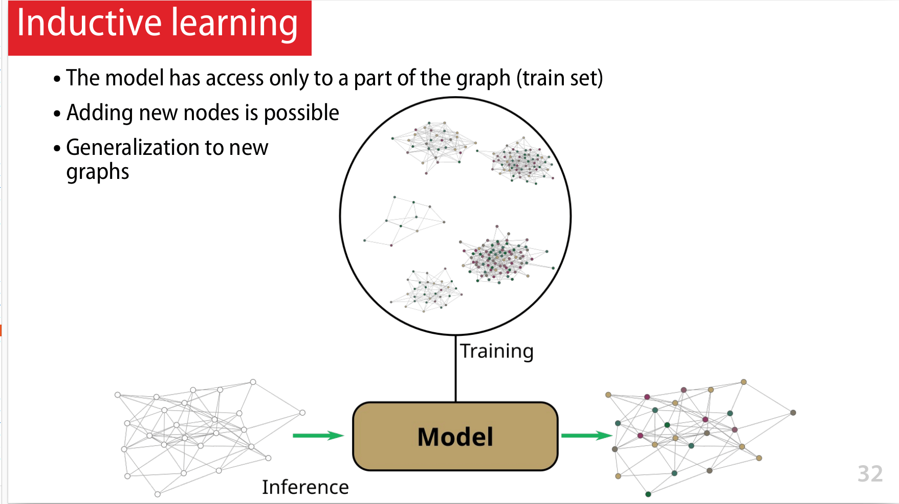

#### Transductive learning

Le `transductive learning` est une technique d'apprentissage automatique où le modèle utilise à la fois des données étiquetées et des données non étiquetées pour effectuer des prédictions. Plutôt que de séparer clairement les données d'entraînement et les données de test, le modèle tente de généraliser à partir des données partiellement étiquetées, en essayant de faire des prédictions sur les données non étiquetées. Cela peut aider le modèle à capturer des schémas plus complexes et à mieux s'adapter aux nouvelles données.

- on parle de raisonnement par transduction
- on travaille sur un seul grpahe (exemple le graphe de chez Facebook)
- Le modèle a accès au grpahe entier
- on veut par exemple labéliser les noeuds (les noeuds blancs sur le graphe)
- ne peut pas être généraliser sur d'autre graphe, donc par exemple pas possible d'ajouter des noeuds

> 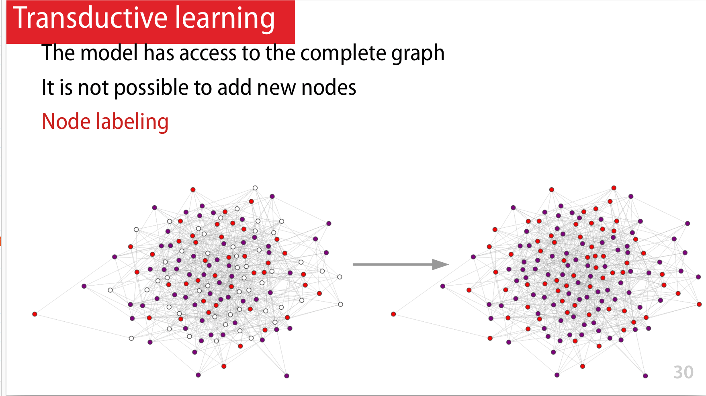

- ou par exemple suggérer des connexions entre les gens, ajouter des nouvelles arrêtes

> 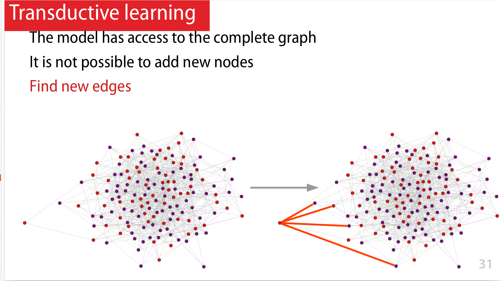

### Tâches possibles

> 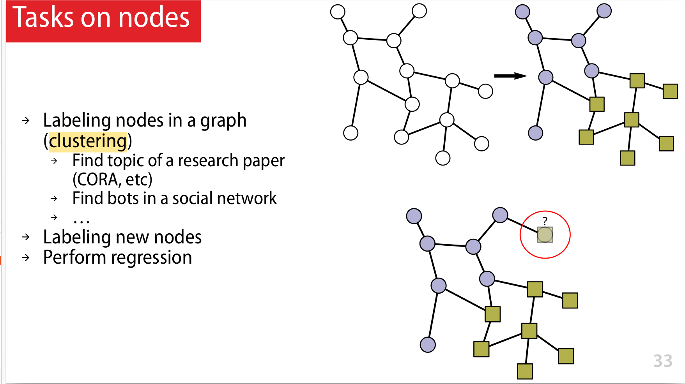

> 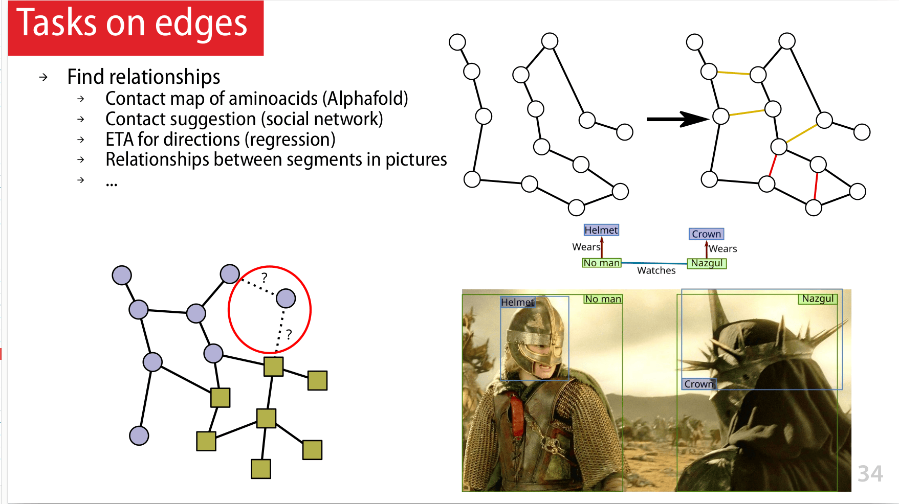

> 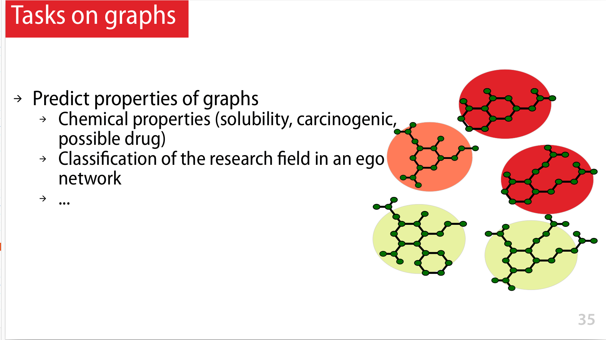

### Exemples de réseaux et taxonomie des outils

[Machine Learning on Graphs: A Model and Comprehensive Taxonomy](https://arxiv.org/abs/2005.03675)

> 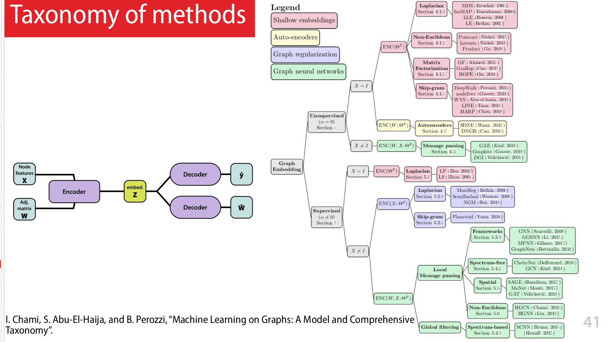

### Graph convolution

> 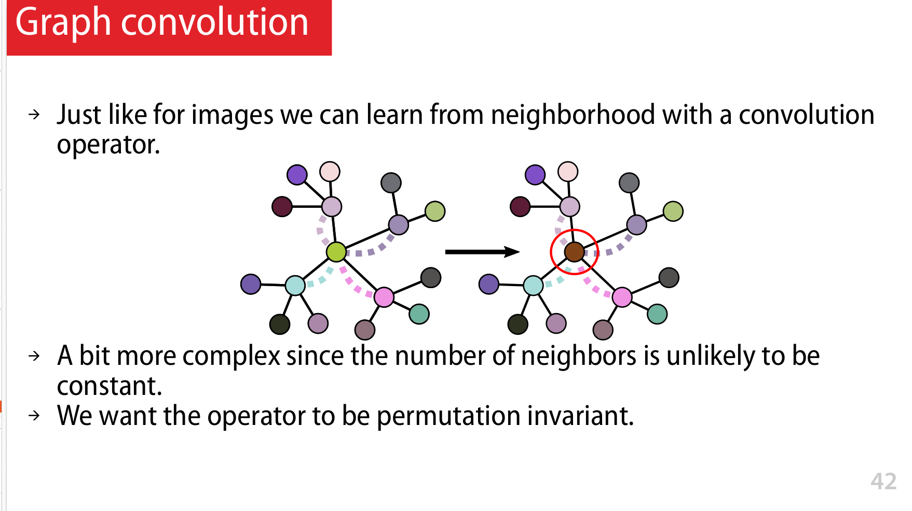

> 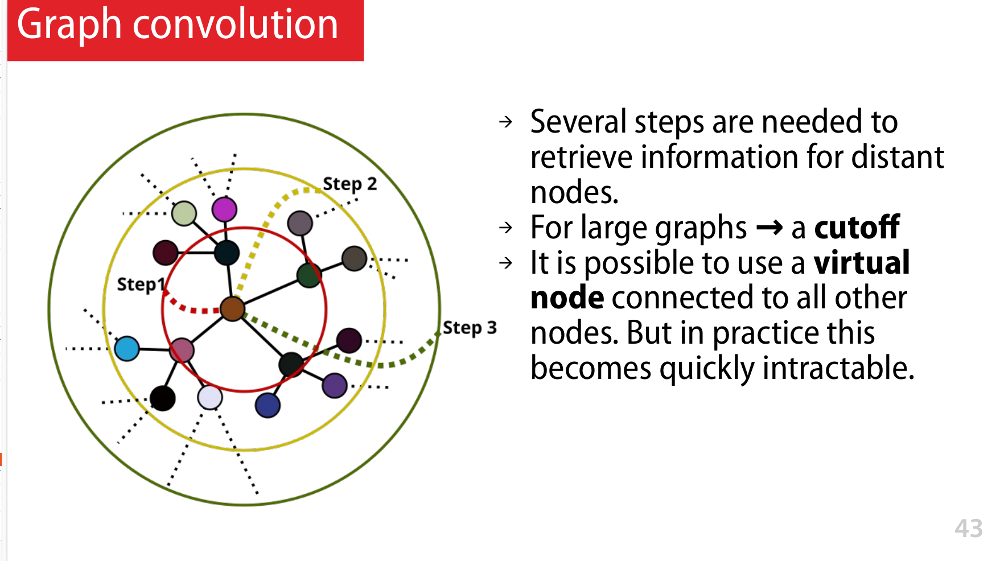

### Message passing

> 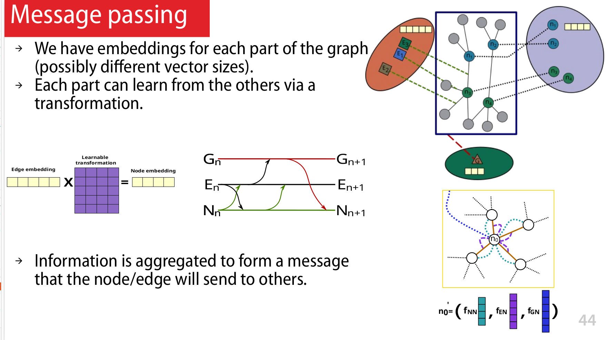

### Graphes et transformers (Alphafold, ...)

> 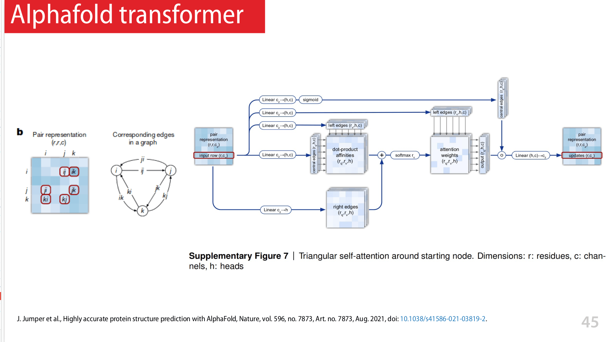

> 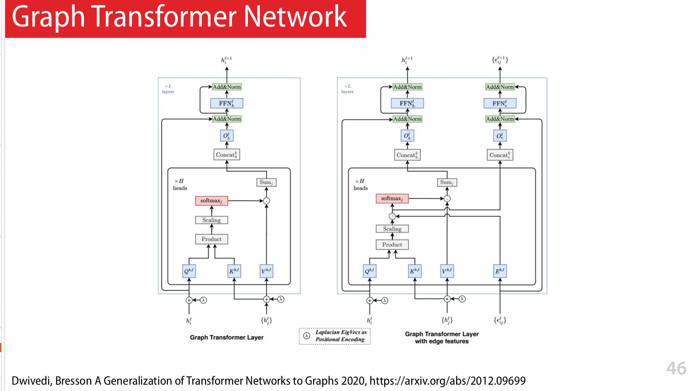

<!--

## Seq 10 : Autoencodeur (AE) : un exemple d'apprentissage "self supervised"

## Seq 11 : Variational Autoencoder (VAE) : apprentissage "self supervised"

## Seq 12 : Revue de projets Fidle Intégrée à la future journée Deep Learning pour la Science

## Seq 13 : Generative Adversarial Networks (GAN)!

## Seq 14 : Diffusion model, text to image (HB,NC,MS)

## Seq 15 -  AI, droit, société et éthique (LR, BC, ...)

## Seq 16 : Apprendre plus vite et moins cher, optimiser l’apprentissage (BC,LH)

## Seq 17 :  Passer à la vitesse supérieure : l’accélération matérielle (BC,LH)

## Seq 18 :  Tactiques et stratégies du Deep Reinforcement Learning

## Seq 19 :  Des neurones pour la physique, les physics-informed neural networks (PINNS)

## Seq 20 :  Journée Deep Learning pour la Science - JDLS2023 -->
