## Seq 10 : Réseaux autoencodeurs

https://www.youtube.com/watch?v=rGz_NavEMmM&list=PLlI0-qAzf2Sa6agSVFbrrzyfNkU5--6b_&index=11

### Apprentissage "self supervised"

Les réseaux autoencodeurs sont intéressants car 
- ils peuvent apprendre sans label (auto-supervision) 
- ils peuvent générer de nouvelles données (capacités génératives)


**L'apprentissage auto-supervisé** (self-supervised learning) est une approche d'apprentissage automatique où le modèle apprend sans nécessiter de labels ou de supervision humaine explicite : 
- Prédiction de parties manquantes (masquer certaines parties d'une image, d'un texte... et demander de retrouver)
- Prédiction de l'ordre (mélanger l'ordre des éléments et demander de les réordonner correctement)
- Reconstruction : Apprendre à reconstruire une version bruitée ou altérée de l'originale.


### Architecture d'un autoencodeur

Un autoencodeur fonctionne de la manière suivante : 
1. **Encodeur** :
    - L'autoencodeur prend une donnée d'entrée, généralement un vecteur ou une image.
    - L'encodeur produit une représentation de plus faible dimension dans l'entrée dans ce qu'on appelle l'espace latent. 
    - Cette représentation capture les caractéristiques importantes de la donnée.
1. **Espace Latent** (Latent Space) :
    - L'espace latent est comme un résumé compact des données d'entrée. C'est là que les informations clés sont stockées sous forme de petits vecteurs de petite dimension.
1. **Decodeur** :
    - La représentation dans l'espace latent est ensuite passée au décodeur.
    - Le décodeur retransforme la représentation réduite en une sortie reconstruite, pour retrouver une version détaillée de l'information originale. 

> 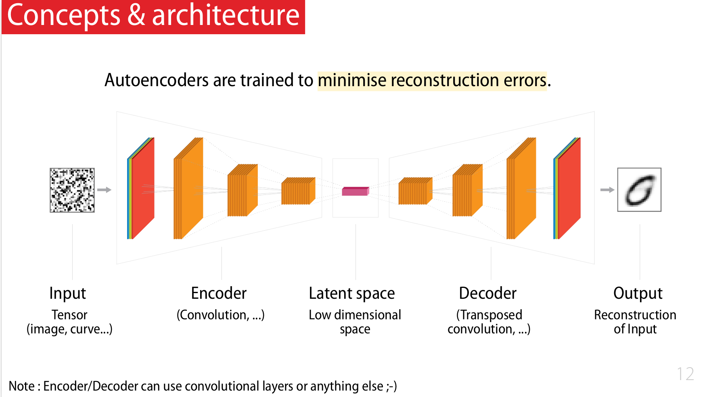

L'objectif est de conserver les éléments essentiels de l'information tout au long de ce processus, en passant par l'espace latent. Cela se fait en réduisant une image bruitée (dans notre exemple), puis en essayant de retrouver l'image originale non bruitée. Le but est de préserver les informations clés tout en se débarrassant du bruit, afin de récupérer l'essence de l'information initiale.

Dans l'exemple et le TP de ce cours:
- on part d'une image intacte 
- on la bruite les image grâce à la méthode `randon_noise` de [scikit-image](https://scikit-image.org/)


#### Encodeur

- L'encodeur peut par exemple être une [convolution](/deeplearning/deep-learning-specialization/c4-convolutional-neural-netowrks/week1/) 

> 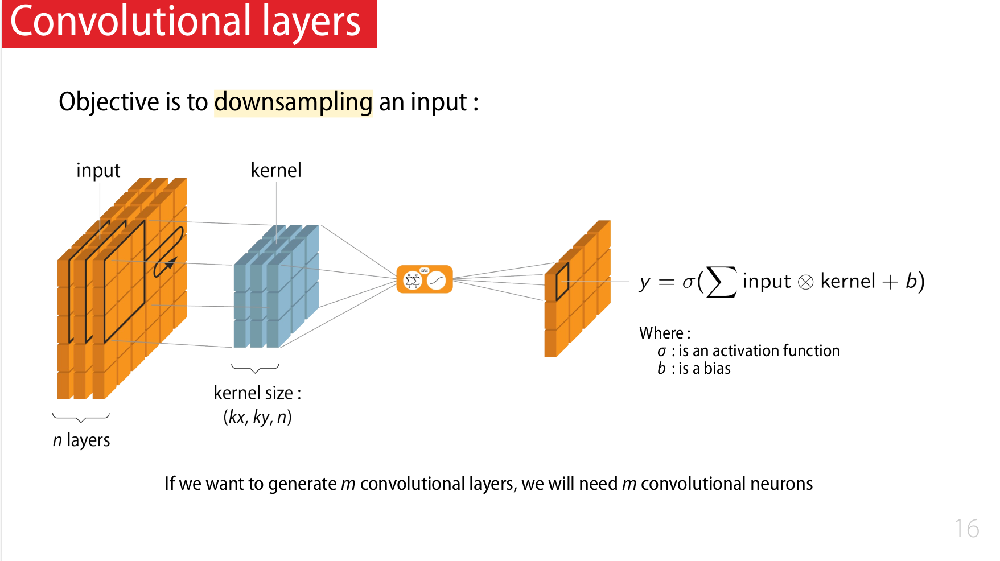


#### Decodeur

- Le decodeur peut être une [transposed convolution](/deeplearning/deep-learning-specialization/c4-convolutional-neural-netowrks/week3/#transpose-convolutions).

> 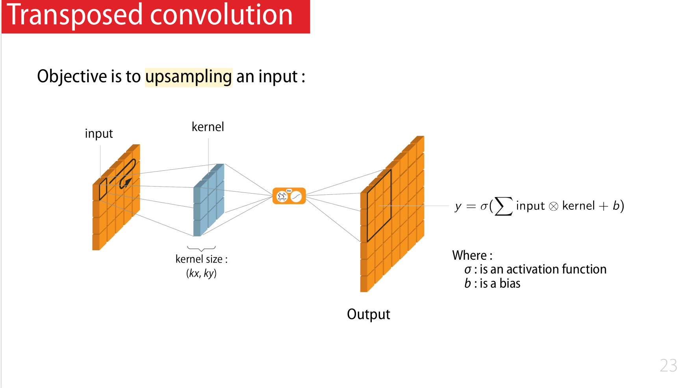

> 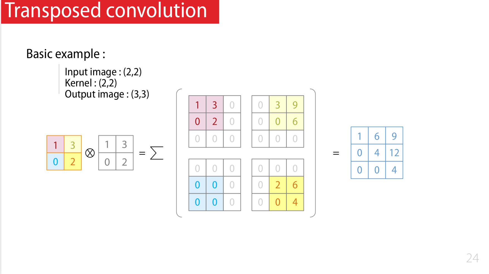

- A noter qu'une transposed convolution peut être implémentée comme une convolution classique

> 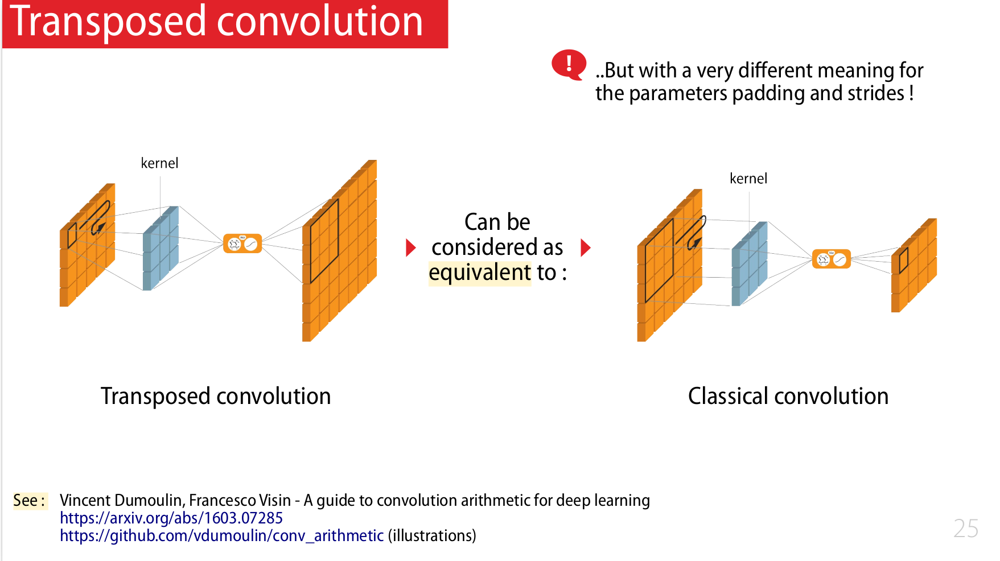

- A noter qu'une transposed convolution peut être remplacée par un upsampling

> 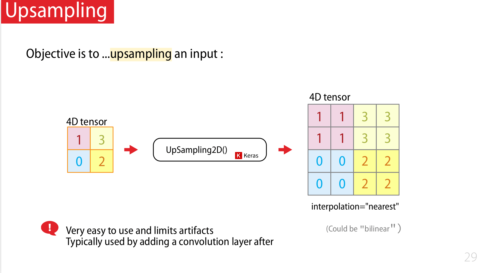


Remarque : L'architecture convolution + transposed convolution se retrouve ici : [Semantic Segmentation with U-Net](/deeplearning/deep-learning-specialization/c4-convolutional-neural-netowrks/week3#semantic-segmentation-with-u-net) (sans l'aspect self-supervised)

### L'API fonctionnelle de Keras

- [Sequential API vs Functional API](/deeplearning/deep-learning-fidle/part4/#keras---sequential-api) 
- L'API fonctionnelle de Keras permet d'avoir de multiple entrées

> 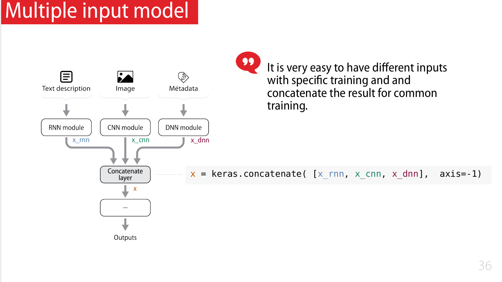

- L'API fonctionnelle de Keras permet d'avoir de multiple sorties

> 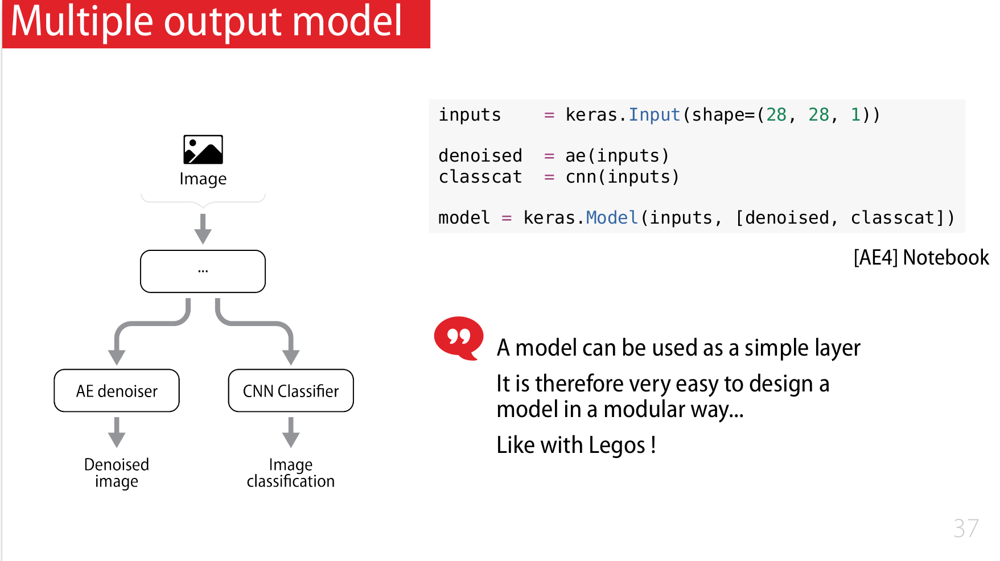

- on peut donc faire plusieurs branches en parallèles pour faire des entrainements en parallèles

> 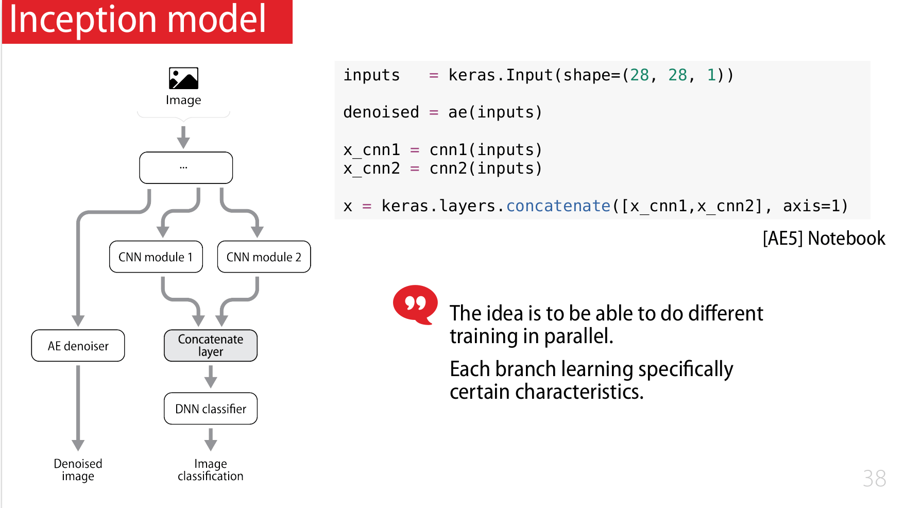

### Exemple 1 : Débruiteur classique

- Exemple d'architecture où l'encodeur et le décodeur sont complétement symétriques

> 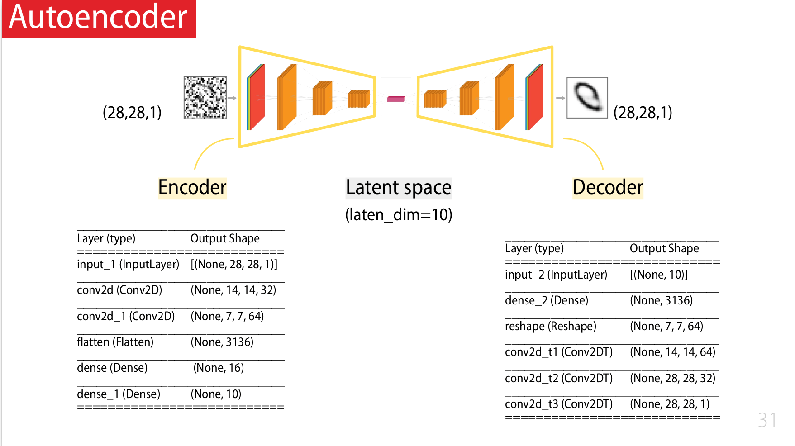

#### Encodeur

```python
inputs    = keras.Input(shape=(28, 28, 1))
x         = layers.Conv2D(32, 3, activation="relu", strides=2, padding="same")(inputs)
x         = layers.Conv2D(64, 3, activation="relu", strides=2, padding="same")(x)
x         = layers.Flatten()(x)
x         = layers.Dense(16, activation="relu")(x)
z         = layers.Dense(latent_dim)(x)

encoder = keras.Model(inputs, z, name="encoder")
# encoder.summary()
```

#### Decodeur

```python
inputs  = keras.Input(shape=(latent_dim,))
x       = layers.Dense(7 * 7 * 64, activation="relu")(inputs)
x       = layers.Reshape((7, 7, 64))(x)
x       = layers.Conv2DTranspose(64, 3, activation="relu", strides=2, padding="same")(x)
x       = layers.Conv2DTranspose(32, 3, activation="relu", strides=2, padding="same")(x)
outputs = layers.Conv2DTranspose(1, 3, activation="sigmoid", padding="same")(x)

decoder = keras.Model(inputs, outputs, name="decoder")
# decoder.summary()
```

#### Autoencodeur (AE)

```python
inputs    = keras.Input(shape=(28, 28, 1))
latents   = encoder(inputs)
outputs   = decoder(latents)
ae = keras.Model(inputs,outputs, name="ae")
ae.compile(optimizer=keras.optimizers.Adam(), loss='binary_crossentropy')
```

#### Train and Predict

```python
# ---- Callback : Images
#
fidle.utils.mkdir( run_dir + '/images')
filename = run_dir + '/images/image-{epoch:03d}-{i:02d}.jpg'
callback_images = ImagesCallback(filename, x=clean_test[:5], encoder=encoder,decoder=decoder)

# ---- Callback : Best model
#
fidle.utils.mkdir( run_dir + '/models')
filename = run_dir + '/models/best_model.h5'
callback_bestmodel = tf.keras.callbacks.ModelCheckpoint(filepath=filename, verbose=0, save_best_only=True)

# ---- Callback tensorboard
#
logdir = run_dir + '/logs'
callback_tensorboard = TensorBoard(log_dir=logdir, histogram_freq=1)

# callbacks_list = [callback_images, callback_bestmodel, callback_tensorboard]
callbacks_list = [callback_images, callback_bestmodel]
```

```python
history = ae.fit(noisy_train, clean_train,
                 batch_size      = batch_size,
                 epochs          = epochs,
                 verbose         = fit_verbosity,
                 validation_data = (noisy_test, clean_test),
                 callbacks       = callbacks_list  )

```

```python
denoised_test = model.predict(noisy_test)
```

> 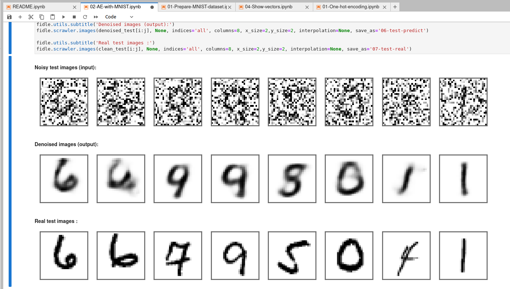


#### Looking atthe latent space

- on prend l'encodeur
- on fait une prediction juste à travers l'encodeur

```python
encoder=model.get_layer('encoder')
z = encoder.predict(x_show)
```

- on choisit 2 axes parmis les 10 et on affiche un graphe 2D avec les points
- on remarque que "naturellement", les points se regroupent dans l'espace latent (clusterisation)

> 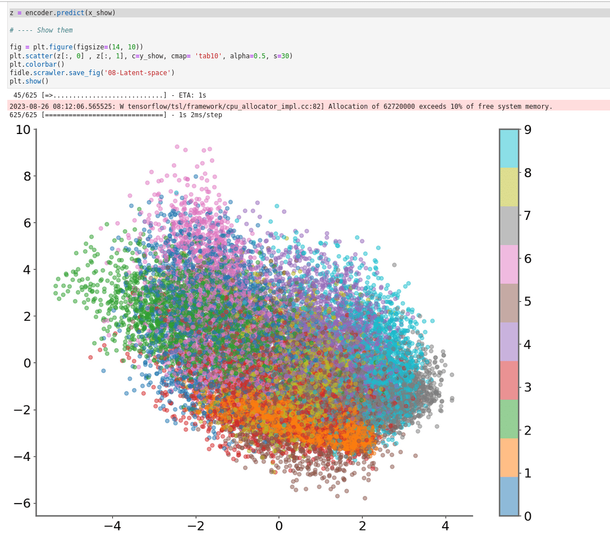


### Exemple 2 : Dual output  (debruiteur + classifieur)
- Objective :
    - Using an uniq model for denoising and classifing
    - Implement a dual output model
    - Understand the Keras functional API
- Dataset :
    - MNIST


> 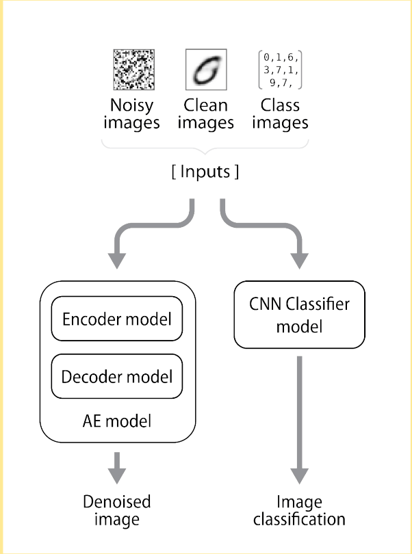

#### Encodeur

```python
inputs    = keras.Input(shape=(28, 28, 1))
x         = layers.Conv2D(32, 3, activation="relu", strides=2, padding="same")(inputs)
x         = layers.Conv2D(64, 3, activation="relu", strides=2, padding="same")(x)
x         = layers.Flatten()(x)
x         = layers.Dense(16, activation="relu")(x)
z         = layers.Dense(latent_dim)(x)
encoder = keras.Model(inputs, z, name="encoder")

```

#### Decoder

```python
inputs  = keras.Input(shape=(latent_dim,))
x       = layers.Dense(7 * 7 * 64, activation="relu")(inputs)
x       = layers.Reshape((7, 7, 64))(x)
x       = layers.Conv2DTranspose(64, 3, activation="relu", strides=2, padding="same")(x)
x       = layers.Conv2DTranspose(32, 3, activation="relu", strides=2, padding="same")(x)
outputs = layers.Conv2DTranspose(1, 3, activation="sigmoid", padding="same")(x)

decoder = keras.Model(inputs, outputs, name="decoder")
# decoder.summary()
```

#### AE
```python
inputs    = keras.Input(shape=(28, 28, 1))

latents   = encoder(inputs)
outputs   = decoder(latents)

ae = keras.Model(inputs,outputs, name='ae')
```
#### CNN

```python
hidden1     = 100
hidden2     = 100

inputs    = keras.Input(shape=(28, 28, 1))

x         = keras.layers.Conv2D(8, (3,3),  activation='relu')(inputs)
x         = keras.layers.MaxPooling2D((2,2))(x)
x         = keras.layers.Dropout(0.2)(x)

x         = keras.layers.Conv2D(16, (3,3), activation='relu')(x)
x         = keras.layers.MaxPooling2D((2,2))(x)
x         = keras.layers.Dropout(0.2)(x)

x         = keras.layers.Flatten()(x)
x         = keras.layers.Dense(100, activation='relu')(x)
x         = keras.layers.Dropout(0.5)(x)

outputs   = keras.layers.Dense(10, activation='softmax')(x)

cnn       = keras.Model(inputs, outputs, name='cnn')
```

#### Final model

```python
inputs    = keras.Input(shape=(28, 28, 1))

denoised = ae(inputs)
classcat = cnn(inputs)

model = keras.Model(inputs, [denoised, classcat])

model.compile(optimizer='rmsprop', 
              loss={'ae':'binary_crossentropy', 'cnn':'sparse_categorical_crossentropy'},
              loss_weights=[1,1],
              metrics={'cnn':'accuracy'} )
```

### Exemple 3 : Dual output +Inception
- Objective :
    - Adding an inception part to our previous model
    - Understand the Keras functional API
- Dataset :
    - MNIST

> 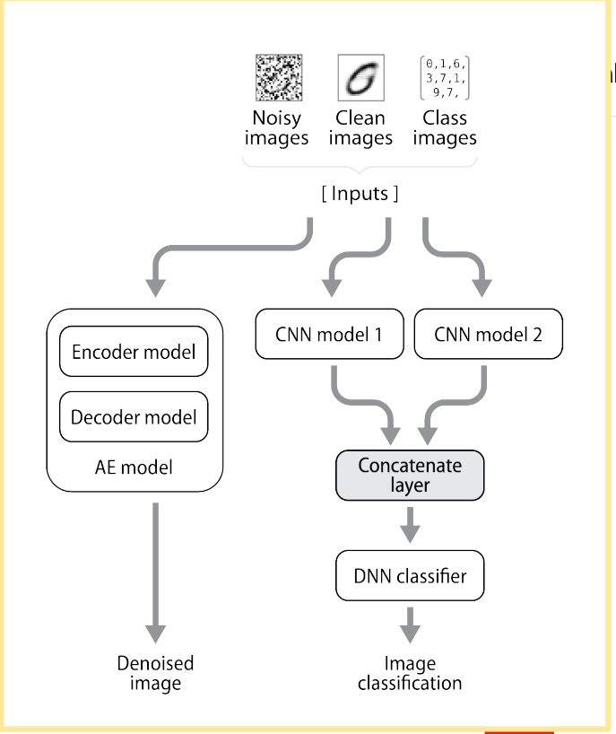


```python
inputs    = keras.Input(shape=(28, 28, 1))

denoised = ae(inputs)

branch_1 = cnn1(inputs)
branch_2 = cnn2(inputs)

x        = keras.layers.concatenate([branch_1,branch_2], axis=1)

classcat = keras.layers.Dense(10, activation='softmax', name='cnn')(x)


model = keras.Model(inputs, [denoised, classcat])

model.compile(optimizer='rmsprop', 
              loss={'ae':'binary_crossentropy', 'cnn':'sparse_categorical_crossentropy'},
              loss_weights=[1,1],
              metrics={'cnn':'accuracy'} )
```


## Seq 11 : Variational Autoencoder (VAE) : apprentissage "self supervised"

https://www.youtube.com/watch?v=m7tQeKw7N2k&list=PLlI0-qAzf2Sa6agSVFbrrzyfNkU5--6b_&index=12


<!--


## Seq 12 : Revue de projets Fidle Intégrée à la future journée Deep Learning pour la Science

## Seq 13 : Generative Adversarial Networks (GAN)!

## Seq 14 : Diffusion model, text to image (HB,NC,MS)

## Seq 15 -  AI, droit, société et éthique (LR, BC, ...)

## Seq 16 : Apprendre plus vite et moins cher, optimiser l’apprentissage (BC,LH)

## Seq 17 :  Passer à la vitesse supérieure : l’accélération matérielle (BC,LH)

## Seq 18 :  Tactiques et stratégies du Deep Reinforcement Learning

## Seq 19 :  Des neurones pour la physique, les physics-informed neural networks (PINNS)

## Seq 20 :  Journée Deep Learning pour la Science - JDLS### -->
