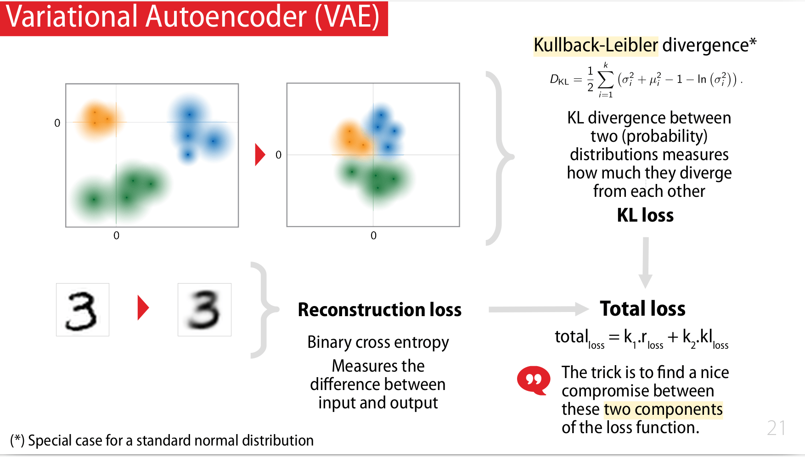

## Seq 10 : Réseaux autoencodeurs

https://www.youtube.com/watch?v=rGz_NavEMmM&list=PLlI0-qAzf2Sa6agSVFbrrzyfNkU5--6b_&index=11

### Apprentissage "self supervised"

Les réseaux autoencodeurs sont intéressants car 
- ils peuvent apprendre sans label (auto-supervision) 
- ils peuvent générer de nouvelles données (capacités génératives)


**L'apprentissage auto-supervisé** (self-supervised learning) est une approche d'apprentissage automatique où le modèle apprend sans nécessiter de labels ou de supervision humaine explicite : 
- Prédiction de parties manquantes (masquer certaines parties d'une image, d'un texte... et demander de retrouver)
- Prédiction de l'ordre (mélanger l'ordre des éléments et demander de les réordonner correctement)
- Reconstruction : Apprendre à reconstruire une version bruitée ou altérée de l'originale.


### Architecture d'un autoencodeur

Un autoencodeur fonctionne de la manière suivante : 
1. **Encodeur** :
    - L'autoencodeur prend une donnée d'entrée, généralement un vecteur ou une image.
    - L'encodeur produit une représentation de plus faible dimension dans l'entrée dans ce qu'on appelle l'espace latent. 
    - Cette représentation capture les caractéristiques importantes de la donnée.
1. **Espace Latent** (Latent Space) :
    - L'espace latent est comme un résumé compact des données d'entrée. C'est là que les informations clés sont stockées sous forme de petits vecteurs de petite dimension.
1. **Decodeur** :
    - La représentation dans l'espace latent est ensuite passée au décodeur.
    - Le décodeur retransforme la représentation réduite en une sortie reconstruite, pour retrouver une version détaillée de l'information originale. 

> 

L'objectif est de conserver les éléments essentiels de l'information tout au long de ce processus, en passant par l'espace latent. Cela se fait en réduisant une image bruitée (dans notre exemple), puis en essayant de retrouver l'image originale non bruitée. Le but est de préserver les informations clés tout en se débarrassant du bruit, afin de récupérer l'essence de l'information initiale.

Dans l'exemple et le TP de ce cours:
- on part d'une image intacte 
- on la bruite les image grâce à la méthode `random_noise` de [scikit-image](https://scikit-image.org/)


#### Encodeur

- L'encodeur peut par exemple être une [convolution](/deeplearning/deep-learning-specialization/c4-convolutional-neural-netowrks/week1/) 

> 


#### Decodeur

- Le decodeur peut être une [transposed convolution](/deeplearning/deep-learning-specialization/c4-convolutional-neural-netowrks/week3/#transpose-convolutions).

> 

> 

- A noter qu'une transposed convolution peut être implémentée comme une convolution classique

> 

- A noter qu'une transposed convolution peut être remplacée par un upsampling

> 


Remarque : L'architecture convolution + transposed convolution se retrouve ici : [Semantic Segmentation with U-Net](/deeplearning/deep-learning-specialization/c4-convolutional-neural-netowrks/week3#semantic-segmentation-with-u-net) (sans l'aspect self-supervised)

### L'API fonctionnelle de Keras

- [Sequential API vs Functional API](/deeplearning/deep-learning-fidle/part4/#keras---sequential-api) 
- L'API fonctionnelle de Keras permet d'avoir de multiple entrées

> 

- L'API fonctionnelle de Keras permet d'avoir de multiple sorties

> 

- on peut donc faire plusieurs branches en parallèles pour faire des entrainements en parallèles

> 

### Exemple 1 : Débruiteur classique

- Exemple d'architecture où l'encodeur et le décodeur sont complétement symétriques

> 

#### Encodeur

```python
inputs    = keras.Input(shape=(28, 28, 1))
x         = layers.Conv2D(32, 3, activation="relu", strides=2, padding="same")(inputs)
x         = layers.Conv2D(64, 3, activation="relu", strides=2, padding="same")(x)
x         = layers.Flatten()(x)
x         = layers.Dense(16, activation="relu")(x)
z         = layers.Dense(latent_dim)(x)

encoder = keras.Model(inputs, z, name="encoder")
# encoder.summary()
```

#### Decodeur

```python
inputs  = keras.Input(shape=(latent_dim,))
x       = layers.Dense(7 * 7 * 64, activation="relu")(inputs)
x       = layers.Reshape((7, 7, 64))(x)
x       = layers.Conv2DTranspose(64, 3, activation="relu", strides=2, padding="same")(x)
x       = layers.Conv2DTranspose(32, 3, activation="relu", strides=2, padding="same")(x)
outputs = layers.Conv2DTranspose(1, 3, activation="sigmoid", padding="same")(x)

decoder = keras.Model(inputs, outputs, name="decoder")
# decoder.summary()
```

#### Autoencodeur (AE)

```python
inputs    = keras.Input(shape=(28, 28, 1))
latents   = encoder(inputs)
outputs   = decoder(latents)
ae = keras.Model(inputs,outputs, name="ae")
ae.compile(optimizer=keras.optimizers.Adam(), loss='binary_crossentropy')
```

#### Train and Predict

```python
# ---- Callback : Images
#
fidle.utils.mkdir( run_dir + '/images')
filename = run_dir + '/images/image-{epoch:03d}-{i:02d}.jpg'
callback_images = ImagesCallback(filename, x=clean_test[:5], encoder=encoder,decoder=decoder)

# ---- Callback : Best model
#
fidle.utils.mkdir( run_dir + '/models')
filename = run_dir + '/models/best_model.h5'
callback_bestmodel = tf.keras.callbacks.ModelCheckpoint(filepath=filename, verbose=0, save_best_only=True)

# ---- Callback tensorboard
#
logdir = run_dir + '/logs'
callback_tensorboard = TensorBoard(log_dir=logdir, histogram_freq=1)

# callbacks_list = [callback_images, callback_bestmodel, callback_tensorboard]
callbacks_list = [callback_images, callback_bestmodel]
```

```python
history = ae.fit(noisy_train, clean_train,
                 batch_size      = batch_size,
                 epochs          = epochs,
                 verbose         = fit_verbosity,
                 validation_data = (noisy_test, clean_test),
                 callbacks       = callbacks_list  )

```

```python
denoised_test = model.predict(noisy_test)
```

> 


#### Looking at the latent space

- on prend l'encodeur
- on fait une prediction juste à travers l'encodeur

```python
encoder=model.get_layer('encoder')
z = encoder.predict(x_show)
```

- on choisit 2 axes parmis les 10 et on affiche un graphe 2D avec les points
- on remarque que "naturellement", les points se regroupent dans l'espace latent (clusterisation)

> 

L'utilisation du terme "espace latent" pour désigner cet aspect du modèle provient du fait que ces variables cachées ou latentes ne sont pas directement observées, mais elles sont liées aux données observées par les opérations d'encodage et de décodage du modèle. L'espace latent peut être vu comme un espace abstrait où les caractéristiques essentielles sont capturées de manière comprimée, permettant ainsi une meilleure modélisation, une génération de données et une exploration des propriétés des données d'origine.


### Exemple 2 : Dual output  (debruiteur + classifieur)
- Objective :
    - Using an uniq model for denoising and classifing
    - Implement a dual output model
    - Understand the Keras functional API
- Dataset :
    - MNIST


> 

#### Encodeur

```python
inputs    = keras.Input(shape=(28, 28, 1))
x         = layers.Conv2D(32, 3, activation="relu", strides=2, padding="same")(inputs)
x         = layers.Conv2D(64, 3, activation="relu", strides=2, padding="same")(x)
x         = layers.Flatten()(x)
x         = layers.Dense(16, activation="relu")(x)
z         = layers.Dense(latent_dim)(x)
encoder = keras.Model(inputs, z, name="encoder")

```

#### Decoder

```python
inputs  = keras.Input(shape=(latent_dim,))
x       = layers.Dense(7 * 7 * 64, activation="relu")(inputs)
x       = layers.Reshape((7, 7, 64))(x)
x       = layers.Conv2DTranspose(64, 3, activation="relu", strides=2, padding="same")(x)
x       = layers.Conv2DTranspose(32, 3, activation="relu", strides=2, padding="same")(x)
outputs = layers.Conv2DTranspose(1, 3, activation="sigmoid", padding="same")(x)

decoder = keras.Model(inputs, outputs, name="decoder")
# decoder.summary()
```

#### AE
```python
inputs    = keras.Input(shape=(28, 28, 1))

latents   = encoder(inputs)
outputs   = decoder(latents)

ae = keras.Model(inputs,outputs, name='ae')
```
#### CNN

```python
hidden1     = 100
hidden2     = 100

inputs    = keras.Input(shape=(28, 28, 1))

x         = keras.layers.Conv2D(8, (3,3),  activation='relu')(inputs)
x         = keras.layers.MaxPooling2D((2,2))(x)
x         = keras.layers.Dropout(0.2)(x)

x         = keras.layers.Conv2D(16, (3,3), activation='relu')(x)
x         = keras.layers.MaxPooling2D((2,2))(x)
x         = keras.layers.Dropout(0.2)(x)

x         = keras.layers.Flatten()(x)
x         = keras.layers.Dense(100, activation='relu')(x)
x         = keras.layers.Dropout(0.5)(x)

outputs   = keras.layers.Dense(10, activation='softmax')(x)

cnn       = keras.Model(inputs, outputs, name='cnn')
```

#### Final model

```python
inputs    = keras.Input(shape=(28, 28, 1))

denoised = ae(inputs)
classcat = cnn(inputs)

model = keras.Model(inputs, [denoised, classcat])

model.compile(optimizer='rmsprop', 
              loss={'ae':'binary_crossentropy', 'cnn':'sparse_categorical_crossentropy'},
              loss_weights=[1,1],
              metrics={'cnn':'accuracy'} )
```

### Exemple 3 : Dual output +Inception
- Objective :
    - Adding an inception part to our previous model
    - Understand the Keras functional API
- Dataset :
    - MNIST

> 

On ajoutant un "second expert", un autre classifier, on augmente la précision du modèle de facon significative par rapport à l'exercice précédent.

```python
inputs    = keras.Input(shape=(28, 28, 1))

denoised = ae(inputs)

branch_1 = cnn1(inputs)
branch_2 = cnn2(inputs)

x        = keras.layers.concatenate([branch_1,branch_2], axis=1)

classcat = keras.layers.Dense(10, activation='softmax', name='cnn')(x)


model = keras.Model(inputs, [denoised, classcat])

model.compile(optimizer='rmsprop', 
              loss={'ae':'binary_crossentropy', 'cnn':'sparse_categorical_crossentropy'},
              loss_weights=[1,1],
              metrics={'cnn':'accuracy'} )
```


## Seq 11 : Variational Autoencoder (VAE) : apprentissage "self supervised"

https://www.youtube.com/watch?v=m7tQeKw7N2k&list=PLlI0-qAzf2Sa6agSVFbrrzyfNkU5--6b_&index=12

Les VAE sont une évolution des autoencodeurs, dans laquelle on va guider la projection des données au sein de l'espace latent, de manière à pouvoir étudier et utiliser celui-ci. L'apprentissage pourra cette fois être totalement non supervisé.

On a vu précédemment que les autoencodeur utilisaient un espace latent. Et que les données, une fois passées par l'encodeur, se retrouvent projeter dans cet espace latent, en se regroupant de façon naturelle (phénomène de clustering), mais sans contrôle de ce clustering

> 

La particularité des VAEs est de s'intéresser à ce qui se passe dans l'espace latent (projection dans un autre monde, imaginaire, avant de revenir dans notre monde), et de faire maîtriser la clusterisation.


On va faire une projection dans ce qu'on appelle un espace probabiliste.

1. **Projection** : sur base de l'information de départ, on ne va pas projeter directement un point, on va générer la **moyenne** et la **variance** qui décrivent la distribution de probabilité de la représentation dans l'espace latent (ici présentation en 2D, mais en n-dimension)
2. **Random Sampling** : on sait donc que le point est projeté dans ce nuage de points (distribution probabiliste). On pioche un point dans ce nuage de point
3. **Up sampling**:  on reconstruit l'image de départ grâce au décodeur

Le modèle est entraîner pour avoir μ (moyenne) et σ (écart type)  pour que lorsqu'on pioche dans ce nuage de point, on retrouve l'image d'origine.

> 


La fonction de perte (loss) est un deux partie :
- **Reconstruction loss** : une artie classique qui calcul la différence entre l'output prédit et l'output attendu
- **Kullback-Leibler** (ici version simplifiée) : elle permet de calculer la distance entre deux distribution, afin de permettre (distribution de droite, de limiter l'éparpillement des projections)

> 


Exemple dans le cas suivant:
- à droite, on ne maîtrise pas la distribution, k1 est trop lourd ce qu favorise la reconstruction
- à gauche, k2 est trop grand, la distribution est maîtrisée, mais la reconstruction n'est pas bonne
- k1 et k2 sont des hyper-paramètres

> 


- Deux exemples de représentation équilibrées :

> 

- Puisque l'espace est correctement centrée, on peut choisir des points pour faire un quadrillage pour parcourir l'espace latent
- pour chaque point on peut construire l'image obtenu par l'encodeur (c'est réellement un espace de dimension 2, il ne nous manque pas de dimension pour reconstruite)
- on peut voir comment par exemple on passe du 0 (bleu) au 6 (rose)
- on peut se "promener" et "générer" de la donnée (le génératif est un use case de l'espace du VAE, mais d'autres réseaux sont plus efficaces aujourd'hui)
- l'autre usage reste le clustering

> 


### Notebooks VAE1

- Objectives :
    - implementating a VAE, using Keras functionel API and model subclass, using real Python !
- Dataset :
    - MNIST

> 


#### Implémentation 1 : VAE using Keras functional API - SamplingLayer & VariationalLossLayer

##### Encoder
```python
inputs    = keras.Input(shape=(28, 28, 1))
x         = layers.Conv2D(32, 3, strides=1, padding="same", activation="relu")(inputs)
x         = layers.Conv2D(64, 3, strides=2, padding="same", activation="relu")(x)
x         = layers.Conv2D(64, 3, strides=2, padding="same", activation="relu")(x)
x         = layers.Conv2D(64, 3, strides=1, padding="same", activation="relu")(x)
x         = layers.Flatten()(x)
x         = layers.Dense(16, activation="relu")(x)

z_mean    = layers.Dense(latent_dim, name="z_mean")(x)
z_log_var = layers.Dense(latent_dim, name="z_log_var")(x)
z         = SamplingLayer()([z_mean, z_log_var])

encoder = keras.Model(inputs, [z_mean, z_log_var, z], name="encoder")
# encoder.summary()
```

##### Decoder

```python
inputs  = keras.Input(shape=(latent_dim,))
x       = layers.Dense(7 * 7 * 64, activation="relu")(inputs)
x       = layers.Reshape((7, 7, 64))(x)
x       = layers.Conv2DTranspose(64, 3, strides=1, padding="same", activation="relu")(x)
x       = layers.Conv2DTranspose(64, 3, strides=2, padding="same", activation="relu")(x)
x       = layers.Conv2DTranspose(32, 3, strides=2, padding="same", activation="relu")(x)
outputs = layers.Conv2DTranspose(1,  3, padding="same", activation="sigmoid")(x)

decoder = keras.Model(inputs, outputs, name="decoder")
# decoder.summary()
```


##### VAE

We will calculate the loss with a specific layer: VariationalLossLayer 

```python
inputs = keras.Input(shape=(28, 28, 1))

z_mean, z_log_var, z = encoder(inputs)
outputs              = decoder(z)

outputs = VariationalLossLayer(loss_weights=loss_weights)([inputs, z_mean, z_log_var, outputs])

vae=keras.Model(inputs,outputs)

vae.compile(optimizer='adam', loss=None)
```

Ici on programme 2 layers custom dans Keras (très simple) :

###### SamplingLayer

```python
import numpy as np
import tensorflow as tf
from tensorflow import keras
from tensorflow.keras import layers
from IPython.display import display,Markdown

# Note : https://keras.io/guides/making_new_layers_and_models_via_subclassing/

class SamplingLayer(keras.layers.Layer):
    '''A custom layer that receive (z_mean, z_var) and sample a z vector'''

    def call(self, inputs):
        
        z_mean, z_log_var = inputs
        
        batch_size = tf.shape(z_mean)[0]
        latent_dim = tf.shape(z_mean)[1]
        
        epsilon = tf.keras.backend.random_normal(shape=(batch_size, latent_dim))
        z = z_mean + tf.exp(0.5 * z_log_var) * epsilon
        
        return z
```

###### VariationalLossLayer

```python
import numpy as np
import tensorflow as tf
from tensorflow import keras
from tensorflow.keras import layers
from IPython.display import display,Markdown

# Note : https://keras.io/guides/making_new_layers_and_models_via_subclassing/

class VariationalLossLayer(keras.layers.Layer):
   
    def __init__(self, loss_weights=[3,7]):
        super().__init__()
        self.k1 = loss_weights[0]
        self.k2 = loss_weights[1]


    def call(self, inputs):
        
        # ---- Retrieve inputs
        #
        x, z_mean, z_log_var, y = inputs
        
        # ---- Compute : reconstruction loss
        #
        r_loss  = tf.reduce_mean( keras.losses.binary_crossentropy(x,y) ) * self.k1
        #
        # ---- Compute : kl_loss
        #
        kl_loss = 1 + z_log_var - tf.square(z_mean) - tf.exp(z_log_var)
        kl_loss = -tf.reduce_mean(kl_loss) * self.k2
        
        # ---- Add loss
        #
        loss = r_loss + kl_loss
        self.add_loss(loss)
        
        # ---- Keep metrics
        #
        self.add_metric(loss,   aggregation='mean',name='loss')
        self.add_metric(r_loss, aggregation='mean',name='r_loss')
        self.add_metric(kl_loss,aggregation='mean',name='kl_loss')
        return y

    
    def get_config(self):
        return {'loss_weights':[self.k1,self.k2]}
```


#### Implémentation 2 : VAE using Keras subclass - SamplingLayer & VAE

On fabrique directement un modèle VAE plutôt que d'ajouter une couche Loss comme précédemment

> 


<!--


## Seq 12 : Revue de projets Fidle Intégrée à la future journée Deep Learning pour la Science

## Seq 13 : Generative Adversarial Networks (GAN)!

## Seq 14 : Diffusion model, text to image (HB,NC,MS)

## Seq 15 -  AI, droit, société et éthique (LR, BC, ...)

## Seq 16 : Apprendre plus vite et moins cher, optimiser l’apprentissage (BC,LH)

## Seq 17 :  Passer à la vitesse supérieure : l’accélération matérielle (BC,LH)

## Seq 18 :  Tactiques et stratégies du Deep Reinforcement Learning

## Seq 19 :  Des neurones pour la physique, les physics-informed neural networks (PINNS)

## Seq 20 :  Journée Deep Learning pour la Science - JDLS### -->
