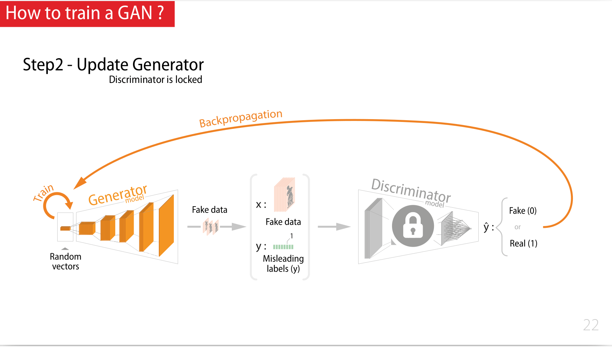

## Seq 13 : Generative Adversarial Networks (GAN)!

### About GAN

- Il est aujourd'hui compliqué de faire la différence entre ce qui est généré par de l'IA et la réalité:
    - Voir le site https://thisxdoesnotexist.com/
    - AI-synthesized faces are indistinguishable from real faces and more trustworthy. Synthetically generated faces are more trustworthy than real faces. This may be because synthesized faces tend to look more like average faces which themselves are deemed more trustworthy (cf. https://doi.org/10.1073/pnas.2120481119)
- GAN = **Generative Adversarial Networks**, voir le [papier](https://arxiv.org/abs/1406.2661) écrit par Ian J. Goodfellow, qui introduit deux intelligence qui fonctionne de façon concurrente
    - un Generator, Counterfeiter ou Faussaire
    - Un Descriminator ou Expert

> 

### Principle

- Le Counterfeiter essaye de tromper l'Expert
- L'expert essaie de faire la différence entre le vrai et le faux
- cette compétition entraîne chacun à devenir meilleur

> 

L'entraînement des deux composants ne se fait pas en parallèle, mais en deux étapes distinctes

### How I train a GAN

#### Step 1 - Update Discriminator

- On fabrique un dataset labellisé avec :
    - des données réelles
    - des données fabriquée avec le générateur tel qu'il est (pas d'entraînement dans ce step)
- ces données sont présentées au discriminator qui est entraîné comme tout réseau de classification
    - prédiction faite par le discriminator
    - comparaison avec le résultat attendu

> 

#### Step 2 - Update Generator

- le Generator génère de fausse images, ces images sont associées avec des labels (trompeurs) qui prétendent que ce sont de vrais images et on essaie de tromper le discriminator
- à partir de ce qu'on obtient pas le discriminator, on calcul une erreur et on entraîne pou tromper le dicriminator.

> 

### Notebook

- Objective :
    - Learn to draw or generate sheep.
- Dataset :
    - Quick draw dataset - https://quickdraw.withgoogle.com/data

> 

Le Generator et le Discriminator n'ont aucune particularité.

#### Discriminator, Classifier Convolutif d'image classique

```python
inputs  = keras.Input(shape=(28, 28, 1))
x       = layers.Conv2D(64, kernel_size=4, strides=2, padding="same")(inputs)
x       = layers.LeakyReLU(alpha=0.2)(x)
x       = layers.Conv2D(128, kernel_size=4, strides=2, padding="same")(x)
x       = layers.LeakyReLU(alpha=0.2)(x)
x       = layers.Conv2D(128, kernel_size=4, strides=2, padding="same")(x)
x       = layers.LeakyReLU(alpha=0.2)(x)
x       = layers.Flatten()(x)
x       = layers.Dropout(0.2)(x)
z       = layers.Dense(1, activation="sigmoid")(x)
discriminator = keras.Model(inputs, z, name="discriminator")
discriminator.summary()
```

#### Generator, upsampling

On part du vecteur de l'espace latent et on fait de l'upsampling (et non de la transposer convolution) pour générer une image noir et blanc 28x28

```python
inputs  = keras.Input(shape=(latent_dim,))
x       = layers.Dense(7 * 7 * 64)(inputs)
x       = layers.Reshape((7, 7, 64))(x)
x       = layers.UpSampling2D()(x)
x       = layers.Conv2D(128,  kernel_size=3, strides=1, padding='same', activation='relu')(x)
x       = layers.UpSampling2D()(x)
x       = layers.Conv2D(256,  kernel_size=3, strides=1, padding='same', activation='relu')(x)
outputs = layers.Conv2D(1,    kernel_size=5, strides=1, padding="same", activation="sigmoid")(x)

generator = keras.Model(inputs, outputs, name="generator")
generator.summary()
```

#### DCGAN

```python
gan = DCGAN(discriminator=discriminator, generator=generator, latent_dim=latent_dim)
```

- DCGAN = Deep Convolution GAN
- https://gricad-gitlab.univ-grenoble-alpes.fr/talks/fidle/-/blob/master/DCGAN/modules/models/DCGAN.py
- [DGAN class source](/fidle/DCGAN.py)


<!-- ## Seq 14 : Diffusion model, text to image (HB,NC,MS)

## Seq 15 -  AI, droit, société et éthique (LR, BC, ...)

## Seq 16 : Apprendre plus vite et moins cher, optimiser l'apprentissage (BC,LH)

## Seq 17 :  Passer à la vitesse supérieure : l'accélération matérielle (BC,LH)

## Seq 18 :  Tactiques et stratégies du Deep Reinforcement Learning

## Seq 19 :  Des neurones pour la physique, les physics-informed neural networks (PINNS)

## Seq 20 :  Journée Deep Learning pour la Science - JDLS2023 -->