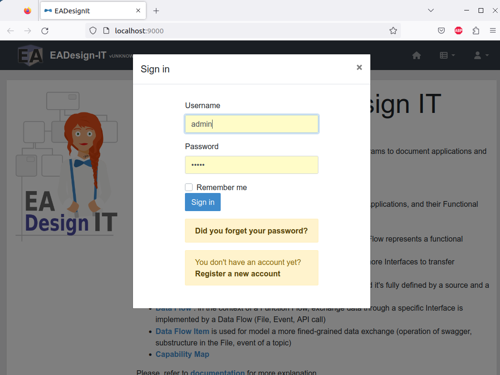
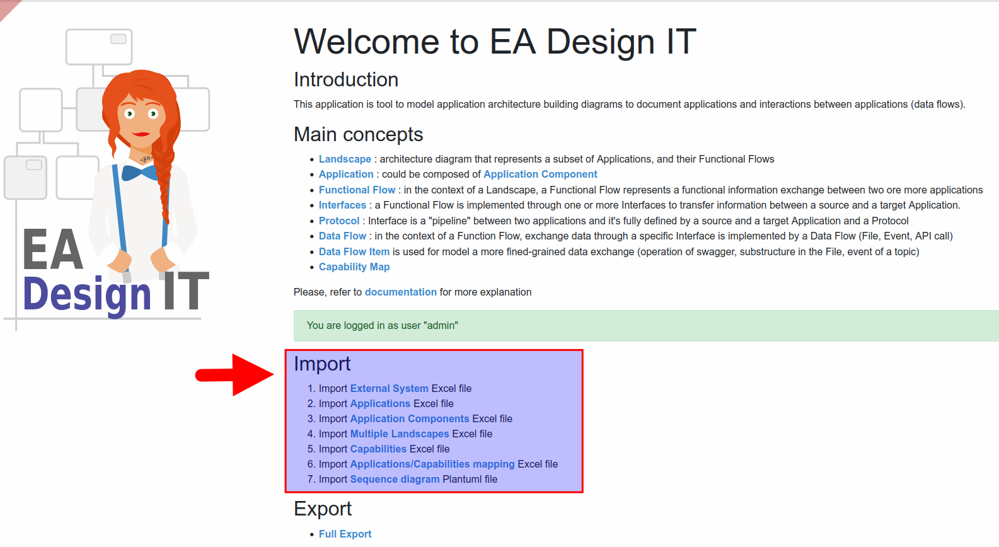

EADesignIt is a lightweight, open-source Enterprise Architecture software designed to bring transparency to your organization's assets, their connections, and their characteristics. This tool is specifically tailored to serve Enterprise Architects who need an efficient solution for documenting the state of their enterprises. EADesignIt simplifies the task of describing your applications landscape, reducing the effort required to create valuable documentation.

## Key Features of EADesignIt

- **Effortless Documentation**: EADesignIt streamlines the process of documenting your enterprise's assets and their relationships, helping you maintain a clear and up-to-date view of your architecture.

- **Replace Unmaintainable Spreadsheets**: Say goodbye to unwieldy and unmanageable Excel files. EADesignIt provides a structured database repository, making it easy to keep your architectural information organized and accessible.

Whether you're an experienced Enterprise Architect or new to the field, this guide will walk you through the essential steps to get started with EADesignIt. Explore the features, import your data, and begin your journey to improved enterprise architecture documentation.


## Getting Started
- [1. Install EADesignIt with Docker](#install-eadesignit-with-docker)
- [2. Load Data into EADesignIt](#load-data-into-eadesignit)
- [3. Explore EADesignIt](#explore-eadesignit)

### Install EADesignIT with Docker
DesignIT can be easily installed using Docker. Follow these simple steps:

1. **Install Docker**: If you don't already have Docker installed, you can download and install it from the [official Docker website](https://www.docker.com/products/docker-desktop).

2. **Pull the DesignIT Docker Image**:
   ```bash
   docker pull mauvaisetroupe/ea-design-it

3. **Log into the application** with `admin` / `admin`

> 


### Load Data into EADesignIT
DesignIT allows you to seamlessly import data from Excel files. Follow these steps to get started:

1. Downolad [Synthetic Data Set Excel file](https://github.com/mauvaisetroupe/ea-design-it/tree/main/docs/excel-import/samples).

2. Import :
   - Import External System Excel file
   - Import Applications Excel file
   - Import Application Components Excel file
   - Import Multiple Landscapes Excel file
   - Import Capabilities Excel file
   - Import Applications/Capabilities mapping Excel file 

> 


### Explore EADesignIt

## What's next ?

> **NEXT** : Start read about the meta-model : [Applications and Application Components](../metamodel/metamodel-application/)
