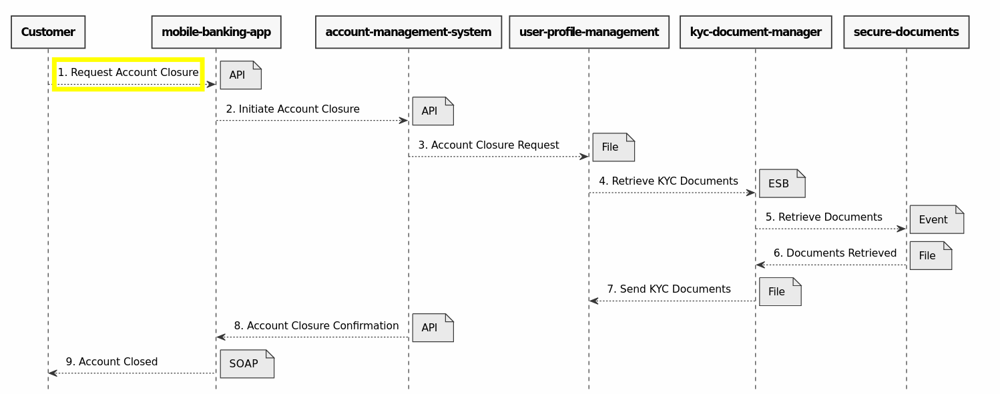
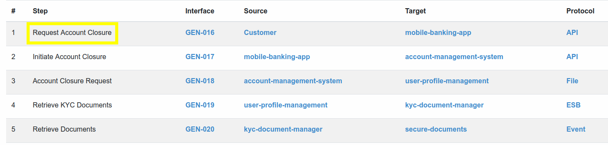
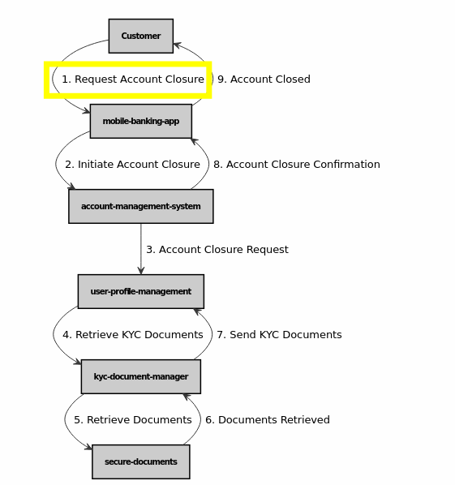
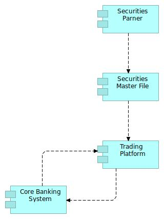

## Teminology 

In the context of a **Landscape**, a Functional Flow represents a functional information exchange between two or more applications

## Example

**GEN.002** is FunctionalFlow that describes interactions between applications to execute a Customer offboarding. **GEN.002** is part of the [Onboarding Landscape](../metamodel-landscape/)

### Sequence Diagram

Functional Flow can be thought of as use cases that are typically represented using **sequence diagrams**. They describe how specific functions or processes are carried out within the landscape. 

Functional flows provide a detailed and step-by-step depiction of how applications interact and work together to achieve a particular task or goal.

### Functional Flow as a sequence of steps provided by Interfaces

**GEN.002** FunctionalFlow is composed of many **steps** :
- <mark style="background-color: yellow">Request Account Closure</mark>
- Initiate Account Closure
- Account Closure Request
- ...

FunctionalFlow is a list of **steps**, each step leverages on an [Interface](../metamodel-interface/). Interface is a “pipeline” between two Applications.

### Application Cooperation Diagram

Functional Flow is mainly thought as a use case described with a **sequence diagram**. Another representation is a **Archimate Application Cooperation Viewpoint**. 

> **NEXT** : If you want to continue to dicover the metamodel, see what is an [Interface](../metamodel-interface/)

## Mapping with Archimate specification

Basically, a Functional Flow is a subset of Landscape, representing a specific usage of a part of the landscape in a specific functional use case.

> Archimate 3.1 
>
> Like Landscape, a Functional Flow is typically an **Application Cooperation Viewpoint**.

## What's next ?

> **NEXT** : If you want to continue to dicover the metamodel, see what is an [Interface](../metamodel-interface/)