## TOGAF and ADD

I worked for a long time in a large company in Luxembourg, a company where I became the Chief Architect. With the assistance of the consulting firm we had the opportunity to work with at the enterprise architecture level, we co-designed a working methodology and deliverables.

This mainly consisted of implementing an approach based on TOGAF, which requires in its initial phase to set up the architecture function by adapting the processes and deliverables (TOGAF is a framework, as indicated by the “F” in TOGAF , and must therefore be customized).

One of the key documents was called ADD (Architecture Definition Document).

## ADD, Purpose of the Document

The ADD had two versions: one referred to as "project" and the other as "domain."

### Project ADD
The project version served as the document presenting the high-level architecture during the project's design phase.

In the enterprise portfolio management process, before transforming a business idea into a project, it is necessary to have an understanding of what the project will yield (or the risk of not undertaking it). This is manifested through the creation of a business case.

On the other hand, it is essential to know the cost of implementing the project. This is where the ADD comes into play. The document served as the foundation for aligning stakeholders around the solution. Accompanied by high-level requirements and high-level processes impacted by the project, it formed the basis for defining the IT solution to be implemented. It was high-level enough to avoid investing too much time in a subject that might never materialize into a project but detailed enough to enable IT teams to produce cost estimations (high-level, certainly, but sufficient for assessing the positivity of the business case).

### The Domain ADD

For a specific business domain, the Domain ADD serves as a kind of user manual that explains how the IT landscape and its applications cover the business domain.

The Domain ADD had exactly the same structure as the project ADD. This is because, once a project was completed, once the application components were in production, and once the associated data flows were in place, the content of the project ADD was added to the ADD of the associated domain. The Domain ADD is, therefore, a compiled version of all the project ADDs that have been completed, and its outcome is the part of the landscape that covers the business domain.

### ADD as slides

The original format of the ADD was in PowerPoint.

This choice was made at the outset of a substantial transformation plan that would impact two-thirds of the application landscape. Instead of aiming to create a repository of applications, a reference for flows, or an application repository, the primary objective was to make decisions and align stakeholders.

Therefore, having a document in a PowerPoint format was deemed the optimal choice, allowing for direct presentation and discussion in architecture forums or architecture committees. This format facilitated efficient communication and decision-making during the early stages of the significant transformation initiative.

## Essential Chapters of the ADD

### 01 - Vision

> 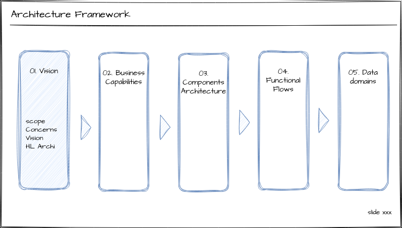

In the Vision section, we define the project's scope and assumptions, identify key stakeholders and address their concerns, present the business vision within its context, and provide a high-level overview of the proposed solution architecture. This sets the foundation for clear decision-making and alignment.

#### Concerns

> 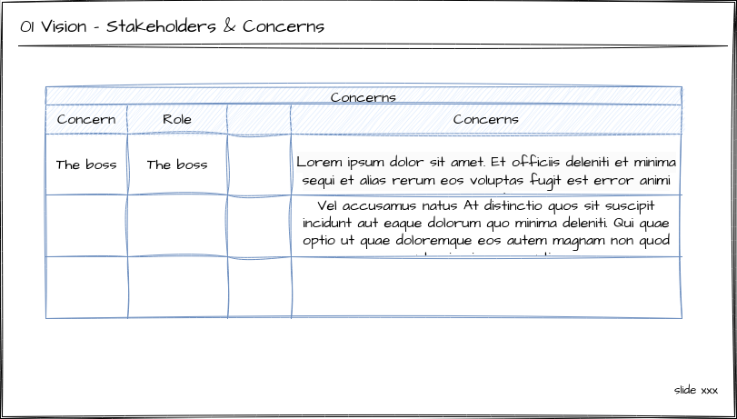

In the Vision chapter, the initial slide featured a table that captured the concerns of stakeholders. This table provided a structured overview of the various interests, perspectives, and apprehensions of key stakeholders involved in the project. By explicitly outlining these concerns, the document aimed to ensure a comprehensive understanding of the diverse viewpoints within the stakeholder community. This table served as a valuable reference point for project decision-making.

An exemple of concern : "I'm concerned about the scalability of the proposed solution. As our user base and data volumes continue to grow"

Another concerns : "I am concerned about the potential impact of the project on existing legacy systems. It's crucial that the transition is seamless and does not disrupt our current operations. Additionally, I want assurance that data migration processes are well-defined and won't lead to data integrity issues."

#### Business Vision

> 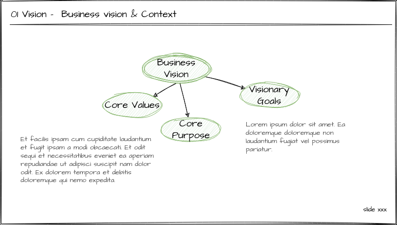

The second part was centered on "Business Vision." An example of the vision could involve explaining that the project is intended to form the groundwork for a future API platform, emphasizing goals related to monetization, and establishing an organizational structure where
Product Owners (POs) take charge of designing APIs as products.

#### Highlights on Conceptual Architecture

> 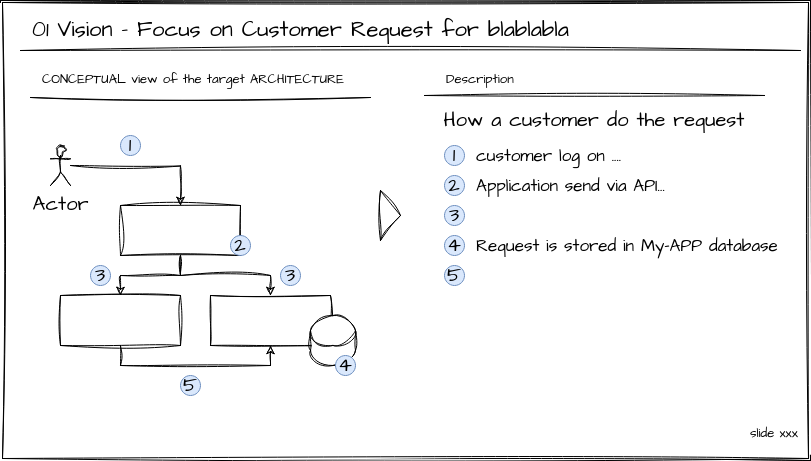

Ultimately, the third part of the vision comprised a high-level description of the conceptual architecture, elucidating the crucial elements within the architectural framework. The aim was to articulate key points and simplify the information to align stakeholders on the proposed solution.

### 02 - Business Capabilities

Within the Business Capabilities Map section, we present an updated version of the business capability map. This serves as a common framework shared among all stakeholders, fostering a shared understanding between business and IT perspectives.

> 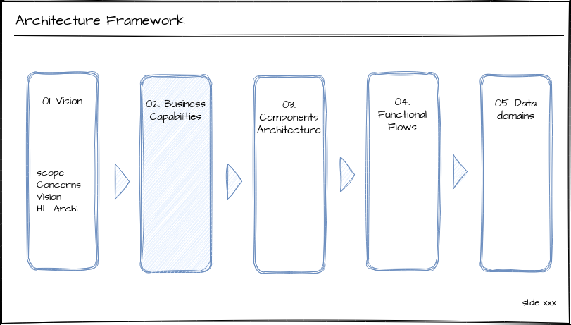

#### Enterprise-wide Capabilities Map

The first slide of the Business Capabilities in each ADD, whether for projects or domains, was a standardized one-pager. This page featured the company's Business Capabilities Map, representing everything that the business is capable of doing to ensure the smooth operation of the enterprise. The creation of this capabilities map involved collaboration with domain analysts and organizing brainstorming meetings with business stakeholders from each domain. The collective insights and expertise gathered during these sessions were instrumental in shaping a comprehensive and inclusive Business Capabilities Map that served as a foundational reference across various projects and domains.

> 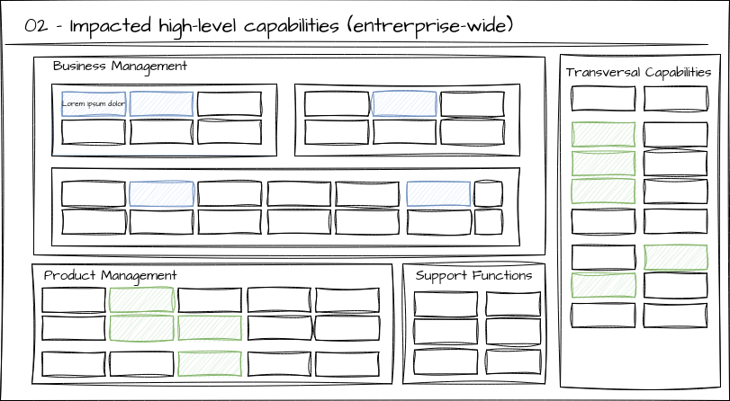

On this enterprise-wide capabilities map, we highlighted the capabilities impacted by a specific project for an project ADD  or the capabilities covered by a domain for an Domain ADD.

For an ADD projet, the focus was on showcasing the capabilities influenced or changed by the project. This helped in providing a clear visual representation of how the project aligns with and affects the broader capabilities of the entire enterprise.

In the case of an Domain ADD, the emphasis was on displaying the capabilities encompassed by the specific business domain. This allowed stakeholders to understand the domain's contributions and functionalities within the larger context of the enterprise, fostering alignment and coherence in the architectural decisions made at the domain level.

#### Detailed Project/Domain Capabilities Map

The second part of the capabilities map includes a slide that provides a more detailed representation of the capabilities implemented by the project or those within the domain. We visualize a capabilities map structured across four levels, with the enterprise-wide one-pager covering the first two levels. In this section, we systematically go deeper, extending down to the fourth level, offering a granular view of the capabilities being addressed.

> 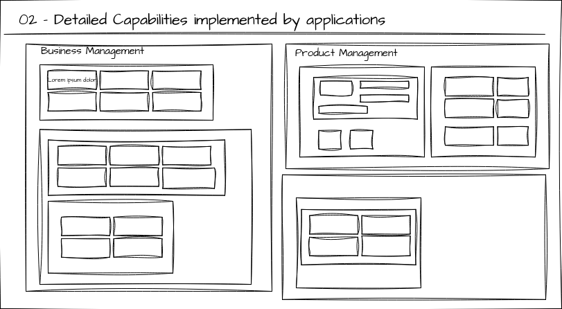

It's worth noting that, despite the increased detail, this representation fundamentally aligns with the one-page format at the enterprise-wide scale.

### 03 - Components Architecture

In the Business Components Architecture section, we explore the differents components, and how they interacts

> 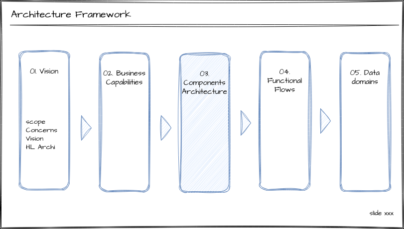


#### Application landscape

The first part of the architecture components is a section that describes the landscape. It forms the core of the ADD. The landscape is a representation, captured in a single diagram, of all the applications implicated in the project or existing within the domain. In a project scenario, a color-coding system was employed to signify the level of impact (new application, slight modification, profound refactoring). On this landscape, a set of arrows illustrates all the interactions between applications, without delving into the detailed reasons or methods behind each arrow.

> 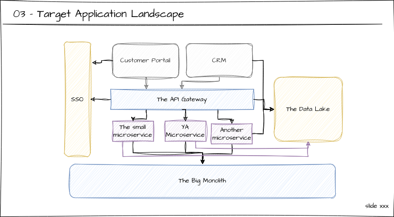

The landscape serves as a crucial entry point for newcomers to the company. It provides an easily understandable overview of all the applications with which they will interact, either directly or indirectly, if they are involved in the business domain associated with this landscape. This facilitates a smoother onboarding process by offering a clear, high-level view of the technological elements within which they will be working.

> 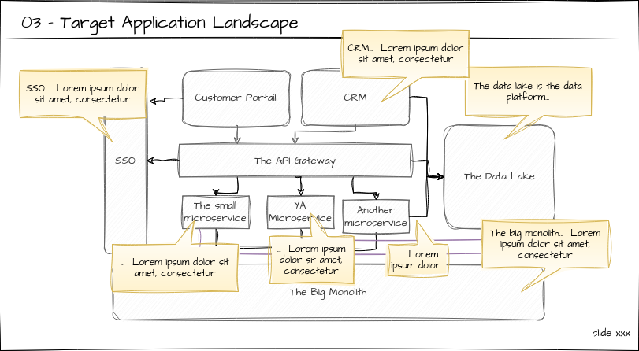

A second slide precisely depicted the same landscape but with annotations in the form of comments providing succinct descriptions for each application and component.


#### Application / Capabilities Mapping

The next section of the architecture components involves mapping the applications and capabilities. While the landscape provides a static view of the applications and the interactions/flows between them, to delve deeper into understanding the landscape, the next step is to comprehend what each application covers in terms of macro-functionality. To achieve this, the decision was made to map detailed capabilities with the applications.


In practice, this involved using the detailed capabilities map as the base layer and overlaying the applications on top of the capabilities with transparency.

> 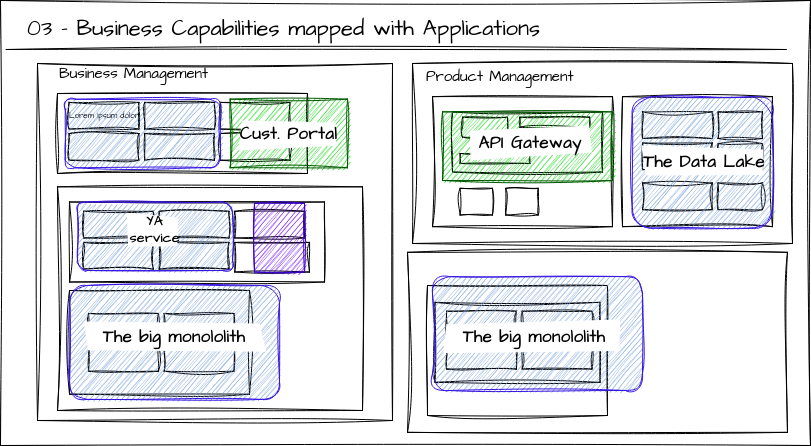

From a formalism perspective, an approximation was made since a business capability represents the ability of the business to produce something, while applications offer services or features.

```
Business Capability : A particular ability that a business may possess or exchange to achieve a specific purpose.
```

In our context,  we considered that there is a one to one correspondence between capabilities and application features or services.


### 04 - Functional Flows

> 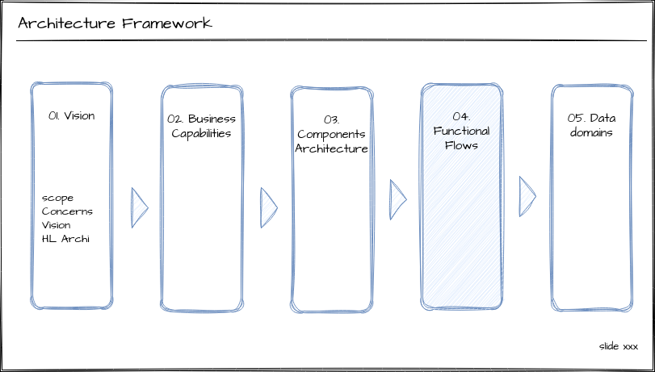


To summarize, in the preceding sections, we have a landscape presenting all the applications within the domain, as well as the capabilities and the mapping between these capabilities and the applications that implement them.

The "Functional Flow" section adds a dynamic aspect to this by presenting sequence diagrams that illustrate how the applications communicate with each other. Within this section, we map functional process flows and applications onto the target architecture landscape. This visual representation aids in understanding how functional processes flow within the architectural framework, ensuring alignment with the overall vision.

The purpose of these flows is not to be exhaustive or comprehensive. For instance, error handling processes are not represented in the same detailed manner as one might do in a BPMN (Business Process Model and Notation) diagram.

> 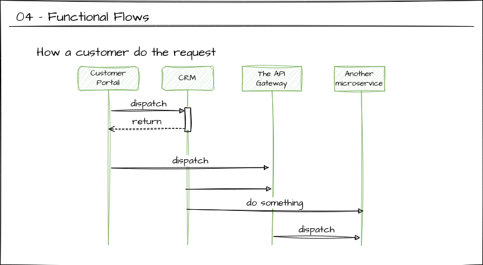

### 05 - Data Domain Architecture

> 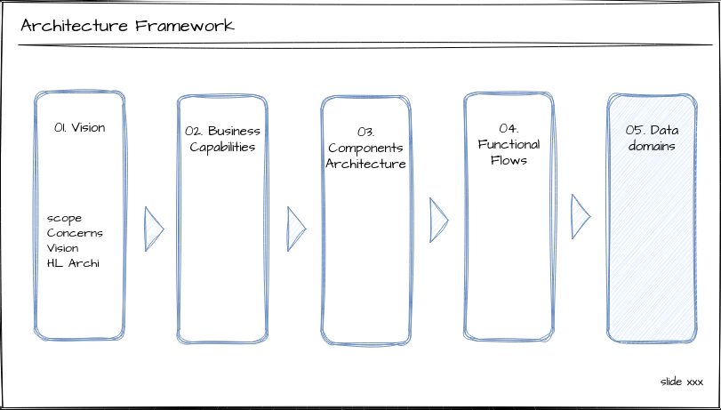


The Data Domain Architecture section involves mapping data domains onto the target application landscape.

It involves positioning data repositories on the landscape, specifying whether they are the golden source of data or replicas.

> 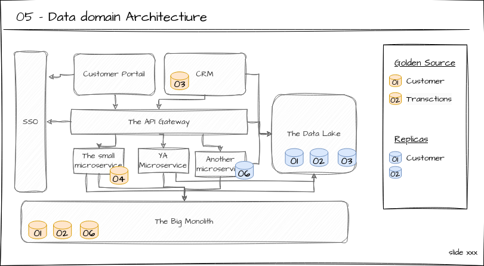


## What's next ?

> **NEXT** : If you want to continue explore EADesigntIt : [Getting started section](../getting-started/).