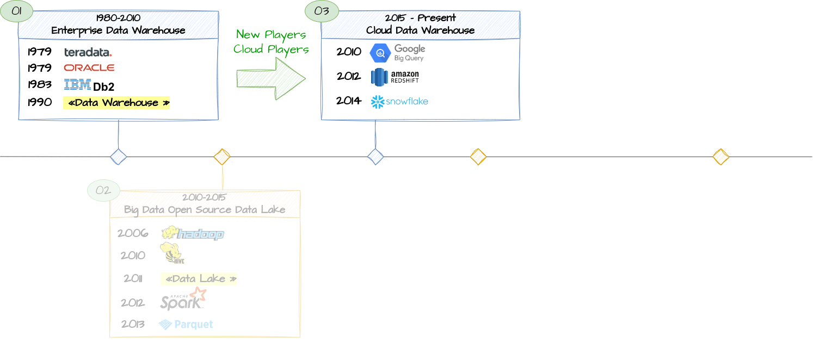
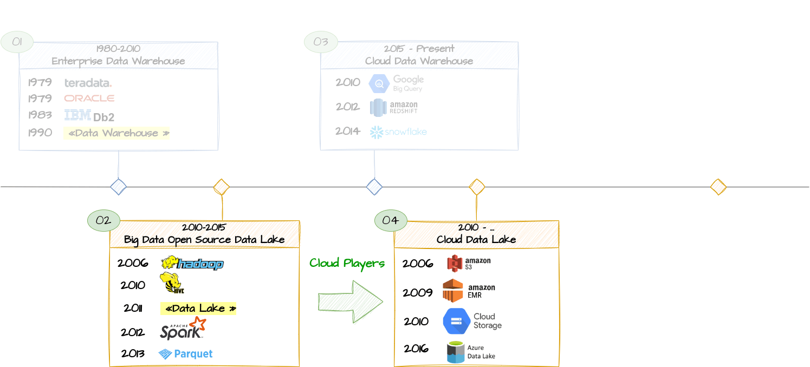
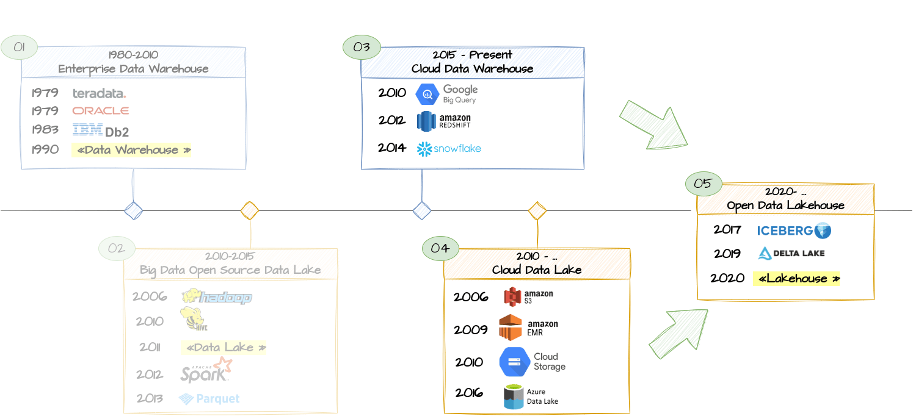

In the ever-evolving realm of data management, organizations have witnessed a remarkable journey from handling large datasets to embracing innovative solutions like data warehouses, data lakes, and the emerging concept of a 'lakehouse.' 

I propose in this blog to share the knowledge I have acquired on the internet, through my readings, but especially from my professional experience.

Indeed, I had the opportunity to participate in the implementation, over 15 years ago, of a data warehouse or at least an Operational Data Store (ODS), which served as a data hub used by the bank for producing its legal and client reporting, as well as for the financial management of the bank.

This initial implementation, which is still live, was complemented by a much more recent study (2022) for the replacement of this first platform. As part of the development of an IT strategy, we created battles, including one dedicated to data, in which we had the opportunity to think about the data architecture for the years to come. This provided the opportunity to meet vendors and companies such as Databricks, Snowflake, Informatica, and Denodo.

## A Journey from Data Warehouse, Data Lake, and Beyond

We coud try to draw the 5 big area in the historey in data warehousing. Please note that these periods and technologies are generalized and may not reflect the exact adoption patterns for every organization

### 01. Data warehouse

The story begins with classical data warehouses, robust solutions that emerged in the 1980s. 

Pioneered by industry giants like IBM, Teradata, and Oracle, these centralized repositories were designed to handle structured data efficiently. Their primary focus was on providing a platform for Business Intelligence (BI), enabling organizations to store and retrieve data for reporting and analysis.

{}
- **Data Range:** Historical and structured data
- **Main Technology/Tooling Stack:**
    - Relational Database Management Systems (RDBMS)
    - SQL-based querying and reporting tools
{}

#### Limitations

Despite advancements, data warehouses, originally tailored for structured data and ideal for operational reporting, face limitations in addressing evolving business needs:
- modern projects integrating machine learning, IoT data, and real-time streams reveal their inefficiency in handling unstructured data
- proprietary systems tied to data warehouses contribute to complexities, hindering smooth migrations and leaving companies with closed, challenging-to-leave systems (vendor lock effect)

### 02. The Era of Big Data

Advancing to the 2000s, the era of Big Data unfolded. With an explosion in data volume, velocity, and variety, traditional data warehouses faced challenges in keeping up. The need to process diverse data types led to the exploration of Big Data technologies. Platforms like Apache Hadoop emerged, enabling organizations to store and process vast datasets more flexibly.

{}
   - **Data Range:** Historical, real-time, and diverse data
   - **Main Technology/Tooling Stack:**
     - [Hadoop ecosystem](../hadoop/) (HDFS, MapReduce, Hive, HBase)
     - [Apache Spark](../spark/) for data processing
     - NoSQL databases for flexibility
     - [Apache Parquet](../parquet/) for columnar storage
{}

These systems boast low costs, open-source foundations, and advocate for breaking free from the vendor lock challenges associated with traditional Data Warehouses (DWH). Their distributed architecture ensures scalability, addressing the growing need for flexibility.

James Dixon, then chief technology officer at Pentaho, coined the term "Data Lake" by 2011

Historically, managing Hadoop clusters posed complexity, but this challenge has diminished, thanks to managed services offered by cloud service providers. Currently, there's a proliferation of managed services centered around Spark, notably through platforms like Databricks. These services significantly simplify the deployment and management of Spark clusters, marking a notable shift in the data management landscape.

###  03. Datawarehouse & the cloud

Over time, evolution has led to the emergence of new, more efficient databases. 

- The first evolution was the advent of new columnar architecture databases (such as Sybase IQ or Vertica).
- However, the most significant advancement came with the rise of cloud service providers, who brought substantial improvements in terms of performance and elasticity (AWS Redshift, Google BigQuery, Snowflake).

{}
   - **Data Range:** Historical and real-time data
   - **Main Technology/Tooling Stack:**
     - Cloud-based infrastructure (e.g., AWS Redshift, Google BigQuery, Snowflake)
     - SQL-based querying and reporting tools
{}

Overall, the emphasis has been on elasticity in the cloud and improved performance. An despite these advancements, data warehouses remain primarily focused on Business Intelligence (BI) access, thereby presenting certain inherent limitations associated with this orientation (only for structured data, not implemented machine learning, IoT data, and real-time data streams, ...)

### 04. Data Lakes & the cloud

As technology advanced, the need to manage various types of data, including unstructured and semi-structured information, also increased. This marked the beginning or at least the consolidation of the era of data lakes, where organizations could store large amounts of raw and unprocessed data in its native format.

Technologies like Apache Hadoop already lay the groundwork for scalable storage and processing, allowing a more adaptable approach to data analysis. But, managing Hadoop clusters was complex. However, the use of cloud providers makes it more accessible for companies:
- It has become easier from an operability standpoint with managed services that alleviate companies from the expensive and intricate implementation of such technological stacks on-premise (installing an on-premise Hadoop stack, including HDFS, can be a challenging task).
- The cloud also provides cost-effective and elastic storage solutions, with services such as AWS S3.

{}
   - **Data Range:** Historical, real-time, and diverse data
   - **Main Technology/Tooling Stack:**
     - Cloud storage services (AWS S3, Azure Data Lake Storage, Google Cloud Storage)
     - Managed big data services (AWS EMR, Azure HDInsight)
     - [Apache Parquet](../parquet/) for columnar storage
{}

Currently, there is a proliferation of managed services around Spark, with platforms such as Databricks, AWS EMR... These services significantly simplify the deployment and management of [Apache Spark](../spark/) clusters.

### 04. Data Swamp

Implementing a data lake can be a complex endeavor, and several challenges may contribute to its failure or lead to it being referred to as a "data swamp." 

Here are some common reasons

| Title | Issue | Impact |
|-------|-------|--------|
| Lack of Governance and Data Quality | Without proper governance, a data lake can quickly become a chaotic repository with inconsistent and poor-quality data. | Users may lose trust in the data, leading to incorrect analyses and business decisions. |
| Poor Metadata Management | Inadequate metadata management makes it challenging to discover, understand, and use the data stored in the lake. | Users may struggle to find relevant data, leading to underutilization of the data lake. |
| Security Concerns | Inadequate security measures can expose sensitive information, risking data breaches and non-compliance with regulations. | Loss of sensitive data can result in legal consequences, damage to reputation, and financial losses. |
| Lack of Data Cataloging | Without a comprehensive data catalog, users may struggle to locate the right datasets, leading to inefficiencies. | Users may resort to creating siloed datasets, defeating the purpose of having a centralized data lake. |
| Uncontrolled Data Proliferation | Without proper data lifecycle management, there's a risk of uncontrolled data growth, consuming storage resources. | Increased storage costs and performance degradation due to the sheer volume of unmanaged data. |
| Limited Collaboration and Communication | Inadequate tools for collaboration and communication can hinder teams from working effectively with the data. | Reduced collaboration may result in missed opportunities for insights and innovation. |

In short, if data is not linked together, and if there are no metadata, a data lake can quickly transform into a data swamp.

### 05. Lakehouse paradigm

Current **Data lakes** are mainly based on managed Spark and blob storage like AWS S3. They bring unprecedented flexibility, advanced support for machine learning tasks, and good support for streaming operations and real-time processing. However, they are not fully adequate for large-scale BI. They have performance limitations that prevent reaching the levels expected by businesses, necessitating the copying of data from the data lake to the data warehouse. This data duplication, coupled with a lack of governance, can lead to poor-quality data, making their effective use difficult.

As consequence, the **Lakehouse** approach emerged in 2020 and, as of 2024, is still quite recent and evolving. The concept of this approach is to no longer have copies of data spread across multiple data warehouses or datamarts. Instead, the idea is to deploy data warehouse-like tools directly on the data lake to enable real-time analysis, schema evolution, and integration with tools for managing data quality.

{}
   - **Data Range:** Historical and real-time data, structured and semi-structured
   - **Main Technology/Tooling Stack:**
     - Unified analytics platforms (e.g., Databricks Delta Lake)
     - Apache Iceberg for table evolution and metadata management
     - [Apache Parquet](../parquet/) for columnar storage
     - Optionally, integration with Presto or Trino for distributed SQL querying
{}

If you want to know more detail about [Lakehouse, Iceberg & Delta](../lakehouse-iceberg-delta/).

#### Logical Datawarehouse

An alternative or complementary strategy to the Data Lakehouse concept is data virtualization, as suggested in a [blog post by Denodo](https://www.datamanagementblog.com/data-lakehouse-myth/).

The challenge with the data lakehouse concept lies in its attempt to be the exclusive central repository for all enterprise data. In today's data landscape, data is inherently distributed and likely to remain so.

A more effective approach could be to leave the data in its original locations, creating logical connections without physically moving any data. Implementing this approach transforms the traditional data warehouse into a logical data warehouse

The evolution of data management technologies continues...