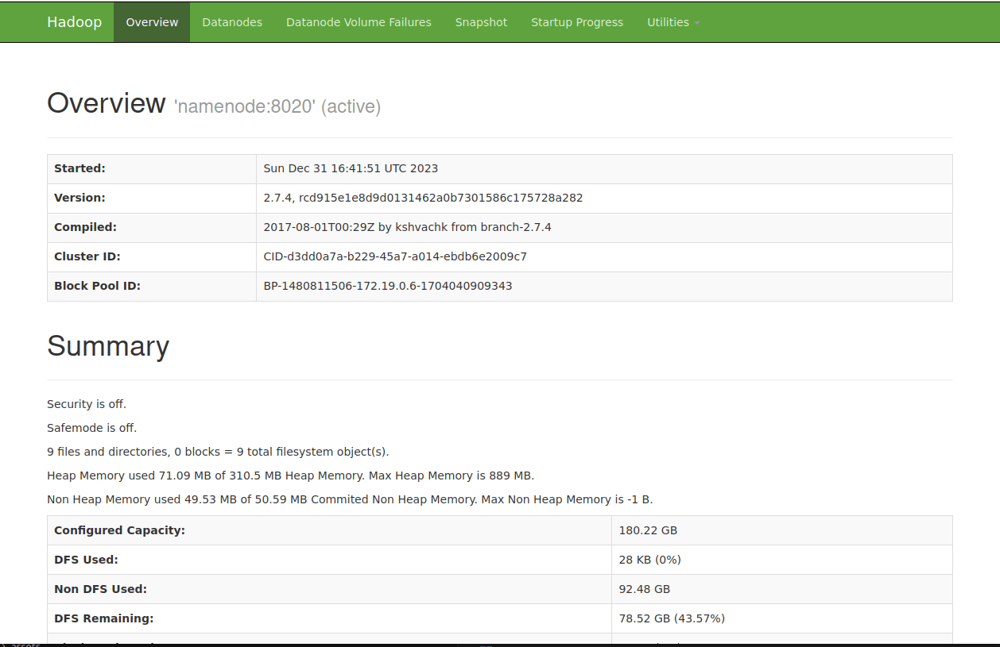

BDE typically stands for "Big Data Europe," which was a project funded by the European Commission under the Horizon 2020 program. The Big Data Europe project aimed to support the adoption of big data technologies across various industries and sectors by providing tools, methods, and infrastructure to handle large-scale data processing.

As part of the project, Docker images were created to simplify the deployment of big data technologies, including Apache Hadoop and Apache Hive. These Docker images are often prefixed with "bde" to indicate their association with the Big Data Europe project.

## Install and run Hadoop & Hive

##### 1. Download files docker-compose 

Download files `docker-compose.yml` and `hadoop-hive.env`  here : https://github.com/big-data-europe/docker-hive

```docker
version: "3"

services:
  namenode:
    image: bde2020/hadoop-namenode:2.0.0-hadoop2.7.4-java8
    volumes:
      - /home/lionel/docker/data/hadoop-dive/namenode:/hadoop/dfs/name
    environment:
      - CLUSTER_NAME=test
    env_file:
      - ./hadoop-hive.env
    ports:
      - "50070:50070"
  datanode:
    image: bde2020/hadoop-datanode:2.0.0-hadoop2.7.4-java8
    volumes:
      - /home/lionel/docker/data/hadoop-dive/datanode:/hadoop/dfs/data
    env_file:
      - ./hadoop-hive.env
    environment:
      SERVICE_PRECONDITION: "namenode:50070"
    ports:
      - "50075:50075"
  hive-server:
    image: bde2020/hive:2.3.2-postgresql-metastore
    volumes:
      - /home/lionel/docker/data/hadoop-dive/my-data:/my-data
    env_file:
      - ./hadoop-hive.env
    environment:
      HIVE_CORE_CONF_javax_jdo_option_ConnectionURL: "jdbc:postgresql://hive-metastore/metastore"
      SERVICE_PRECONDITION: "hive-metastore:9083"
    ports:
      - "10000:10000"
  hive-metastore:
    image: bde2020/hive:2.3.2-postgresql-metastore
    env_file:
      - ./hadoop-hive.env
    command: /opt/hive/bin/hive --service metastore
    environment:
      SERVICE_PRECONDITION: "namenode:50070 datanode:50075 hive-metastore-postgresql:5432"
    ports:
      - "9083:9083"
  hive-metastore-postgresql:
    image: bde2020/hive-metastore-postgresql:2.3.0
  presto-coordinator:
    image: shawnzhu/prestodb:0.181
    ports:
      - "8080:8080"
```

##### 2. Run docker-compose

```bash
docker-compose up -d
```

##### 3. Connect to Hadoop web interface

[http://localhost:50070](http://localhost:50070)

> 

