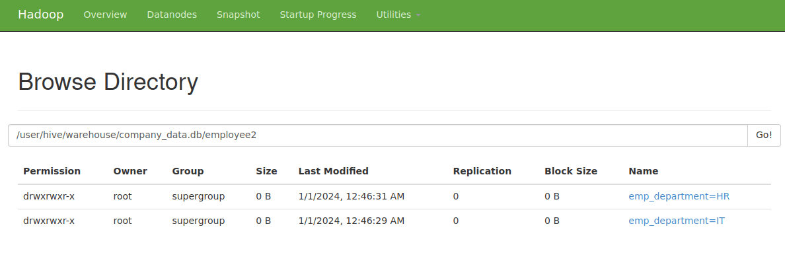

## Installation

Please refer to [Install Hive with Docker](../01-docker-install/)


## Create a new database with Employee table

#### Execute a Bash shell inside the 'hive-server' container.

```bash
docker-compose exec hive-server bash
$ /opt/hive/bin/beeline -u jdbc:hive2://localhost:10000
...
Beeline version 2.3.2 by Apache Hive
0: jdbc:hive2://localhost:10000> 

```

#### Create new database and table

```bash
0: jdbc:hive2://localhost:10000> CREATE DATABASE IF NOT EXISTS company_data;
0: jdbc:hive2://localhost:10000> USE company_data;
0: jdbc:hive2://localhost:10000> show tables
+----------------+
| database_name  |
+----------------+
| company_data   |
| default        |
+----------------+
```


```SQL
-- Create a New Database
CREATE DATABASE IF NOT EXISTS company_data;

-- Switch to the New Database
USE company_data;

-- Create an Employee Table in the New Database
CREATE TABLE employee (
    emp_id INT,
    emp_name STRING,
    emp_salary DOUBLE,
    emp_department STRING
);

-- Insert Data into the Employee Table
INSERT INTO employee VALUES
    (1, 'John Doe', 50000.0, 'IT'),
    (2, 'Jane Smith', 60000.0, 'HR'),
    (3, 'Bob Johnson', 55000.0, 'Finance'),
    (4, 'Alice Brown', 70000.0, 'IT'),
    (5, 'Charlie Davis', 48000.0, 'Marketing');

-- Query the Employee Table in the Current Database
SELECT * FROM employee;

```

#### Create Partitions

```sql
-- Création de la table avec une partition par département
CREATE TABLE employee2 (
    emp_id INT,
    emp_name STRING,
    emp_salary DOUBLE
)
PARTITIONED BY (emp_department STRING);

-- Insertion de données dans la table avec spécification de la partition
INSERT INTO TABLE employee2 PARTITION (emp_department='IT') VALUES
    (1, 'John Doe', 50000.0),
    (4, 'Alice Brown', 70000.0);

INSERT INTO TABLE employee2 PARTITION (emp_department='HR') VALUES
    (2, 'Jane Smith', 60000.0);

```

This will create a directory structure in the Hadoop file system, where each department will have its own subdirectory under the main directory of the table. This enables optimization of queries that filter or aggregate data based on the department.

> 

#### Other commands

```bash
# copy file in hdfs
hadoop fs -copyFromLocal localfile.csv /user/hadoop/hdfspath/
```

```bash
-- If the file is on HDFS
LOAD DATA INPATH '/path/to/yourfile.csv' INTO TABLE your_table;

-- If the file is on the local file system (not recommended for large files)
LOAD DATA LOCAL INPATH '/path/to/yourfile.csv' INTO TABLE your_table;
```