## Datalake is not enough

In recent years, most companies have chosen to store their data, whether structured or not, in data lakes due to their cost-effective storage. According to some sources at Databricks, around 90% of enterprise data resides in data lakes. 

### Data swamp

For various reasons, such as a lack of governance, poor metadata management, and inadequate data quality performance, data lakes often transform into a [data swamp](../from-bigdata-to-lakehouse/#04-data-swamp), making both the data lake and the stored data unusable.

{}
In his book "[Building the Data Lakehouse](https://www.databricks.com/resources/ebook/building-the-data-lakehouse)", Bill Inmon, widely recognized as the pioneer of data warehousing, explains that for meaningful analysis, a data lake needs to meet **two crucial conditions**:
1. The data must be related to each other.
2. The data must be organized within a structured analytical infrastructure designed to be accessible to end-users.

Unless these two conditions are satisfied, the data lake is at risk of becoming a data swamp.
{}

### Data Lake limitations

#### Reliability

In data management, maintaining reliability is challenging
- Adding data to evolving schemas and performing updates or deletions are complex tasks that often require manual correction, especially following job failures. 
- Combining streaming with batch processing is tricky as it can lead to misinterpretations by processing engines like Spark. 
- Furthermore, ensuring traceability and safe concurrent modifications across multiple partitions by various jobs is difficult, risking data integrity and consistency. Efficient systems must manage these aspects to prevent reliability issues.

#### Security and privacy

Data lakes often have underdeveloped data access security layers, which can lead to over-provisioning of access. This poses significant risks of security and privacy breaches, as well as non-compliance with regulatory standards.

#### Accessibility and physical layout

Navigating a data lake's structure can be cumbersome. Users must often grasp the table's physical layout, particularly when data is partitioned into directories by time frames, such as months. Moreover, overly strict compliance and governance can restrict user access to critical data, hampering the flexibility and utility of the data lake, and potentially impeding business innovation.

#### Performance

Performance issues in data lakes stem primarily from the management of metadata and the increase in partitions and files as data scales to petabyte size.

Specifically, streaming can lead to many small files, where the time to open these files may exceed query execution time, causing bottlenecks. Moreover, partition management can be ineffective, particularly with unique identifiers that don't partition well, affecting throughput and latency in large-scale BI environments.

Attempts to optimize costs by using slower, cheaper storage can result in high-latency queries. The choice of file and table formats, paired with the query engine, is crucial, as poor combinations can significantly slow down performance. Directory-based operations, like listings and opening files, also tend to be sluggish, adding to the inefficiency.

### Data Warehouses, rescuing Data Lakes

#### Business need data warehouse even with a data lake...

Initially, the idea was to process this data, perform ETL operations, implement machine learning models, and enable self-service data exploration, directly in the data lake. However, because of the limitations we've seen above, to deliver projects to end users, it became necessary to copy this data (via ETL processes) :
- OLTP systems, which are operational databases running applications, host the original data
- ETLs processes transfer data to the data lake, serving as a repository for diverse data formats (object storage, HDFS)
- ETLs transfer data from the lake into the data warehouse for analysis
- The data within the data warehouse is often in a proprietary format, making it challenging to understand its structure, with vendor lock effect and an expensive cost

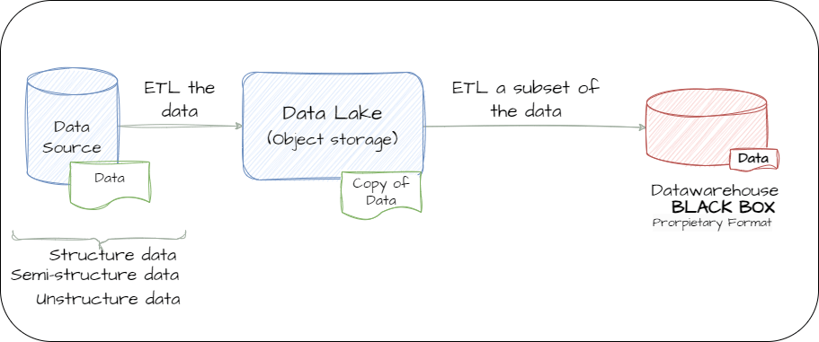

#### Data Lake infrastructure complexity

 Often, there are **multiple copies** of data because each operational unit may have its own data lake. Moreover, data scientists who draw from data lakes often create results from their work that must be integrated into data warehouses.

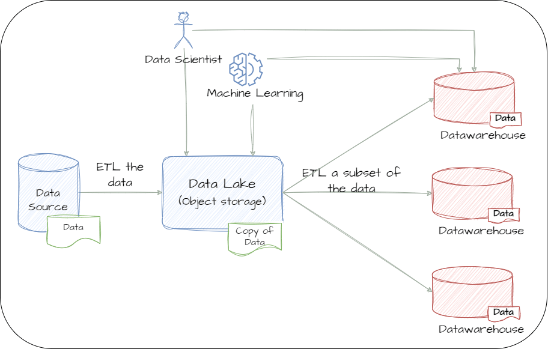

This entire process introduces complexities such as security management and synchronization between different systems. This situation creates genuine complexity and silos, leading to high costs for companies in terms of infrastructure, tools, and human resources.

## Table Format, The Central Pillar of the Lakehouse

In a lakehouse model, the conventional ELT process into a data warehouse is replaced by structuring data in an open table format, utilizing technologies like **Apache Iceberg** or **Apache Delta Lake**. 

This strategy allows for the execution of data warehouse-like workloads, combining the speed and efficiency of a data warehouse with the direct operation on a data lake, thereby reducing the need for maintaining multiple data copies. Tools such as **Dremio SQL Engine**, **Spark**, or **Flink** can seamlessly integrate with the data lake under this setup.

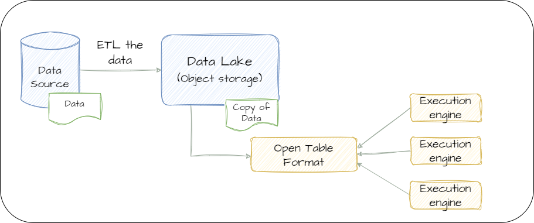

Benefits of a data lakehouse include cost-effectiveness, as data lakes are inexpensive. The open data format tables provide data warehouse-like performance and features directly on the data lake. This approach avoids vendor lock-in, as the open format allows the use of current and future tools and SQL engines.

### Understanding what is a table format

#### Accessing the data in a warehouse-like way

When we store data in a database or data warehouse, the underlying organization, optimization, and access methods for this data are often opaque to us. Our interaction is primarily through executing SQL queries on tables, without needing to understand the internal data management.

In the context of a data lake, a single dataset might be distributed across numerous files, potentially ranging from thousands to hundreds of thousands. This is common, for instance, with [Parquet](../parquet/) files stored in object storage on a cloud platform. The challenge arises in understanding how to treat these dispersed files as a cohesive dataset or a single table for analytical operations. This is a typical issue encountered when working with MapReduce and a Hadoop HDFS cluster, where identifying and operating on distributed data sets becomes complex.

#### Hive, Pioneering Simplicity in Data Lake Complexity

[Apache Hive](../hadoop/#hive--simplifier-lanalyse-des-données-avec-le-langage-sql) was developed as a solution to simplify data analysis. Rather than writing complex algorithms, users can write SQL queries. Hive translates these SQL statements into MapReduce scripts.

To facilitate this, Hive adopts a directory-based approach for recognizing tables. Essentially, a folder and all its files represent a table, with subfolders acting as partitions.

Hive has become something of an industry standard because it enables users to handle data lake content as they would in a traditional database or data warehouse. Its key advantages include efficient query processing by scanning only relevant data partitions, compatibility with various file formats, the ability to perform atomic updates on entire partitions (like updating all data for a specific month), and providing clear insights into the contents of a table.

#### Hive limitations 

Despite its benefits, Hive faces several challenges, including inefficiency in handling small updates, lack of a safe method for modifying data across multiple partitions (which risks data inconsistency during concurrent queries), difficulties in safely managing simultaneous updates from multiple jobs, and time-consuming directory-based operations like file listings and access.

#### Phisical layout and partitioning should be hidden 

The biggest issue is that users must understand the physical layout of the table. Data partitioning involves dividing the dataset into subdirectories, often based on time periods like months. 

> For instance, to query data within a specific period, it's insufficient to select based on a timestamp alone. Users must also apply filters for the derived columns, like 'month' and 'year,' making what should be a straightforward query into a more complex operation. This nuanced querying can become a barrier to efficient data utilization.

### Iceberg starting point at Netflix

[Apache Iceberg](https://iceberg.apache.org/) is a high-performance format designed originally by Netflix for handling extensive analytical tables in big data environments. It brings the reliability and simplicity of SQL tables to large datasets, making it compatible with various data processing engines like Spark, Trino, Flink, Presto, Hive, and Impala, allowing them to work simultaneously with the same tables.

##### Ensure Data Correctness and Consistency with ACID Transactions

Apache Iceberg was specifically crafted to ensure the correctness and consistency of data by providing support for ACID (Atomicity, Consistency, Isolation, Durability) transactions. This robustness ensures data reliability even in multi-user and concurrent access scenarios.

##### Enhance Query Performance
Iceberg significantly improves query performance through optimized query planning and execution. Users can retrieve results more rapidly, particularly when handling extensive analytical workloads.

##### Facilitate Table and Schema Evolutions
Iceberg enables seamless table and schema evolutions, eliminating the need for resource-intensive batch processes to reprocess data. This flexibility allows users to adapt data structures without disruptions.

##### Simplify Table Management
By abstracting the physical layout of data, Iceberg simplifies the operation and maintenance of tables. Users can focus on their data and analytics tasks without the complexity of managing intricate physical data lake structures.

##### Scale with Confidence
Iceberg's design ensures that all of these features can be applied at scale. It remains a reliable choice for efficiently managing datasets of various sizes, maintaining its capabilities and benefits regardless of the dataset's scale.

### Iceberg format 

Iceberg is a Table Format Specification, that means that Iceberg defines how data is organized in tables. The [Iceberg Table Spec](https://iceberg.apache.org/spec/) clearly explain the structure of the format.

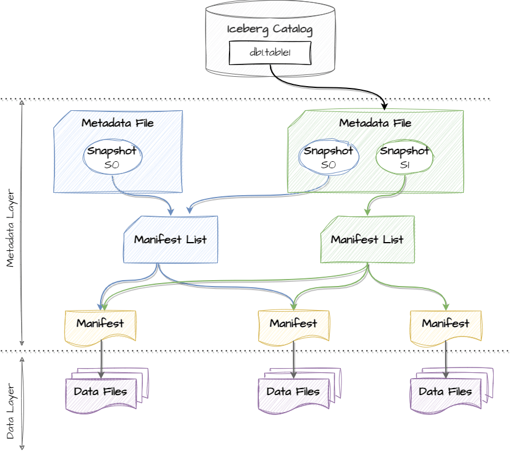

- **Snapshot** : An important concept is the concept of snapshot that represents a consistent view of the table at a specific point in time. It's essentially a snapshot of the table's metadata and manifest files at a particular version. Snapshots are fundamental for enabling **time travel** queries and ensuring data consistency.
- **Fully Open Format**: The format is fully open, meaning any engine that wants to read or write an Iceberg table adheres to this open specification, ensuring accessibility.
- **APIs and Libraries**: To facilitate data access, Iceberg provides APIs and libraries, including a [Java API](https://iceberg.apache.org/docs/latest/api/) and Python support with [PyIceberg](https://py.iceberg.apache.org/).
- **Integrations**: The Iceberg project offers integrations with tools like Flink and Spark.

#### Apache iceberg is not a storage neither an execution engine

Apache Iceberg is not a storage or execution engine but integrates smoothly with storage systems like Hadoop HDFS and object storage (e.g., AWS S3), as well as execution engines like Apache Spark and Apache Flink.

#### Design benefits

1. Efficient Updates: Changes at the file level, not directory level, enable smaller updates.
2. Snapshot Creation: Changes trigger snapshot creation, supporting concurrent writes and atomicity.
3. Faster Querying: Metadata aids query planning, and column stats improve query execution.
4. Abstracting Physical Layer: Hidden partitioning, compaction tools, and schema/partition evolution.
5. Rich Schema Evolution: Easily modify column names, types, add, or drop columns.
6. Real-time Data: Always read from the newest snapshot for immediate changes.

## Building a lake house

### Lake house foundation layers

In a modern data lake analytics architecture, several key components define its structure

#### 1. Commodity Storage and Compute
Contemporary data lakes are frequently constructed using cloud platforms that offer readily available storage and computational resources. Notable examples include Amazon S3 (Simple Storage Service) and Elastic Compute Cloud (EC2) within the AWS ecosystem, or Azure Blob Storage. These resources deliver the ability to scale, cost-efficiency, and resilient storage and computational capabilities, all of which are essential for accommodating the storage and processing demands of extensive datasets

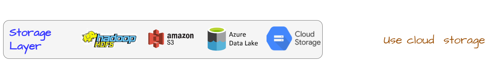

#### 2. Open File Formats
In terms of file formats, it's essential to store data in open formats optimized for analytics. A typical choice is Apache Parquet files, known for their columnar format, which optimizes storage and query performance. But company also frequently use Avro or Apache ORC.

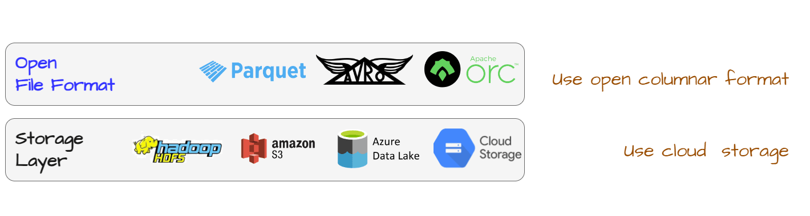

#### 3. Open Table Formats

Contemporary data lakes prioritize improved data accessibility and compatibility through the adoption of advanced table formats, building upon open file formats like Iceberg, Delta Lake, and Hudi. These formats introduce an array of features, encompassing schema evolution, transactional consistency, adherence to ACID (Atomicity, Consistency, Isolation, Durability) principles, and the facilitation of time travel capabilities. 

These improvements notably enhance the efficiency, data quality, and simplify data processing and analytics workflows.

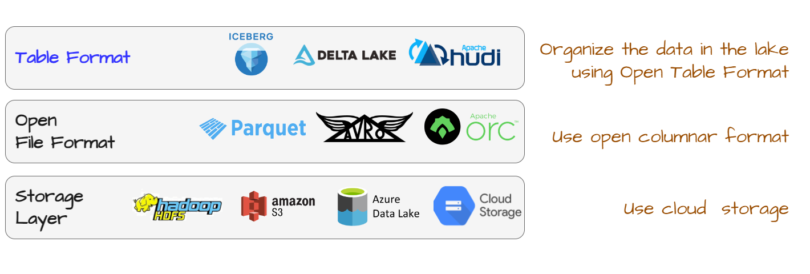

#### 4. High-Performance and Scalable Query Engine

A crucial component of a modern data lake is a high-performance, scalable query engine such as Apache Spark and Trino. This engine executes queries efficiently on large datasets within the data lake using distributed processing methods, enabling parallel execution across a cluster of machines, which in turn streamlines data retrieval and analysis.

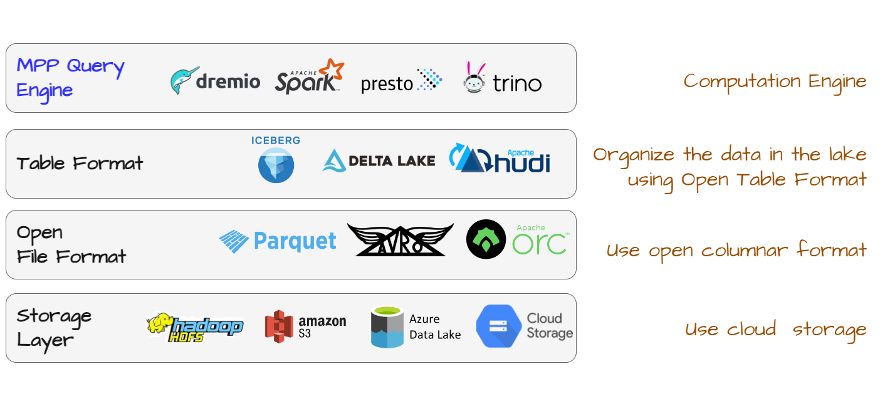

### Others Layers

#### Data Pipeline

A data pipeline moves data between systems. Data pipelines involve a series of data processing steps to move data from source to target.
The construction of these pipelines, **data engineers** use dedicated frameworks when addressing data processing. 

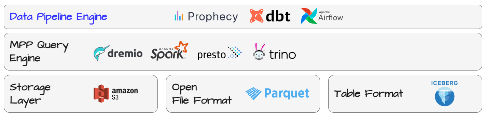

In the open-source world, there are tools such as DBT and Delta Live Table, Airflows which allow the construction of ETLs in a way that:
- Preserves the lineage (traceability) of the data,
- Operates them in a simple manner,
- Implements retry mechanisms in case of errors,
- Integrates data quality and consistency rules,
- Documents and makes it easy to discover the different tables.

#### BI Capabilities

The first use case concerns Business Intelligence (BI), and the question is how to connect these BI tools. Generally, JDBC connectors are preferred, a classic approach used by platforms such as PowerBI, Tableau, or Qlik, allowing direct querying of the data.

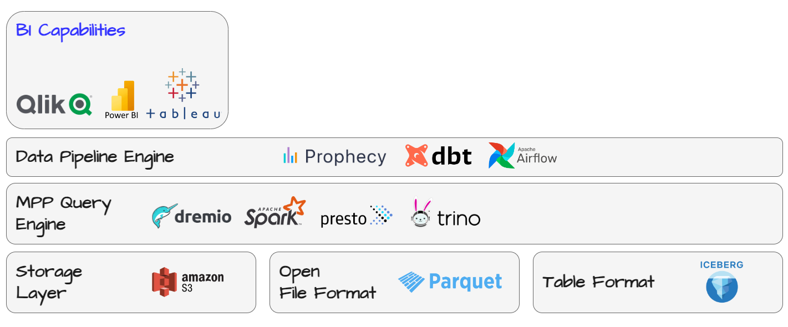

Previously, this posed major difficulties because the performance of the engines did not allow for a satisfactory user experience. Now, with efficient engine like Spark, low latency and high concurrency can be achieved directly on top of the data stored in the data lake, without having to copy and send them back to another data warehouse system for use.

#### Data Science worksapace / Notebooks 

Data scientists require a high-performance workspace equipped with tools like Jupyter notebooks, which are essential for ensuring reproducibility in their work. 

The overarching goal is to promote collaboration between data engineers, data scientists, and analysts within the same environment. This collaborative workspace is crucial, as it allows professionals from different backgrounds to develop in programming languages that are most relevant to their work. 

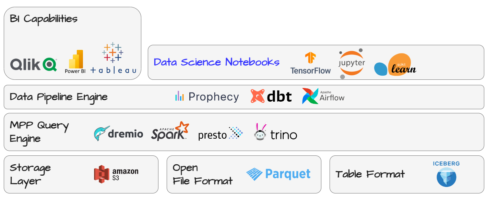

Additionally, the environment should support a robust code versioning system (Git), which is vital for maintaining the integrity and evolution of the code over time. 

Moreover, the workspace should provide access to a wide range of libraries that cater to specific needs in data science and machine learning, such as TensorFlow, Keras, PyTorch, XGBoost, and others. This setup not only fosters an environment of collaboration but also ensures that each professional can work with the best tools suited for their specific tasks, leading to more efficient and innovative outcomes in data-driven projects.

#### Machine learning lifecycles 

When addressing machine learning, it is crucial to ensure that projects can be industrialized in a straightforward manner. It is necessary to be able to scale up in terms of the number of projects, not just from the standpoint of performance scalability. 

A key question is: How can we manage the governance of these machine learning projects? How can we ensure proper tracking of various experiments and the different models deployed in production? 

This is where tools like MLFlow (or Kubeflow) come into play.

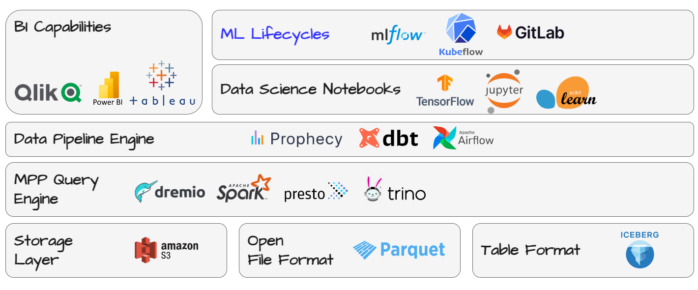

#### Governance, Lineage & Security

The final part focuses on governance, which is crucial for cataloging information, observing all aspects of lineage, and applying all necessary security rules.

Effective governance in a data environment involves managing the metadata, ensuring quality and lineage of the data, and enforcing security and compliance standards, which is key to maintaining the integrity, confidentiality, and reliability of data assets in any organization

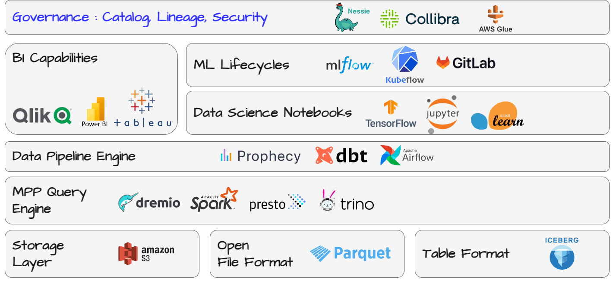

- Cataloging Information involves creating a comprehensive inventory of all data assets in the organization. Tools like Apache Atlas, Apache Nessie, AWS glue catalog or Collibra are used to categorize and index data, making it easily searchable and accessible, helping in understanding what data exists, where it's located, and how it's used.
- Lineage Tracking is essential for tracing how data is transformed, combined, and utilized across different stages of the data pipeline. This is vital for data quality, reproducibility, and compliance purposes. Tools like Apache Atlas, Informatica, and Talend provide robust lineage tracking features.
- Security Rules and Compliance ensure that data is accessed and processed securely, in compliance with organizational policies and regulatory requirements. This includes implementing access controls, encryption, and auditing

#### Sources

- Bill Inmon book - https://www.databricks.com/resources/ebook/building-the-data-lakehouse 
- Dremio Apache Iceberg 101 - https://www.youtube.com/playlist?list=PL-gIUf9e9CCskP6wP-NKRU9VhofMHYjcd
- Databriks @ Devoxxhttps://www.youtube.com/watch?v=YK_tli-jDPs
- Starbust - A data lake is a centralized repository - https://www.starburst.io/learn/data-fundamentals/data-lake/