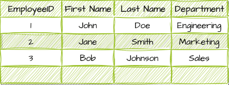
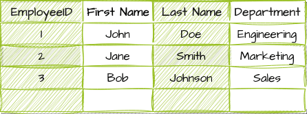
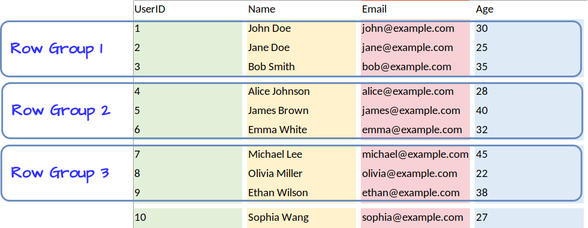
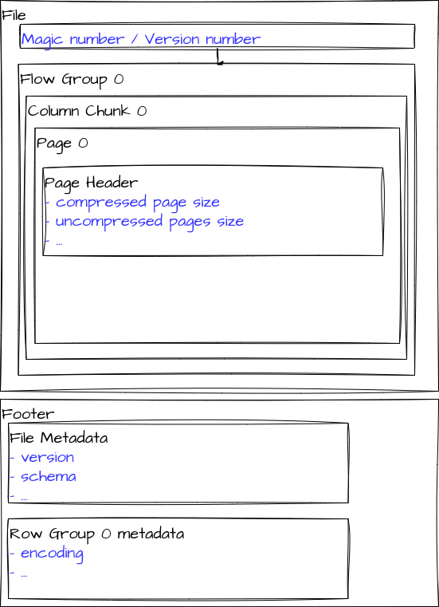

---
title: "Apache Parquet"
tags: [Architecture, Data, Lakehouse, Hadoop]
date: 2023-12-28
categories: [English]
type: docs
weight: 30

---

## Row-Based vs. Column-Based Storage

Data storage plays a crucial role in the world of databases and data processing. One fundamental distinction lies in how data is organized within the storage system, and this can be broadly categorized into row-based and column-based storage. In this blog post, we'll explore the key differences between these two storage approaches.

### Row-Based Storage

In row-based storage, data is organized and stored row by row. Each record, consisting of multiple columns, is stored together as a single unit. 

Let's illustrate this with an example of a hypothetical "Employee" table:




Data is stored line by line :
- | 1          | John      | Doe      | Engineering  |
- | 2          | Jane      | Smith    | Marketing    |
- | 3          | Bob       | Johnson  | Sales         |

#### Characteristics of Row-Based Storage:

- **Sequential Access:** Reading an entire row at a time is efficient.
- **Transaction Processing:** Suited for transactional systems where the whole record is frequently updated.
- **Memory Usage:** May be less efficient for analytics as it tends to load entire rows into memory.
- **Usage:**
  - Best suited for transactional databases.
  - Efficient for OLTP (Online Transaction Processing) systems where individual records are frequently updated.

### Column-Based Storage

In column-based storage, data is organized and stored column by column. Each column, containing data from multiple records, is stored together. 


Here's an example of the same "Employee" table stored in a columnar format:




Data is stored column by column:
- | 1 | 2 | 3 |
- | John | Jane | Bob |
- | Doe | Smith | Johnson |
- | Engineering | Marketing | Sales |

#### Characteristics of Column-Based Storage

- **Analytical Processing:** Suited for analytics as it allows for efficient querying of specific columns without loading unnecessary data.
- **Aggregation:** Well-suited for operations like sum, average, or other aggregations.
- **Compression:** Can achieve high compression ratios as similar data is stored together (in a column, you will find same values multiple times)
- **Usage:**
  - Ideal for data warehouses and analytical databases.
  - Well-suited for OLAP (Online Analytical Processing) systems where analytics and aggregations are common.

## Apache Parquet: A Columnar Storage Format

Apache Parquet is an open-source columnar storage format designed for efficient storage and processing of big data. It has gained popularity in the big data ecosystem, especially in conjunction with processing frameworks like Apache Spark and Apache Hive

### Row groups


One key optimization in the Parquet format is the concept of "**row group**" :
- A row group is a unit of data storage within a Parquet file. It represents a set of contiguous rows within each column.
- Rows within a row group are physically stored together, facilitating efficient compression and encoding for that subset of data.
- Benefits:
  - **Parallel Processing:** Row groups enable parallel processing of data, as different row groups can be read simultaneously.
  - **Optimized I/O Operations:** By organizing data into row groups, Parquet minimizes I/O operations when reading specific portions of the dataset.





### Column Chunks

Within each row group, columns are further divided into column chunks.
- A column chunk is a contiguous set of values for a specific column within a row group.
- It represents the columnar storage format in Parquet.
- Each column chunk has its own metadata, including encoding and compression information.


###  Pages:

Column chunks are composed of pages, which are the basic unit of storage within a column:
- A page represents a portion of a column's data within a column chunk.
- Different pages within a column chunk may use different encodings or compression schemes.
- Pages enable efficient reading of specific segments of a column, contributing to query performance.

**Row groups**, **column chunks**, and **pages** work together to structure and optimize the storage and retrieval of data in the Parquet format. The hierarchy ensures efficient parallel processing, storage optimization, and improved query performance, making Parquet well-suited for analytics workloads.


## Predicate and Projection Pushdown

When working with big data systems and databases, "predicate pushdown" and "projection pushdown" concepts play a crucial role in optimizing data queries and improving performance


### What are Predicate and Projection?

- **Predicate:** In the world of databases, a predicate is a condition or criteria used to filter data. For example, if you want to retrieve only the rows where the "status" column is equal to "completed," the condition "status = 'completed'" is your predicate.

- **Projection:** Projection, on the other hand, is about selecting specific columns from a table rather than retrieving all of them. It's like choosing which pieces of information you want from a dataset.

```SQL
SELECT FirstName, LastName
FROM Employee
WHERE Department = 'Sales';
```

In this query, we have both projection and predicate:
- The projection (`SELECT FirstName, LastName`) specifies the desired columns, 
- and the predicate (`WHERE Department = 'Sales'`) filters the rows based on the specified condition. 


### Pushdown: Optimizing Queries

Pushdown is all about moving operations as close to the data as possible, reducing the amount of data that needs to be processed elsewhere. When we talk about predicate and projection pushdown, we mean pushing the filtering and selecting operations closer to the source of the data.

### Predicate Pushdown

Imagine you have a massive dataset, and you want to retrieve only the rows where the "date" column is after January 1, 2023. Instead of fetching all the data and then filtering it in your application, predicate pushdown allows the query engine to push the condition "date > '2023-01-01'" directly to the data source.

> Benefits of Predicate Pushdown:
> - Reduces the amount of data transferred.
> - Saves processing time by filtering data at the source.

### Projection Pushdown

Now, let's say you have a dataset with many columns, but you're only interested in the "name" and "price" columns. Instead of pulling all the columns and then discarding the ones you don't need, projection pushdown allows the query engine to request only the specified columns from the data source.

> Benefits of Projection Pushdown:
> - Minimizes data transfer by fetching only the necessary columns.
> - Optimizes query performance by reducing the volume of data processed.

### Parquet Projection & Predicate Pushdowns

When you combine predicate and projection pushdown, you're telling your query engine to be smart about fetching and processing data. It's like sending a tailored request to the data source, saying, **"Give me only what I need, and filter it before sending."**

In Parquet, the ingenious organization of data into row groups, column chunks, and pages sets the stage for highly efficient projection and predicate pushdowns. 

Projection pushdown is seamlessly achieved due to the columnar storage layout, where each column is independently stored within a column chunk. This allows query engines to selectively read only the relevant columns, minimizing unnecessary I/O operations. 

Simultaneously, predicate pushdown leverages the characteristics of row groups and pages. Since row groups encapsulate data with similar attributes, the query engine can skip entire row groups that don't meet the predicate conditions. Furthermore, the division of column chunks into pages allows for targeted reading of specific segments within a column, reducing the amount of data that needs to be processed. 

These structural elements in the Parquet format not only optimizes storage but fundamentally empowers query engines to intelligently and selectively fetch the data required for analytical queries, resulting in substantial performance improvements.


## Parquet metadata 

There are three types of metadata: 
- file metadata, 
- column (chunk) metadata 
- page header metadata.





- File Metadata
  - Contains high-level information about the Parquet file, such as the schema, version, and compression settings.
  - Enables quick inspection of the file's overall structure without parsing the entire data.
- Column Metadata
  - Specific to each column within a Row Group.
  - Includes information like column name, data type, encoding used, and statistics.
  - Enables efficient column pruning and optimization during query execution.

### Schema Evolution

- Parquet supports schema evolution, allowing for changes to the schema over time without requiring modification of existing data files.
- New columns can be added, and existing columns can be renamed or have their data types changed.

### Statistics

- Per-column statistics provide valuable insights into the data distribution and characteristics.
- Statistics include min and max values, null counts, and other metrics.
- Aid in query optimization by allowing engines to skip irrelevant data during execution.

### Compression Information

- Metadata includes details about the compression algorithms applied to each column.
- Different columns may use different compression methods based on their data characteristics.

### Compatibility

- Parquet metadata ensures compatibility across different systems and tools that support the Parquet format.
- Users can rely on consistent metadata interpretation across various analytics platforms.

### Optimization Opportunities

- The metadata structure enables optimization opportunities such as predicate pushdown and efficient query planning.
- Engines can leverage metadata to make informed decisions about which data to read and which columns to skip.

## Conclusion - Parquet Advantages

#### Storage Efficiency
Parquet's columnar storage minimizes storage space by compressing and encoding similar data values together. This compression is particularly effective for analytics workloads where only a subset of columns is frequently accessed.

#### Query Performance
Reading a subset of columns is a common pattern in analytical queries. Parquet's columnar storage allows for efficient reading of only the necessary columns, resulting in improved query performance.

#### Compatibility
Parquet is designed to be compatible with a variety of big data processing frameworks, including Apache Spark, Apache Hive, Apache Impala, and others. This makes it a versatile choice for different data processing environments.

#### Schema Evolution
Parquet supports schema evolution, allowing users to add or remove columns without requiring modifications to existing data. This flexibility is crucial for evolving data structures over time.

#### Cross-Language Support
Parquet supports multiple programming languages, making it accessible to a broad range of users. It is not limited to a specific language, enabling seamless integration into diverse data processing workflows.


#### Sources
- https://parquet.apache.org/docs/
- https://blog.ippon.fr/2020/02/24/de-limportance-du-format-de-donnees-theorie/
- https://data-mozart.com/parquet-file-format-everything-you-need-to-know/
- https://blog.ippon.fr/2020/03/02/de-limportance-du-format-de-la-donnee-pratique-partie-2-2/
