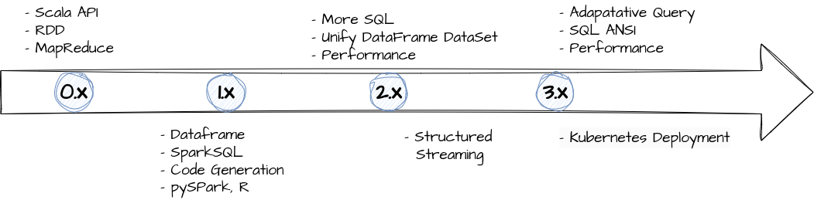
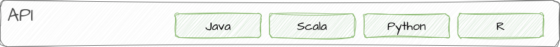
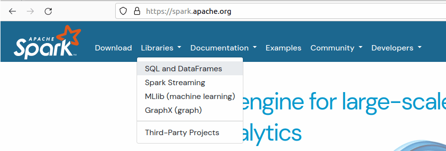
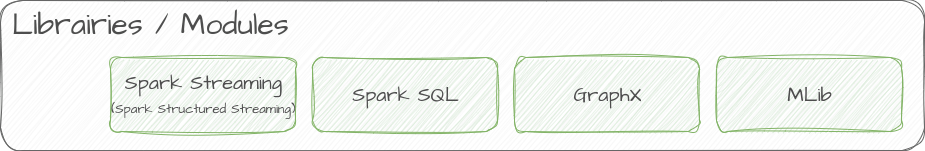
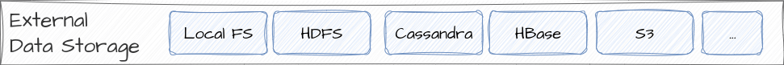
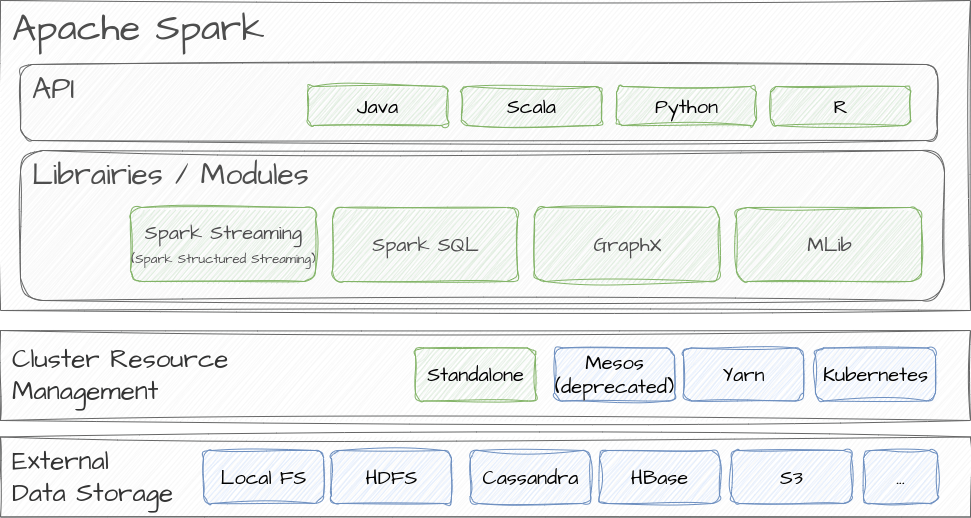
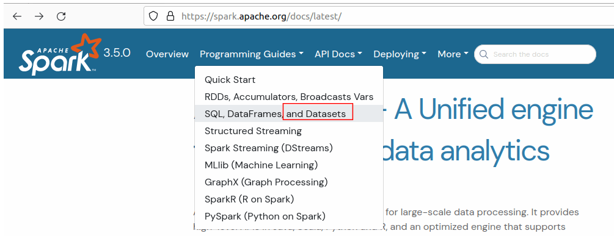

---
title: "Apache Spark"
tags: [Architecture, Data, Lakehouse, Hadoop]
date: 2024-01-02
categories: [English]
type: docs
weight: 20

---

## What is Spark in a Nutshell?

> Apache Spark™ is a multi-language engine for executing data engineering, data science, and machine learning on single-node machines or clusters (self-definition from [Apache Spak website](https://spark.apache.org/))

Apache Spark is an open-source, distributed computing system that has emerged as a powerful tool for processing large-scale data sets. Designed to overcome the limitations of traditional data processing frameworks, Spark is renowned for its speed, ease of use, and versatility ("polyvalence" in French). It facilitates the analysis of vast amounts of data in a distributed and fault-tolerant manner, making it a preferred choice for many big data analytics.

#### Key features

|Feature|Description|
|--|--|
|Batch/streaming data|Effortlessly integrate batch and real-time streaming data processing into a unified workflow. Using Python, SQL, Scala, Java or R as language|
|SQL analytics|Run fast, distributed ANSI SQL queries for creating dashboards and reports. Runs faster than most data warehouses|
|Data science at scale|Conduct Exploratory Data Analysis (EDA) on massive petabyte-scale datasets without the need for downsampling|
|Machine learning|Train machine learning algorithms on a laptop and use the same code to scale to fault-tolerant clusters of thousands of machines.|

More details on [Apache Spak website](https://spark.apache.org/)

## Why Spark: A Brief History

In the realm of big data processing, traditional tools faced challenges in handling massive datasets efficiently. Hadoop's MapReduce framework emerged as a solution, but its batch processing nature posed limitations for real-time analytics. Enter Apache Spark, conceived in response to the shortcomings of MapReduce. 

Spark introduced Resilient Distributed Datasets (RDDs), a fault-tolerant data structure, and leveraged in-memory processing to significantly boost performance. This innovation marked the beginning of a new era in big data processing.

#### Significant dates

- Spark was conceived in 2009 by Matei Zaharia, originally developed to accelerate processing in Hadoop systems (compared to MapReduce)
- In 2013, Spark was handed over to the Apache Foundation, becoming one of its most active projects.
- In 2014, Spark achieved a significant milestone by winning the Daytona GraySort Contest, a competition to sort 100 terabytes of data as quickly as possible
- Today, contributions to Spark's development come from around 200 different companies (Intel, Facebook, IBM, Netflix...)

More detail in [wikipedia](https://fr.wikipedia.org/wiki/Apache_Spark).

#### Features and vision evolution

- **Spark 0.x** : The early stages of Spark marked a significant advancement with a framework exclusively based on Scala and MapReduce APIs, surpassing the limitations of Hadoop. Despite an application at a higher level, the use of RDDs remained intricate, requiring advanced manipulation.
- **Spark 1.x** : The transition to Spark 1.x introduced DataFrames with bindings to Python and integration of generated SQL, reducing dependence on RDDs and simplifying programming in MapReduce.
- **Spark 2.x** : Version 2 of Spark unified the framework with the introduction of DataFrame APIs and full SQL integration, further facilitating the data transformation process.
- **Spark 3.x** : In Spark 3.x, the transition for data scientists from pandas to Spark was initially hindered by Scala's orientation. To address this, the Koalas framework, originally developed by Databricks, was integrated into Spark 3.2. Koalas is now an integral part of PySpark, enabling users to reuse existing code and simplifying the transition to a distributed environment. Spark 3.x also introduced notable improvements such as Adaptive Query Tuning, Kubernetes deployment, and SQL ANSI compliance, streamlining the framework's usage to a higher level.

More details in this [French Devoxxed conference](https://www.youtube.com/watch?v=YK_tli-jDPs).

## Spark Components: An Overview

### Spark Core

Apache Spark is a unified analytics engine for large-scale data processing. It provides 
- high-level programming APIs in Scala (native language), Java, Python and R 
- and an optimized engine that supports **general execution graphs**.

> The terms "general execution graphs", is likely because Spark uses a Directed Acyclic Graph (DAG) engine to represent the jobs that run on it in opposition to Hadoop Map-Reduce jobs that only have two few discrete stages (Map, Shuffle, Reduce, Summarize)

### Spark Librairies/Modules

You can find Spark libraries from [Spark website](https://spark.apache.org/) through the "Libraries menu"

Below a brief summary of the 4 libraries.




Spark SQL provides a programming interface for structured data using SQL queries. It introduces DataFrames and Datasets, allowing users to seamlessly blend SQL queries with Spark programs, making data manipulation more intuitive.

Spark SQL not only supports the <a href="https://cwiki.apache.org/confluence/display/Hive/LanguageManual">HiveQL</a> syntax but also integrates with <a href="https://cwiki.apache.org/confluence/display/hive/serde"> Hive SerDes</a>  and <a href="https://cwiki.apache.org/confluence/display/Hive/LanguageManual+UDF">UDFs</a>, allowing you to effortlessly tap into existing Hive warehouses. 



For real-time data processing, Spark Streaming allows the ingestion and processing of live data streams. This component is crucial for applications requiring low-latency processing, such as fraud detection and monitoring.





Spark's MLlib is a comprehensive machine learning library that supports various algorithms and tools for scalable machine learning. It caters to diverse use cases, from classification and regression to clustering and collaborative filtering.


GraphX is Spark's graph processing library, designed for analyzing and processing graph-structured data. It's invaluable for applications like social network analysis and fraud detection, where relationships among data points are crucial.



### CLuster management type

In Spark, applications run independently on a cluster guided by the **SparkContext** object in the **Driver Program**

The SparkContext in the main program coordinates with various **Cluster Managers** (standalone, Mesos, YARN) to allocate resources. **Executors** on cluster nodes (**Worker Node**) receive and execute application code, ensuring distributed processing across the cluster.

Spark supports several [cluster managers](https://spark.apache.org/docs/3.5.0/cluster-overview.html#cluster-manager-types):
- Standalone – a simple cluster manager included with Spark that makes it easy to set up a cluster.
- Apache Mesos – a general cluster manager that can also run Hadoop MapReduce and service applications. (Deprecated)
- Hadoop YARN – the resource manager in Hadoop 3.
- Kubernetes – an open-source system for automating deployment, scaling, and management of containerized applications.

### Spark Storage

Spark can create [distributed datasets](https://spark.apache.org/docs/3.5.0/rdd-programming-guide.html#external-datasets) from any storage source supported by Hadoop, including your local file system, HDFS, Cassandra, HBase, Amazon S3, etc.    

### Spark components architecture

If we put API, Libraries, External storage systems and Cluster Manageent together, we have the following global conceptual architecture schema:

## Focus on RDD, DataFrames and Dataset 

> Since version 2.0, the former interface, Resilient Distributed Dataset (RDD), has been replaced by Datasets. Dataset, which is strongly-typed like an RDD, come with richer optimizations. Source [Spark Quick Start](https://spark.apache.org/docs/latest/quick-start.html) 

See [Spark Shell hands-on for more details](./02-spark-shell/)

#### Sources
- https://spark.apache.org/
- https://fr.wikipedia.org/wiki/Apache_Spark
- https://www.youtube.com/watch?v=YK_tli-jDPs&ab_channel=DevoxxFR
