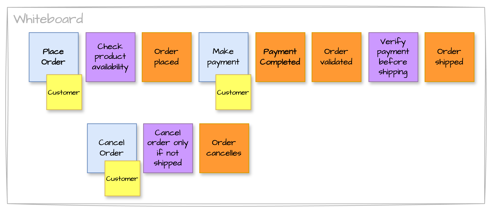
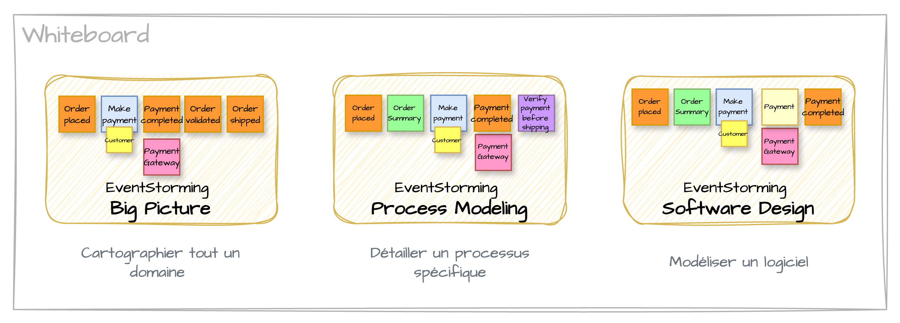

> 🧩 Cet article fait partie d’une [série sur l’EventStorming](../)

Dans le développement logiciel, le principal point de friction entre les experts métier et les équipes techniques réside souvent dans la compréhension fine du métier. C’est là qu’intervient l’EventStorming, une méthode de modélisation collaborative puissante qui permet de visualiser, d’explorer et de structurer les processus métier complexes de manière efficace et intuitive.

## Qu’est-ce que l’EventStorming ?

EventStorming a été introduit en 2013 par Alberto Brandolini. C'est une approche de modélisation orientée événements métiers (domain events) qui repose sur une session collaborative impliquant toutes les parties prenantes – développeurs, experts métier, UX designers, product owners – afin de construire ensemble une vision partagée du système.

Plutôt que de partir d’une documentation technique ou de diagrammes UML, l’EventStorming commence par des post-its de couleurs différentes, collés sur un mur ou un tableau blanc, pour représenter les événements, commandes, agrégats, acteurs, règles métier, etc.

EventStorming repose sur quelques constats simples mais puissants :
- Les problèmes complexes ont besoin de visualisation.
- Les meilleures conversations naissent quand les outils s’effacent. Les tableaux blancs laissent place à l’exploration, là où les outils plus rigides comme BPMN ou UML freinent les idées et excluent ceux qui ne maîtrisent pas leur langage.

> L'EventStorming est une méthode rapide et visuelle qui favorise une vision partagée et permet de détecter précocement les zones grises dans un processus complexe.

Pour plus de détails sur son origine et son évolution, consultez l’article complet ici : [https://www.avanscoperta.it/en/eventstorming/](https://www.avanscoperta.it/en/eventstorming/).

## Les 3 formats d’EventStorming

EventStorming se décline en plusieurs formats, adaptés à différents niveaux de profondeur. Au fil des années, trois grands types d’ateliers ont émergé :

> - [**Big Picture EventStorming**](../02-techniques-eventstorming/#big-picture) : cartographier tout un domaine ou un ensemble de processus métier.
> - [**Process Modelling EventStorming**](../02-techniques-eventstorming/#process-modeling) : se concentrer sur un processus spécifique.
> - [**Software Design EventStorming**](../02-techniques-eventstorming/#software-design) : modélisation orientée vers la conception logicielle, souvent couplée au DDD (Domain-Driven Design).

Plus de détails sur [la technique, les post-its à utiliser, les grandes étapes](../02-techniques-eventstorming/).

## Un processus itératif

#### Espaces Problème / Solution

> En Domain-Driven Design (DDD), il est essentiel de distinguer :
> - l’espace du **problème** (ce que le domaine métier cherche à résoudre) ;
> - l’espace de la **solution** (la façon dont le logiciel le résout).

#### Modeling Whirlpool

À l’image du [*Whirlpool Process of Model Exploration*](https://www.domainlanguage.com/ddd/whirlpool/) en Domain-Driven Design, l’EventStorming permet d’itérer entre les histoires concrètes racontées par les experts métier (espace problème) et la modélisation progressive de solutions (espace solution), en affinant la compréhension du domaine à chaque boucle.

#### Les étapes de ces itérations :

1. **Raconter une histoire** : parcourir des scénarios utilisateurs concrets pour ancrer la réflexion
2. **Proposer un modèle** : élaborer un premier modèle basé sur les scénarios 
3. **Découvrir de nouveaux éléments** : identifier des cas limites ou contraintes inattendues
4. **Retour à l’histoire** : affiner le modèle à partir des retours métier.

Ce processus est itératif : chaque passage dans le *whirlpool* améliore la pertinence du modèle en le confrontant à la réalité métier et aux contraintes techniques.

## Comparaison avec d'autres outils

Dans ce [workshop de modélisation](https://www.youtube.com/watch?v=oj4zGj6sPDc), Nick Tune compare différents outils dont EventStorming, UML, BPMN, et [Message flow modeling](https://github.com/ddd-crew/domain-message-flow-modelling).

#### Entre structure et complexité

Structurer un diagramme peut apporter de la clarté, mais parfois au prix d’une complexité inutile.
Les modèles structurés (comme UML) offrent de la précision, mais peuvent donner une fausse impression de qualité en dissimulant des erreurs de conception.
Les modèles flexibles (comme EventStorming) encouragent l’exploration et la créativité, mais peuvent devenir flous sans cadre.

Il faut choisir l’approche selon le besoin : privilégier la souplesse pour explorer, et la rigueur pour formaliser.

<table>
  <thead>
    <tr>
      <th>Outil</th>
      <th>Caractéristiques</th>
    </tr>
  </thead>
  <tbody>
    <tr>
      <td>EventStorming</td>
      <td>
        <ul>
          <li>Outil collaboratif et flexible, idéal pour explorer un domaine.</li>
          <li>Très expressif mais potentiellement chaotique sans cadre ni facilitateur</li>
          <li>Utile en phase de découverte, moins adapté à la structuration technique</li>
        </ul>
      </td>
    </tr>
    <tr>
      <td>BPMN</td>
      <td>
        <ul>
          <li>Approche formelle et structurée pour modéliser des workflows.</li>
          <li>Efficace pour documenter, mais devient complexe si trop détaillé.</li>
          <li>Moins adapté à l’exploration ou à la conception souple.</li>
        </ul>
      </td>
    </tr>
    <tr>
      <td>UML Sequence Diagram</td>
      <td>
        <ul>
          <li>Très structuré, idéal pour représenter des flux séquentiels précis.</li>
          <li>Apporte clarté et rigueur, mais peu flexible.</li>
          <li>Peut masquer des défauts de conception derrière sa formalisation.</li>
        </ul>
      </td>
    </tr>
    <tr>
      <td>Message Flow Modeling</td>
      <td>
        <ul>
          <li>Plus structuré qu’EventStorming, moins rigide qu’UML.</li>
          <li>Permet d’explorer, puis de préciser les échanges entre <em>bounded contexts</em>.</li>
          <li>Révèle les dépendances, couplages, et anti-patterns (ex. monolithe distribué)</li>
          <li>Il peut être utilisé pour <a href="../03-monolith/#03-message-flow-modelling">découper un monolithe</a>.</li>
        </ul>
      </td>
    </tr>
  </tbody>
</table>

#### Espaces DDD et outils

Les outils de modélisation s’inscrivent dans [les espaces du DDD](./#espaces-problème--solution), selon qu'ils servent à explorer le problème ou à concevoir la solution :

- **Espace problème** :  
  *Big Picture EventStorming*, *Process Modelling EventStorming*, *BPMN* - pour comprendre le métier, ses processus et ses acteurs.

- **Espace solution** :  
  *Software Design EventStorming*, *Domain Message Flow Modeling*, *Diagrammes de séquence UML* - pour concevoir les interactions, les composants et les limites du système.

## Conclusion

En combinant ces trois formats, il est possible d’orchestrer une approche holistique : commencer par un **Big Picture**, zoomer avec un **Process Modeling**, puis approfondir la conception avec un **Software Design**.

Un fil conducteur : la collaboration visuelle, au service de la compréhension et de l’action.

Plus de détails sur [la technique, les post-its à utiliser, les grandes étapes](../02-techniques-eventstorming/).
