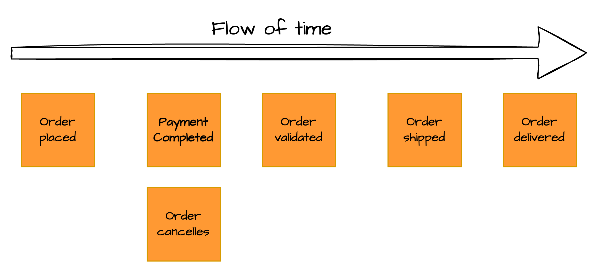
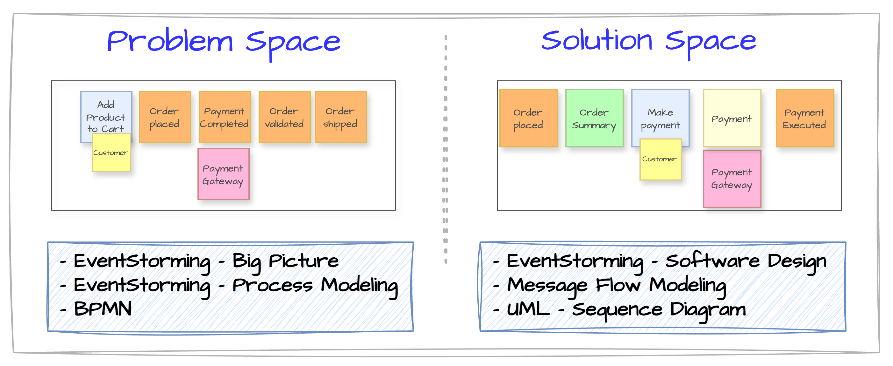
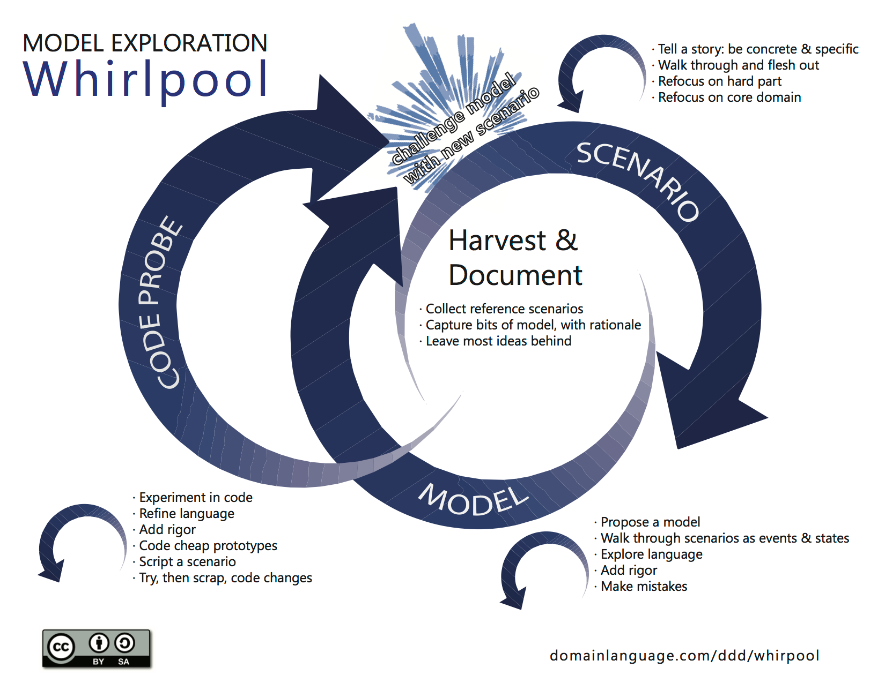
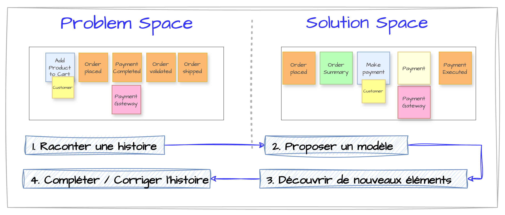

Dans le développement logiciel, la compréhension fine du métier est souvent le point de friction principal entre les experts métier et les équipes techniques. C’est là qu’intervient l’EventStorming, une méthode de modélisation collaborative puissante qui permet de visualiser, d’explorer et de structurer les processus métier complexes de manière efficace et intuitive.

## Qu’est-ce que l’EventStorming ?

EventStorming a été introduit en 2013 par Alberto Brandolini. Pour plus de détails sur son origine et son évolution, consultez l’article complet ici : [https://www.avanscoperta.it/en/eventstorming/](https://www.avanscoperta.it/en/eventstorming/).

L’EventStorming est une approche de modélisation orientée événements métiers (domain events), inventée par Alberto Brandolini. Elle repose sur une session collaborative impliquant toutes les parties prenantes – développeurs, experts métier, UX designers, product owners – afin de construire ensemble une vision partagée du système.

Plutôt que de partir d’une documentation technique ou de diagrammes UML, l’EventStorming commence par des post-its de couleurs différentes, collés sur un mur ou un tableau blanc, pour représenter les événements, commandes, agrégats, acteurs, règles métier, etc.

EventStorming repose sur quelques constats simples mais puissants :
- Les problèmes complexes ont besoin de visualisation.
- Les meilleures conversations naissent quand les outils s’effacent. Les tableaux blancs laissent place à l’exploration, là où les outils plus rigides comme BPMN ou UML freinent les idées et excluent ceux qui ne maîtrisent pas leur langage.

> L'EventStorming est une méthode rapide et visuelle qui favorise une vision partagée et permet de détecter précocement les zones grises dans un processus complexe.

## Les 3 formats d’EventStorming

EventStorming se décline en plusieurs formats, adaptés à différents niveaux de profondeur. Tous reposent sur le **récit collectif** à l’aide de **post-its colorés** sur une grande surface de modélisation (généralement un long rouleau de papier).

> Au fil des années, trois grands types d’ateliers ont émergé :
> - [**Big Picture EventStorming**](../02-techniques-eventstorming/#big-picture) : cartographier tout un domaine ou un ensemble de processus métier.
> - [**Process Modelling EventStorming**](../02-techniques-eventstorming/#process-modeling) : se concentrer sur un processus spécifique.
> - [**Software Design EventStorming**](../02-techniques-eventstorming/#software-design) : modélisation orientée vers la conception logicielle, souvent couplée au DDD (Domain-Driven Design).

Plus de détails sur [la technique, les post-its à utiliser, les grandes étapes](../02-techniques-eventstorming/).

## Comparaison avec d'autres outils

### Entre structure et complexité

Nick Tune participe à un [workshop de modélisation](https://www.youtube.com/watch?v=oj4zGj6sPDc) dans lequel il compare les différents outils (BPMN, UML, EventStorming, Message Flow).

Structurer un diagramme peut aider à identifier des problèmes, surtout si l’organisation du modèle est difficile — cela peut révéler des failles plus profondes. Mais attention : toute complexité n’est pas utile. Parfois, structurer ajoute juste des complications inutiles.

Au final, le choix entre un modèle structuré ou libre dépend des objectifs. La flexibilité encourage l’exploration, tandis que la structure apporte de la clarté — mais peut aussi cacher des défauts de conception :

> * Modèles structurés (UML, BPMN) : clairs, précis, mais peuvent masquer des défauts de conception.
> * Modèles flexibles (EventStorming, Message Flow) : favorisent l’exploration, mais peuvent être confus sans cadre.
> * Il y a une tension permanente entre simplicité (pour communiquer) et précision (pour concevoir).
> * La clé : adapter l’outil au moment et au but — l’exploration nécessite flexibilité, la documentation exige rigueur.

### EventStorming

* Outil flexible, collaboratif et peu formel, idéal pour l’exploration initiale et la créativité.
* Simplicité apparente, mais potentiellement chaotique sans facilitateur compétent.
* L’absence de formalisme strict (couleurs, noms, règles souples) facilite l’expression, mais peut générer de la confusion, surtout pour les débutants.
* Plus utile dans une phase de découverte de domaine que dans la structuration technique.

### BPMN

* Structuré et formel, BPMN est efficace pour visualiser des workflows, mais son usage peut varier.
* Il devient complexe s’il cherche à tout intégrer (logique métier incluse), mais plus souple quand il se contente d’orchestrer visuellement en déléguant la logique aux microservices.
* Son formalisme fort est utile pour documenter des processus, mais peut être rigide pour la conception ou l’exploration.
* Tendance à évoluer, mais pour l’instant, il est plus adapté à des contextes structurés qu’à des phases exploratoires.

### UML Sequence Diagram

* Très structuré et formel, UML évite les malentendus et apporte de la précision.
* Moins flexible qu’EventStorming, il est parfait pour représenter clairement les flux séquentiels et les interactions système.
* Cette rigueur peut masquer des problèmes architecturaux (ex. couplage excessif) qui seraient visibles dans un outil plus libre.

### Message Flow Modeling 

L'outil est présenté [ici](https://github.com/ddd-crew/domain-message-flow-modelling). Il peut être utilisé dans un [workshop pour découper un monolithe](../03-monolith/#02-alternative-2--message-flow-modelling).

* Outil entre deux mondes : plus structuré qu’EventStorming, moins rigide qu’UML.
* La version simple mise sur la clarté et la simplicité ; la version avancée ajoute des notations précises (commandes, événements, requêtes).
* Flexibilité initiale, puis montée en complexité selon le niveau d’expertise.
* Utile pour révéler des anti-patterns (ex. trop de requêtes → monolithe distribué).
* L’agencement libre rend la modélisation plus expressive, mais plus cognitive à gérer que des diagrammes automatisés comme UML.

## Espaces Problème / Solution

> En Domain-Driven Design (DDD), il est essentiel de distinguer :
> - l’espace du **problème** (ce que le domaine métier cherche à résoudre) ;
> - l’espace de la **solution** (la façon dont le logiciel le résout).

### Espaces et outils

Voici un tableau qui les met en relation les outils de modélisation avec les espaces du DDD :

| Type d’EventStorming / Outil     | Espace DDD               | Explication |
|----------------------------------|--------------------------|-------------|
| Big Picture EventStorming        | Espace du problème       | Vision d’ensemble du métier, parties prenantes, objectifs. L’objectif est de comprendre, pas de concevoir. |
| Process Modelling EventStorming  | Espace du problème (majoritairement) | Zoom sur un processus métier spécifique. On s’approche de la solution, mais on reste dans la compréhension métier. |
| Software Design EventStorming    | Espace de la solution    | On modélise les agrégats, commandes, politiques, événements techniques, limites de contexte, etc. |
| Domain Message Flow Modeling     | Espace de la solution    | On modélise les bounded contexts (et donc les microservices) et les communications entre ceux-ci. |
| BPMN                             | Espace du problème       | Outil formel pour décrire les processus métier avec acteurs, décisions, événements. Utilisé pour l’analyse métier, parfois automatisable. |
| UML Sequence Diagram             | Espace de la solution    | Outil pour modéliser les interactions entre objets/systèmes dans le temps. Très utile pour spécifier des flux de messages, services, appels d’API. |

### Modeling Whirlpool

Le *Modeling Whirlpool* décrit le flux naturel de la modélisation en DDD. Il s’agit d’une oscillation continue entre l’espace du problème (compréhension métier) et l’espace de la solution (conception logicielle). Ce va-et-vient permet de raffiner progressivement le modèle jusqu’à ce qu’il réponde à la fois aux besoins métier et aux contraintes techniques.

#### Les étapes du Whirlpool :

1. **Raconter une histoire** : parcourir des scénarios utilisateurs concrets pour ancrer la réflexion (ex. : activer le régulateur de vitesse).
2. **Proposer un modèle** : élaborer un premier modèle basé sur les scénarios (ex. : Service de régulation de vitesse, Service moteur).
3. **Découvrir de nouveaux éléments** : identifier des cas limites ou contraintes inattendues (ex. : reprise manuelle via la pédale).
4. **Retour à l’histoire** : affiner le modèle à partir des retours métier.

Ce processus est itératif : chaque passage dans le *whirlpool* améliore la pertinence du modèle en le confrontant à la réalité métier et aux contraintes techniques.

## Conclusion

En combinant ces trois formats, il est possible d’orchestrer une approche holistique : commencer par un **Big Picture**, zoomer avec un **Process Modeling**, puis approfondir la conception avec un **Software Design**.

Un fil conducteur : la collaboration visuelle, au service de la compréhension et de l’action.

Plus de détails sur [la technique, les post-its à utiliser, les grandes étapes](../02-techniques-eventstorming/).
