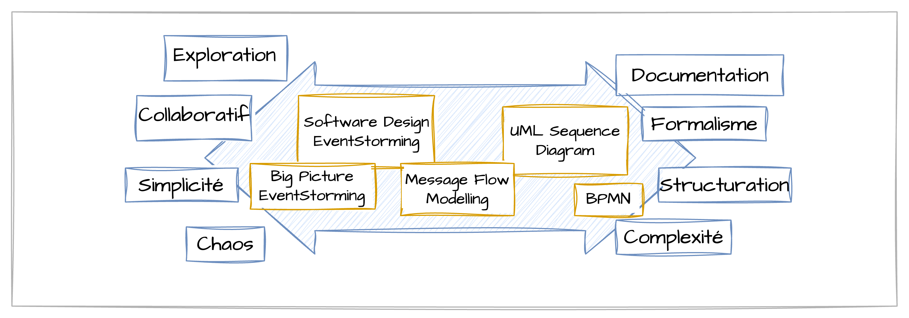

Dans le développement logiciel, le principal point de friction entre les experts métier et les équipes techniques réside souvent dans la compréhension fine du métier. C’est là qu’intervient l’EventStorming, une méthode de modélisation collaborative puissante qui permet de visualiser, d’explorer et de structurer les processus métier complexes de manière efficace et intuitive.

## Qu’est-ce que l’EventStorming ?

EventStorming a été introduit en 2013 par Alberto Brandolini. C'est une approche de modélisation orientée événements métiers (domain events) qui repose sur une session collaborative impliquant toutes les parties prenantes – développeurs, experts métier, UX designers, product owners – afin de construire ensemble une vision partagée du système.

Plutôt que de partir d’une documentation technique ou de diagrammes UML, l’EventStorming commence par des post-its de couleurs différentes, collés sur un mur ou un tableau blanc, pour représenter les événements, commandes, agrégats, acteurs, règles métier, etc.

EventStorming repose sur quelques constats simples mais puissants :
- Les problèmes complexes ont besoin de visualisation.
- Les meilleures conversations naissent quand les outils s’effacent. Les tableaux blancs laissent place à l’exploration, là où les outils plus rigides comme BPMN ou UML freinent les idées et excluent ceux qui ne maîtrisent pas leur langage.

> L'EventStorming est une méthode rapide et visuelle qui favorise une vision partagée et permet de détecter précocement les zones grises dans un processus complexe.

Pour plus de détails sur son origine et son évolution, consultez l’article complet ici : [https://www.avanscoperta.it/en/eventstorming/](https://www.avanscoperta.it/en/eventstorming/).

## Les 3 formats d’EventStorming

EventStorming se décline en plusieurs formats, adaptés à différents niveaux de profondeur. Tous reposent sur le **récit collectif** à l’aide de **post-its colorés** sur une grande surface de modélisation (généralement un long rouleau de papier).

> Au fil des années, trois grands types d’ateliers ont émergé :
> - [**Big Picture EventStorming**](../02-techniques-eventstorming/#big-picture) : cartographier tout un domaine ou un ensemble de processus métier.
> - [**Process Modelling EventStorming**](../02-techniques-eventstorming/#process-modeling) : se concentrer sur un processus spécifique.
> - [**Software Design EventStorming**](../02-techniques-eventstorming/#software-design) : modélisation orientée vers la conception logicielle, souvent couplée au DDD (Domain-Driven Design).

Plus de détails sur [la technique, les post-its à utiliser, les grandes étapes](../02-techniques-eventstorming/).

## Comparaison avec d'autres outils

#### Entre structure et complexité

Nick Tune a participé à un [workshop de modélisation](https://www.youtube.com/watch?v=oj4zGj6sPDc) dans lequel il compare différents outils (BPMN, UML, EventStorming, Message Flow). 

Structurer un diagramme peut apporter de la clarté, mais parfois au prix d’une complexité inutile.
Les modèles structurés (comme UML) offrent de la précision, mais peuvent donner une fausse impression de qualité en dissimulant des erreurs de conception.
Les modèles flexibles (comme EventStorming) encouragent l’exploration et la créativité, mais peuvent devenir flous sans cadre.

Il faut choisir l’approche selon le besoin : privilégier la souplesse pour explorer, et la rigueur pour formaliser.

#### EventStorming

* Outil collaboratif et flexible, idéal pour explorer un domaine.
* Très expressif mais potentiellement chaotique sans cadre ni facilitateur.
* Utile en phase de découverte, moins adapté à la structuration technique.

#### BPMN

* Approche formelle et structurée pour modéliser des workflows.
* Efficace pour documenter, mais devient complexe si trop détaillé.
* Moins adapté à l’exploration ou à la conception souple.

#### UML Sequence Diagram

* Très structuré, idéal pour représenter des flux séquentiels précis.
* Apporte clarté et rigueur, mais peu flexible.
* Peut masquer des défauts de conception derrière sa formalisation.

#### Message Flow Modeling 

[Message flow modeling](https://github.com/ddd-crew/domain-message-flow-modelling), promu par Nick Tune, est une méthode intermédiaire pour le design stratégique.

* Plus structuré qu’EventStorming, moins rigide qu’UML.
* Permet d’explorer, puis de préciser les échanges entre *bounded contexts*.
* Révèle les dépendances, couplages, et anti-patterns (ex. monolithe distribué)

Il peut être utilisé pour [découper un monolithe](../03-monolith/#03-message-flow-modelling).

## Espaces Problème / Solution

> En Domain-Driven Design (DDD), il est essentiel de distinguer :
> - l’espace du **problème** (ce que le domaine métier cherche à résoudre) ;
> - l’espace de la **solution** (la façon dont le logiciel le résout).

### Espaces et outils

Voici un tableau qui met en relation les outils de modélisation avec les espaces du DDD :

| Outil     | Espace DDD               |
|----------------------------------|--------------------------|
| Big Picture EventStorming        | **Problème** - Vision d’ensemble du métier, parties prenantes, objectifs. L’objectif est de comprendre, pas de concevoir. |
| Process Modelling EventStorming  | **Problème (majoritairement)** - Zoom sur un processus métier spécifique. On s’approche de la solution, mais on reste dans la compréhension métier. |
| Software Design EventStorming    | **Solution** - On modélise les agrégats, commandes, politiques, événements techniques, limites de contexte, etc. |
| Domain Message Flow Modeling     | **Solution** - On modélise les bounded contexts (et donc les microservices) et les communications entre ceux-ci. |
| BPMN                             | **Problème** - Outil formel pour décrire les processus métier avec acteurs, décisions, événements. Utilisé pour l’analyse métier, parfois automatisable. |
| UML Sequence Diagram             | **Solution** - Outil pour modéliser les interactions entre objets/systèmes dans le temps. Très utile pour spécifier des flux de messages, services, appels d’API. |

### Modeling Whirlpool

Le *Modeling Whirlpool* décrit le flux naturel de la modélisation en DDD. Il s’agit d’une oscillation continue entre l’espace du problème (compréhension métier) et l’espace de la solution (conception logicielle). Ce va-et-vient permet de raffiner progressivement le modèle jusqu’à ce qu’il réponde à la fois aux besoins métier et aux contraintes techniques.

#### Les étapes du Whirlpool :

1. **Raconter une histoire** : parcourir des scénarios utilisateurs concrets pour ancrer la réflexion (ex. : activer le régulateur de vitesse).
2. **Proposer un modèle** : élaborer un premier modèle basé sur les scénarios (ex. : Service de régulation de vitesse, Service moteur).
3. **Découvrir de nouveaux éléments** : identifier des cas limites ou contraintes inattendues (ex. : reprise manuelle via la pédale).
4. **Retour à l’histoire** : affiner le modèle à partir des retours métier.

Ce processus est itératif : chaque passage dans le *whirlpool* améliore la pertinence du modèle en le confrontant à la réalité métier et aux contraintes techniques.

## Conclusion

En combinant ces trois formats, il est possible d’orchestrer une approche holistique : commencer par un **Big Picture**, zoomer avec un **Process Modeling**, puis approfondir la conception avec un **Software Design**.

Un fil conducteur : la collaboration visuelle, au service de la compréhension et de l’action.

Plus de détails sur [la technique, les post-its à utiliser, les grandes étapes](../02-techniques-eventstorming/).
