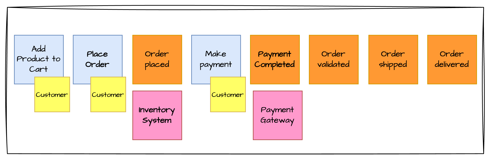
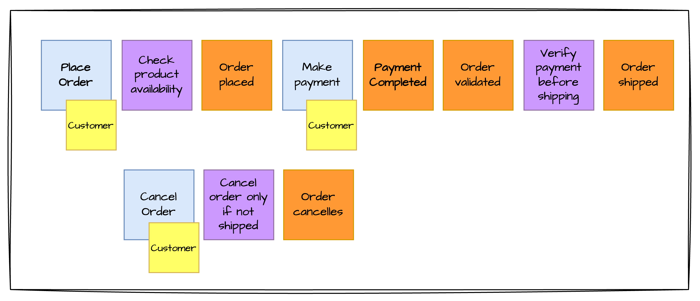
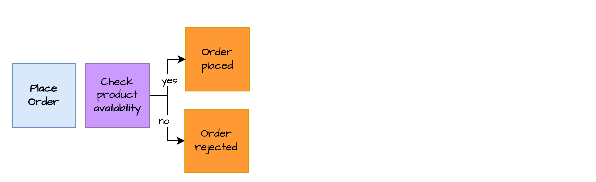
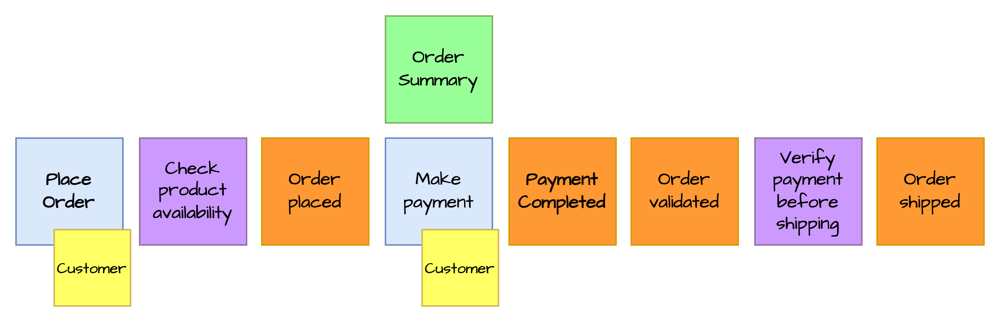
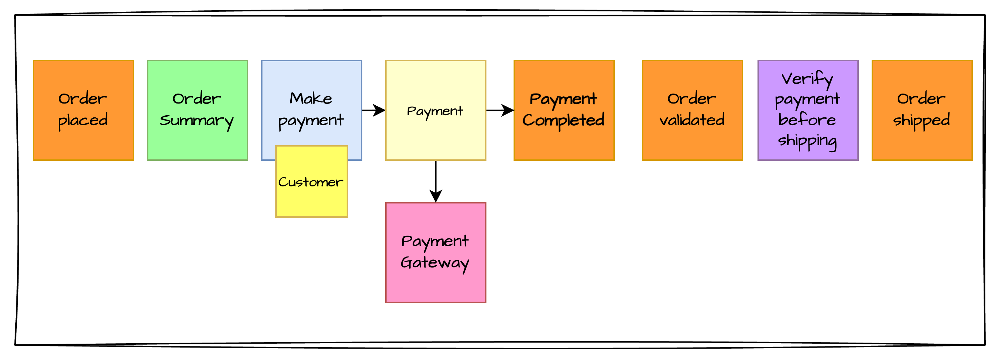
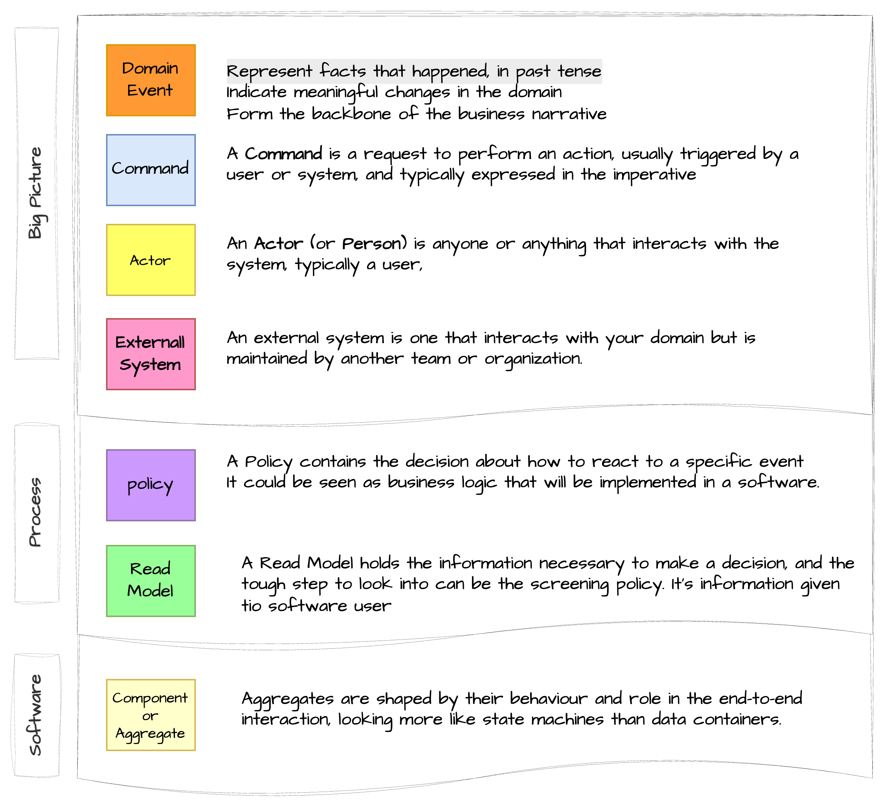

Dans le développement logiciel, la compréhension fine du métier est souvent le point de friction principal entre les experts métier et les équipes techniques. C’est là qu’intervient l’EventStorming, une méthode de modélisation collaborative puissante qui permet de visualiser, d’explorer et de structurer les processus métier complexes de manière efficace et intuitive.

## Un peu d’histoire

EventStorming a été introduit en 2013 par Alberto Brandolini. Pour plus de détails sur son origine et son évolution, consultez l’article complet ici : [https://www.avanscoperta.it/en/eventstorming/](https://www.avanscoperta.it/en/eventstorming/).

## Qu’est-ce que l’EventStorming ?

L’EventStorming est une approche de modélisation orientée événements métiers (domain events), inventée par Alberto Brandolini. Elle repose sur une session collaborative impliquant toutes les parties prenantes – développeurs, experts métier, UX designers, product owners – afin de construire ensemble une vision partagée du système.

Plutôt que de partir d’une documentation technique ou de diagrammes UML, l’EventStorming commence par des post-its de couleurs différentes, collés sur un mur ou un tableau blanc, pour représenter les événements, commandes, agrégats, acteurs, règles métier, etc.

EventStorming repose sur quelques constats simples mais puissants. 
- Les problèmes complexes ont besoin de visualisation
- Les meilleures conversations naissent quand les outils s’effacent. Les tableaux blancs laissent place à l’exploration, là où les outils comme plus rigides comme BPMN ou UML freine les idées et exclut ceux qui ne maîtrisent pas leur langage.

> L'EventStorming est une méthode rapide et visuelle qui favorise une vision partagée et permet de détecter précocement les zones grises dans un processus complexe.

## Les grands formats d’EventStorming

EventStorming se décline en plusieurs formats, adaptés à différents niveaux de profondeur. Tous reposent sur le **récit collectif** à l’aide de **post-its colorés** sur une grande surface de modélisation (généralement un long rouleau de papier). 

> Au fil des années, trois grands types d’ateliers ont émergé:
> - **Big Picture** : cartographier tout un domaine ou un ensemble de processus métier.
> - **Process Modeling** : se concentrer sur un processus spécifique.
> - **Design-Level** : modélisation orientée vers la conception logicielle, souvent couplée au DDD (Domain-Driven Design).

## Big Picture EventStorming

Le format **Big Picture** est le plus vaste. Il mobilise souvent **25 à 30 participants** issus de tous les niveaux de l’organisation. L’objectif est d’explorer **l’ensemble d’une ligne métier**, du début à la fin.

{}
#### 💡 Tip : Scénario Global
Utilise un scénario "system-wide" pour aligner tous les participants et révéler les opportunités d'amélioration à travers les départements. Il doit couvrir tout un "customer journey"
{}

### Step 01 - Domain Events

Le déroulé est itératif : les participants racontent les événements majeurs qui jalonnent les processus de leur organisation, en les positionnant chronologiquement. Cela se traduit par des **Domain Events** (post-it oranges)

  Un <strong>Event</strong> ou <strong>Domain Event</strong> : Un fait significatif qui s'est produit dans le système, formulé au passé, représentant un changement d'état. Représente des faits qui se sont produits, indiquent des changements importants dans le domaine et forment l'épine dorsale de la narration métier.

### Step 02 - Commands and Persons

On ajoute ensuite les **commandes** (post-it bleus)

Une <strong>commande</strong>, c'est une intention exprimée par un utilisateur ou un système, qui demande qu’une action soit exécutée. Chaque commande déclenche (souvent) un événement, si les conditions métier sont respectées.

Et dans le même temps les **Actorss** ou **Persons**  (post-it jaune) sur les commandes qu'elles déclenchent

      Un <strong>Actor</strong> ou <strong>Person</strong>, c'est quelqu'un qui agit sur le système et prend des décisions. En général, les personnes sont posées sur des commandes dont elles sont à l'origine.

### Step 03 - External Systems

On peut ensuite ajouter les systèmes externes

      Le <strong>systèmes externes</strong> sont les systèmes maintenus par d'autres équipes ou d'autres organisations. Ces systèmes sont les logiciels qu'on ne modélise pas dans le processus actuel.

## Process Modelling EventStorming

Le format **Process Modelling** vise un niveau de granularité plus fin. On y modélise un **processus spécifique**, de bout en bout, en y ajoutant **plus de rigueur méthodologique**.

Ici, on introduit une **grammaire précise** (événements, commandes, règles, acteurs…), dans un esprit de **jeu collaboratif structuré**, tout en restant du côté métier – on ne descend pas encore dans la conception logicielle.

Ce format permet :

- D’**analyser un processus existant** en profondeur,
- D’**explorer des variantes** ou des scénarios alternatifs,
- De **concevoir de nouveaux processus** à partir de l’expérience terrain,
- D’identifier les **goulots d’étranglement**, **risques**, ou **opportunités d’automatisation**.

Il est particulièrement utile dans les contextes de transformation opérationnelle ou d’amélioration continue.

### Step 04 - Policies

      Une <strong>policy</strong> est une règle métier ou un comportement automatique déclenché par un événement. Elle agit comme une réaction logique à un événement, et peut conduire à une commande ou un autre événement.

Une policie peut également servir à introduire un comportement conditionnel dans la description du processus

### Step 05 -  Read model

      Un <strong>Read Model</strong> (ou <strong>information</strong>) est une vue optimisée pour la lecture, créée à partir des événements métier. Il sert à afficher les données dont un utilisateur ou un système a besoin, souvent via des écrans, APIs, dashboards, etc.

Ici, le read-model **Order Summary** permet à l'utilisateur de vérifier sa commande avant d'executer le paiememt.

## Software Design EventStorming

Le format **Software Design** fait le lien entre les événements du métier et leur **implémentation logicielle** potentielle. On y introduit des éléments supplémentaires dans la grammaire comme :

- Les **agrégats** (Aggregates),
- Les **contextes bornés** (Bounded Contexts).

Cela permet d’augmenter la **précision de la discussion**, tout en conservant un fort ancrage métier.

Ce format est particulièrement pertinent pour :

- Concevoir une architecture logicielle alignée sur le métier,
- Identifier les **interfaces** entre domaines,
- Définir des **limites de responsabilité claires**,
- Éviter les couplages inutiles,
- Préparer la modélisation orientée DDD.

Il s’agit du format le plus technique, mais il garde une forte valeur collaborative en maintenant le **dialogue constant entre experts métier et développeurs**.

### Step 06 - Aggregates

  Un <strong>aggrégat</strong> est un concept destiné à être transformé en code — sous forme de classes ou de fonctions. C’est essentiellement une <strong>machine à états</strong>, c’est-à-dire quelque chose qui suit un cycle de vie. 

Dans notre scénario, voici les aggrégats que nous pourrions ajouter :

| Aggregate         |  Justification possible                                        |
| ----------------- | ---------------------------------------------------------------- |
| Payment           | Si le paiement devient un processus complexe à part entière      |
| Shipment          | Pour gérer finement les livraisons (multi-colis, tracking) |
| ProductInventory  | Pour intégrer la gestion de stock (en lecture/écriture)         |

Dans la vraie vie, un **aggregate** est une classe métier qui fait autorité sur un sous-domaine
Pour les aggregates, on met l’accent sur le comportement, pas sur les données — dans l’esprit de la programmation orientée objet. Toutes les règles métier doivent être appliquées et garanties par cet agrégat.

### Summary Legend

### Conclusion

En combinant ces trois formats, il est possible d’orchestrer une approche holistique : commencer par un **Big Picture**, zoomer avec un **Process Modelling**, puis approfondir la conception avec un **Software Design**. 

Un fil conducteur : la collaboration visuelle, au service de la compréhension et de l’action.

