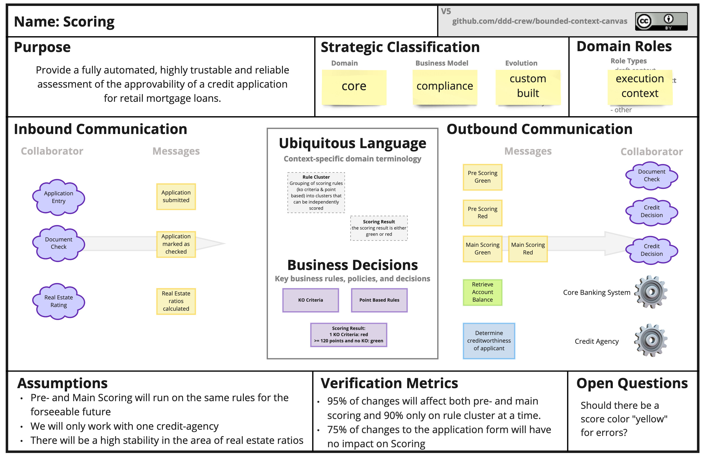

## Espace Problème / Solution

L'Event Storming, popularisé par Alberto Brandolini, est une approche collaborative de modélisation qui aide les équipes à comprendre, explorer et concevoir des systèmes complexes. 

> En Domain-Driven Design (DDD), il est essentiel de distinguer :
> - l’espace du problème (ce que le domaine métier cherche à résoudre) 
> - l’espace de la solution (la façon dont le logiciel le résout).

Le Modeling Whirlpool décrit le flux naturel de la modélisation en DDD. Il s’agit d’une oscillation continue entre l’espace du problème (la compréhension du métier) et l’espace de la solution (la conception du logiciel). Ce va-et-vient permet de raffiner progressivement le modèle jusqu’à ce qu’il réponde à la fois aux besoins métier et aux contraintes techniques.

Les étapes du tourbillon suivies :
1. **Raconter une histoire** : parcourir des scénarios utilisateurs concrets pour ancrer la réflexion (par exemple : activer le régulateur de vitesse).
2. **Proposer un modèle** : Élaborer un premier modèle basé sur les scénarios précédents (par exemple : Service de régulation de vitesse, Service moteur).
3. **Découvrir de nouveaux éléments** :  Identifier des cas limites ou des contraintes techniques inattendues (par exemple : reprise manuelle via la pédale, conditions de course).
4. **Retour à l’histoire** : Revenir aux scénarios d’origine pour affiner la compréhension et ajuster le modèle en conséquence.

Ce processus est itératif : chaque passage dans le tourbillon améliore la pertinence du modèle en le confrontant à la réalité du domaine et aux exigences techniques.

## Quel rapport le workshop?

Nous avons vu dans cet [article](../01-introduction-eventstorming/) quels sont les trois types d’Event Storming, et en particulier comment se déroule chacun d’entre eux : Big Picture, Process Modelling et Software Modelling.

Voici un tableau pour visualiser la correspondance entre les types d’Event Storming et les espaces du DDD :

| Type d’Event Storming         | Espace DDD             | Explication |
|------------------------------|------------------------|-------------|
| Big Picture Event Storming |  Espace du problème | On explore ici la compréhension globale du métier : vision d’ensemble, objectifs, enjeux, parties prenantes, événements métier. L’objectif est de comprendre, pas encore de concevoir. |
| Process Modelling Event Storming |  Espace du problème *(majoritairement)* | On zoome sur un processus métier spécifique, avec ses variations. On est encore dans la compréhension du fonctionnement métier, même si on approche déjà des choix de conception. |
| Software Design Event Storming |  Espace de la solution | Ici, on modélise les agrégats, commandes, politiques, événements techniques, limites de contexte, etc. C’est là qu’on passe du "quoi" au "comment", donc clairement dans la solution technique. |

> Un workshop pour découper un monolithe va devoir :
> 1. Travailler dand l'espace des problèmes pour **comprendre ce qu'il faut modéliser** et aligner tout les participants autour de cet compréhension ommunne
> 2. Travailler dans l'espace des solutions pour faire **émerger les microservices** qui vont remplacer tout ou partie du monolithe

## Workshop pour découper mon monolithe

Comment découper un grand système en composants modulaires plus petits et plus faciles à gérer ? C'est la question qui se pose le plus souventy. Dans cette artcile, [Nick Tune nous donne sa recette](https://medium.com/nick-tune-tech-strategy-blog/modelling-bounded-contexts-with-the-bounded-context-design-canvas-a-workshop-recipe-1f123e592ab) qui a inspriré cet article.

### 01. Big Picture EventStorming

**Participants** : il est essentiel d’avoir des représentants du métier ou des experts métier, ainsi que des développeurs et des personnes capables de concevoir des systèmes informatiques (architectes, tech leads, etc.).

La première étape consiste à comprendre le processus métier. On choisit donc un ou plusieurs scénarios représentatifs d’un processus de bout en bout (end-to-end) ou d’un parcours client (customer journey). L’objectif est d’obtenir une vue globale du système.

Si nécessaire, on peut approfondir certains processus en réalisant un EventStorming de type Process Modelling.

Le but final est que tous les participants aient une compréhension suffisamment claire du métier tel qu’il est ou sera implémenté dans le système.

#### Bounded Context

Lorsqu’on parle d’architecture et de conception stratégique, les Bounded Contexts viennent souvent à l’esprit. Il s’agit d’identifier et de définir des frontières claires au sein d’un système.
Concevoir une architecture revient souvent à découper une structure complexe en sous-systèmes plus petits.

Certains appellent cela des microservices, d’autres parlent de Bounded Contexts, et pour certains, un microservice est un Bounded Context à part entière.

Le sujet suscite évidemment des opinions bien tranchées, et de nombreux articles de blog lui ont été consacrés

#### Emergent Bounded Context

> À ce stade, il est déjà possible de **faire émerger des Bounded Contexts** potentiels, en observant les zones de rupture, les vocabulaires distincts ou les responsabilités bien délimitées. Ces pistes seront approfondies dans les étapes suivantes.

Source : https://github.com/ddd-crew/eventstorming-glossary-cheat-sheet

#### Les Bounded Contexts ne sont pas toujours évidents

> En théorie, on pourrait regarder un tableau d'Event Storming et penser qu'on peut diviser les événements en sections distinctes, chacune correspondant à un Bounded Context. Mais en réalité, cela n'est que rarement aussi simple.

Souvent, des événements liés à un même Bounded Context apparaissent à plusieurs endroits sur le tableau. Un même Bounded Context peut se manifester au début d'un processus, puis réapparaître à la fin. C’est pourquoi Alberto Brandolini, le créateur de l’Event Storming, les qualifie de Bounded Contexts émergents. Ils émergent du processus — ils ne sont pas prédéfinis.

Considérons cet exemple est inspiré d'une vidéo youtube  [[Hands-on] Exploring Techniques For Modelling Bounded Context Collaboration](https://www.youtube.com/watch?v=oj4zGj6sPDc), avec la participation de Nick Tune. Il y décrit le cycle de vie d'un **bank account** :
* Un utilisateur crée un **account**
* Dépose de l'argent
* Retire de l'argent
* Ferme le **account**

Ces activités ne se déroulent pas toujours dans un ordre bien défini, et elles sont souvent entrecoupées d'autres processus, comme la demande d'un mortgage ou l'ouverture d'un savings account.

> Bien que ce soient des phases distinctes, **elles reposent toutes sur le même objet de domaine**, **account**. Cela entraîne des défis de modélisation et des compromis (cohésion vs. duplication).

### 02. Alternative 1 : Software Design EventStorming

**Participants** : en plus des participants précédents, on implique des personnes du métier, des développeurs, et des experts en conception de systèmes logiciels. Ce type d’atelier est plus orienté architecture et modélisation technique.

On utilise cette approche pour identifier les agrégats, les commandes, les politiques, les événements techniques, et pour poser les limites de contexte (Bounded Contexts) du futur système modulaire.

Plus de détail dans cette [article](../01-introduction-eventstorming/#software-design-eventstorming)

### 02. Alternative 2 : Message Flow Modelling

#### EventStorming vs Message Flow Modelling

> Concevoir des systèmes faiblement couplés nécessite plus que de simples frontières bien définies. Il est tout aussi important de définir précisément les interactions entre les bounded contexts.

C’est pour cette raison qu’un *EventStorming* de type *software modelling* n’est pas toujours suffisant. Nick Tune introduit le [Message Flow Modelling](https://github.com/ddd-crew/domain-message-flow-modelling). Cette alternative est centrée sur l’échange de messages entre les composants du système. Elle peut être utilisée pour explorer ou valider la communication entre **Bounded Contexts**, et donc valider la découpe en **microservices**.

A noter que Nick propose aussi une version simplifié pour modéliser ces communications

Cette modélisation permet également d’aller plus loin, en modélisant :
* Les événements publiés et consommés ;
* Les interactions synchrones/asynchrones ;
* Et les protocoles d’intégration.

#### D'accord, mais je les trouve où mes Bounded Context?

Il n’existe malheureusement pas de méthode magique pour identifier les *Bounded Contexts* dans un système.

Dans ce [workshop](https://www.youtube.com/watch?v=oj4zGj6sPDc), Nick Tune propose un exercice de modélisation d’un système d’*Adaptive Cruise Control*. Après une première phase consacrée à l’exploration de l’espace du problème — à travers un *EventStorming* de type *Big Picture* — il engage, avec son co-animateur jouant le rôle d’expert métier, une démarche de découverte des *Bounded Contexts*. Ensemble, ils construisent progressivement une vision partagée du système en identifiant les contours contextuels pertinents.

Cette démarche repose sur plusieurs éléments clés : 
- une connaissance approfondie du métier, 
- une compréhension fine des enjeux fonctionnels, 
- des compétences en conception logicielle, 
- ainsi qu’une capacité à modéliser de manière collaborative.

Autrement dit, il s’agit avant tout d’un travail itératif, nécessitant de se confronter au domaine, de formuler des hypothèses, de modéliser, puis d’ajuster au fil des échanges et de l’apprentissage collectif.

Puis il faut se **lancer**.

Et surtout, **itérer**.

### 03. Bounded Context Canvas

L'étape suivante du processus de conception consiste à modéliser chaque *Bounded Context* candidat en détaillant des critères de design clés. Pour cela, le [Bounded Context Canvas](https://github.com/ddd-crew/bounded-context-canvas) fournit un support structurant, particulièrement utile pour faire émerger une compréhension partagée du rôle, des capacités et des contraintes d’un contexte donné.

Ce canevas est un outil **itératif**. Remplissez-le pour un contexte, puis recommencez pour les autres. L’idée n’est pas d’être parfait dès le départ, mais de progresser par cycles jusqu’à une modélisation claire et stable.

#### Définition du Contexte

Commencez par nommer le *Bounded Context* et décrire sa finalité dans le domaine métier. La description doit porter sur son rôle fonctionnel dans le système, pas sur des aspects techniques ou d’implémentation.

> Un manque de clarté sur le nom, la description ou le vocabulaire partagé peut indiquer des frontières mal définies. Ce sont des opportunités de refactorisation.

#### Extraction des Règles Métier et du *Ubiquitous Language*

Appuyez-vous sur les résultats d’un *EventStorming* pour identifier les règles métier principales associées à ce contexte. Sélectionnez-en trois qui capturent l’essence du domaine et reportez-les sur le canvas.

Identifiez également les termes métier clés — mots ou expressions spécifiques — et placez-les dans la section *Ubiquitous Language*. Cette partie est évolutive : elle s’enrichira tout au long du processus de modélisation.

#### Capacités du Contexte

Listez les principales capacités du contexte : que peut-il faire ? Que propose-t-il aux autres contextes ? Incluez aussi les tâches internes s’il y en a.

Cela vous aidera à :
* clarifier les responsabilités ;
* identifier les éventuels regroupements logiques ;
* repérer les surcharges ou incohérences à corriger.

