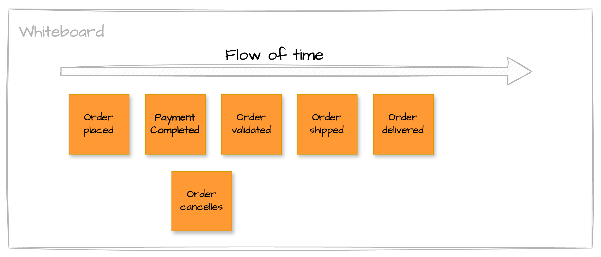
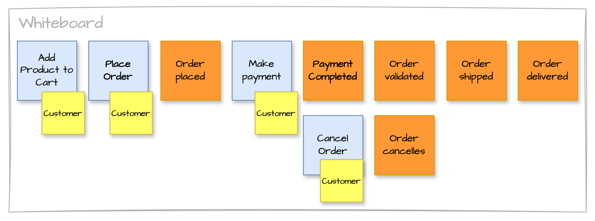
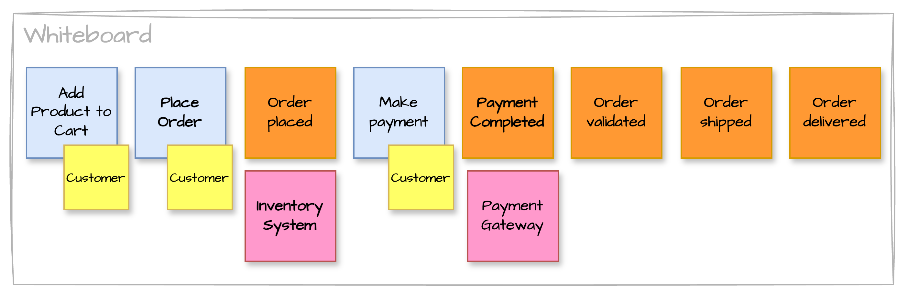
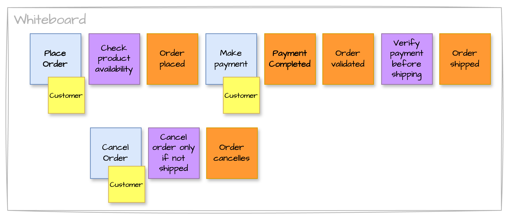
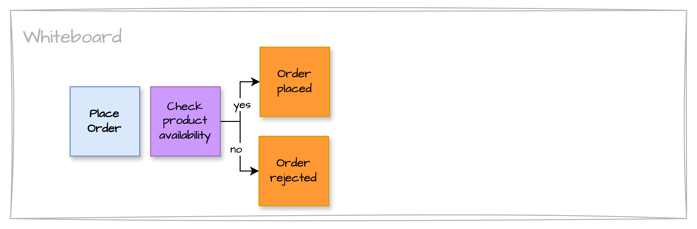
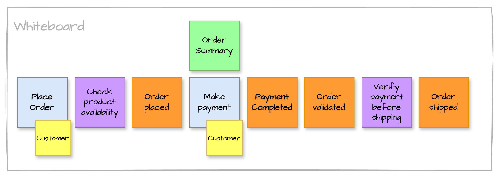
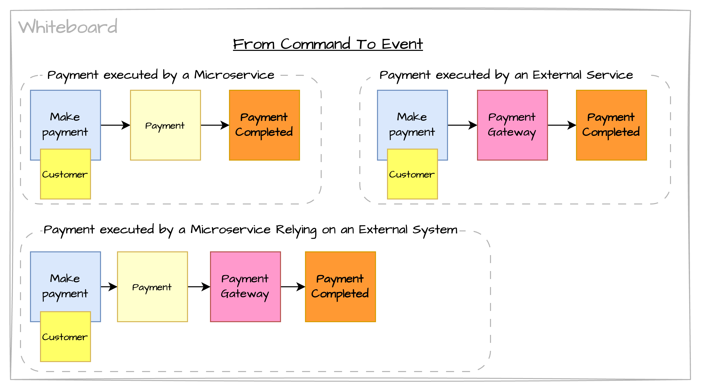
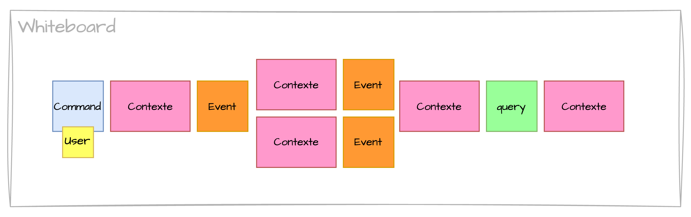

> 🧩 Cet article fait partie d’une [série sur l’EventStorming](../)

Dans le développement logiciel, la compréhension fine du métier est souvent le point de friction principal entre les experts métier et les équipes techniques. C’est là qu’intervient l’EventStorming, une méthode de modélisation collaborative puissante qui permet de visualiser, d’explorer et de structurer les processus métier complexes de manière efficace et intuitive.

## Les 3 formats d’EventStorming

> Au fil des années, trois grands types d’ateliers ont émergé :
> - **Big Picture EventStorming** : cartographier tout un domaine ou un ensemble de processus métier.
> - **Process Modelling EventStorming** : se concentrer sur un processus spécifique.
> - **Software Design EventStorming** : modélisation orientée vers la conception logicielle, souvent couplée au DDD (Domain-Driven Design).

## Big Picture

Le format **Big Picture EventStorming** est le plus vaste. Il mobilise souvent **25 à 30 participants** issus de tous les niveaux de l’organisation. L’objectif est d’explorer **l’ensemble d’une ligne métier**, du début à la fin.

{}
#### 💡 Tip : Scénario Global
Utilise un scénario "system-wide" pour aligner tous les participants et révéler les opportunités d'amélioration à travers les départements. Il doit couvrir tout un "customer journey".
{}

### 01. Domain Events

Les participants racontent les événements majeurs qui jalonnent les processus de leur organisation, en les positionnant chronologiquement. Cela se traduit par des **Domain Events** (post-its oranges).


 Un <strong>Event</strong> ou <strong>Domain Event</strong> est un fait significatif qui s'est produit dans le système, formulé au passé, représentant un changement d'état. Il représente des faits qui se sont produits, indique des changements importants dans le domaine et forme l'épine dorsale de la narration métier.


Les événements métier racontent une histoire compréhensible par le métier. 

### 02. Commands / Persons

On ajoute ensuite les **commandes** et les **acteurs** sur ces commandes.


Une <strong>commande</strong>, c'est une intention exprimée par un utilisateur ou un système, qui demande qu’une action soit exécutée. Chaque commande déclenche (souvent) un événement, si les conditions métier sont respectées.



  Un <strong>acteur</strong> ou <strong>personne</strong> est quelqu’un qui agit sur le système et prend des décisions. En général, les personnes sont positionnées sur les commandes dont elles sont à l'origine.


Notre histoire est enrichie avec les commandes qui souvent une conséquence d’une action d’un acteur. Les commandes déclenchent les événements métier.

### 03. External Systems

On peut ensuite ajouter les **systèmes externes**.


  Les <strong>systèmes externes</strong> sont les systèmes maintenus par d'autres équipes ou organisations. Ces systèmes sont les logiciels qu'on ne modélise pas dans le processus actuel.


Notre histoire continue d'évoluer, certains systèmes externes sont identifiés. Ces systèmes jouent un rôle dans l'apparition d'un événement métier. 

## Process Modeling

Après le format **Big Picture EventStorming**, le second format s'appelle **Process Modeling**. Il vise un niveau de granularité plus fin. On y modélise un **processus spécifique**, de bout en bout, en y ajoutant **plus de rigueur méthodologique**.

Ici, on introduit une **grammaire précise** (événements, commandes, règles, acteurs…), dans un esprit de **jeu collaboratif structuré**, tout en restant du côté métier – on ne descend pas encore dans la conception logicielle.

Ce format permet :

- D’**analyser un processus existant** en profondeur,
- D’**explorer des variantes** ou des scénarios alternatifs,
- De **concevoir de nouveaux processus** à partir de l’expérience terrain,
- D’identifier les **goulots d’étranglement**, **risques**, ou **opportunités d’automatisation**.

Il est particulièrement utile dans les contextes de transformation opérationnelle ou d’amélioration continue.

### 04. Policies


  Une <strong>policy</strong> est une règle métier ou un comportement automatique déclenché par un événement. Elle agit comme une réaction logique à un événement, et peut conduire à une commande ou un autre événement.


Dans notre histoire, on identifie - à travers les policies - les règles qui existent lorsqu'un événement se produit.

Une policy peut également servir à introduire un comportement conditionnel dans la description du processus.

### 05. Read model


  Un <strong>Read Model</strong> (ou <strong>information</strong>) est une vue optimisée pour la lecture, créée à partir des événements métier. Il sert à afficher les données dont un utilisateur ou un système a besoin, souvent via des écrans, APIs, dashboards, etc.


Ici, le read model **Order Summary** est un écran qu'on présente à l'acheteur et qui lui permet de vérifier sa commande avant d'exécuter le paiement.

## Software Design

Le dernier format s'appelle **Software Design EventStorming**. Il fait le lien entre les événements du métier et leur **implémentation logicielle** potentielle. On y introduit des éléments supplémentaires dans la grammaire comme:

- Les **agrégats** (Aggregates),
- Les **contextes bornés** (Bounded Contexts).

Cela permet d’augmenter la **précision de la discussion**, tout en conservant un fort ancrage métier.

Ce format est particulièrement pertinent pour :

- Concevoir une architecture logicielle alignée sur le métier,
- Identifier les **interfaces** entre domaines,
- Définir des **limites de responsabilité claires**,
- Éviter les couplages inutiles,
- Préparer la modélisation orientée DDD.

Il s’agit du format le plus technique, mais il garde une forte valeur collaborative en maintenant le **dialogue constant entre experts métier et développeurs**.

### 06. Aggregates


  Un <strong>agrégat</strong> est un concept destiné à être transformé en code — sous forme de classes ou de fonctions. C’est essentiellement une <strong>machine à états</strong>, c’est-à-dire quelque chose qui suit un cycle de vie.


Dans notre scénario, voici les agrégats que nous pourrions ajouter :
- **Payment** - Si le paiement devient un processus complexe à part entière
- **Shipment** - Pour gérer finement les livraisons (multi-colis, tracking)
- **ProductInventory** - Pour intégrer la gestion de stock (en lecture/écriture)

En pratique, un **aggregate** est une classe métier qui fait autorité sur un sous-domaine.
Pour les agrégats, on met l’accent sur le comportement, pas sur les données - dans l’esprit de la programmation orientée objet. Toutes les règles métier doivent être appliquées et garanties par cet agrégat.

#### De la commande à l'événement

Que ce soit un **aggregate** ou un **external system**, ces "morceaux de software" servent souvent à transformer une **commande** en **event**

## Résumé des post-its utilisés

Nous avons essayé de rester proches du standard, notamment en ce qui concerne le nom et la couleur des post-its. Cependant, il est important de comprendre qu'il est possible de prendre beaucoup de libertés avec ces conventions.

Voici un exemple présenté par Nick Tune lors d’un atelier :
- Le **context**, qui représente un **aggregate**, a la même couleur qu’un **external system**.
- Le **read model** est appelé **query**, car ici le premier **event** effectue un appel vers le second pour obtenir des **informations** (*read model*).

En savoir plus : [organiser un workshop pour découper un monolithe en microservices](../03-monolith/)
