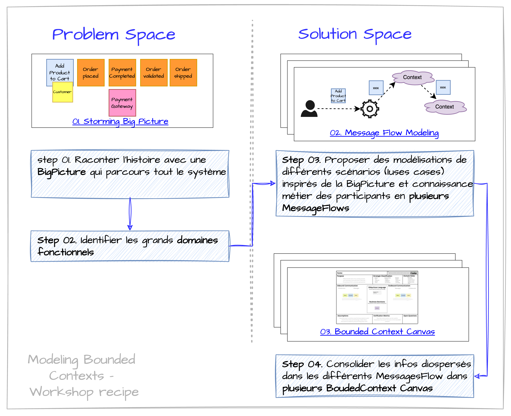
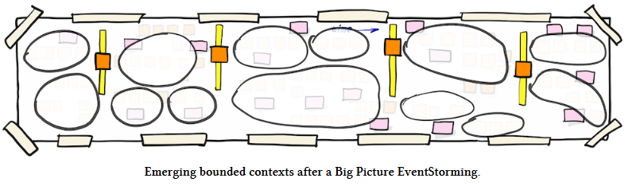
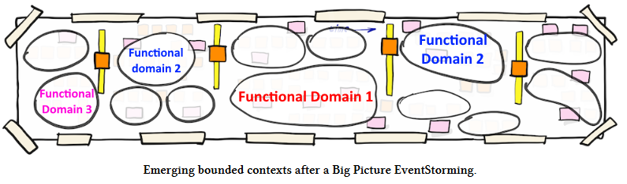
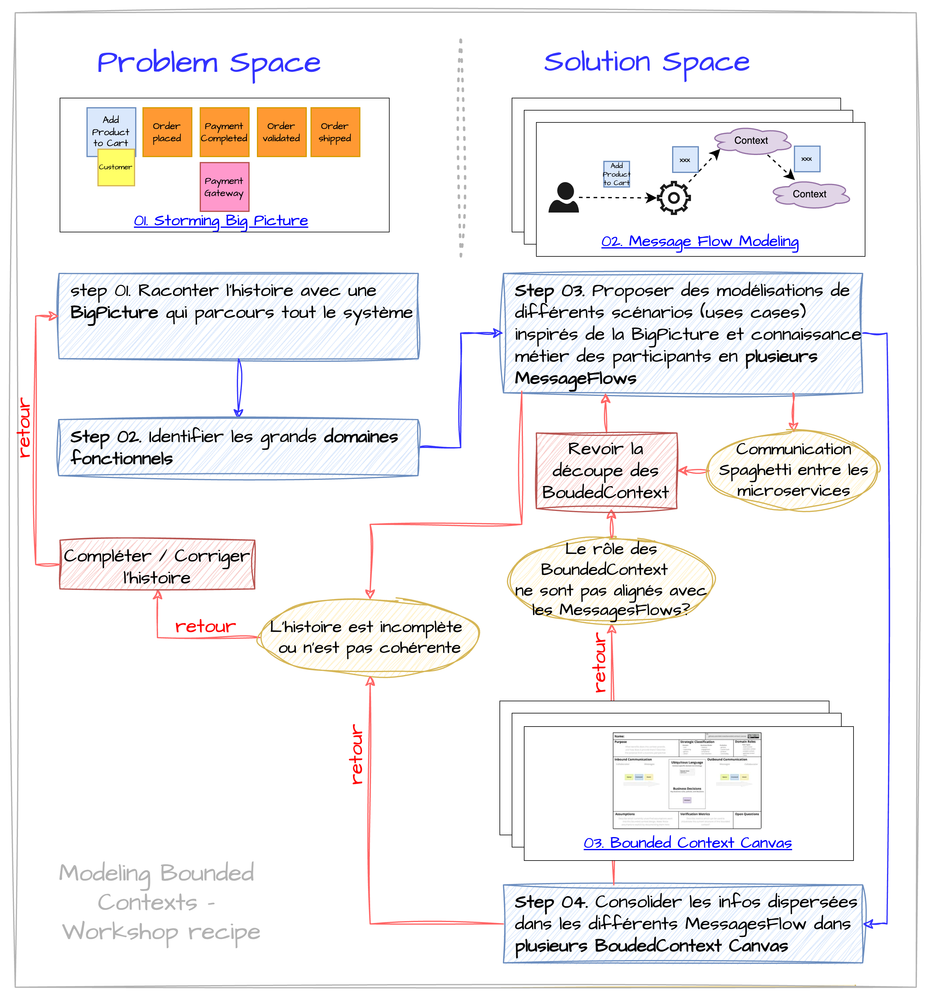

## Description de l'approche

La décomposition d’un grand système en composants plus petits, modulaires et faciles à maintenir est une question fréquemment soulevée dans les projets de transformation.

**EventStorming** est une méthode visuelle largement considérée comme idéale pour identifier les **bounded contexts** et définir des **microservices**. Toutefois, lorsqu'il s'agit de découper un monolithe, une notion clé doit être prise en compte : l’architecture *loosely coupled*. En effet, si le découpage d'un monolithe ne permet pas d’éviter une complexité excessive au niveau de l’intégration et du déploiement (par exemple, l’obligation de déployer l’ensemble du système simultanément), alors la transformation n’aura pas apporté les bénéfices attendus.

C’est pourquoi il est essentiel d’aller au-delà d’EventStorming en introduisant une modélisation plus approfondie, afin de traiter spécifiquement les aspects d’intégration et de communication entre les microservices.

[Nick Tune nous livre sa méthode](https://medium.com/nick-tune-tech-strategy-blog/modelling-bounded-contexts-with-the-bounded-context-design-canvas-a-workshop-recipe-1f123e592ab), article qui a inspiré la démarche décrite ci-dessous.

## Les étapes du Workshop

Le workshop se déroule en 4 étapes :
1. Créer une **EventStorming Big Picture** pour comprendre le processus complet.
2. Analyser *rapidement* la *Big Picture* pour faire émerger les grands **domaines fonctionnels** (à défaut de trouver les *bounded contexts*).
3. Analyser des scénarios (ou *use cases*) stratégiques à l'aide de **Message Flow Modeling**. C'est lors de cette phase que nous allons trouver les candidats pour les **bounded contexts**.
4. Faire une carte d'identité de chaque *bounded context* grâce aux **Bounded Context Canvas**.

### 01. Big Picture EventStorming

> **💡 L'étape** - Le but de cette étape est créer une EventStorming Big Picture opur comprendre le processus métier dans sa globalité.

**Participants** : Il est essentiel d’avoir des représentants du métier ou des experts métier, ainsi que des développeurs et des personnes capables de concevoir des systèmes informatiques (architectes, tech leads, etc.).

On ne peut pas modéliser la solution qui répond à un métier qu'on ne comprend pas. La première étape consiste donc à comprendre le processus métier. On choisit un ou plusieurs scénarios représentatifs d’un processus de bout en bout (end-to-end) ou d’un parcours client (customer journey). L’objectif est d’obtenir une vue globale du système et de faire émerger les premiers *bounded contexts* ou, au minimum, les grands domaines fonctionnels.

Plus de détails [sur la technique de modélisation pour réaliser un EventStorming de type Big Picture](../02-techniques-eventstorming/#big-picture). Si nécessaire, on peut approfondir certains processus en réalisant un EventStorming de type *Process Modelling* (qui est le [second type d'EventStorming](../02-techniques-eventstorming/#process-modeling)).

### 02. Identifier les Bounded Contexts

> **💡 L'étape** -  Le but de cette étape est d'analyser *rapidement* la *Big Picture* pour faire émerger les grands **domaines fonctionnels**

#### Bounded Context ou microservices ?

Lorsqu’on parle d’architecture et de conception stratégique, les *bounded contexts* viennent souvent à l’esprit. Il s’agit d’identifier et de définir des frontières claires au sein d’un système.
Concevoir une architecture revient souvent à découper une structure complexe en sous-systèmes plus petits.

Certains appellent cela des microservices, d’autres parlent de *bounded contexts*, et pour certains, un microservice est un *bounded context* à part entière. Le sujet suscite évidemment des opinions bien tranchées, et de nombreux articles de blog lui ont été consacrés.

#### Emergent Bounded Context - La théorie

À ce stade, il est déjà possible *en théorie* de **faire émerger des bounded contexts** potentiels, en observant dans la Big Picture les zones de rupture, les vocabulaires distincts ou les responsabilités clairement délimitées. Ce sont les *grosses patates* sur ce schéma.

Source : https://github.com/ddd-crew/eventstorming-glossary-cheat-sheet

#### Les Bounded Contexts - La pratique

En **théorie**, on pourrait regarder un tableau d'EventStorming et penser qu'on peut diviser les événements en sections distinctes, chacune correspondant à un bounded context. Mais en **réalité**, cela n'est que rarement aussi simple.

Souvent, des événements liés à un même bounded context apparaissent à plusieurs endroits sur le tableau. Un même bounded context peut se manifester au début d'un processus, puis réapparaître à la fin. C’est pourquoi Alberto Brandolini, le créateur de l’EventStorming, les qualifie de *bounded contexts* **émergents**. Ils émergent du processus, mais ils ne sont pas stabilisés ni définitifs.

Dans [un workshop de modélisation](https://www.youtube.com/watch?v=oj4zGj6sPDc), Nick Tune décrit le cycle de vie d'un **bank account** : un utilisateur crée un compte, il peut déposer ou retirer de l'argent, et même fermer son compte. Ces activités ne se déroulent pas toujours dans un ordre bien défini, et elles sont souvent entrecoupées d'autres processus, comme la demande d'un prêt ou l'ouverture d'un compte épargne.

#### Bounded Contexts vs. Domaines Fonctionnels

À défaut d'avoir les *bounded contexts* dans la Big Picture, que pouvons-nous attendre de cette première phase en termes de découpe en microservices ?

Il est souvent plus réaliste de commencer par identifier des **domaines fonctionnels** plutôt que de chercher directement des bounded contexts complets et bien délimités.

Ces domaines fonctionnels représentent des zones d’activité métier cohérentes, comme la gestion des commandes, la relation client, la facturation ou la logistique. 

Ils ne sont pas encore des bounded contexts au sens DDD - il manque encore un modèle de domaine, des frontières techniques - mais ils servent de boussoles pour organiser la suite de l’exploration. Repérer ces grands ensembles permet de structurer la complexité du système en blocs compréhensibles par tous. C’est souvent à ce niveau qu’on commence à révéler les dépendances, les frictions ou les doublons, et donc à préparer le terrain pour une future découpe en microservices ou en contextes bien définis.

### 03. Message Flow Modelling

> **💡 L'étape** -  L'objectif de cette étape est de proposer des candidats pour les *bounded contexts*, d'analyser leur utilisation ainsi que les modes de communication entre eux, afin de valider la légitimité de ces candidats.

#### EventStorming vs Message Flow Modelling

On pourrait dans cette étape utiliser [Software Design EventStorming](../02-techniques-eventstorming/#software-design) pour identifier les agrégats, les commandes, les politiques, les événements techniques, et pour poser les limites de contexte (*bounded contexts*) du futur système modulaire. Nick Tune propose d'utiliser un autre outil appelé [Message Flow Modelling](https://github.com/ddd-crew/domain-message-flow-modelling).

Concevoir des systèmes faiblement couplés nécessite plus que de simples frontières bien définies. Il est tout aussi important de **définir précisément les interactions** entre les *bounded contexts*.

C’est pour cette raison qu’un EventStorming de type *Software Design* ne suffit pas toujours.

Le *Message Flow Modelling* est centré sur l’échange de messages entre les composants du système. C'est un outil plus adapté pour explorer ou valider la communication entre *bounded contexts*, et donc valider la découpe en *microservices*.

#### Message Flow Modelling - En pratique

Dans la pratique :
- on sélectionne **les flux stratégiques**, qu'on considère comme des *scénarios* ou des *use cases*, en s'inspirant de la *Big Picture*, mais aussi de la connaissance métier et technique des participants ;
- pour **chaque scénario**, on dessine le *message flow* correspondant.

Avec Message Flow Modelling, les *bounded contexts* deviennent les acteurs principaux de l’histoire.
- Une histoire typique commence par un utilisateur qui cherche à atteindre un objectif,
- puis décrit les interactions entre les bounded contexts qui collaborent pour fournir une solution à cet utilisateur.

Modéliser les flux stratégiques du domaine permet d’obtenir un retour sur la qualité des *bounded contexts* proposés. Cela met en évidence comment ils collaborent et dépendent les uns des autres pour réaliser des *use cases* métier complets.

**Question clé** : « Est-ce que la description de chaque *bounded context* est alignée avec le rôle qu’il joue dans le *use case* décrit par le *Message Flow Modelling* ? »

Si ce n’est pas le cas, il est probable que le nommage ou les frontières du *bounded context* nécessitent une refonte.

#### D'accord, mais où trouver mes Bounded Contexts ?

> Il n’existe malheureusement pas de méthode magique pour identifier les *bounded contexts* dans un système.
> 
> Dans ce [workshop](https://www.youtube.com/watch?v=oj4zGj6sPDc), Nick Tune se livre à un exercice de modélisation d’un système d'*Adaptive Cruise Control*. Après une première phase consacrée à l’exploration de l’espace du problème - à travers un *EventStorming* de type *Big Picture* - il engage, avec son co-animateur jouant le rôle d’expert métier, une démarche de découverte des *bounded contexts*. Ensemble, ils construisent progressivement une vision partagée du système en identifiant (*devinant*) les contours contextuels pertinents.

La réussite de cette découpe en *bounded contexts*, et donc en microservices, repose sur plusieurs éléments clés :
- Une connaissance approfondie du métier ;
- Une compréhension fine des enjeux fonctionnels ;
- Des compétences en conception logicielle ;
- Ainsi qu’une capacité à modéliser de manière collaborative.

Il faut se **lancer**, oser une première découpe.

Et surtout, [**itérer**](#workshop-et-itérations).

#### Message Flow Modelling - Aller plus loin

Cette modélisation, que nous utilisons ici pour découvrir les *bounded contexts* et les microservices, permet également d’aller plus loin, en modélisant :
* Les événements publiés et consommés ;
* Les interactions synchrones/asynchrones ;
* Et les protocoles d’intégration.

### 04. Bounded Context Canvas

> **💡 L'étape** -  L'objectif de cette étape est d'affiner les premiers *bounded contexts* ou microservices, en consolidant pour chacun d'eux les informations dispersées dans les différents *MessagesFlow*.

L'étape suivante du processus de conception consiste à modéliser chaque *bounded context* candidat en détaillant des critères de design clés. Pour cela, le [Bounded Context Canvas](https://github.com/ddd-crew/bounded-context-canvas) fournit un support structurant, particulièrement utile pour faire émerger une compréhension partagée du rôle, des capacités et des contraintes d’un contexte donné.

Exemple [extrait de cet article](https://medium.com/nick-tune-tech-strategy-blog/modelling-bounded-contexts-with-the-bounded-context-design-canvas-a-workshop-recipe-1f123e592ab) :

Ce canevas est un outil **itératif**. Remplissez-le pour un contexte, puis recommencez pour les autres. L’idée n’est pas d’être parfait dès le départ, mais de progresser par cycles jusqu’à une modélisation claire et stable.

#### Définition du Contexte

Commencez par nommer le *bounded context* et décrire sa finalité dans le domaine métier. La description doit porter sur son rôle fonctionnel dans le système, pas sur des aspects techniques ou d’implémentation.

> Un manque de clarté sur le nom, la description ou le vocabulaire partagé peut indiquer des frontières mal définies. Ce sont des opportunités de refactorisation.

#### Extraction des Règles Métier et du *Ubiquitous Language*

Appuyez-vous sur les résultats d’un *EventStorming* pour identifier les règles métier principales associées à ce contexte. Sélectionnez-en trois qui capturent l’essence du domaine et reportez-les sur le canvas.

Identifiez également les termes métier clés - mots ou expressions spécifiques - et placez-les dans la section *Ubiquitous Language*. Cette partie est évolutive : elle s’enrichira tout au long du processus de modélisation.

#### Capabilities

Listez les principales *capabilities* du contexte : que peut-il faire ? Que propose-t-il aux autres contextes ? Incluez aussi les tâches internes s’il y en a. Cela vous aidera à clarifier les responsabilités, à identifier les éventuels regroupements logiques et repérer les incohérences à corriger.

## Workshop et itérations

Comme dans beaucoup de workshops liés à DDD ou à EventStorming, on appliquera les principes du [Modeling Whirlpool](../01-introduction-eventstorming/#modeling-whirlpool)

> Dans ce workshop d'EventStorming visant à découper un monolithe, on devra :
> - Travailler dans l’espace du **problème**, pour **comprendre ce qu’il faut modéliser** et aligner tous les participants autour d’une compréhension partagée.
> - Travailler dans l’espace de la **solution**, pour **faire émerger les microservices** qui remplaceront le monolithe.
> - Retourner dans l'espace du **problème** quand des incohérences ou des manques d'explications apparaissent.

