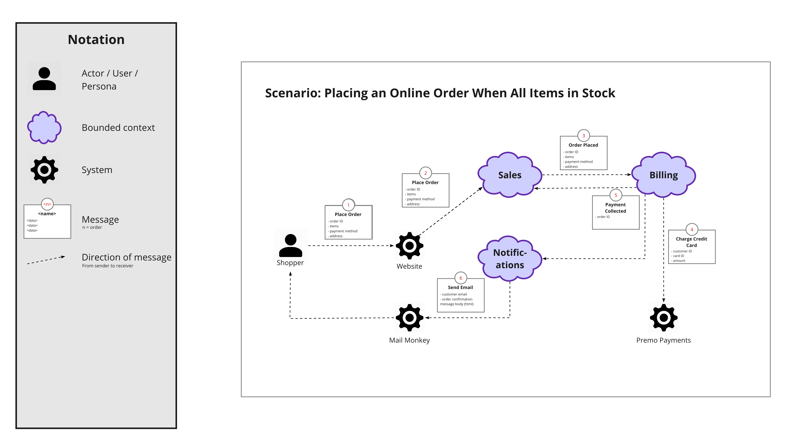

## Les étapes du Workshop

Comment décomposer un grand système en composants plus petits, modulaires et faciles à maintenir ? C’est la question qui se pose le plus souvent. Dans cet article, [Nick Tune nous donne sa recette](https://medium.com/nick-tune-tech-strategy-blog/modelling-bounded-contexts-with-the-bounded-context-design-canvas-a-workshop-recipe-1f123e592ab) qui a inspiré cet article.

### 01. Big Picture EventStorming

> 💡 Le but de cette étape est de comprendre le processus métier dans sa globalité, ou tout au moins dams un *customer journey* qui couvre l'ensemble du système. Cette étape permet également de faire émerger les premiers Bouded Contexts ou tout au moins les grands domaines fonctionnels

**Participants** : il est essentiel d’avoir des représentants du métier ou des experts métier, ainsi que des développeurs et des personnes capables de concevoir des systèmes informatiques (architectes, tech leads, etc.).

La première étape consiste à comprendre le processus métier. On choisit donc un ou plusieurs scénarios représentatifs d’un processus de bout en bout (end-to-end) ou d’un parcours client (customer journey). L’objectif est d’obtenir une vue globale du système.

Si nécessaire, on peut approfondir certains processus en réalisant un EventStorming de type *Process Modelling*.

Le but final est que tous les participants aient une compréhension suffisamment claire du métier tel qu’il est ou sera implémenté dans le système.

Plus de détails [ici](../02-techniques-eventstorming/#big-picture).

#### Bounded Context ou microservices?

Lorsqu’on parle d’architecture et de conception stratégique, les *Bounded Contexts* viennent souvent à l’esprit. Il s’agit d’identifier et de définir des frontières claires au sein d’un système.
Concevoir une architecture revient souvent à découper une structure complexe en sous-systèmes plus petits.

Certains appellent cela des microservices, d’autres parlent de *Bounded Contexts*, et pour certains, un microservice est un *Bounded Context* à part entière.

Le sujet suscite évidemment des opinions bien tranchées, et de nombreux articles de blog lui ont été consacrés.

#### Emergent Bounded Context

> À ce stade, il est déjà possible de **faire émerger des Bounded Contexts** potentiels, en observant les zones de rupture, les vocabulaires distincts ou les responsabilités bien délimitées. Ces pistes seront approfondies dans les étapes suivantes.

Source : https://github.com/ddd-crew/eventstorming-glossary-cheat-sheet

#### Les Bounded Contexts - Entre théorie et pratique

> En théorie, on pourrait regarder un tableau d'EventStorming et penser qu'on peut diviser les événements en sections distinctes, chacune correspondant à un Bounded Context. Mais en réalité, cela n'est que rarement aussi simple.

Souvent, des événements liés à un même Bounded Context apparaissent à plusieurs endroits sur le tableau. Un même Bounded Context peut se manifester au début d'un processus, puis réapparaître à la fin. C’est pourquoi Alberto Brandolini, le créateur de l’EventStorming, les qualifie de *Bounded Contexts émergents*. Ils émergent du processus — ils ne sont pas prédéfinis.

Dans [un workshop de modélisation](https://www.youtube.com/watch?v=oj4zGj6sPDc), Nick Tune décrit le cycle de vie d'un **bank account** :
* Un utilisateur crée un **account**.
* Dépose de l'argent.
* Retire de l'argent.
* Ferme le **account**.

Ces activités ne se déroulent pas toujours dans un ordre bien défini, et elles sont souvent entrecoupées d'autres processus, comme la demande d'un mortgage ou l'ouverture d'un savings account.

> Bien que ce soient des phases distinctes, **elles reposent toutes sur le même objet de domaine**, **account**. Cela entraîne des défis de modélisation et des compromis (cohésion vs. duplication).

### 02. Message Flow Modelling

> 💡 Le but de cette étape est d'identifier les premiers Bouded Contexts ou microservices.

**Participants** : en plus des participants précédents, on implique des personnes du métier, des développeurs, et des experts en conception de systèmes logiciels. Ce type d’atelier est plus orienté architecture et modélisation technique.

On pourrait dans cette étape utiliser [Software Design EventStorming](../02-techniques-eventstorming/#software-design) pour identifier les agrégats, les commandes, les politiques, les événements techniques, et pour poser les limites de contexte (*Bounded Contexts*) du futur système modulaire.

Nick Tune propose d'utiliser un outil appelé [Message Flow Modelling](https://github.com/ddd-crew/domain-message-flow-modelling).

#### EventStorming vs Message Flow Modelling

> Concevoir des systèmes faiblement couplés nécessite plus que de simples frontières bien définies. Il est tout aussi important de définir précisément les interactions entre les *Bounded Contexts*.

C’est pour cette raison qu’un EventStorming de type Software Design n’est pas toujours suffisant. Nick Tune introduit le Message Flow Modelling. Cette alternative est centrée sur l’échange de messages entre les composants du système. Elle peut être utilisée pour explorer ou valider la communication entre **Bounded Contexts**, et donc valider la découpe en **microservices**.

A noter que Nick propose aussi une version simplifiée pour modéliser ces communications.

Cette modélisation permet également d’aller plus loin, en modélisant :
* Les événements publiés et consommés ;
* Les interactions synchrones/asynchrones ;
* Et les protocoles d’intégration.

#### D'accord, mais je les trouve où mes Bounded Contexts ?

> Il n’existe malheureusement pas de méthode magique pour identifier les *Bounded Contexts* dans un système.
>
> Dans ce [workshop](https://www.youtube.com/watch?v=oj4zGj6sPDc), Nick Tune propose un exercice de modélisation d’un système d’*Adaptive Cruise Control*. Après une première phase consacrée à l’exploration de l’espace du problème — à travers un *EventStorming* de type *Big Picture* — il engage, avec son co-animateur jouant le rôle d’expert métier, une démarche de découverte des *Bounded Contexts*. Ensemble, ils construisent progressivement une vision partagée du système en identifiant les contours contextuels pertinents.

La réussite de cette découpe en *bounded context* et donc en microservices repose sur plusieurs éléments clés :
- une connaissance approfondie du métier,
- une compréhension fine des enjeux fonctionnels,
- des compétences en conception logicielle,
- ainsi qu’une capacité à modéliser de manière collaborative.

Il faut se **lancer**, oser une première découpe.

Et surtout, **itérer**.

### 03. Bounded Context Canvas

> 💡 Le but de cette étape est d'affiner les premiers Bouded Contexts ou microservices.

L'étape suivante du processus de conception consiste à modéliser chaque *Bounded Context* candidat en détaillant des critères de design clés. Pour cela, le [Bounded Context Canvas](https://github.com/ddd-crew/bounded-context-canvas) fournit un support structurant, particulièrement utile pour faire émerger une compréhension partagée du rôle, des capacités et des contraintes d’un contexte donné.

Ce canevas est un outil **itératif**. Remplissez-le pour un contexte, puis recommencez pour les autres. L’idée n’est pas d’être parfait dès le départ, mais de progresser par cycles jusqu’à une modélisation claire et stable.

#### Définition du Contexte

Commencez par nommer le *Bounded Context* et décrire sa finalité dans le domaine métier. La description doit porter sur son rôle fonctionnel dans le système, pas sur des aspects techniques ou d’implémentation.

> Un manque de clarté sur le nom, la description ou le vocabulaire partagé peut indiquer des frontières mal définies. Ce sont des opportunités de refactorisation.

#### Extraction des Règles Métier et du *Ubiquitous Language*

Appuyez-vous sur les résultats d’un *EventStorming* pour identifier les règles métier principales associées à ce contexte. Sélectionnez-en trois qui capturent l’essence du domaine et reportez-les sur le canvas.

Identifiez également les termes métier clés — mots ou expressions spécifiques — et placez-les dans la section *Ubiquitous Language*. Cette partie est évolutive : elle s’enrichira tout au long du processus de modélisation.

#### Capacités du Contexte

Listez les principales capacités du contexte : que peut-il faire ? Que propose-t-il aux autres contextes ? Incluez aussi les tâches internes s’il y en a.

Cela vous aidera à :
* clarifier les responsabilités ;
* identifier les éventuels regroupements logiques ;
* repérer les surcharges ou incohérences à corriger.

## Workshop et itérations

Comme dans beaucoup de workshops liés à DDD ou à EventStorming, on appliquera les principes du [Modeling Whirlpool](../01-introduction-eventstorming/#modeling-whirlpool)

> Un dans ce workshop d'EventStorming visant à découper un monolithe, on devra :
> 1. Travailler dans l’espace du **problème**, pour **comprendre ce qu’il faut modéliser** et aligner tous les participants autour d’une compréhension partagée.
> 2. Travailler dans l’espace de la **solution**, pour **faire émerger les microservices** qui remplaceront le monolithe.

