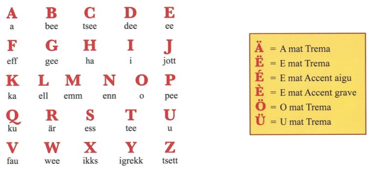

## L'alphabet

Le luxembourgeois utilise lalphabet latin, similaire à celui du français, avec quelques lettres spécifiques : **ä, ë, é, è, ö, ü**

## Présentation

{}
|||
|-|-|
|Je suis|**Ech sinn** de(n) Marc|
||**Ech sinn** d'Anna|
|Je m'appelle|**Ech Heesche** Marc|
||**Ech Heschenn** Anna|
|Mon nom est|**Mäin Numm ass** Marc|
||**Mäin Numm ass** Anna|
{}

## Salutations

|Période|Begréissungen|
|--|--|
|07:00 - 13:00|Gudde **Moien** / Moien|
|13:00 - 15:00|Gudde **Mëtteg** / Schéine Mëtteg|
|15:00 - 18:00|Gudden **Nomëtteg** / Schéinen Nomëtteg|
|18:00 - 22:00|Gudden **Owend** / Schéinen Owend|
|22:00 - 07:00|Gutt **Nuecht**|
|00:00 - 24:00 | **Äddi** / **Awar** / **Awuer** |

{}
**Nomëtteg** = **No** (après) **Mëtteg** (midi)
{}

## n-Reegel

La règle n-Reegel en luxembourgeois, aussi appelée Eifeler Regel, détermine si le "n" final d'un mot est maintenu ou supprimé. Le "n" reste si le mot suivant commence par:
- **N T D Z H**
- ou par une **voyelle**. 

La méthode mnémotechnique "**United Zoha**" aide à se souvenir de ces lettres (D, H, N, T, Z) pour lesquelles le "n" reste en place devant.

## Les articles 

||Définis (le/la/les)|Indéfinis (un/une)|
|--|--|--|
|Singulier masculin |**de(n)**|**e**|
|Singulier féminin |**d'** |**eng**|
|Singulier neutre |**d'** |**e**|
|Pluriel (pour tous les genres) |**d'**|-|

## Article devant les personnes 

En luxembourgeois, on met l'article devant les noms et prénoms: 

{}
- Ech sinn **de** Jean.
- Ech sinn **d'** Anna.
- Ech sinn **den** Olivier Schmit.
{}

## Pronom personnels

||
|--|--|
|**Ech**|je|
|**Du**|tu|
|**Hien** /  **Hatt** / **Si**  / **Et** |il / elle / elle (politesse)/ ça|
|**mir**|nous|
|**dir**|vous|
|**si**|ils / elles|

## Verbe SEIN (être)

|||
|--|--|
|Ech|**sinn**|
|Du|bass|
|Hien / Hatt / Et|**ass**|
|Mir|sinn|
|Dir|**sidd**|
|Si|sinn|

{}
|||
|--|--|
|**Ech sinn** de(n) Marc|Je suis Marc|
|**Et ass kal**|Il fait froid, litt. il est froid|
|**Ass dat de Lionel**?|Est-ce Lionel ? en montrant du doigt|
|**Dat ass de Lionel** |C'est Lionel|
{}
